# Commerce Marketplace Platform

> **Master Project Plan & Architecture**
>
> An Amazon-style commerce platform combining **first-party retail** with a **third-party marketplace**, delivered through a web storefront, seller portal, admin platform, and customer mobile application.

---

## 1. Project Vision

The platform will combine two commercial models in one unified commerce system:

1. **First-party retail** — the platform owns products/inventory and sells directly to customers.
2. **Third-party marketplace** — external sellers list products and sell through the platform.

Customers should experience this as **one marketplace** regardless of whether an item is sold by the platform or by an external seller.

The system is designed once as a complete platform and implemented progressively in phases.

### Target experience

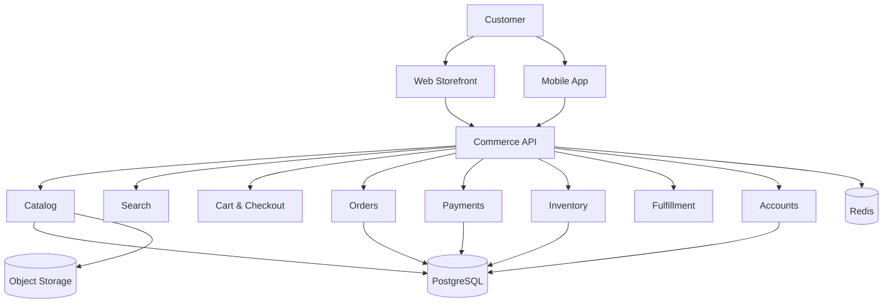

---

## 2. Core Principles

### 2.1 One commerce platform

Retail and marketplace operations use the same foundational systems for:

- Catalog
- Product discovery
- Cart
- Checkout
- Orders
- Payments
- Inventory
- Fulfillment
- Customer accounts
- Reviews
- Returns
- Notifications

### 2.2 API-first architecture

The business logic belongs in the backend, not in the Next.js storefront or mobile application.

```text
Web              ─┐
                   ├──> Commerce API ───> Domain Services ───> Database
Mobile            ─┤
Seller Portal     ─┤
Admin Portal      ─┘
```

This means the web and mobile applications are clients of the same platform.

### 2.3 Product and Offer are different concepts

A **Product** represents what an item is.

An **Offer** represents who is selling it and under which commercial conditions.

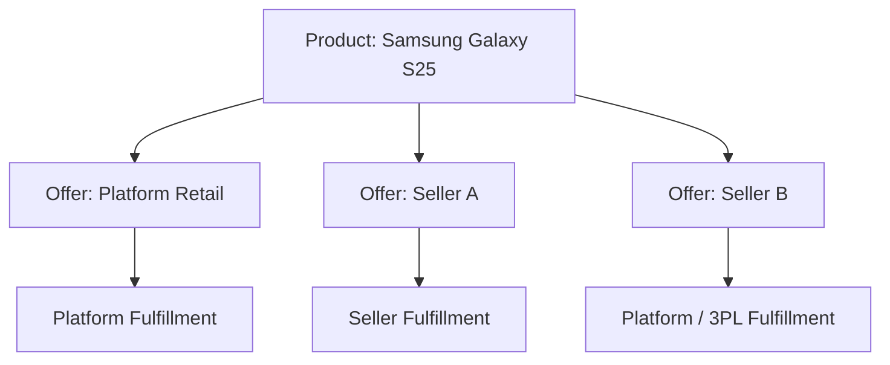

This allows multiple sellers to compete around one product while the platform can also sell the same product itself.

---

## 3. High-Level System Architecture

```mermaid
flowchart TB
    subgraph Clients
        WEB[Next.js Web]
        MOB[Customer Mobile App]
        SELLER[Seller Portal]
        ADMIN[Admin Portal]
    end

    subgraph Platform[Commerce Platform]
        API[Go Commerce API]
        AUTH[Identity & Access]
        CAT[Catalog Service]
        SEARCH[Search Service]
        CART[Cart & Checkout]
        ORDER[Order Service]
        PAYMENT[Payment Service]
        INV[Inventory Service]
        FUL[Fulfillment & Shipping]
        RETURN[Returns & Refunds]
        MARKET[Marketplace & Seller Service]
        REVIEW[Reviews]
        NOTIFY[Notification Service]
        ANALYTICS[Analytics]
        SUPPORT[Support]
    end

    subgraph Data
        DB[(PostgreSQL)]
        REDIS[(Redis)]
        OBJECT[(Object Storage)]
        INDEX[(Search Index)]
    end

    subgraph External
        GATEWAY[In-house Payment Gateway]
        COURIER[Courier / 3PL Integrations]
        MSG[Email / SMS / Push Providers]
    end

    WEB --> API
    MOB --> API
    SELLER --> API
    ADMIN --> API

    API --> AUTH
    API --> CAT
    API --> SEARCH
    API --> CART
    API --> ORDER
    API --> PAYMENT
    API --> INV
    API --> FUL
    API --> RETURN
    API --> MARKET
    API --> REVIEW
    API --> NOTIFY
    API --> ANALYTICS
    API --> SUPPORT

    AUTH --> DB
    CAT --> DB
    ORDER --> DB
    PAYMENT --> DB
    INV --> DB
    MARKET --> DB
    RETURN --> DB
    REVIEW --> DB
    SUPPORT --> DB

    API --> REDIS
    CAT --> OBJECT
    SEARCH --> INDEX

    PAYMENT --> GATEWAY
    FUL --> COURIER
    NOTIFY --> MSG
```

---

## 4. Applications

The platform consists of four major applications.

### Web Storefront

**Technology:** Next.js + TypeScript + Tailwind CSS + shadcn/ui

Used by customers to:

- Browse products
- Search and filter
- View product details
- Compare offers
- Add items to cart
- Checkout
- Pay
- Track orders
- Request returns/refunds
- Review products
- Manage their account

### Customer Mobile App

Recommended starting technology: **Kotlin Multiplatform + Jetpack Compose / Compose Multiplatform**.

Flutter is also viable; the backend architecture remains framework-agnostic.

The mobile app consumes the same Commerce API as the web storefront.

### Seller Portal

Used by third-party sellers to:

- Apply to become sellers
- Manage store profile
- Create products/offers
- Manage pricing
- Manage inventory
- Manage orders
- Manage fulfillment
- View earnings
- Request payouts
- Monitor reviews
- View sales analytics

### Admin Portal

Used by internal operations/admin teams to control the entire platform.

---

## 5. User Roles

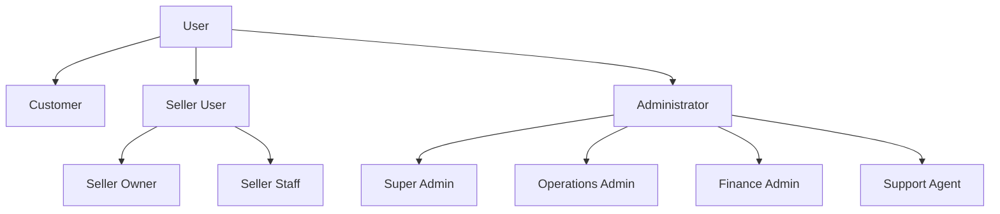

Use role-based access control (RBAC) with explicit permissions rather than hardcoding authorization rules into individual screens.

---

## 6. Domain Architecture

The backend should be divided into clear business domains.

```text
Identity & Access
Catalog
Pricing & Offers
Marketplace
Inventory
Orders
Payments
Financial Ledger
Fulfillment
Shipping
Returns & Refunds
Reviews
Notifications
Customer Support
Analytics
Audit
```

### Domain relationship

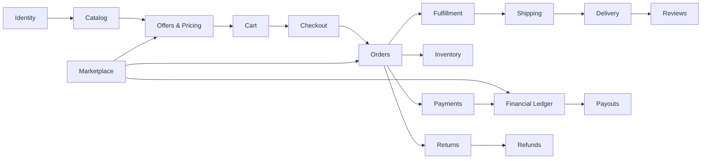

---

## 7. Catalog Model

The catalog is shared between retail and marketplace operations.

### Core entities

```text
Category
Brand
Product
Product Variant
Product Attribute
Product Media
SKU
Offer
Price
Inventory Item
Warehouse
Collection
```

### Product/Offer model

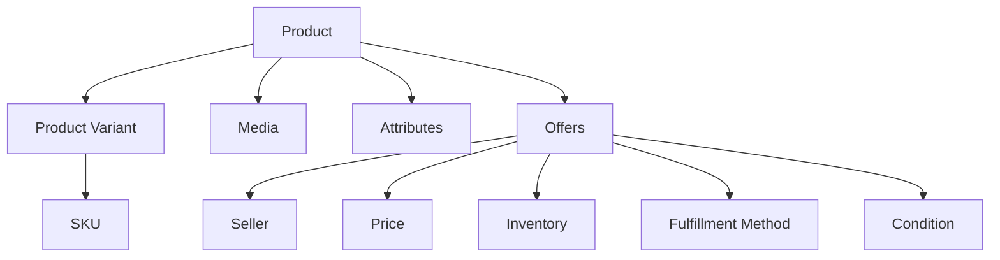

Example:

```text
Product
└── Samsung Galaxy S25

Offers
├── Platform Retail
│   ├── Price: K15,999
│   ├── Stock: Platform Warehouse
│   └── Fulfillment: Platform
│
├── ABC Electronics
│   ├── Price: K15,500
│   ├── Stock: Seller
│   └── Fulfillment: Seller
│
└── XYZ Mobiles
    ├── Price: K15,850
    ├── Stock: 3PL
    └── Fulfillment: 3PL
```

---

## 8. Retail + Marketplace Model

Retail and marketplace inventory should coexist.

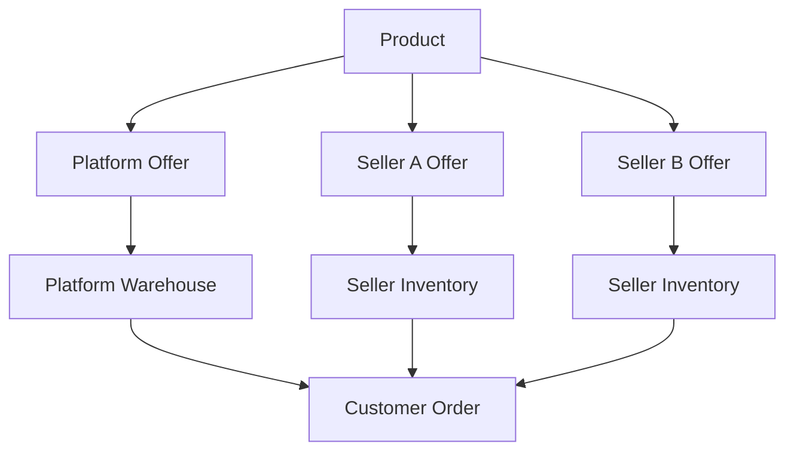

### Fulfillment types

Support these from the architecture level:

- Platform fulfillment
- Seller fulfillment
- Third-party logistics (3PL)
- Customer pickup

This leaves room for an eventual **Fulfilled by Platform** capability similar to Amazon FBA.

---

## 9. Customer Shopping Flow

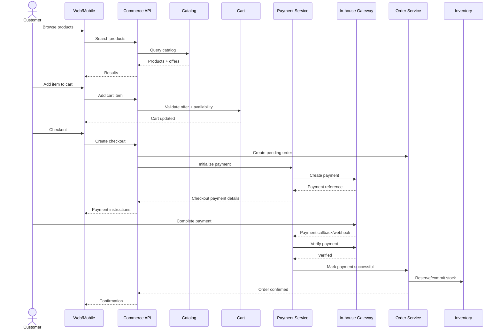

---

## 10. Payment Architecture

### Payment gateway

The primary and initial payment provider is the **in-house payment gateway**.

The commerce platform should still use an internal provider abstraction so gateway-specific details do not leak through the entire codebase.

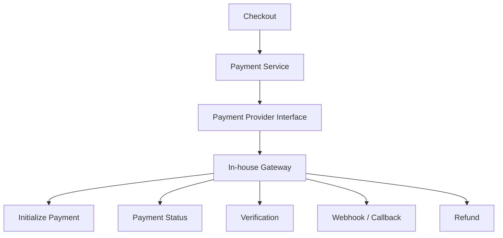

### Internal provider interface

Conceptually:

```go
interface PaymentProvider {
    InitializePayment(...)
    GetPaymentStatus(...)
    VerifyPayment(...)
    HandleWebhook(...)
    CreateRefund(...)
    GetRefundStatus(...)
}
```

### Payment rules

The frontend must never mark an order as paid.

A successful payment must come from a verified server-side gateway interaction.

### Payment lifecycle

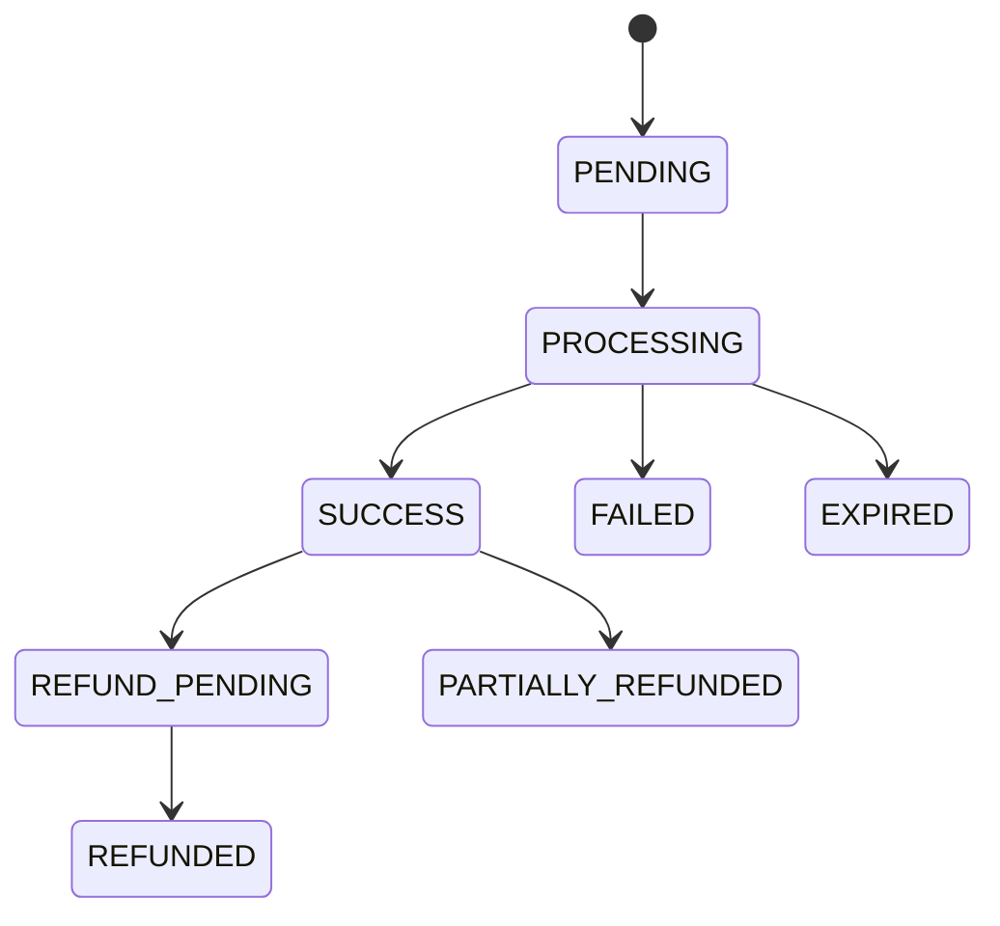

### Payment flow

```text
Customer
   ↓
Checkout
   ↓
Create Order (PENDING_PAYMENT)
   ↓
Create Payment
   ↓
In-house Gateway
   ↓
Customer pays
   ↓
Gateway callback/webhook
   ↓
Server verifies transaction
   ↓
Payment = PAID
   ↓
Order = CONFIRMED
   ↓
Inventory committed
   ↓
Fulfillment begins
```

### Payment data

Recommended entities:

```text
payments
payment_attempts
payment_events
payment_methods
refunds
refund_events
```

---

## 11. Marketplace Financial Model

A marketplace needs more than a simple `order.total` field.

### Financial flow

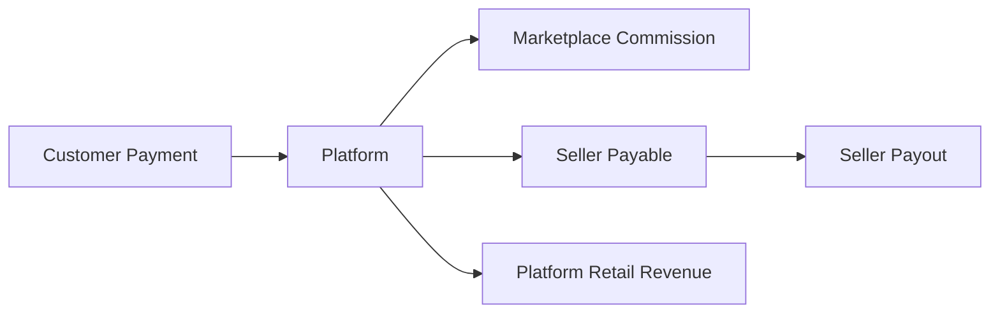

Example:

```text
Customer pays:               K10,000
Marketplace commission:       K1,000
Seller payable:               K9,000
```

### Financial entities

```text
financial_accounts
ledger_entries
seller_balances
commission_transactions
payouts
payment_transactions
refund_transactions
```

### Important distinction

```text
Payment
= Did the customer successfully pay?

Ledger
= How was the money allocated?

Seller Balance
= How much does the seller currently have claim to?

Payout
= Has money actually been released to the seller?
```

This design is critical before real marketplace money starts moving.

---

## 12. Order Architecture

The customer can place one order containing products from multiple sellers.

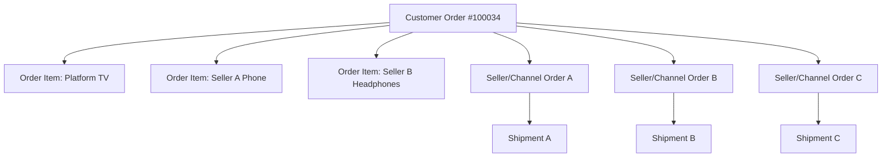

### Recommended order entities

```text
orders
order_items
seller_orders
shipments
shipment_items
fulfillments
```

### Order lifecycle

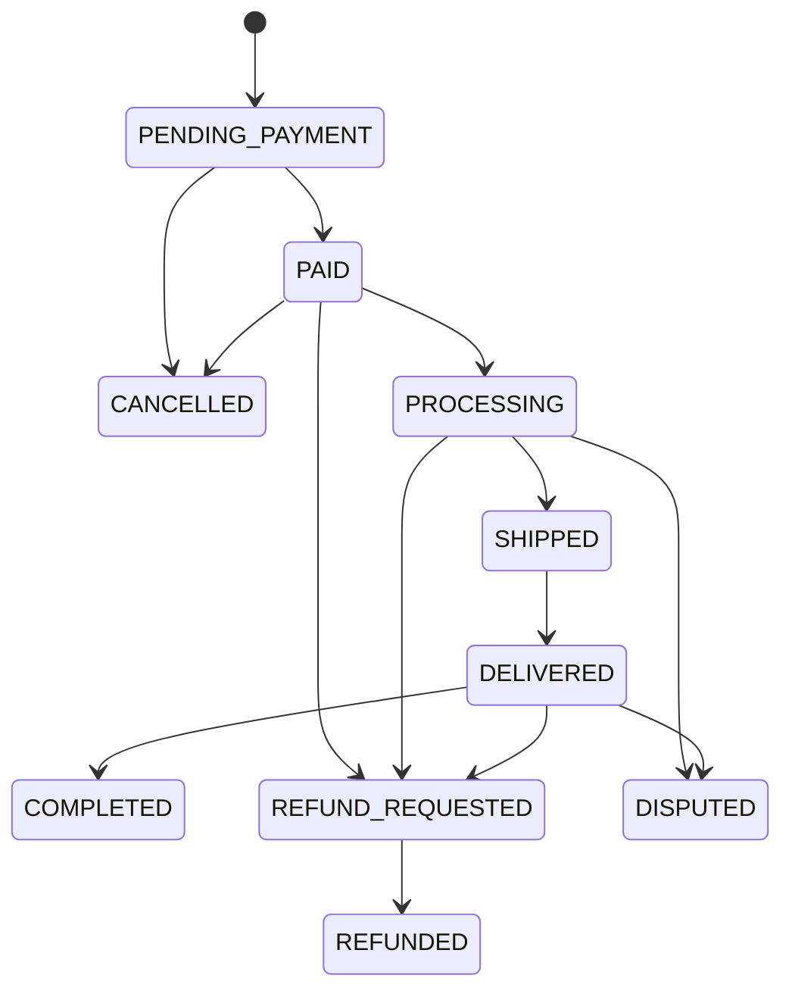

---

## 13. Inventory Architecture

Inventory must support both platform-owned inventory and seller inventory.

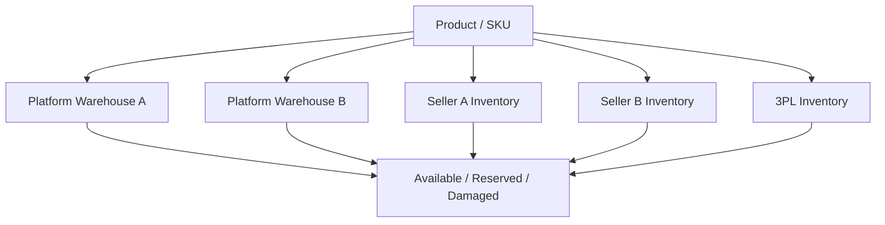

### Inventory principles

Track:

- On hand
- Reserved
- Available
- Damaged
- In transit
- Reorder threshold

Recommended entities:

```text
warehouses
warehouse_inventory
inventory_movements
stock_reservations
stock_transfers
supplier_purchase_orders
```

---

## 14. Fulfillment & Shipping

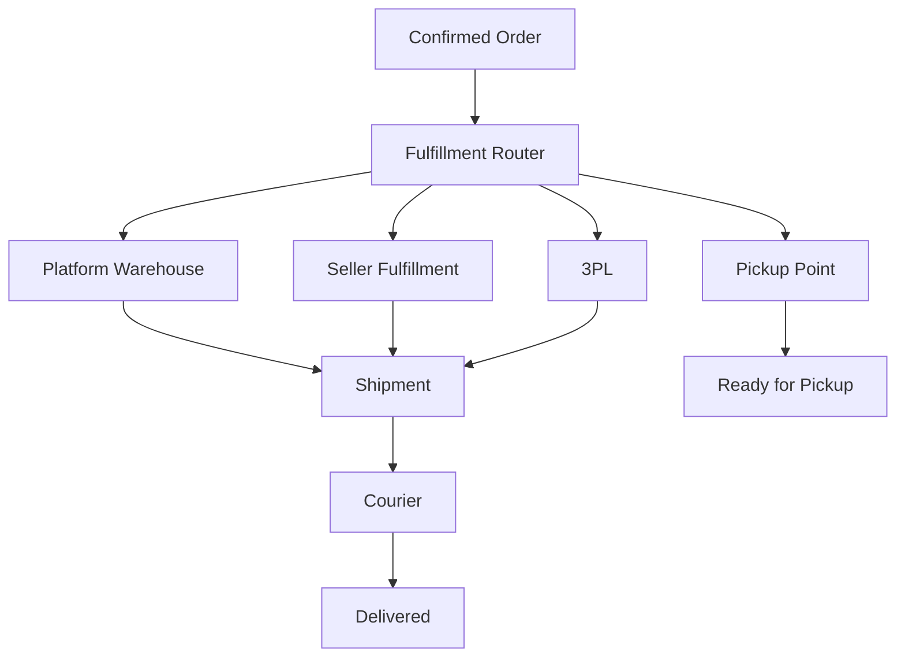

The fulfillment engine should eventually support:

- Shipment creation
- Tracking numbers
- Delivery estimates
- Partial shipments
- Multiple shipments per order
- Pickup locations
- Courier integrations

---

## 15. Returns, Refunds & Disputes

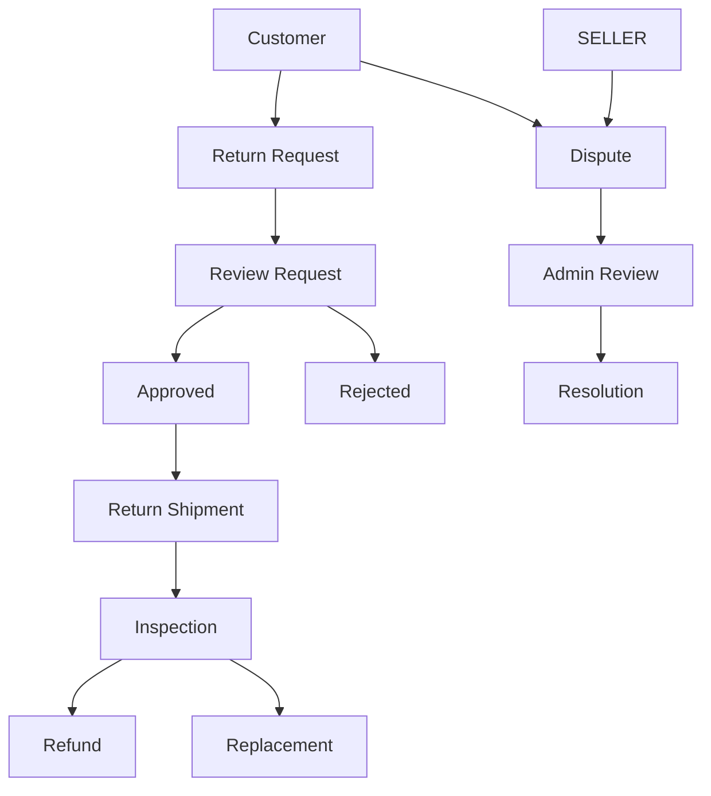

Entities:

```text
return_requests
return_items
return_shipments
return_inspections
disputes
refunds
```

Possible dispute outcomes:

```text
REFUND_BUYER
PARTIAL_REFUND
PAY_SELLER
REPLACEMENT
REJECT
```

---

## 16. Seller Architecture

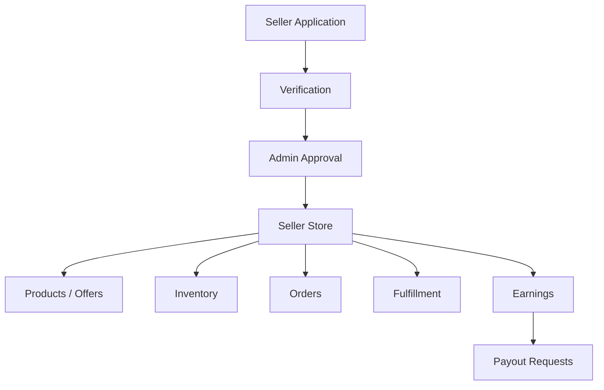

Seller domain entities:

```text
sellers
seller_profiles
seller_verifications
seller_users
seller_settings
seller_policies
seller_metrics
seller_balances
payouts
```

---

## 17. Admin Architecture

The admin platform manages both first-party retail and marketplace operations.

### Admin navigation

```text
Dashboard

Commerce
├── Products
├── Categories
├── Brands
├── Offers
├── Pricing
└── Collections

Orders
├── All Orders
├── Returns
├── Refunds
└── Shipments

Inventory
├── Inventory
├── Warehouses
├── Stock Transfers
└── Low Stock

Marketplace
├── Sellers
├── Seller Applications
├── Seller Products
├── Commissions
├── Seller Balances
└── Payouts

Payments
├── Transactions
├── Failed Payments
├── Refunds
└── Payment Events

Customers
├── Customers
├── Reviews
└── Support

Reports
├── Sales
├── Revenue
├── Marketplace
├── Inventory
└── Customers

System
├── Users
├── Roles
├── Permissions
├── Settings
└── Audit Logs
```

### Admin dashboard example

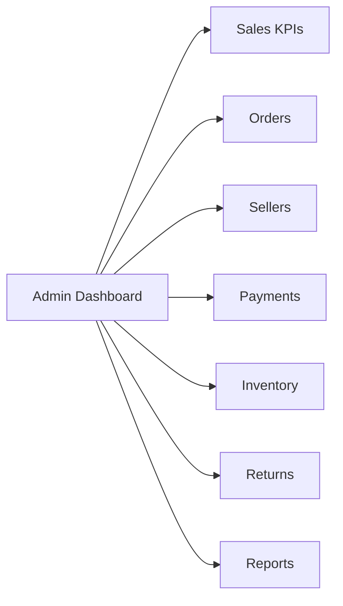

---

## 18. Mobile App Architecture

The customer mobile app is a first-class client, not a later retrofit.

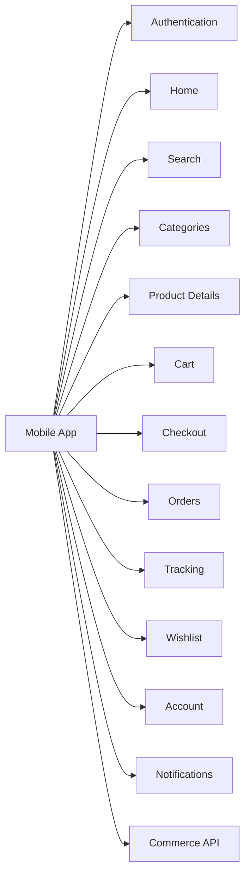

### Suggested mobile stack

**Preferred:**

- Kotlin
- Kotlin Multiplatform
- Jetpack Compose / Compose Multiplatform
- Ktor client or equivalent HTTP client
- Kotlin serialization

**Alternative:**

- Flutter
- Dart

The API contract must remain independent of the chosen mobile framework.

---

## 19. Search Architecture

Start simple and scale without changing the public API.

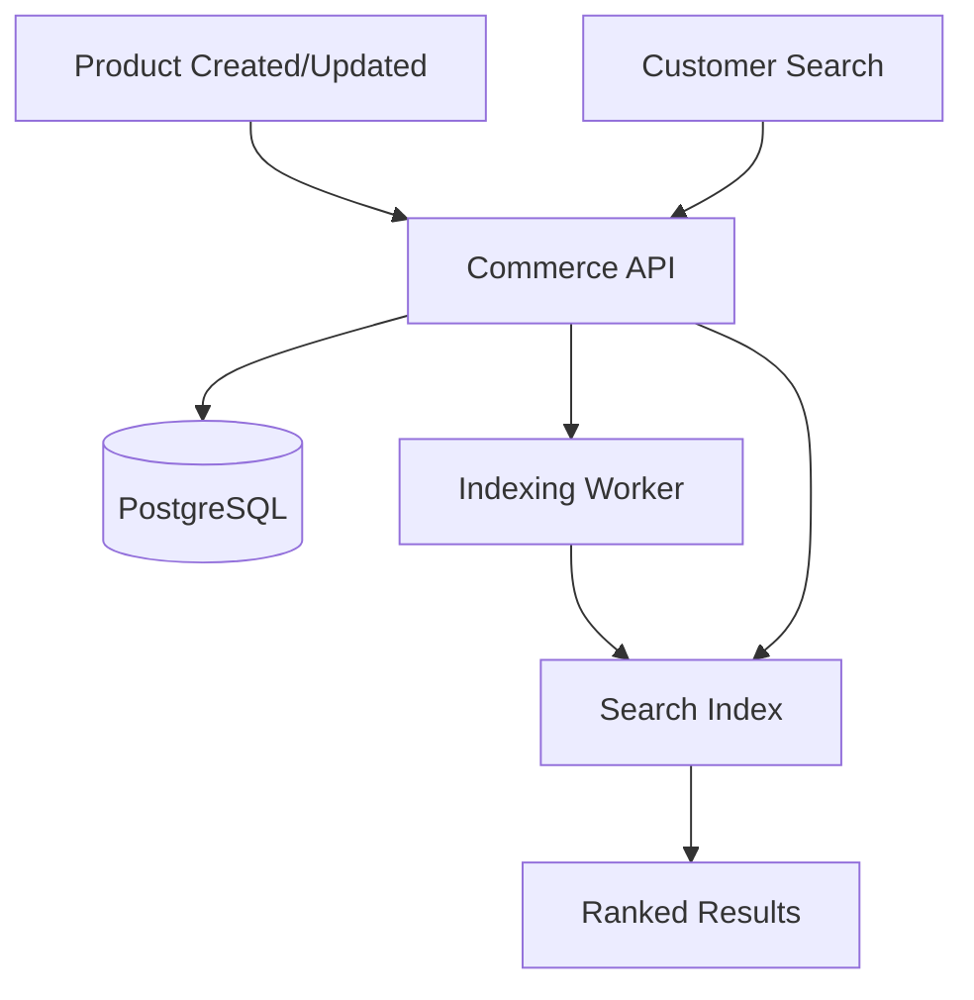

### Phase 1

Use PostgreSQL search capabilities.

### Later

Introduce Meilisearch or OpenSearch for:

- Full-text search
- Facets
- Autocomplete
- Synonyms
- Filtering
- Ranking
- Suggestions
- Large catalog performance

---

## 20. Notifications

```mermaid
flowchart TD
    EVENT[Domain Event] --> NOTIFY[Notification Service]
    NOTIFY --> EMAIL[Email]
    NOTIFY --> SMS[SMS]
    NOTIFY --> PUSH[Push Notification]
    NOTIFY --> INAPP[In-App Notification]
```

Examples:

```text
Order confirmed
Payment successful
Order shipped
Order delivered
Return approved
Refund processed
Seller approved
Seller payout processed
Product rejected
Low inventory
```

---

## 21. Audit Logging

All sensitive administrative and financial actions should be auditable.

Recommended entity:

```text
audit_logs
- id
- actor_id
- action
- entity_type
- entity_id
- metadata
- ip_address
- user_agent
- created_at
```

Example:

```text
ADMIN
CHANGED_PRODUCT_PRICE
Product #239
K12,000 -> K10,500
```

---

## 22. Security Architecture

Because the system processes payments and seller funds, security is foundational.

### Required controls

- Strong authentication
- Secure session/token handling
- RBAC and permission checks
- Admin 2FA
- Server-side validation
- Rate limiting
- Secure cookies where applicable
- Input sanitization
- Webhook signature verification
- Idempotency for payment/order operations
- Encryption in transit
- Encryption for sensitive stored secrets/data
- Secret management
- Audit logging
- Session revocation
- Login attempt monitoring
- Database least-privilege access
- Secure file upload validation

### Trust boundary

```mermaid
flowchart TD
    CLIENT[Browser / Mobile] -->|Untrusted Input| API[API Boundary]
    API --> AUTH[Authentication]
    AUTH --> AUTHZ[Authorization]
    AUTHZ --> VALIDATE[Validation]
    VALIDATE --> DOMAIN[Domain Logic]
    DOMAIN --> DB[(Database)]
    DOMAIN --> EXTERNAL[External Services]
```

Never trust:

- Client-side prices
- Client-side order totals
- Client-side seller IDs
- Client-side payment success flags
- Client-side permissions
- Client-side inventory counts

---

## 23. Recommended Database Modules

The database should be structured around the following logical groups.

```text
identity
├── users
├── roles
├── permissions
├── user_roles
└── user_sessions

catalog
├── categories
├── brands
├── products
├── product_variants
├── product_attributes
├── product_media
└── collections

commerce
├── offers
├── prices
├── carts
├── cart_items
├── wishlists
└── wishlist_items

marketplace
├── sellers
├── seller_profiles
├── seller_verifications
├── seller_users
├── seller_policies
└── seller_settings

inventory
├── warehouses
├── warehouse_inventory
├── inventory_movements
├── stock_reservations
└── stock_transfers

orders
├── orders
├── order_items
├── seller_orders
├── shipments
├── shipment_items
└── fulfillments

payments
├── payments
├── payment_attempts
├── payment_events
├── payment_methods
├── refunds
└── refund_events

finance
├── financial_accounts
├── ledger_entries
├── commission_transactions
├── seller_balances
└── payouts

customer
├── addresses
├── reviews
├── notifications
└── support_tickets

returns
├── return_requests
├── return_items
├── return_shipments
├── return_inspections
└── disputes

platform
├── audit_logs
├── settings
└── feature_flags
```

---

## 24. Technology Stack

### Frontend — Web

| Tool | Purpose |
|---|---|
| Next.js | Web application / SSR / routing |
| TypeScript | Application language |
| Tailwind CSS | Styling |
| shadcn/ui | UI component system |
| React Hook Form | Forms |
| Zod | Client-side schema validation |
| TanStack Query | Server-state/data fetching where appropriate |
| Lucide | Icons |

### Backend

| Tool | Purpose |
|---|---|
| Go | Backend language |
| Gin | HTTP/API framework |
| GORM | ORM |
| PostgreSQL | Primary database |
| Redis | Cache, rate limits, jobs |
| Go worker processes | Background processing |

### Mobile

| Tool | Purpose |
|---|---|
| Kotlin | Mobile language |
| Kotlin Multiplatform | Shared application/domain capability |
| Jetpack Compose | Android UI |
| Compose Multiplatform | Shared UI where practical |

Alternative: Flutter/Dart.

### Infrastructure

| Tool | Purpose |
|---|---|
| Vercel | Next.js hosting |
| Render or equivalent cloud | Go API / workers |
| Managed PostgreSQL | Production database |
| Redis | Cache and queues |
| S3 / Cloudflare R2 | Object/file storage |
| GitHub | Source control |
| GitHub Actions | CI/CD |
| Sentry | Application error monitoring |

### Search

Start with PostgreSQL; move to Meilisearch or OpenSearch when the catalog/search workload requires it.

### Payments

**In-house payment gateway** is the primary integration.

Use a provider abstraction internally to avoid coupling domain code directly to gateway-specific APIs.

---

## 25. Repository Structure

A monorepo is recommended for the platform codebase.

```text
commerce-platform/
│
├── apps/
│   ├── web/
│   │   ├── storefront
│   │   ├── seller
│   │   └── admin
│   │
│   ├── api/
│   │   └── Go backend
│   │
│   └── mobile/
│       └── customer mobile app
│
├── packages/
│   ├── types/
│   ├── validation/
│   ├── ui/
│   └── config/
│
├── infrastructure/
│   ├── docker/
│   ├── scripts/
│   └── deployment/
│
├── docs/
│   ├── architecture/
│   ├── api/
│   ├── database/
│   └── decisions/
│
└── README.md
```

The exact repository split can be adjusted depending on deployment and team preferences, but the logical separation should remain.

---

## 26. Next.js Structure

Recommended starting point:

```text
apps/web/
├── app/
│   ├── (store)/
│   │   ├── page.tsx
│   │   ├── products/
│   │   ├── categories/
│   │   ├── sellers/
│   │   ├── cart/
│   │   └── checkout/
│   │
│   ├── account/
│   │   ├── profile/
│   │   ├── orders/
│   │   ├── wishlist/
│   │   ├── addresses/
│   │   └── settings/
│   │
│   ├── seller/
│   │   ├── dashboard/
│   │   ├── products/
│   │   ├── orders/
│   │   ├── inventory/
│   │   ├── earnings/
│   │   ├── payouts/
│   │   └── settings/
│   │
│   └── admin/
│       ├── dashboard/
│       ├── users/
│       ├── sellers/
│       ├── products/
│       ├── categories/
│       ├── orders/
│       ├── inventory/
│       ├── payments/
│       ├── payouts/
│       ├── refunds/
│       ├── disputes/
│       ├── reports/
│       └── settings/
│
├── components/
├── features/
├── lib/
├── hooks/
├── schemas/
└── styles/
```

Business logic should remain in the backend. Next.js may provide API proxy/BFF capabilities where useful, but it should not become the financial source of truth.

---

## 27. Backend Structure

Recommended Go organization:

```text
apps/api/
├── cmd/
│   └── server/
│
├── internal/
│   ├── auth/
│   ├── catalog/
│   ├── marketplace/
│   ├── offers/
│   ├── inventory/
│   ├── cart/
│   ├── checkout/
│   ├── orders/
│   ├── payments/
│   ├── finance/
│   ├── fulfillment/
│   ├── shipping/
│   ├── returns/
│   ├── reviews/
│   ├── notifications/
│   ├── support/
│   ├── analytics/
│   └── audit/
│
├── migrations/
├── pkg/
└── configs/
```

---

## 28. API Strategy

All public API endpoints should be versioned.

```text
/api/v1/
```

Examples:

```text
GET    /api/v1/products
GET    /api/v1/products/{id}
GET    /api/v1/categories
GET    /api/v1/search

POST   /api/v1/auth/login
POST   /api/v1/auth/register
POST   /api/v1/auth/refresh

GET    /api/v1/cart
POST   /api/v1/cart/items
PATCH  /api/v1/cart/items/{id}
DELETE /api/v1/cart/items/{id}

POST   /api/v1/checkout
POST   /api/v1/payments
GET    /api/v1/payments/{id}

GET    /api/v1/orders
GET    /api/v1/orders/{id}

GET    /api/v1/sellers/{id}
POST   /api/v1/seller/apply

GET    /api/v1/seller/products
POST   /api/v1/seller/products
GET    /api/v1/seller/orders
GET    /api/v1/seller/balance
POST   /api/v1/seller/payouts
```

Use consistent:

- HTTP semantics
- Error response shape
- Pagination
- Filtering
- Sorting
- Idempotency keys for sensitive mutations
- Request IDs / correlation IDs

---

## 29. API Request Flow

```mermaid
sequenceDiagram
    participant Client as Web / Mobile
    participant API as API Gateway
    participant Auth as Auth
    participant Domain as Domain Service
    participant DB as PostgreSQL

    Client->>API: HTTP Request
    API->>Auth: Authenticate
    Auth-->>API: Identity + Claims
    API->>Auth: Authorize
    Auth-->>API: Allowed
    API->>Domain: Business Operation
    Domain->>DB: Read/Write
    DB-->>Domain: Result
    Domain-->>API: Result
    API-->>Client: JSON Response
```

---

## 30. Background Jobs

Long-running/non-critical operations should be asynchronous.

```mermaid
flowchart TD
    API[Commerce API] --> QUEUE[Redis Queue]
    QUEUE --> WORKER[Worker]
    WORKER --> EMAIL[Email]
    WORKER --> SMS[SMS]
    WORKER --> SEARCH[Search Index]
    WORKER --> REPORT[Reports]
    WORKER --> NOTIFY[Push/In-app]
    WORKER --> RECON[Payment Reconciliation]
```

Good candidates:

- Email
- SMS
- Push notifications
- Search indexing
- Report generation
- Payment reconciliation
- Large imports
- Image processing
- Seller analytics aggregation

---

## 31. Observability

Every environment should have:

- Structured logging
- Request IDs
- Error tracking
- API latency monitoring
- Database monitoring
- Queue/job monitoring
- Payment event monitoring
- Audit logs

### Payment observability

Payment-related logs should make it possible to trace:

```text
Customer
→ Order
→ Payment
→ Gateway Transaction
→ Gateway Event
→ Verification
→ Ledger Entry
→ Seller Balance
```

without logging sensitive payment credentials or secrets.

---

## 32. Environment Strategy

Use separate environments:

```text
local
   ↓
development
   ↓
staging
   ↓
production
```

### Environment categories

```text
Database
Redis
Object Storage
Payment Gateway
Email
SMS
Push Notifications
Search
Monitoring
```

The in-house gateway should provide a sandbox/test environment if available and production credentials must never be committed to source control.

---

## 33. CI/CD

```mermaid
flowchart LR
    DEV[Developer] --> GIT[GitHub]
    GIT --> PR[Pull Request]
    PR --> CI[CI Checks]
    CI --> TEST[Test]
    CI --> LINT[Lint]
    CI --> BUILD[Build]
    CI --> SECURITY[Security Checks]
    PR --> REVIEW[Code Review]
    REVIEW --> MERGE[Merge]
    MERGE --> DEPLOY[Deployment]
    DEPLOY --> STAGING[Staging]
    STAGING --> PRODUCTION[Production]
```

Minimum CI checks:

- Formatting
- Linting
- Type checks
- Unit tests
- Integration tests
- Build verification
- Dependency/security scanning

---

## 34. Development Phases

The platform architecture is planned once. Delivery happens in phases.

### Phase 0 — Architecture & Foundation

**Goal:** establish the technical foundation.

Deliver:

- Repository/monorepo
- Development environments
- CI/CD
- Database migrations
- Authentication
- RBAC
- API conventions
- Design system
- Logging/monitoring
- Security baseline
- Core domain skeleton

### Phase 1 — Retail Storefront

**Goal:** operate as a normal online retailer.

Deliver:

- Catalog
- Categories
- Products
- Product variants
- Offers
- Search
- Product pages
- Customer accounts
- Cart
- Checkout
- In-house payment integration
- Orders

### Phase 2 — Retail Operations

**Goal:** support first-party operations.

Deliver:

- Warehouses
- Inventory
- Stock movements
- Fulfillment
- Shipping
- Returns
- Refunds
- Admin commerce operations
- Reports

### Phase 3 — Marketplace

**Goal:** allow external sellers.

Deliver:

- Seller registration
- Seller verification
- Seller approval
- Seller stores
- Seller products/offers
- Seller inventory
- Seller orders
- Commissions
- Seller balances
- Payouts
- Seller analytics

### Phase 4 — Customer Mobile App

**Goal:** provide a native mobile shopping experience.

Deliver:

- Authentication
- Home
- Search
- Categories
- Product detail
- Offer selection
- Cart
- Checkout
- Payment
- Orders
- Tracking
- Wishlist
- Account
- Push notifications

### Phase 5 — Advanced Commerce

Deliver:

- Coupons
- Promotions
- Gift cards
- Loyalty
- Advanced search
- Recommendations
- Personalization
- Seller ratings
- Enhanced analytics

### Phase 6 — Marketplace Expansion

Deliver:

- Seller advertising
- Sponsored products
- Seller fulfillment
- 3PL integrations
- Messaging
- Advanced seller analytics
- Promotion tools

### Phase 7 — Advanced Marketplace

Potential future features:

- Buy Box
- Make an Offer
- Counter Offers
- Auctions
- Bidding
- Dynamic pricing
- AI search
- AI recommendations
- Fraud/risk scoring

---

## 35. MVP Scope

The MVP should **not** attempt to reproduce all of Amazon.

### MVP customer capabilities

```text
Register / Login
Browse catalog
Search
Filter
View product
Select offer
Add to cart
Checkout
Pay
View orders
Manage profile
Review purchased products
```

### MVP retail capabilities

```text
Products
Categories
Offers
Inventory
Orders
Fulfillment
Payments
Admin
```

### MVP marketplace capabilities

```text
Seller application
Seller approval
Seller store
Seller listing
Seller inventory
Seller orders
Commission calculation
Payout request
```

### MVP administration

```text
Dashboard
Users
Products
Categories
Sellers
Orders
Payments
Inventory
Returns
Refunds
Payouts
Audit Logs
```

---

## 36. Features Intentionally Deferred

The following are planned but should not block the initial launch:

```text
Auctions
Bidding
Make Offer
AI recommendations
Advanced personalization
Advertising
Subscriptions
Gift cards
Loyalty
Advanced fraud scoring
Complex multi-warehouse optimization
Full 3PL orchestration
```

The architecture must leave extension points for these features without requiring major rewrites.

---

## 37. Non-Functional Requirements

### Performance

- Fast storefront initial load
- Aggressive caching for catalog data where appropriate
- Pagination for large datasets
- Async processing for background work
- Search optimized independently from transactional database access

### Reliability

- Payment idempotency
- Order idempotency
- Retryable background jobs
- Webhook retries
- Transactional database operations
- Graceful failure of external integrations

### Scalability

The backend should allow horizontal scaling of:

```text
API instances
Workers
Search infrastructure
Redis
Database read capacity
Object storage
```

### Maintainability

- Domain-oriented code
- Clear interfaces
- Strong typing
- Automated tests
- API versioning
- Documentation
- Architecture decision records

---

## 38. Critical Business Rules

1. **Backend is the source of truth for prices.**
2. **Backend is the source of truth for inventory.**
3. **Frontend cannot declare a payment successful.**
4. **Gateway callbacks/webhooks must be validated and verified.**
5. **Payment operations must be idempotent.**
6. **Order transitions must follow explicit state rules.**
7. **Seller balances must come from ledger/accounting records, not UI calculations.**
8. **Only authorized administrators can approve sellers or release payouts.**
9. **Reviews should normally require a verified purchase.**
10. **Every financial/admin-sensitive action must be auditable.**

---

## 39. Key End-to-End Flows

### Customer purchases a platform-owned product

```mermaid
flowchart LR
    CUSTOMER[Customer] --> PRODUCT[Platform Product]
    PRODUCT --> CART[Cart]
    CART --> CHECKOUT[Checkout]
    CHECKOUT --> PAYMENT[In-house Gateway]
    PAYMENT --> ORDER[Order]
    ORDER --> INVENTORY[Platform Inventory]
    INVENTORY --> FULFILL[Platform Fulfillment]
    FULFILL --> DELIVERY[Delivery]
```

### Customer purchases a marketplace product

```mermaid
flowchart LR
    CUSTOMER[Customer] --> PRODUCT[Marketplace Product]
    PRODUCT --> SELLER[Seller Offer]
    SELLER --> CART[Cart]
    CART --> CHECKOUT[Checkout]
    CHECKOUT --> PAYMENT[In-house Gateway]
    PAYMENT --> ORDER[Order]
    ORDER --> SELLERORDER[Seller Order]
    SELLERORDER --> FULFILL[Seller / 3PL Fulfillment]
    FULFILL --> DELIVERY[Delivery]
    ORDER --> LEDGER[Commission + Seller Payable]
    LEDGER --> PAYOUT[Payout]
```

### Customer buys from multiple sellers

```mermaid
flowchart TD
    CART[Single Customer Cart]
    CART --> ORDER[Single Customer Order]
    ORDER --> PLATFORM[Platform Items]
    ORDER --> SELLERA[Seller A Items]
    ORDER --> SELLERB[Seller B Items]

    PLATFORM --> SHIPA[Shipment A]
    SELLERA --> SHIPB[Shipment B]
    SELLERB --> SHIPC[Shipment C]

    ORDER --> PAYMENT[Single/Unified Customer Payment]
    PAYMENT --> LEDGER[Financial Allocation]
```

The customer's experience remains one checkout and one order history even when operationally the order is split into multiple fulfillment streams.

---

## 40. Future Mobile and Client Strategy

The platform should eventually support:

```text
Customer Web
Customer Mobile
Seller Web
Seller Mobile (optional future)
Admin Web
Partner APIs
```

All clients should consume the same versioned Commerce API.

```mermaid
flowchart TD
    API[Versioned Commerce API]
    API --> WEB[Customer Web]
    API --> MOBILE[Customer Mobile]
    API --> SELLERWEB[Seller Web]
    API --> ADMINWEB[Admin Web]
    API --> PARTNER[Future Partner APIs]
```

---

## 41. Recommended Tooling Summary

### Required at project start

```text
GitHub
Next.js
TypeScript
Tailwind CSS
shadcn/ui
Go
Gin
GORM
PostgreSQL
Redis
GitHub Actions
S3/R2-compatible object storage
Sentry
In-house payment gateway
```

### Introduce as scale requires

```text
Meilisearch / OpenSearch
Dedicated message broker if Redis queues become insufficient
Advanced observability stack
Data warehouse / BI platform
CDN/image optimization infrastructure
Fraud/risk tooling
```

### Development tools

```text
VS Code / Cursor / JetBrains
Docker
Git
Postman / Insomnia
OpenAPI
Swagger UI
DBeaver / pgAdmin
```

---

## 42. Suggested First Engineering Milestone

Before building the storefront, complete these architectural artifacts:

1. **Entity Relationship Diagram (ERD)**
2. **Database migration plan**
3. **OpenAPI specification**
4. **RBAC permission matrix**
5. **Payment gateway integration contract**
6. **Order state machine**
7. **Inventory state model**
8. **Financial ledger model**
9. **Seller onboarding flow**
10. **Deployment topology**
11. **Mobile API contract**
12. **ADR (Architecture Decision Records)** for major technology decisions

These should be treated as the source-of-truth documents for the implementation team.

---

## 43. Definition of Done for the Platform Foundation

The foundation is ready for feature development when:

- Local development environment is reproducible.
- CI runs automatically on pull requests.
- Authentication and RBAC are working.
- PostgreSQL migrations are established.
- API versioning is established.
- Error response conventions are defined.
- Logging and request tracing exist.
- Payment integration contract is documented.
- Webhook handling and idempotency strategy are documented.
- Order states are implemented centrally.
- Financial ledger concepts are defined.
- Object storage strategy is defined.
- Web and mobile clients can authenticate against the API.

---

## 44. Final Architecture Position

The platform should be treated as a **commerce operating system**, not simply a website.

```text
                         COMMERCE PLATFORM
                                │
          ┌─────────────────────┼─────────────────────┐
          │                     │                     │
       RETAIL              MARKETPLACE            CUSTOMERS
          │                     │                     │
          └─────────────────────┼─────────────────────┘
                                │
                         COMMERCE API
                                │
       ┌───────────┬────────────┼───────────┬────────────┐
       │           │            │           │            │
    Catalog     Orders       Payments   Inventory   Fulfillment
       │           │            │           │            │
       └───────────┴────────────┼───────────┴────────────┘
                                │
                           PostgreSQL
                                │
                ┌───────────────┼───────────────┐
                │               │               │
              Redis       Object Storage      Search
```

The most important architectural decisions are:

- **Amazon-style retail + marketplace** is the target model.
- **Retail and third-party sellers share the same commerce platform.**
- **Product and Offer are separate concepts.**
- **Web and mobile consume the same backend APIs.**
- **The in-house payment gateway is the primary payment integration.**
- **Payment, ledger, seller balance, and payout are separate concepts.**
- **Orders can contain products from multiple sellers.**
- **Fulfillment is modeled independently from selling.**
- **The architecture is defined once; implementation is phased.**

---

## 45. Implementation Order at a Glance

```mermaid
flowchart LR
    P0[Phase 0\nFoundation] --> P1[Phase 1\nRetail Storefront]
    P1 --> P2[Phase 2\nRetail Operations]
    P2 --> P3[Phase 3\nMarketplace]
    P3 --> P4[Phase 4\nMobile]
    P4 --> P5[Phase 5\nAdvanced Commerce]
    P5 --> P6[Phase 6\nMarketplace Expansion]
    P6 --> P7[Phase 7\nAdvanced Marketplace]
```

The architecture should be locked conceptually before Phase 1 begins, while implementation details can evolve through documented Architecture Decision Records (ADRs).

---

## 46. Project Status

**Planning status:** Master architecture defined.

**Implementation status:** Not started.

**Primary target:** Amazon-style retail + marketplace.

**Primary payment integration:** In-house payment gateway.

**Primary web stack:** Next.js + TypeScript + shadcn/ui + Tailwind CSS.

**Primary backend stack:** Go + Gin + PostgreSQL + GORM + Redis.

**Mobile:** Kotlin Multiplatform + Compose preferred; Flutter remains a viable alternative.

---

## 47. Next Technical Documents

After this README, the project should produce the following detailed documents:

```text
docs/
├── architecture/
│   ├── system-architecture.md
│   ├── domain-model.md
│   ├── payment-architecture.md
│   ├── order-architecture.md
│   ├── inventory-architecture.md
│   └── mobile-architecture.md
│
├── database/
│   ├── erd.md
│   └── schema.md
│
├── api/
│   ├── openapi.yaml
│   └── conventions.md
│
├── security/
│   └── security-architecture.md
│
└── decisions/
    ├── ADR-001-backend-stack.md
    ├── ADR-002-payment-gateway.md
    ├── ADR-003-product-offer-model.md
    └── ADR-004-mobile-platform.md
```

This README is the **master plan**. Those documents become the deeper implementation references as the project progresses.
