# Commerce Marketplace Platform

> **Master Project Plan & Architecture**
>
> An Amazon-style commerce platform combining **first-party retail** with a **third-party marketplace**, delivered through a web storefront, seller portal, admin platform, and customer mobile application.

---

## Architecture Decision — Modular Monolith First

The platform will begin as a **modular monolith** rather than a distributed microservices system.

All transactional commerce domains will live in one deployable NestJS application while remaining separated into explicit business modules with clear ownership boundaries.

```text
apps/
├── web/
├── admin/
├── seller/
└── mobile/

services/
└── commerce-api/
    └── src/
        ├── modules/
        │   ├── auth/
        │   ├── users/
        │   ├── catalog/
        │   ├── products/
        │   ├── offers/
        │   ├── cart/
        │   ├── checkout/
        │   ├── orders/
        │   ├── payments/
        │   ├── inventory/
        │   ├── fulfillment/
        │   ├── shipping/
        │   ├── sellers/
        │   ├── marketplace/
        │   ├── commissions/
        │   ├── payouts/
        │   ├── reviews/
        │   ├── promotions/
        │   ├── notifications/
        │   └── admin/
        │
        ├── common/
        ├── database/
        ├── integrations/
        └── infrastructure/
```

### Modular monolith rules

- Each business module owns its domain logic, application services, controllers, DTOs, validation and persistence boundaries.
- Modules communicate through explicit services/interfaces rather than reaching directly into another module's repositories or tables.
- `common/` contains shared primitives, decorators, guards, pipes, exception types and cross-cutting utilities.
- `database/` contains Prisma configuration/client access and migration support.
- `integrations/` contains adapters for the in-house payment gateway, couriers, 3PLs and other external systems.
- `infrastructure/` contains Redis, queues, object storage, observability and runtime infrastructure.
- The application remains one deployable NestJS service until there is a demonstrated reason to extract a module into an independently deployed service.

This gives the project strong boundaries without paying the operational and distributed-system cost of microservices too early. Modules should be designed so they can later be extracted if scale, team ownership or operational requirements justify it.

---

## 1. Project Vision

The platform will combine two commercial models in one unified commerce system:

1. **First-party retail** — the platform owns products/inventory and sells directly to customers.
2. **Third-party marketplace** — external sellers list products and sell through the platform.

Customers should experience this as **one marketplace** regardless of whether an item is sold by the platform or by an external seller.

The system is designed once as a complete platform and implemented progressively in phases.

### Target experience

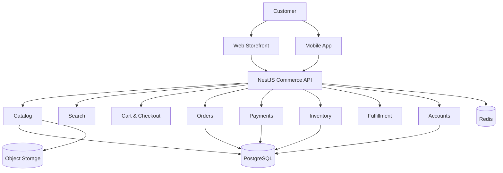

---

## 2. Core Principles

### 2.1 One commerce platform

Retail and marketplace operations use the same foundational systems for:

- Catalog
- Product discovery
- Cart
- Checkout
- Orders
- Payments
- Inventory
- Fulfillment
- Customer accounts
- Reviews
- Returns
- Notifications

### 2.2 API-first architecture

The business logic belongs in the backend, not in the Next.js storefront or mobile application.

```text
Web              ─┐
                   ├──> NestJS Commerce API ───> Domain Modules ───> Database
Mobile            ─┤
Seller Portal     ─┤
Admin Portal      ─┘
```

This means the web and mobile applications are clients of the same platform.

### 2.3 Product and Offer are different concepts

A **Product** represents what an item is.

An **Offer** represents who is selling it and under which commercial conditions.

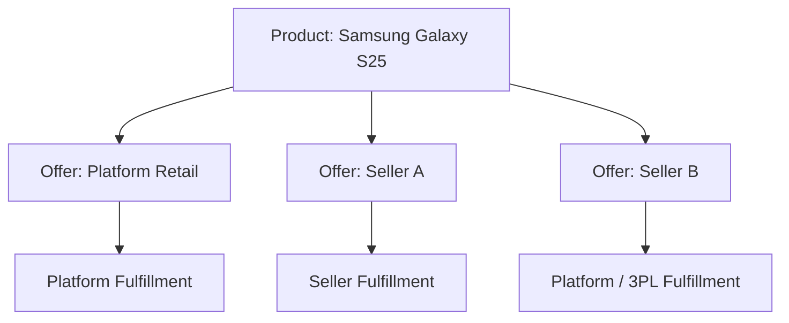

This allows multiple sellers to compete around one product while the platform can also sell the same product itself.

---

## 3. High-Level System Architecture

```mermaid
flowchart TB
    subgraph Clients
        WEB[Next.js Web]
        MOB[Customer Mobile App]
        SELLER[Seller Portal]
        ADMIN[Admin Portal]
    end

    subgraph Platform[Commerce Platform — Modular Monolith]
        API[NestJS Commerce API]
        AUTH[Auth Module]
        CAT[Catalog Module]
        SEARCH[Search Module]
        CART[Cart & Checkout Modules]
        ORDER[Orders Module]
        PAYMENT[Payments Module]
        INV[Inventory Module]
        FUL[Fulfillment & Shipping Modules]
        RETURN[Returns & Refunds]
        MARKET[Marketplace & Seller Modules]
        REVIEW[Reviews Module]
        NOTIFY[Notifications Module]
        ANALYTICS[Analytics]
        SUPPORT[Support]
    end

    subgraph Data
        DB[(PostgreSQL)]
        REDIS[(Redis)]
        OBJECT[(Object Storage)]
        INDEX[(Search Index)]
    end

    subgraph External
        GATEWAY[In-house Payment Gateway]
        COURIER[Courier / 3PL Integrations]
        MSG[Email / SMS / Push Providers]
    end

    WEB --> API
    MOB --> API
    SELLER --> API
    ADMIN --> API

    API --> AUTH
    API --> CAT
    API --> SEARCH
    API --> CART
    API --> ORDER
    API --> PAYMENT
    API --> INV
    API --> FUL
    API --> RETURN
    API --> MARKET
    API --> REVIEW
    API --> NOTIFY
    API --> ANALYTICS
    API --> SUPPORT

    AUTH --> DB
    CAT --> DB
    ORDER --> DB
    PAYMENT --> DB
    INV --> DB
    MARKET --> DB
    RETURN --> DB
    REVIEW --> DB
    SUPPORT --> DB

    API --> REDIS
    CAT --> OBJECT
    SEARCH --> INDEX

    PAYMENT --> GATEWAY
    FUL --> COURIER
    NOTIFY --> MSG
```

The NestJS API is a single deployable process initially. NestJS modules provide logical isolation inside the process while preserving a path to future service extraction.

---

## 4. Applications

The platform consists of four major applications.

### Web Storefront

**Technology:** Next.js + TypeScript + Tailwind CSS + shadcn/ui

Used by customers to:

- Browse products
- Search and filter
- View product details
- Compare offers
- Add items to cart
- Checkout
- Pay
- Track orders
- Request returns/refunds
- Review products
- Manage their account

### Customer Mobile App

Recommended starting technology: **Kotlin Multiplatform + Jetpack Compose / Compose Multiplatform**.

Flutter is also viable; the backend architecture remains framework-agnostic.

The mobile app consumes the same Commerce API as the web storefront.

### Seller Portal

Used by third-party sellers to:

- Apply to become sellers
- Manage store profile
- Create products/offers
- Manage pricing
- Manage inventory
- Manage orders
- Manage fulfillment
- View earnings
- Request payouts
- Monitor reviews
- View sales analytics

### Admin Portal

Used by internal operations/admin teams to control the entire platform.

---

## 5. User Roles

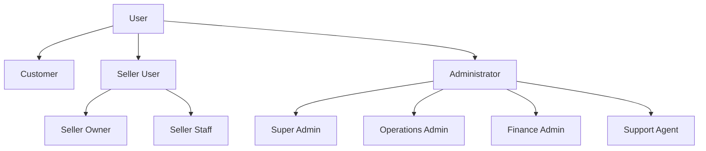

Use role-based access control (RBAC) with explicit permissions rather than hardcoding authorization rules into individual screens.

---

## 6. Domain Architecture

The backend should be divided into clear business domains. In the initial implementation these are NestJS modules inside the modular monolith.

```text
Identity & Access
Catalog
Pricing & Offers
Marketplace
Inventory
Orders
Payments
Financial Ledger
Fulfillment
Shipping
Returns & Refunds
Reviews
Notifications
Customer Support
Analytics
Audit
```

### Domain relationship

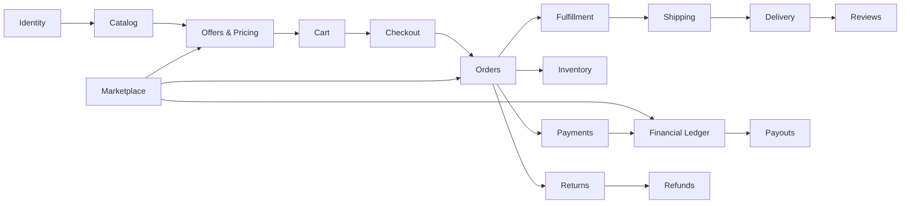

---

## 7. Catalog Model

The catalog is shared between retail and marketplace operations.

### Core entities

```text
Category
Brand
Product
Product Variant
Product Attribute
Product Media
SKU
Offer
Price
Inventory Item
Warehouse
Collection
```

### Product/Offer model

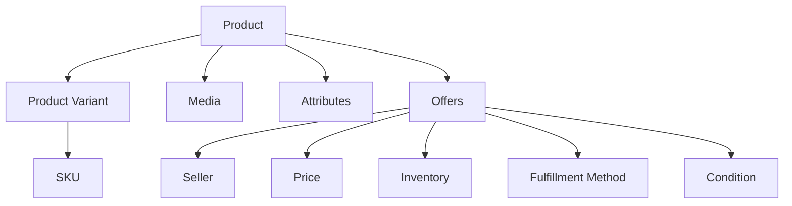

Example:

```text
Product
└── Samsung Galaxy S25

Offers
├── Platform Retail
│   ├── Price: K15,999
│   ├── Stock: Platform Warehouse
│   └── Fulfillment: Platform
│
├── ABC Electronics
│   ├── Price: K15,500
│   ├── Stock: Seller
│   └── Fulfillment: Seller
│
└── XYZ Mobiles
    ├── Price: K15,850
    ├── Stock: 3PL
    └── Fulfillment: 3PL
```

---

## 8. Retail + Marketplace Model

Retail and marketplace inventory should coexist.

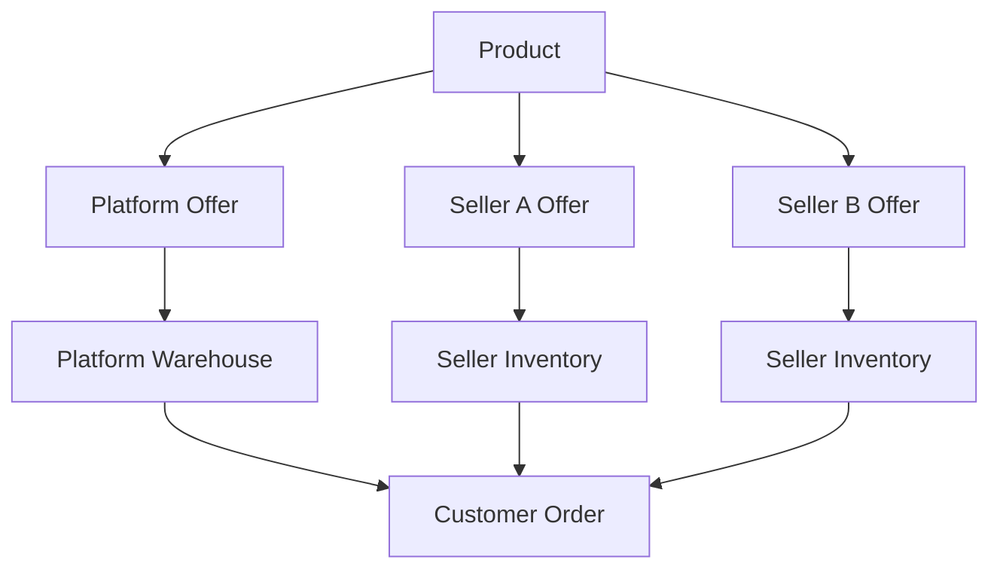

### Fulfillment types

Support these from the architecture level:

- Platform fulfillment
- Seller fulfillment
- Third-party logistics (3PL)
- Customer pickup

This leaves room for an eventual **Fulfilled by Platform** capability similar to Amazon FBA.

---

## 9. Customer Shopping Flow

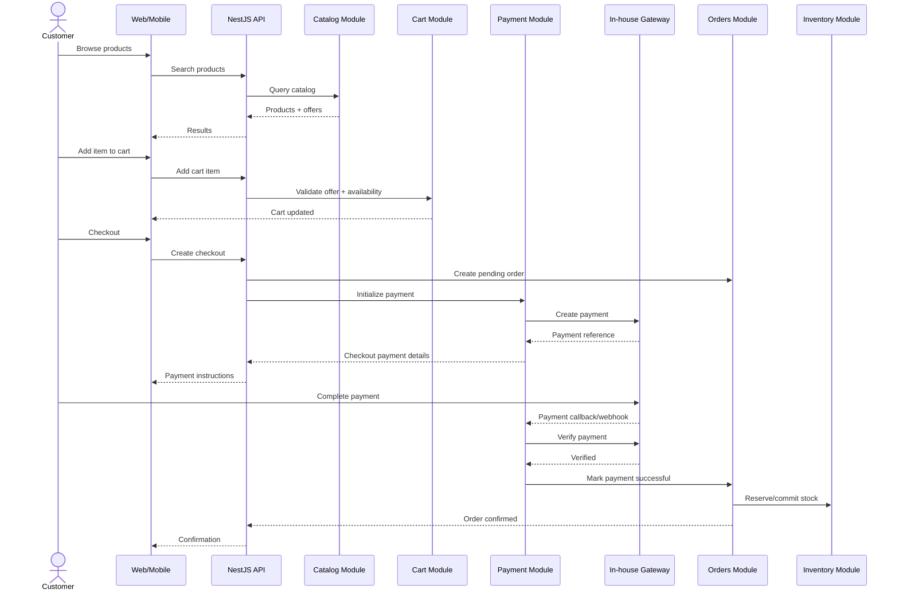

---

## 10. Payment Architecture

### Payment gateway

The primary and initial payment provider is the **in-house payment gateway**.

The commerce platform should still use an internal provider abstraction so gateway-specific details do not leak through the entire codebase.

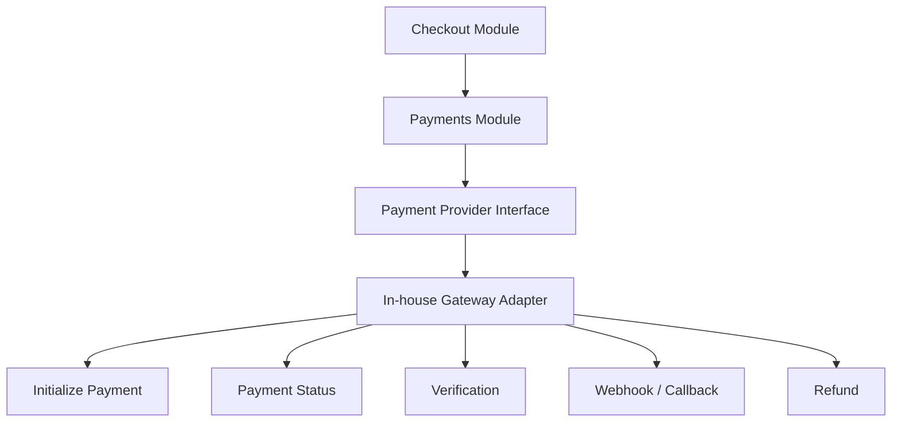

### Internal provider interface

Conceptually:

```typescript
interface PaymentProvider {
    initializePayment(...): Promise<PaymentResult>;
    getPaymentStatus(...): Promise<PaymentStatus>;
    verifyPayment(...): Promise<PaymentVerification>;
    handleWebhook(...): Promise<void>;
    createRefund(...): Promise<RefundResult>;
    getRefundStatus(...): Promise<RefundStatus>;
}
```

### Payment rules

The frontend must never mark an order as paid.

A successful payment must come from a verified server-side gateway interaction.

### Payment lifecycle

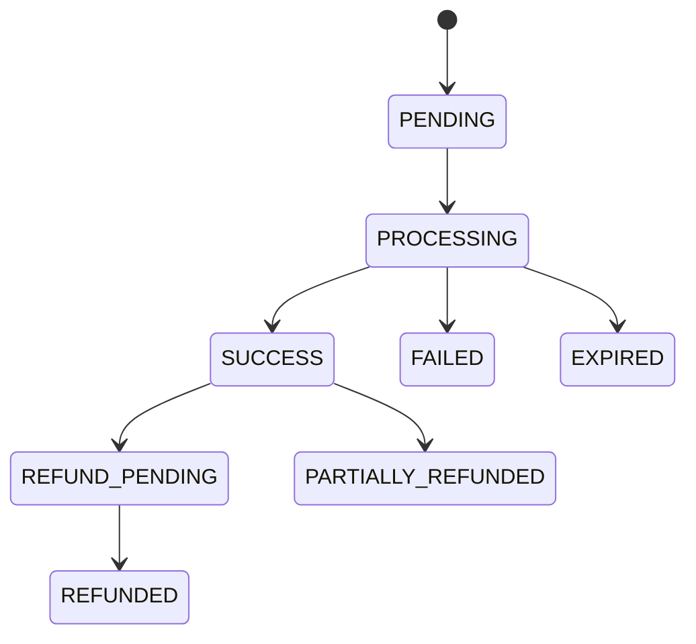

### Payment flow

```text
Customer
   ↓
Checkout
   ↓
Create Order (PENDING_PAYMENT)
   ↓
Create Payment
   ↓
In-house Gateway
   ↓
Customer pays
   ↓
Gateway callback/webhook
   ↓
Server verifies transaction
   ↓
Payment = PAID
   ↓
Order = CONFIRMED
   ↓
Inventory committed
   ↓
Fulfillment begins
```

### Payment data

Recommended entities:

```text
payments
payment_attempts
payment_events
payment_methods
refunds
refund_events
```

---

## 11. Marketplace Financial Model

A marketplace needs more than a simple `order.total` field.

### Financial flow

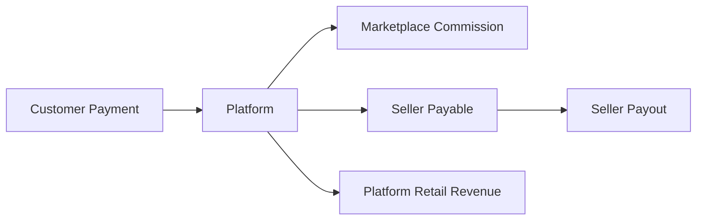

Example:

```text
Customer pays:               K10,000
Marketplace commission:       K1,000
Seller payable:               K9,000
```

### Financial entities

```text
financial_accounts
ledger_entries
seller_balances
commission_transactions
payouts
payment_transactions
refund_transactions
```

### Important distinction

```text
Payment
= Did the customer successfully pay?

Ledger
= How was the money allocated?

Seller Balance
= How much does the seller currently have claim to?

Payout
= Has money actually been released to the seller?
```

This design is critical before real marketplace money starts moving.

---

## 12. Order Architecture

The customer can place one order containing products from multiple sellers.

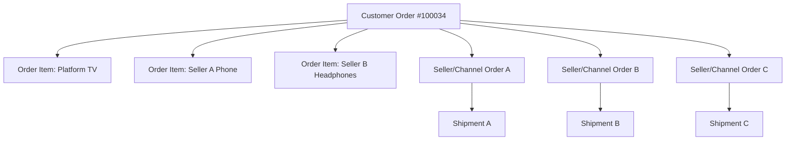

### Recommended order entities

```text
orders
order_items
seller_orders
shipments
shipment_items
fulfillments
```

### Order lifecycle

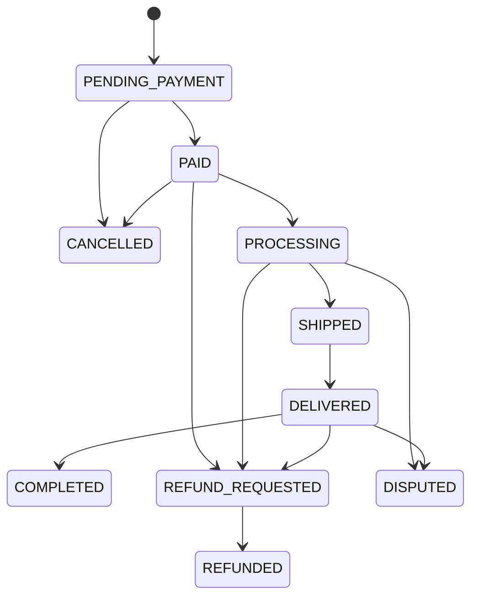

---

## 13. Inventory Architecture

Inventory must support both platform-owned inventory and seller inventory.

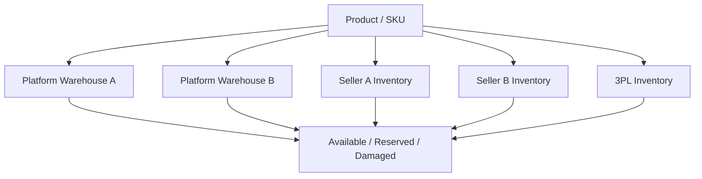

### Inventory principles

Track:

- On hand
- Reserved
- Available
- Damaged
- In transit
- Reorder threshold

Recommended entities:

```text
warehouses
warehouse_inventory
inventory_movements
stock_reservations
stock_transfers
supplier_purchase_orders
```

---

## 14. Fulfillment & Shipping

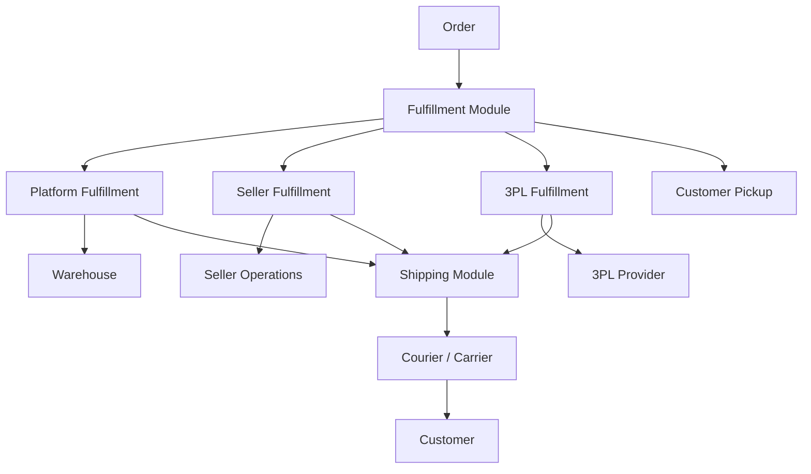

The fulfillment and shipping modules are provider-agnostic and remain inside the modular monolith initially.

---

## 15. Returns, Refunds & Disputes

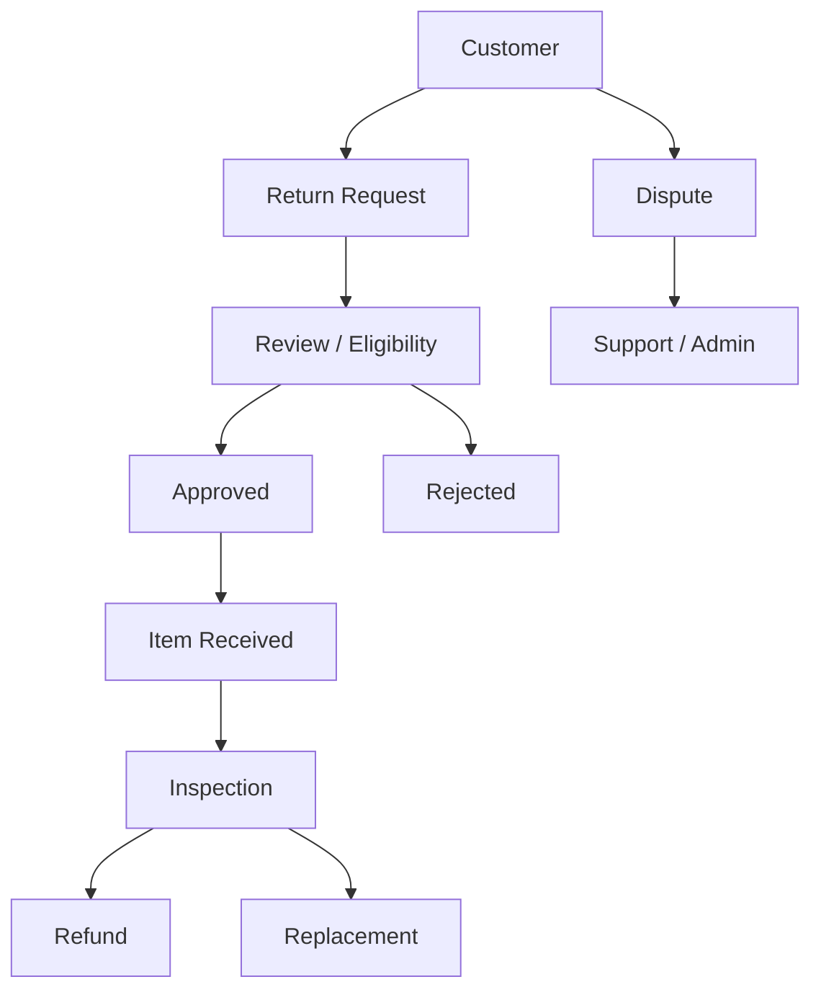

Refunds must go through the payment abstraction and be connected to the original payment transaction.

---

## 16. Seller Architecture

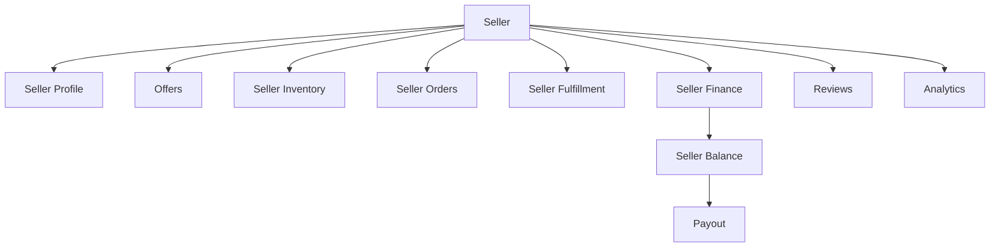

### Seller lifecycle

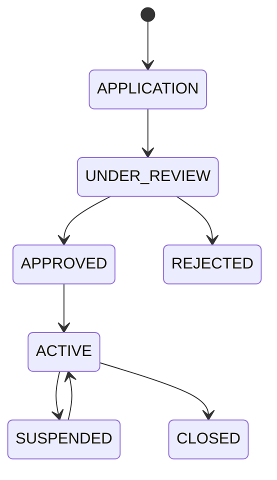

---

## 17. Admin Architecture

Admin users require granular permissions.

```text
Admin
 ├── Catalog Management
 ├── Seller Management
 ├── Order Management
 ├── Inventory
 ├── Fulfillment
 ├── Finance
 ├── Payments
 ├── Promotions
 ├── Reviews & Moderation
 ├── Customer Support
 ├── Analytics
 ├── Security
 └── Audit
```

Administrative actions must generate audit records for privileged or business-critical operations.

---

## 18. Mobile Architecture

The mobile application is not a separate backend.

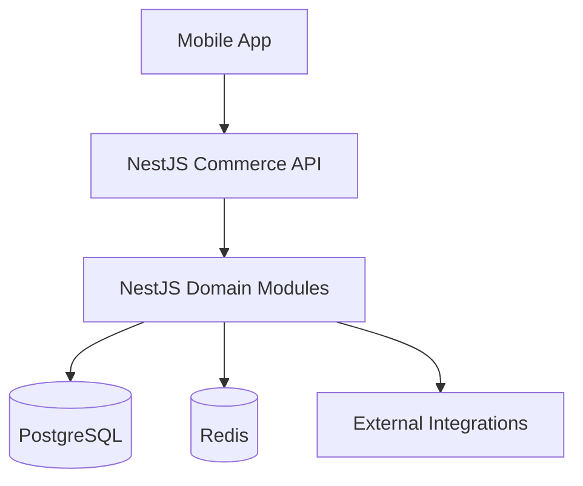

The mobile application consumes the same versioned API as web, seller and admin clients.

### Mobile stack

Preferred:

```text
Kotlin Multiplatform
Compose Multiplatform
Ktor Client / equivalent API client
Secure local storage
Push notifications
```

Flutter remains a valid alternative without changing the backend architecture.

---

## 19. Search

Initial search can use PostgreSQL capabilities.

As catalog size grows, move search to a dedicated search engine without changing the domain API.

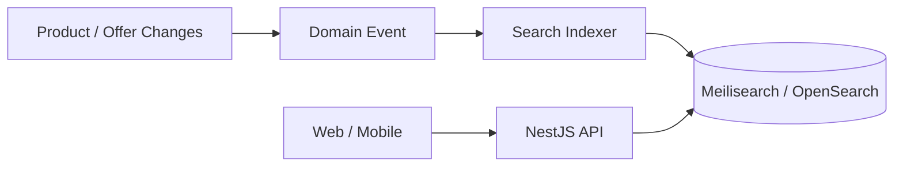

The search index is never the source of truth for product, pricing or inventory.

---

## 20. Notifications

Notification events should originate from backend business events.

```mermaid
flowchart TD
    EVENT[Domain Event]
    EVENT --> NOTIFY[Notifications Module]
    NOTIFY --> EMAIL[Email]
    NOTIFY --> SMS[SMS]
    NOTIFY --> PUSH[Push]
    NOTIFY --> INAPP[In-app Notifications]
```

Examples:

```text
Order Created
Payment Successful
Payment Failed
Order Shipped
Order Delivered
Return Approved
Refund Completed
Seller Approved
Seller Suspended
Payout Completed
```

---

## 21. Audit Logging

Important actions should be recorded.

```text
User
Action
Resource
Previous State
New State
Timestamp
IP / Context where appropriate
Request ID
```

Examples:

```text
Admin approved seller
Admin changed price
Seller updated offer
Finance approved payout
Customer requested refund
Payment status changed
Inventory manually adjusted
```

---

## 22. Security Architecture

### Authentication

```text
Access Token
Refresh Token
Session Management
Password Reset
Email Verification
Optional MFA
```

### Authorization

Use RBAC.

```text
CUSTOMER
SELLER_OWNER
SELLER_STAFF
ADMIN
SUPER_ADMIN
FINANCE
OPERATIONS
SUPPORT
```

### Security requirements

- HTTPS everywhere
- Secure token/session handling
- Password hashing
- Rate limiting
- Request validation
- RBAC
- Resource ownership checks
- Audit logging
- Webhook verification
- Idempotency protection
- Input sanitization
- Secure headers
- PII protection
- Secrets management

---

## 23. Database Logical Structure

PostgreSQL is the primary transactional database.

### Identity

```text
users
roles
permissions
user_roles
sessions
```

### Catalog

```text
categories
brands
products
product_variants
attributes
product_media
skus
```

### Marketplace

```text
sellers
seller_users
offers
seller_inventory
commissions
seller_balances
payouts
```

### Commerce

```text
carts
cart_items
orders
order_items
seller_orders
```

### Payments

```text
payments
payment_attempts
payment_events
refunds
refund_events
```

### Inventory

```text
warehouses
inventory
inventory_movements
stock_reservations
```

### Fulfillment

```text
fulfillments
shipments
shipment_items
shipping_events
```

### Customer

```text
addresses
wishlists
reviews
returns
```

### System

```text
audit_logs
notifications
background_jobs
```

---

## 24. Recommended Backend Structure

The backend is a **NestJS modular monolith**.

```text
apps/
├── web/
├── admin/
├── seller/
└── mobile/

services/
└── commerce-api/
    └── src/
        ├── modules/
        │   ├── auth/
        │   ├── users/
        │   ├── catalog/
        │   ├── products/
        │   ├── offers/
        │   ├── cart/
        │   ├── checkout/
        │   ├── orders/
        │   ├── payments/
        │   ├── inventory/
        │   ├── fulfillment/
        │   ├── shipping/
        │   ├── sellers/
        │   ├── marketplace/
        │   ├── commissions/
        │   ├── payouts/
        │   ├── reviews/
        │   ├── promotions/
        │   ├── notifications/
        │   └── admin/
        │
        ├── common/
        ├── database/
        ├── integrations/
        └── infrastructure/
```

### Module structure guideline

A typical business module can use:

```text
catalog/
├── catalog.module.ts
├── controllers/
├── dto/
├── entities/
├── services/
├── repositories/
├── policies/
├── events/
└── tests/
```

The exact internal layout can vary by domain, but module boundaries must remain explicit.

### Dependency rule

```text
Controller
    ↓
Application Service
    ↓
Domain Logic
    ↓
Repository / Infrastructure Adapter
    ↓
PostgreSQL / Redis / External Provider
```

Cross-module dependencies should use explicit service interfaces or application-level contracts.

---

## 25. API Strategy

All clients use the versioned API.

```text
/api/v1
```

Example:

```text
GET    /api/v1/products
GET    /api/v1/products/:id
GET    /api/v1/offers
POST   /api/v1/cart
POST   /api/v1/checkout
POST   /api/v1/orders
GET    /api/v1/orders/:id
POST   /api/v1/payments
POST   /api/v1/payments/webhook
POST   /api/v1/returns
```

Use consistent:

- HTTP semantics
- Error response shape
- Pagination
- Filtering
- Sorting
- Idempotency keys for sensitive mutations
- Request IDs / correlation IDs

NestJS controllers should remain thin; business behavior belongs in application/domain services.

---

## 26. Background Jobs

Some operations should execute asynchronously.

```mermaid
flowchart TD
    API[NestJS API] --> QUEUE[Job Queue]
    QUEUE --> WORKER[Worker Process]
    WORKER --> EMAIL[Email]
    WORKER --> SMS[SMS]
    WORKER --> PUSH[Push Notifications]
    WORKER --> SEARCH[Search Indexing]
    WORKER --> REPORT[Reports]
    WORKER --> PAYOUT[Payout Jobs]
    WORKER --> CLEANUP[Cleanup]
```

The worker can start as part of the same modular application/runtime boundary and be separated later if operational needs justify it.

Use retries and dead-letter handling.

---

## 27. Observability

Use:

```text
Structured Logs
Metrics
Distributed/Request Tracing
Error Tracking
Audit Logs
Health Checks
```

Monitor:

```text
API latency
5xx rate
Database latency
Redis health
Payment failures
Order failures
Webhook failures
Queue failures
Search failures
```

---

## 28. Environment Strategy

```text
Development
Testing
Staging
Production
```

### Environment variables

Example:

```text
DATABASE_URL=
REDIS_URL=
JWT_SECRET=
OBJECT_STORAGE_ENDPOINT=
OBJECT_STORAGE_BUCKET=
PAYMENT_GATEWAY_URL=
PAYMENT_GATEWAY_SECRET=
EMAIL_PROVIDER_KEY=
SMS_PROVIDER_KEY=
```

Never commit real secrets.

---

## 29. CI/CD

Recommended pipeline:

```mermaid
flowchart LR
    PUSH[Git Push] --> LINT[Lint]
    LINT --> TEST[Test]
    TEST --> BUILD[Build]
    BUILD --> SECURITY[Security Checks]
    SECURITY --> DEPLOY[Deploy]
```

### Web

Deploy Next.js application to:

```text
Vercel
```

### API

Deploy NestJS modular monolith to:

```text
Render / Fly.io / AWS / Equivalent
```

### Database

Use managed PostgreSQL.

### Redis

Use managed Redis.

---

## 30. Development Tools

### Frontend

| Tool | Purpose |
|---|---|
| Next.js | Web application / SSR / routing |
| TypeScript | Application language |
| Tailwind CSS | Styling |
| shadcn/ui | UI component system |
| React Hook Form | Forms |
| Zod | Client-side schema validation |
| TanStack Query | Server-state/data fetching where appropriate |
| Lucide | Icons |

### Backend

| Tool | Purpose |
|---|---|
| TypeScript | Backend language |
| NestJS | HTTP/API framework and modular application architecture |
| Prisma | Type-safe PostgreSQL ORM and migrations |
| PostgreSQL | Primary transactional database |
| Redis | Cache, rate limits and background jobs |

### Mobile

| Tool | Purpose |
|---|---|
| Kotlin Multiplatform | Cross-platform application architecture |
| Compose Multiplatform | UI |
| Ktor Client / equivalent | HTTP client |

### Infrastructure

| Tool | Purpose |
|---|---|
| Docker | Containers |
| GitHub Actions | CI/CD |
| Vercel | Next.js hosting |
| Render or equivalent | NestJS API / workers |
| Managed PostgreSQL | Database |
| Managed Redis | Caching / jobs |
| S3 / Cloudflare R2 | Object storage |
| Meilisearch / OpenSearch | Search |
| Sentry / equivalent | Error tracking |

---

## 31. Repository Structure

Recommended high-level repository:

```text
commerce-platform/
│
├── apps/
│   ├── web/
│   ├── admin/
│   ├── seller/
│   └── mobile/
│
├── services/
│   └── commerce-api/
│       └── NestJS modular monolith
│
├── packages/
│   ├── api-client/
│   ├── contracts/
│   ├── types/
│   ├── config/
│   └── tooling/
│
├── infrastructure/
│   ├── docker/
│   ├── ci/
│   ├── environments/
│   └── scripts/
│
├── docs/
│   ├── architecture/
│   ├── api/
│   ├── database/
│   └── runbooks/
│
├── package.json
├── pnpm-workspace.yaml
└── README.md
```

Use a workspace-capable package manager such as pnpm for the TypeScript monorepo.

---

## 32. Critical Business Rules

### Product

Products are not owned by sellers.

Sellers own offers against products.

### Offer

An offer belongs to a seller and points to a product/SKU.

### Price

Prices must be stored server-side.

### Order

Order totals should be snapshotted at checkout.

### Payment

Payment status is controlled by the server.

### Inventory

Inventory must be reserved atomically.

### Marketplace

Seller balances must be ledger-backed.

### Refunds

Refunds must reference original payment transactions.

### Authentication

Authorization must be enforced server-side.

---

## 33. End-to-End Retail Purchase

```mermaid
sequenceDiagram
    actor Customer
    participant Web as Next.js
    participant API as NestJS API
    participant Product as Product Module
    participant Cart as Cart Module
    participant Checkout as Checkout Module
    participant Orders as Orders Module
    participant Payment as Payments Module
    participant Gateway as In-house Gateway
    participant Inventory as Inventory Module
    participant Fulfillment as Fulfillment Module

    Customer->>Web: Browse
    Web->>API: GET /products
    API->>Product: Find products
    Product-->>API: Products
    API-->>Web: Products

    Customer->>Web: Add to cart
    Web->>API: POST /cart/items
    API->>Cart: Add item
    Cart-->>Web: Cart

    Customer->>Web: Checkout
    Web->>API: POST /checkout
    API->>Checkout: Validate cart
    Checkout->>Orders: Create order
    Orders-->>Checkout: PENDING_PAYMENT
    Checkout->>Payment: Initialize payment
    Payment->>Gateway: Initialize
    Gateway-->>Payment: Payment reference
    Payment-->>Web: Payment instructions

    Customer->>Gateway: Pay
    Gateway->>Payment: Webhook
    Payment->>Gateway: Verify
    Gateway-->>Payment: PAID
    Payment->>Orders: Confirm order
    Orders->>Inventory: Reserve/commit
    Orders->>Fulfillment: Create fulfillment
    Fulfillment-->>Orders: Fulfillment created
    Orders-->>Web: Order confirmed
```

---

## 34. End-to-End Marketplace Purchase

```mermaid
sequenceDiagram
    actor Customer
    participant Web as Web/Mobile
    participant API as NestJS API
    participant Offer as Offers Module
    participant Cart as Cart Module
    participant Checkout as Checkout Module
    participant Orders as Orders Module
    participant Payment as Payments Module
    participant Gateway as In-house Gateway
    participant Ledger as Ledger
    participant Seller as Seller
    participant Fulfillment as Fulfillment

    Customer->>Web: View product
    Web->>API: Get offers
    API->>Offer: Find eligible offers
    Offer-->>Web: Platform + seller offers

    Customer->>Web: Add seller offer
    Web->>API: Add to cart
    API->>Cart: Validate offer

    Customer->>Web: Checkout
    Web->>API: Create checkout
    API->>Checkout: Validate all cart lines
    Checkout->>Orders: Create unified order
    Orders-->>Checkout: Order created

    Checkout->>Payment: Initialize payment
    Payment->>Gateway: Payment request
    Gateway-->>Payment: Reference
    Customer->>Gateway: Pay
    Gateway->>Payment: Callback
    Payment->>Gateway: Verify
    Gateway-->>Payment: Confirmed

    Payment->>Orders: Mark paid
    Orders->>Fulfillment: Create seller fulfillment
    Orders->>Ledger: Allocate seller payable
    Ledger-->>Seller: Balance updated
    Fulfillment-->>Seller: Seller order
```

---

## 35. Development Phases

The platform is intentionally implemented progressively.

---

# PHASE 0 — Architecture & Foundation

**Goal:** establish the technical foundation.

Includes:

- Repository structure
- NestJS modular monolith bootstrap
- Prisma/PostgreSQL foundations
- Redis
- Authentication
- RBAC
- API versioning
- Error handling
- Object storage
- Observability
- Audit logging
- CI/CD
- Payment provider abstraction

**Outcome:** the platform can be developed safely.

---

# PHASE 1 — Retail Storefront

**Goal:** operate as a normal online retailer.

Includes:

- Product catalog
- Search
- Product pages
- Cart
- Wishlist
- Account
- Checkout
- Payment
- Orders

**Outcome:** customers can purchase products directly from the platform.

---

# PHASE 2 — Retail Operations

**Goal:** support first-party operations.

Includes:

- Warehouses
- Inventory
- Stock management
- Suppliers
- Purchase orders
- Receiving
- Fulfillment
- Shipping
- Tracking
- Returns
- Refunds
- Operations dashboard

**Outcome:** platform-owned retail can operate end-to-end.

---

# PHASE 3 — Marketplace

**Goal:** allow external sellers.

Includes:

- Seller onboarding
- Seller verification
- Seller storefronts
- Offers
- Seller inventory
- Seller orders
- Seller fulfillment
- Commissions
- Seller balances
- Payouts
- Reviews
- Marketplace administration

**Outcome:** third-party sellers can sell through the same platform.

---

# PHASE 4 — Mobile Customer App

**Goal:** provide a native mobile shopping experience.

Includes:

- Mobile authentication
- Product discovery
- Search
- Product details
- Cart
- Checkout
- Payment
- Orders
- Tracking
- Notifications

**Outcome:** customers can shop through mobile.

---

# PHASE 5 — Advanced Commerce

**Goal:** increase customer engagement.

Includes:

- Coupons
- Promotions
- Collections
- Loyalty
- Gift cards
- Advanced search
- Recommendations
- Recently viewed
- Customer support
- Analytics

**Outcome:** a more sophisticated commerce platform.

---

# PHASE 6 — Marketplace Expansion

**Goal:** scale the seller ecosystem.

Includes:

- Seller fulfillment programs
- Courier integrations
- 3PL integrations
- Seller messaging
- Seller promotions
- Sponsored products
- Seller analytics
- Performance controls
- Automated payouts
- Fraud/risk controls

**Outcome:** scalable marketplace ecosystem.

---

# PHASE 7 — Advanced Marketplace

**Goal:** introduce advanced marketplace mechanics.

Includes:

- Buy Box
- Offer ranking
- Make an Offer
- Counter-offers
- Auctions
- Bidding
- Dynamic pricing
- Advanced recommendations
- AI
- Fraud detection
- A/B testing
- Personalization

**Outcome:** advanced marketplace capability.

---

## 36. MVP Scope

The first production release should not attempt to implement the entire roadmap.

### MVP

```text
Catalog
Product pages
Search
Cart
Checkout
In-house payment
Orders
Customer accounts
Basic inventory
Basic fulfillment
Basic admin
```

### Phase 2+ marketplace

```text
Seller onboarding
Seller portal
Offers
Seller inventory
Marketplace checkout
Commissions
Seller balances
Payouts
```

This allows the system to generate value before the entire marketplace ecosystem is built.

---

## 37. Future Features

Potential future capabilities:

```text
Buy Box
Auctions
Bidding
Make an Offer
Dynamic Pricing
Loyalty
Subscriptions
Gift Cards
Advertising
Sponsored Products
AI Recommendations
Fraud Detection
Personalization
A/B Testing
Seller Messaging
Wholesale
B2B Marketplace
International Expansion
```

These should be treated as extensions, not MVP requirements.

---

## 38. Non-Functional Requirements

### Performance

Target:

```text
Fast page loads
Low API latency
Efficient database queries
Caching for high-volume reads
```

### Availability

Important transactional systems should be resilient.

### Scalability

The architecture should allow:

```text
More API instances
Read replicas
Redis scaling
Search scaling
Background worker scaling
Object storage scaling
```

The modular monolith is the starting deployment model; scaling the whole API horizontally comes before splitting domains into microservices.

### Security

Financial and customer information must be handled securely.

### Auditability

Transactions should be traceable end to end.

---

## 39. Project Management Structure

Use GitHub Issues and GitHub Projects.

### Phase issues

```text
PHASE 0 — Architecture & Foundation
PHASE 1 — Retail Storefront
PHASE 2 — Retail Operations
PHASE 3 — Marketplace
PHASE 4 — Mobile Customer App
PHASE 5 — Advanced Commerce
PHASE 6 — Marketplace Expansion
PHASE 7 — Advanced Marketplace
```

### Suggested board columns

```text
Backlog
Ready
In Progress
Code Review
QA
Done
Blocked
```

### Issue types

```text
Feature
Bug
Technical Debt
Architecture
Security
Infrastructure
Documentation
```

---

## 40. Recommended Development Order

```text
Phase 0
   ↓
Phase 1
   ↓
Phase 2
   ↓
Phase 3
   ↓
Phase 4
   ↓
Phase 5
   ↓
Phase 6
   ↓
Phase 7
```

Do not build marketplace-specific infrastructure before the retail transaction lifecycle is stable.

Do not build mobile business logic independently of the backend.

Do not introduce microservices simply because the final system is intended to be large.

---

## 41. Architecture Position

The final architecture intentionally combines simplicity at the beginning with an escape hatch for later scale.

```text
                      ┌───────────────────┐
                      │   Web / Mobile    │
                      └─────────┬─────────┘
                                │
                      ┌─────────▼─────────┐
                      │   NestJS API      │
                      │ Modular Monolith  │
                      └─────────┬─────────┘
                                │
          ┌─────────────────────┼─────────────────────┐
          │                     │                     │
     ┌────▼────┐           ┌────▼────┐          ┌────▼────┐
     │Postgres │           │  Redis  │          │ Storage │
     └─────────┘           └─────────┘          └─────────┘
                                │
                     ┌──────────▼─────────┐
                     │ Background Workers │
                     └────────────────────┘
```

The most important architectural decisions are:

- **Amazon-style retail + marketplace** is the target model.
- **Retail and third-party sellers share the same commerce platform.**
- **Product and Offer are separate concepts.**
- **Web and mobile consume the same backend APIs.**
- **The in-house payment gateway is the primary payment integration.**
- **Payment, ledger, seller balance, and payout are separate concepts.**
- **Orders can contain products from multiple sellers.**
- **The backend starts as a NestJS modular monolith.**
- **NestJS modules have explicit boundaries and are designed for future extraction when justified.**
- **Prisma is the primary PostgreSQL data-access and migration layer.**

---

## 42. Final Technology Stack

### Frontend

```text
Next.js
TypeScript
Tailwind CSS
shadcn/ui
```

### Backend

```text
NestJS
TypeScript
Prisma
PostgreSQL
Redis
```

### Mobile

```text
Kotlin Multiplatform
Compose Multiplatform
```

### Infrastructure

```text
Docker
GitHub Actions
Vercel
Render / AWS / Equivalent
Object Storage
Meilisearch / OpenSearch
Sentry / Equivalent
```

### Payments

```text
In-house Payment Gateway
```

---

## 43. Implementation Checklist

### Foundation

- [ ] Repository initialized
- [ ] Workspace structure created
- [ ] Next.js application created
- [ ] Admin application created
- [ ] Seller application created
- [ ] Mobile project initialized
- [ ] NestJS commerce API created
- [ ] Modular architecture defined
- [ ] Prisma initialized
- [ ] PostgreSQL configured
- [ ] Redis configured
- [ ] Authentication implemented
- [ ] RBAC implemented
- [ ] API versioning implemented
- [ ] Error handling standardized
- [ ] Logging implemented
- [ ] Audit logging implemented
- [ ] CI/CD configured
- [ ] Payment provider abstraction defined

### Retail

- [ ] Catalog
- [ ] Products
- [ ] Categories
- [ ] Search
- [ ] Cart
- [ ] Checkout
- [ ] Payments
- [ ] Orders
- [ ] Inventory
- [ ] Fulfillment
- [ ] Shipping
- [ ] Returns
- [ ] Refunds

### Marketplace

- [ ] Seller onboarding
- [ ] Seller verification
- [ ] Seller storefront
- [ ] Offers
- [ ] Seller inventory
- [ ] Seller orders
- [ ] Seller fulfillment
- [ ] Marketplace commissions
- [ ] Seller balances
- [ ] Seller payouts
- [ ] Reviews

---

## 44. Next Technical Documents

After this README, the next technical documents should be:

```text
01-domain-model.md
02-database-schema.md
03-api-specification.md
04-payment-gateway-integration.md
05-authentication-and-security.md
06-order-state-machine.md
07-inventory-model.md
08-marketplace-financial-model.md
09-mobile-architecture.md
10-deployment-architecture.md
```

These documents should remain version-controlled with the project.

---

## Project Status

**Primary target:** Amazon-style retail + marketplace.

**Architecture:** Modular monolith first; future service extraction only when justified.

**Primary payment integration:** In-house payment gateway.

**Primary web stack:** Next.js + TypeScript + shadcn/ui + Tailwind CSS.

**Primary backend stack:** NestJS + TypeScript + PostgreSQL + Prisma + Redis, implemented as a modular monolith.

**Mobile:** Kotlin Multiplatform + Compose preferred; Flutter remains a viable alternative.

**Current stage:** Planning / Architecture / Development Backlog.

---

# Final Position

This platform should be treated as a serious commerce system rather than a simple online store.

The architecture therefore separates:

```text
Customer Experience
        ↓
Commerce API
        ↓
Domain Modules
        ↓
Transactional Infrastructure
        ↓
External Integrations
```

The initial implementation remains intentionally simple:

> **One NestJS application. Clearly separated modules. One PostgreSQL database. Redis for supporting infrastructure. Provider abstractions around external systems.**

That gives the project a practical starting point while keeping the architecture ready for substantial growth.
