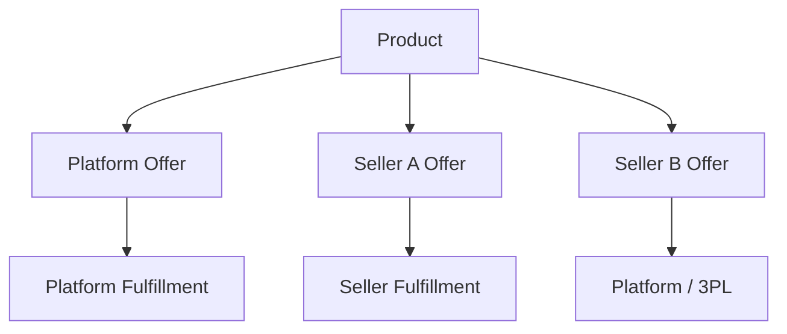
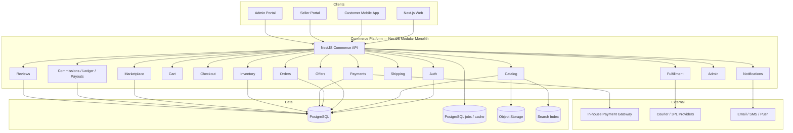
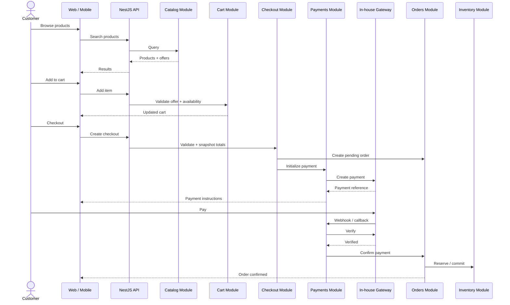
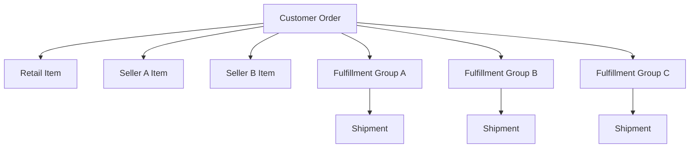
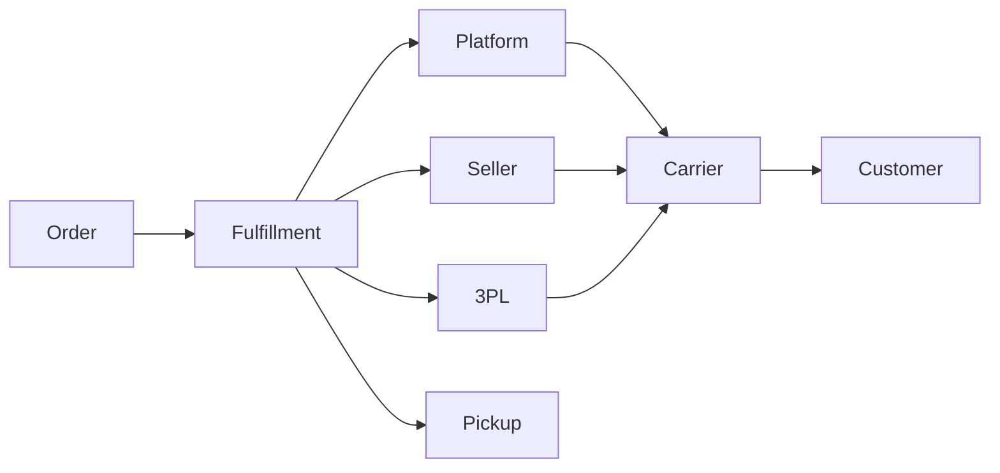
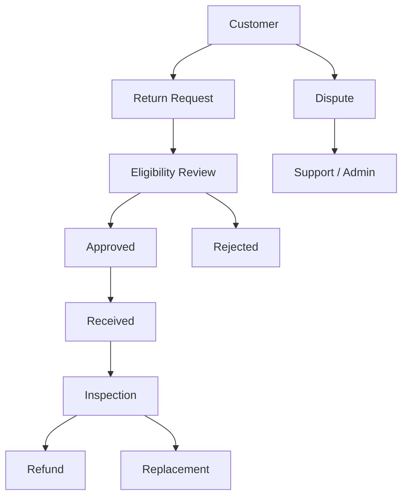
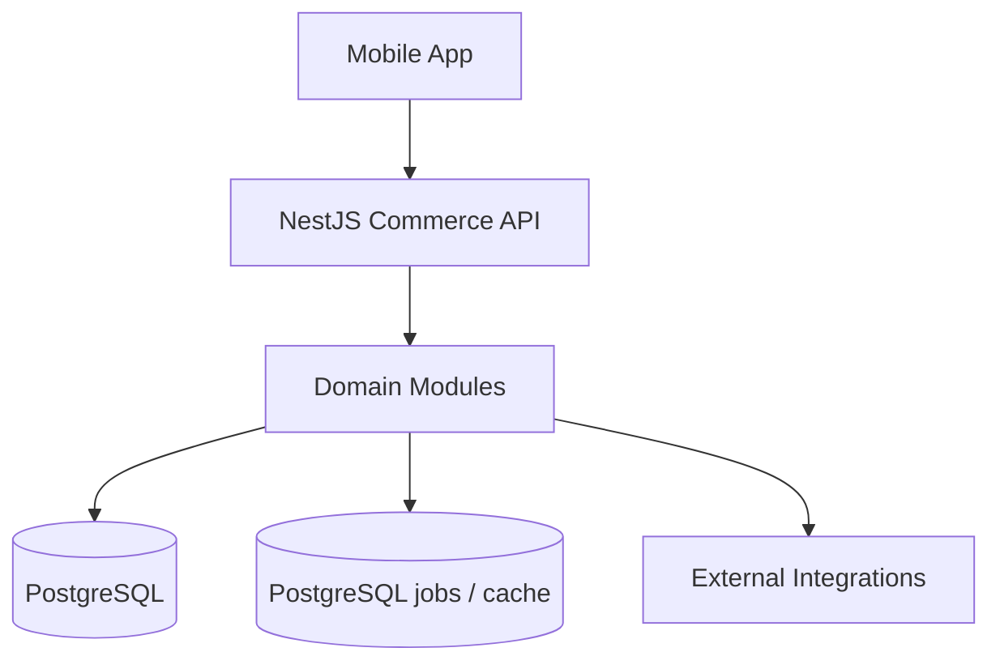
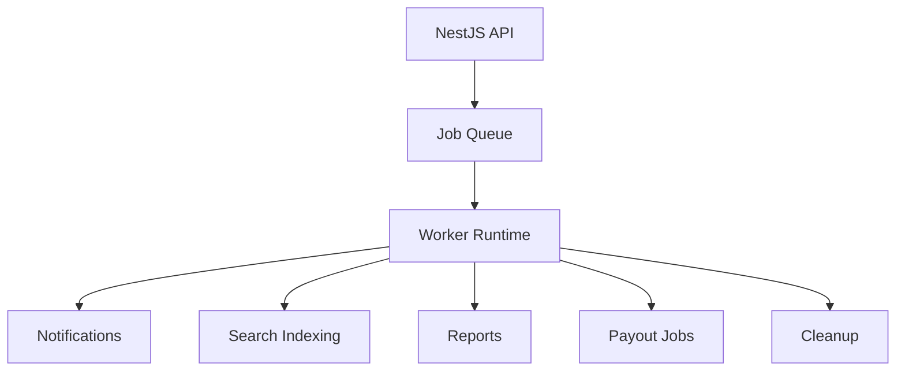
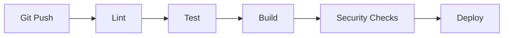

# Commerce Marketplace Platform

> Master Project Plan & Architecture
>
> An Amazon-style commerce platform combining first-party retail with a third-party marketplace, delivered through web, seller, admin, and mobile clients.

## Architecture Decision — Modular Monolith First

The platform starts as a modular monolith rather than a distributed microservices system. All transactional commerce domains live in one deployable NestJS application, separated into explicit business modules with clear ownership boundaries.

```text
apps/
├── web/
├── admin/
├── seller/
└── mobile/

services/
└── commerce-api/
    └── src/
        ├── modules/
        │   ├── auth/
        │   ├── users/
        │   ├── catalog/
        │   ├── products/
        │   ├── offers/
        │   ├── cart/
        │   ├── checkout/
        │   ├── orders/
        │   ├── payments/
        │   ├── inventory/
        │   ├── fulfillment/
        │   ├── shipping/
        │   ├── sellers/
        │   ├── marketplace/
        │   ├── commissions/
        │   ├── payouts/
        │   ├── reviews/
        │   ├── promotions/
        │   ├── notifications/
        │   └── admin/
        │
        ├── common/
        ├── database/
        ├── integrations/
        └── infrastructure/
```

### Modular monolith rules

- Each business module owns its domain logic, application services, controllers, DTOs, validation, and persistence boundaries.
- Modules communicate through explicit services and interfaces rather than directly reaching into another module's repositories.
- `common/` contains shared cross-cutting primitives.
- `database/` contains Prisma client/configuration and migrations.
- `integrations/` contains adapters for the in-house payment gateway, couriers, 3PLs, and other external systems.
- `infrastructure/` contains PostgreSQL-backed jobs and caching, local storage, observability, and runtime concerns.
- The API remains one deployable NestJS service until there is a demonstrated reason to extract a domain.

The goal is strong domain boundaries without introducing distributed-system complexity before it is necessary.

## Getting Started

### Requirements

- Node.js 24 or later
- npm 11 or later
- PostgreSQL 14 or later
- Flutter SDK (only required for the mobile app)

All JavaScript and TypeScript commands below run from the repository root.

### Local development

Install the workspace dependencies:

```bash
npm install
```

Configure the API environment and update the database connection values as
needed. Do not commit this file:

```bash
cp services/commerce-api/.env.example services/commerce-api/.env
```

Create the local database schema, generate Prisma Client, and load development
data:

```bash
npm run prisma:migrate --workspace @commerce/commerce-api
npm run prisma:generate --workspace @commerce/commerce-api
npm run prisma:seed --workspace @commerce/commerce-api
```

Start the API and any client applications in separate terminals:

```bash
npm run api:dev       # http://localhost:3000, Swagger: /api/docs
npm run web:dev       # http://localhost:3001
npm run admin:dev     # http://localhost:3002
npm run seller:dev    # http://localhost:3003
```

The API health endpoint is `http://localhost:3000/api/v1/health`. See
[`services/commerce-api/API_TESTING.md`](services/commerce-api/API_TESTING.md)
for seeded credentials, authentication, and endpoint examples.

### Checks and tests

Run the repository checks from the root:

```bash
npm run format:check
npm run lint
npm run typecheck
npm test
npm run test:e2e
npm run build
```

Generate or verify the API contract directly:

```bash
npm run swagger:generate --workspace @commerce/commerce-api
npm run swagger:check --workspace @commerce/commerce-api
```

## Production

Production requires PostgreSQL, a TLS-enabled API endpoint, and production
values for every API environment variable. Provision secrets through the
deployment platform or secret manager. Never reuse the development
`.env` file, seed credentials, JWT secrets, payment keys, or database
passwords in production.

On the release host or in the release container:

```bash
npm ci

# Set NODE_ENV=production and provide the production environment variables
# before running the commands below.
npm run prisma:deploy --workspace @commerce/commerce-api
npm run prisma:generate --workspace @commerce/commerce-api
npm run build
```

Start the API after the build:

```bash
npm run start:prod --workspace @commerce/commerce-api
```

Start the built Next.js applications as separate processes when they are part
of the deployment:

```bash
npm run start --workspace @commerce/web
npm run start --workspace @commerce/admin
npm run start --workspace @commerce/seller
```

The API production process listens on the `PORT` configured in its environment
(the local default is `3000`). The web, admin, and seller processes use ports
`3001`, `3002`, and `3003` respectively. Put them behind a reverse proxy or
load balancer, terminate TLS there, and configure the clients to use the public
API URL. Do not run `prisma:seed` in production.

## 1. Project Vision

The platform combines:

1. First-party retail — the platform owns inventory and sells directly.
2. Third-party marketplace — approved sellers list products and sell through the platform.

Customers experience one unified marketplace.

## 2. Core Principles

### API-first

Web, mobile, seller, and admin clients consume the same versioned Commerce API. Business rules stay on the backend.

```text
Web              ─┐
Mobile            ├──> NestJS Commerce API ───> Domain Modules ───> PostgreSQL
Seller Portal     ┤
Admin Portal      ─┘
```

### Product vs Offer

A Product represents what an item is. An Offer represents who sells it and under what commercial conditions.



## 3. High-Level System Architecture



The NestJS API is one deployable application initially. Horizontal scaling of the monolith comes before domain extraction.

## 4. Applications

### Web Storefront

Next.js + TypeScript + Tailwind CSS + shadcn/ui.

Customer capabilities include browsing, search, product details, offers, cart, checkout, payment, orders, tracking, returns, reviews, and account management.

### Customer Mobile

Flutter + Dart.

Mobile consumes the same `/api/v1` API as web.

### Seller Portal

Seller onboarding, storefront management, offers, pricing, inventory, orders, fulfillment, earnings, payouts, reviews, and analytics.

### Admin Portal

Catalog, sellers, orders, payments, inventory, fulfillment, promotions, moderation, support, finance, security, analytics, and audit.

## 5. Domain Modules

The initial NestJS application should contain explicit modules for:

```text
auth
users
catalog
products
offers
cart
checkout
orders
payments
inventory
fulfillment
shipping
sellers
marketplace
commissions
payouts
reviews
promotions
notifications
admin
```

Supporting application areas:

```text
common/
database/
integrations/
infrastructure/
```

## 6. Catalog Model

Core entities:

```text
categories
brands
products
product_variants
attributes
product_media
skus
offers
prices
collections
```

A product can have many offers, including the platform's own retail offer.

## 7. Retail + Marketplace

Retail and third-party sellers share the catalog, cart, checkout, orders, payment, fulfillment, reviews, and notification infrastructure.

Fulfillment modes:

- Platform fulfilled
- Seller fulfilled
- 3PL
- Customer pickup

## 8. Customer Shopping Flow



## 9. Payment Architecture

The in-house payment gateway is the primary payment provider, behind an internal provider abstraction.

```typescript
interface PaymentProvider {
  initializePayment(...): Promise<PaymentResult>;
  getPaymentStatus(...): Promise<PaymentStatus>;
  verifyPayment(...): Promise<PaymentVerification>;
  handleWebhook(...): Promise<void>;
  createRefund(...): Promise<RefundResult>;
  getRefundStatus(...): Promise<RefundStatus>;
}
```

Payment state is trusted only after server-side verification. Client callbacks never mark orders paid.

Recommended payment entities:

```text
payments
payment_attempts
payment_events
payment_methods
refunds
refund_events
```

## 10. Marketplace Financial Model

Separate customer payment from seller earnings and payouts.

```text
Customer Payment
      ↓
Platform Financial Accounts
      ├── Platform Retail Revenue
      ├── Marketplace Commission
      └── Seller Payable
                ↓
             Payout
```

Recommended entities:

```text
financial_accounts
ledger_entries
seller_balances
commission_transactions
payouts
payment_transactions
refund_transactions
```

Balances must be derived from auditable financial events.

## 11. Order Architecture

A single checkout may contain platform and multiple seller offers.



Recommended entities:

```text
orders
order_items
seller_orders
fulfillments
shipments
shipment_items
```

## 12. Inventory

Track:

```text
on_hand
reserved
available
damaged
in_transit
reorder_threshold
```

Inventory operations must be transactional and auditable.

## 13. Fulfillment & Shipping



Use provider interfaces so a courier or 3PL can be replaced without changing order-domain logic.

## 14. Returns, Refunds & Disputes



Refunds are linked to original payment transactions and must be idempotent.

## 15. Seller Architecture

```text
Seller
├── Profile
├── Users
├── Offers
├── Inventory
├── Orders
├── Fulfillment
├── Finance
│   ├── Balance
│   └── Payouts
├── Reviews
└── Analytics
```

Seller permissions are always scoped to seller-owned resources.

## 16. Admin Architecture

Administrative controls include:

```text
Catalog
Seller approval / suspension
Orders
Inventory
Fulfillment
Payments
Finance
Promotions
Reviews / moderation
Customer support
Analytics
Security
Audit
```

Privileged actions create audit events.

## 17. Mobile Architecture

The mobile app is a client, not a second backend.



## 18. Search

Start with PostgreSQL where practical. Move to Meilisearch/OpenSearch as scale requires.

The search index is never the source of truth for price, inventory, product state, or payment state.

## 19. Notifications

Backend events drive:

```text
Email
SMS
Push
In-app notifications
```

Examples:

```text
Payment Successful
Order Shipped
Order Delivered
Return Approved
Refund Completed
Seller Approved
Payout Completed
```

## 20. Security

Core controls:

```text
Authentication
RBAC
Resource ownership checks
Rate limiting
Validation
Secure sessions/tokens
Webhook verification
Idempotency
Audit logging
PII protection
Secrets management
HTTPS
```

## 21. Database

PostgreSQL is the system of record.

The NestJS application uses Prisma for type-safe data access and migrations.

## 22. Repository Structure

```text
commerce-platform/
│
├── apps/
│   ├── web/
│   ├── admin/
│   ├── seller/
│   └── mobile/
│
├── services/
│   └── commerce-api/
│       └── src/
│           ├── modules/
│           ├── common/
│           ├── database/
│           ├── integrations/
│           └── infrastructure/
│
├── packages/
│   ├── api-client/
│   ├── contracts/
│   ├── types/
│   ├── config/
│   └── tooling/
│
├── infrastructure/
├── docs/
├── package.json
├── pnpm-workspace.yaml
└── README.md
```

## 23. Module Structure Guideline

Example:

```text
catalog/
├── catalog.module.ts
├── controllers/
├── dto/
├── entities/
├── services/
├── repositories/
├── policies/
├── events/
└── tests/
```

The exact internal folders may vary, but module ownership boundaries must remain explicit.

## 24. API Strategy

All clients use:

```text
/api/v1
```

Controllers stay thin. Business behavior lives in application/domain services.

Sensitive mutations use idempotency keys and request IDs.

## 25. Background Jobs

Asynchronous work includes notifications, search indexing, reports, cleanup, reconciliation, and payouts.



The worker can initially share the same application/domain modules and later be separated operationally.

## 26. Observability

Use:

```text
Structured logs
Request/correlation IDs
Metrics
Tracing
Error tracking
Audit logs
Health/readiness checks
```

Monitor API, database, payments, webhooks, jobs, inventory, orders, and search.

## 27. Environment Strategy

```text
Development
Testing
Staging
Production
```

Never commit secrets.

## 28. CI/CD



Recommended deployment pattern:

```text
Next.js        → Vercel
NestJS API     → Render / AWS / Equivalent
PostgreSQL     → Managed PostgreSQL
Jobs / cache   → PostgreSQL
Object Storage → S3 / R2
```

## 29. Technology Stack

### Web

```text
Next.js
TypeScript
Tailwind CSS
shadcn/ui
```

### Backend

```text
NestJS
TypeScript
Prisma
PostgreSQL
PostgreSQL-backed jobs and cache
```

### Mobile

```text
Flutter
Dart
```

### Infrastructure

```text
Docker
GitHub Actions
Vercel
Render / AWS / Equivalent
S3 / Cloudflare R2
Meilisearch / OpenSearch
Sentry / Equivalent
```

### Payments

```text
In-house Payment Gateway
```

## 30. Development Phases

### Phase 0 — Architecture & Foundation

NestJS modular monolith, Prisma, PostgreSQL, auth, RBAC, local storage, observability, audit, CI/CD, and payment abstraction.

### Phase 1 — Retail Storefront

Catalog, search, product pages, cart, wishlist, accounts, checkout, payment, orders, responsive web.

### Phase 2 — Retail Operations

Warehouses, inventory, procurement, receiving, fulfillment, shipping, tracking, returns, refunds, operations dashboard.

### Phase 3 — Marketplace

Seller onboarding, verification, seller storefronts, offers, seller inventory, multi-seller checkout, commissions, balances, payouts, reviews, seller operations.

### Phase 4 — Mobile Customer App

Flutter customer app consuming the same Commerce API with authentication, discovery, cart, checkout, payments, orders, tracking, reviews, push notifications, and deep links.

### Phase 5 — Advanced Commerce

Promotions, coupons, collections, loyalty, gift cards, advanced search, recommendations, recently viewed, support, analytics.

### Phase 6 — Marketplace Expansion

Courier/3PL integrations, seller fulfillment programs, messaging, seller promotions, sponsored products, seller analytics, automated payouts, risk controls.

### Phase 7 — Advanced Marketplace

Buy Box, offer ranking, Make an Offer, counter-offers, auctions, bidding, dynamic pricing, advanced recommendations, AI, fraud detection, experimentation, personalization.

## 31. MVP Scope

The first production release should focus on:

```text
Catalog
Product pages
Search
Cart
Checkout
In-house payments
Orders
Customer accounts
Basic inventory
Basic fulfillment
Basic admin
```

The marketplace layer follows once the retail transaction lifecycle is stable.

## 32. Critical Business Rules

- Products are not owned by sellers.
- Sellers own offers against products/SKUs.
- Prices are authoritative on the server.
- Order totals are snapshotted at checkout.
- Payment status is controlled by trusted server-side verification.
- Inventory reservations are atomic.
- Seller balances are ledger-backed.
- Refunds reference original payment transactions.
- Authorization is enforced server-side.

## 33. Recommended Development Order

```text
Phase 0
   ↓
Phase 1
   ↓
Phase 2
   ↓
Phase 3
   ↓
Phase 4
   ↓
Phase 5
   ↓
Phase 6
   ↓
Phase 7
```

Do not introduce microservices simply because the final platform is intended to be large. Extract a module only when scale, team ownership, deployment independence, or reliability requirements justify it.

## 34. Project Management

Use GitHub Issues and GitHub Projects.

Suggested columns:

```text
Backlog
Ready
In Progress
Code Review
QA
Done
Blocked
```

Phase issues act as epics. Implementation issues are grouped beneath them by phase.

## 35. Architecture Position

```text
                         ┌──────────────────┐
                         │ Web / Mobile /   │
                         │ Seller / Admin   │
                         └────────┬─────────┘
                                  │
                         ┌────────▼─────────┐
                         │   NestJS API     │
                         │ Modular Monolith │
                         └────────┬─────────┘
                                  │
              ┌───────────────────┼───────────────────┐
              │                   │                   │
        ┌─────▼─────┐       ┌─────▼─────┐       ┌─────▼─────┐
        │ PostgreSQL│       │ DB Jobs   │       │Local Files│
        └───────────┘       └───────────┘       └───────────┘
                                  │
                         ┌────────▼─────────┐
                         │ Background Jobs  │
                         └──────────────────┘
```

## Final Technology Decision

**Primary target:** Amazon-style retail + marketplace.

**Backend architecture:** NestJS modular monolith first.

**Backend:** NestJS + TypeScript + Prisma + PostgreSQL.

**Web:** Next.js + TypeScript + Tailwind CSS + shadcn/ui.

**Mobile:** Flutter + Dart.

**Payments:** In-house payment gateway behind a provider abstraction.

**Scaling strategy:** horizontally scale the modular monolith first; extract domains into services only when there is a concrete reason.
