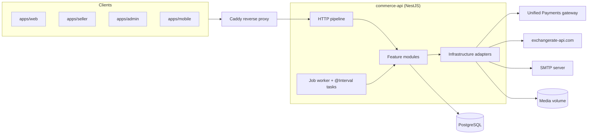
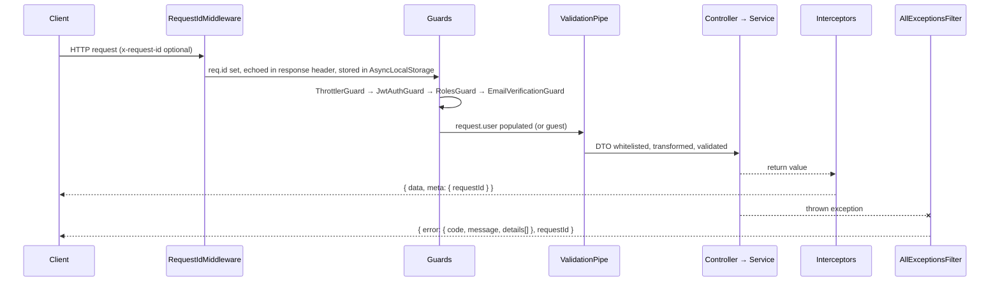
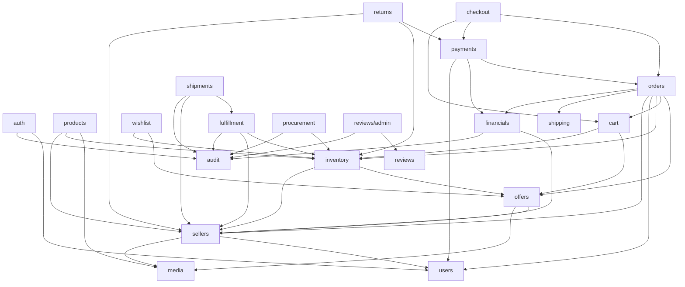

# Architecture

> How `services/commerce-api` is put together: the process, the request pipeline, module boundaries and the conventions every module follows.

## Shape of the system

- **Modular monolith.** One NestJS 11 process on Express, one PostgreSQL database accessed via Prisma 6. The code is split into feature modules under `src/modules/`, with shared building blocks in `src/common/` and technical adapters in `src/infrastructure/`.
- **Postgres does everything stateful.** The background job queue (`BackgroundJob`), the transactional outbox (`OutboxEvent`), the key/value cache (`CacheEntry`), sequence numbers (`SequenceCounter`) and FX rates (`FxRate`) are all ordinary tables. There is no Redis and no message broker, even though some older docs mention Redis.
- **Workers run in-process.** Job polling and scheduled tasks run inside the API process through `@nestjs/schedule`. See [background-processing.md](background-processing.md).
- **External systems sit behind seams.** Payments, FX rates, email, file storage, carriers, payouts and shipping rates are each an interface bound to an adapter. See [integrations.md](integrations.md).

## Source layout

| Path                                                               | Contents                                                                                                                                                                                              |
| ------------------------------------------------------------------ | ----------------------------------------------------------------------------------------------------------------------------------------------------------------------------------------------------- |
| [src/main.ts](../../services/commerce-api/src/main.ts)             | Bootstrap: body parsers, helmet, trust proxy, global prefix, validation pipe, Swagger                                                                                                                 |
| [src/app.module.ts](../../services/commerce-api/src/app.module.ts) | Root module: config validation, throttler, global filter/interceptors/guard, module list                                                                                                              |
| `src/common/auth/`                                                 | Guards (`JwtAuthGuard`, `RolesGuard`, `EmailVerificationGuard`) and decorators (`@Public`, `@OptionalAuth`, `@Roles`, `@RequireVerifiedEmail`, `@CurrentUser`, `@OptionalCurrentUser`, `@GuestToken`) |
| `src/common/http/`                                                 | Response envelope, exception filter, error codes, request-id middleware, `ValidationException`                                                                                                        |
| `src/common/crypto/`                                               | AES-256-GCM field encryption with key rotation ([field-encryption.util.ts](../../services/commerce-api/src/common/crypto/field-encryption.util.ts))                                                   |
| `src/common/numbering/`                                            | `NumberingService`: human-readable sequential codes (PO, receipt, RMA, fulfillment, shipment numbers) backed by `SequenceCounter`                                                                     |
| `src/common/pagination/`                                           | `PaginationQueryDto` (default 20, max 100), `SortDto`, `paginatedResult`, `booleanQuery`                                                                                                              |
| `src/common/catalog/`                                              | `current-price.ts` (ZMW price resolution), `@IsSlug`, currency-query and status DTOs                                                                                                                  |
| `src/common/addresses/`                                            | `address-snapshot.ts`: freezes an address onto an order                                                                                                                                               |
| `src/common/openapi/`                                              | OpenAPI document assembly and generated contracts (see [below](#openapi))                                                                                                                             |
| `src/database/`                                                    | `DatabaseModule`, [prisma.service.ts](../../services/commerce-api/src/database/prisma.service.ts)                                                                                                     |
| `src/infrastructure/`                                              | `config`, `jobs`, `workers`, `email`, `storage`, `cache`, `logging`, `metrics`                                                                                                                        |
| `src/modules/`                                                     | 24 feature modules. See the [module index](README.md#modules)                                                                                                                                         |
| `prisma/`                                                          | `schema.prisma`, 38 migrations, `seed.ts`                                                                                                                                                             |
| `scripts/`                                                         | `generate-openapi.cjs`, `backfill-seller-fulfillments.ts`, `rebuild-review-summaries.ts`                                                                                                              |
| `test/`                                                            | e2e and integration specs, fakes, database-check scripts. See [testing.md](testing.md)                                                                                                                |

## Bootstrap

What [main.ts](../../services/commerce-api/src/main.ts) does, in order:

1. Creates the Nest app with Nest's own body parser turned off ([main.ts:16](../../services/commerce-api/src/main.ts#L16)).
2. Sets `trust proxy` to `loopback, linklocal, uniquelocal`, so that behind Caddy the rate limiter sees the real client IP rather than the proxy's ([main.ts:29](../../services/commerce-api/src/main.ts#L29)).
3. Uses `AppLogger` as the app logger and applies `helmet()`.
4. Adds JSON and urlencoded parsers with a **1 MB** limit. The JSON parser keeps the raw bytes on `req.rawBody` so webhooks can verify signatures ([main.ts:33-43](../../services/commerce-api/src/main.ts#L33-L43)).
5. Sets the global prefix to **`api/v1`**. Nest URI versioning is not used ([main.ts:45](../../services/commerce-api/src/main.ts#L45)).
6. Registers a global `ValidationPipe` with `whitelist`, `forbidNonWhitelisted` and `transform`. Validation failures become `ValidationException` ([main.ts:46-54](../../services/commerce-api/src/main.ts#L46-L54)).
7. Enables shutdown hooks and mounts Swagger UI at `/api/docs`, with the JSON at `/api/docs-json`.
8. Listens on `PORT` (default 3000).

[app.module.ts](../../services/commerce-api/src/app.module.ts) sets up the rest:

- `ConfigModule` is global and validated at startup by [env.validation.ts](../../services/commerce-api/src/infrastructure/config/env.validation.ts). The `.env` file is ignored when `NODE_ENV=test` ([app.module.ts:49-53](../../services/commerce-api/src/app.module.ts#L49-L53)).
- `ThrottlerModule` allows **100 requests per 60 s per IP** by default ([app.module.ts:54](../../services/commerce-api/src/app.module.ts#L54)). Some auth and review routes have tighter limits; see [auth-and-access.md](auth-and-access.md#rate-limits).
- Global providers: `AllExceptionsFilter`, `ResponseEnvelopeInterceptor`, `MetricsInterceptor` and `ThrottlerGuard` ([app.module.ts:86-91](../../services/commerce-api/src/app.module.ts#L86-L91)).
- `RequestIdMiddleware` runs on every route.
- `PrismaService` logs a failed database connection at startup without crashing. Liveness stays up and readiness reports the failure ([prisma.service.ts:16-27](../../services/commerce-api/src/database/prisma.service.ts#L16-L27)).

## Request lifecycle

- **Request ID.** An incoming `x-request-id` header is reused if present; otherwise a UUID is generated. Either way it is echoed in the response header and made available to the logger through AsyncLocalStorage ([request-id.middleware.ts](../../services/commerce-api/src/common/http/request-id.middleware.ts)).
- **Guards.** Four guards are registered globally. `ThrottlerGuard` is in `app.module.ts`. The three auth guards are registered as `APP_GUARD` in `modules/auth/auth.module.ts`. So **every route needs a bearer token unless it says otherwise**. The full model is in [auth-and-access.md](auth-and-access.md).
- **Success responses** are wrapped as `{ data, meta: { requestId } }` ([response-envelope.interceptor.ts](../../services/commerce-api/src/common/http/response-envelope.interceptor.ts)).
- **Error responses** use the shape `{ error: { code, message, details }, requestId }` ([all-exceptions.filter.ts](../../services/commerce-api/src/common/http/all-exceptions.filter.ts)):
  - `code` comes from the HTTP status ([error-codes.ts](../../services/commerce-api/src/common/http/error-codes.ts)). The mapping is 400 → `VALIDATION_ERROR`, 401 → `UNAUTHORIZED`, 403 → `FORBIDDEN`, 404 → `NOT_FOUND`, 409 → `CONFLICT`, 413 → `PAYLOAD_TOO_LARGE`, 429 → `TOO_MANY_REQUESTS` and 503 → `SERVICE_UNAVAILABLE`. **Every other status, including 422, 501 and 502, becomes `INTERNAL_ERROR`.**
  - For validation errors, `details` lists `{ field, message }` with dotted paths into nested DTOs ([validation-exception.ts](../../services/commerce-api/src/common/http/validation-exception.ts)).
  - Errors of 500 and above are logged with the request ID. Their message is only shown to the client if the error is an `HttpException`.
- **Metrics.** `MetricsInterceptor` counts requests and total duration per method, route and status, in memory. `GET /api/v1/metrics` is `@Public` and returns the snapshot ([metrics.controller.ts](../../services/commerce-api/src/infrastructure/metrics/metrics.controller.ts)).

## Module map

The main dependencies between feature modules. An arrow means "imports / calls".

The map shows Nest module imports only. Some modules read other modules' tables directly through Prisma without importing them. `reviews` reads order, fulfillment and shipment rows to check delivery. `operations` reads orders, refund cases, fulfillments, inventory and returns for its metrics.

Cross-module side effects often go through the job queue or the outbox rather than direct calls. For example, a paid order enqueues `fulfillment.provision` instead of calling fulfillment itself. See [background-processing.md](background-processing.md).

`WorkersModule` ([workers.module.ts](../../services/commerce-api/src/infrastructure/workers/workers.module.ts)) is where domain job handlers get registered with the generic `JobWorkerService`. Because of it, `infrastructure/jobs` never imports a feature module.

## Conventions

Every module follows these. The module docs assume them and don't explain them again.

| Convention                 | Rule                                                                                                                                                                                                                                                                                                                                                                                                                        |
| -------------------------- | --------------------------------------------------------------------------------------------------------------------------------------------------------------------------------------------------------------------------------------------------------------------------------------------------------------------------------------------------------------------------------------------------------------------------- |
| **Money**                  | Always an integer in **minor units** (ngwee for ZMW). Orders and catalog prices are **ZMW only**. The only other currencies are USD and GBP, used for card settlement after FX conversion (see [integrations.md](integrations.md#fx-rates)).                                                                                                                                                                                |
| **IDs**                    | UUID primary keys. Human-facing codes such as PO numbers, RMA numbers and fulfillment numbers come from `NumberingService`.                                                                                                                                                                                                                                                                                                 |
| **Idempotency**            | Command endpoints that create money or stock effects take an `Idempotency-Key` header, which must be a **UUID v4**. It is stored in a unique column so a retry returns the original result. Sending the same key with a different payload returns 409. Each module doc says which routes require it.                                                                                                                        |
| **Optimistic concurrency** | Mutable aggregates (offers, inventory records, reviews, payout accounts and so on) carry an integer `version`. Updates send the version they read; a mismatch returns 409.                                                                                                                                                                                                                                                  |
| **Pessimistic locks**      | Money and stock paths serialize on rows with `SELECT ... FOR UPDATE` inside `prisma.$transaction`. Examples: orders (`lockForPayment`), seller balances, reservations, users (`withUserLock` in auth), approved sellers (`SellersService.lockApproved`).                                                                                                                                                                    |
| **Transactions**           | Services accept an optional `tx: Prisma.TransactionClient`, so one caller can compose several side effects in a single commit. Order creation, stock reservations, outbox rows and audit rows are one example.                                                                                                                                                                                                              |
| **Outbox**                 | Domain events are written with `OutboxService.record(input, tx)` in the same transaction as the change. See [background-processing.md](background-processing.md#outbox) and the gap noted there.                                                                                                                                                                                                                            |
| **Audit**                  | `AuditService.record(event, tx?)` writes an `AuditEvent` with actor, action, target, metadata, IP and user agent. Metadata passes through [redact.ts](../../services/commerce-api/src/infrastructure/logging/redact.ts) first, which masks keys such as `password`, `token`, `card`, `phoneNumber` and `apiKey`. Some modules write `auditEvent` rows directly and skip this redaction; see [known-gaps.md](known-gaps.md). |
| **Status machines**        | Each lifecycle is guarded in its service. Transitions are atomic conditional updates (`updateMany where status = X`) or run under a row lock. An invalid transition returns 409. Some statuses are _derived_ rather than set, fulfillment status for example.                                                                                                                                                               |
| **Ownership**              | A resource that exists but belongs to someone else returns **404, not 403**, so its existence is not revealed. Seller resources are checked in the service (`requireApproved`/`lockApproved`), not only by `@Roles`.                                                                                                                                                                                                        |
| **Pagination**             | `?page=&limit=` with page defaulting to 1 and limit defaulting to 20, maximum 100 ([pagination-query.dto.ts](../../services/commerce-api/src/common/pagination/pagination-query.dto.ts)). `paginatedResult` returns `{ data: [...], meta: { page, limit, total } }`, and the envelope then wraps that whole object as its own `data`. Sorting is `?sort=field:asc,other:desc` (`SortQueryDto`/`parseSort`).                 |
| **Validation**             | DTOs use class-validator, and unknown fields are rejected. Query strings `"false"` and `"true"` are parsed with `booleanQuery`.                                                                                                                                                                                                                                                                                             |

## OpenAPI

- [scripts/generate-openapi.cjs](../../services/commerce-api/scripts/generate-openapi.cjs) uses the TypeScript compiler API to read controller signatures, DTO class-validator rules, status codes and the auth decorators. From them it writes `src/common/openapi/contracts.generated.json`, which is checked in.
- [create-api-document.ts](../../services/commerce-api/src/common/openapi/create-api-document.ts) merges those contracts into the routes Nest discovers, matching by `operationId`. **Startup fails** if a route has no contract or a contract has no route ([create-api-document.ts:43-54](../../services/commerce-api/src/common/openapi/create-api-document.ts#L43-L54)).
- `build`, `start` and `start:dev` regenerate the file. `npm run swagger:check` fails when it is stale, and it runs automatically before `test:e2e`.
- Details: [src/common/openapi/README.md](../../services/commerce-api/src/common/openapi/README.md).

## Deployment

[deploy/](../../deploy/README.md) runs the stack with Docker Compose. The services are:

- `caddy`: the reverse proxy, and the only public entry point.
- `api`: built from [services/commerce-api/Dockerfile](../../services/commerce-api/Dockerfile).
- `postgres` 17.
- `migrate`: a one-shot `prisma migrate deploy` that runs before `api` starts, so replicas never race a schema change.
- Optional `cloudflared` tunnel.
- `mailpit`, for catching SMTP in testing.

Health probes are `GET /api/v1/health` (liveness) and `GET /api/v1/health/ready` (database ping). See [modules/audit-and-health.md](modules/audit-and-health.md).
