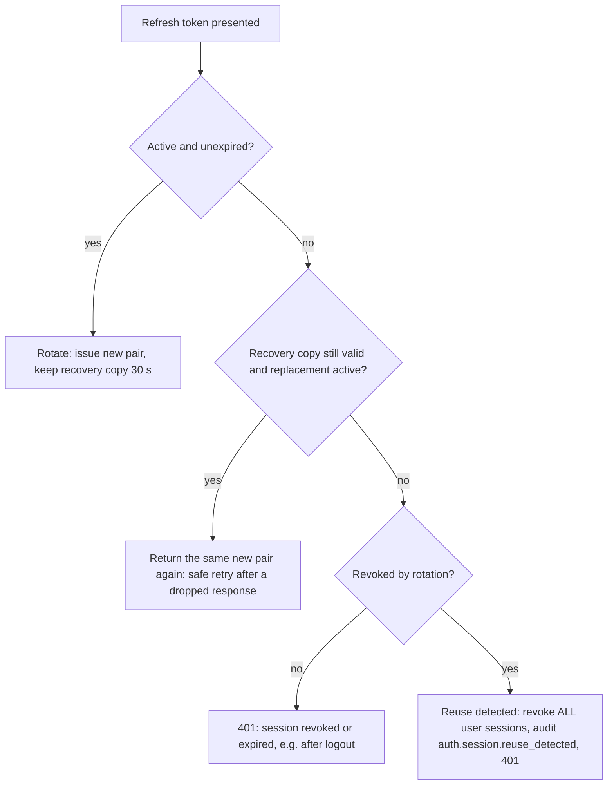

# Authentication and access control

> How callers prove who they are, how sessions work, and how each surface of the API is protected. For per-route details, see the module docs. For the session-management routes specifically, see also [modules/auth-sessions.md](modules/auth-sessions.md).

## Roles

`Role` enum: `CUSTOMER`, `SELLER`, `STAFF`, `ADMIN`.

| Role       | Gets                                                                                                                                 | How it is assigned                                                                                                            |
| ---------- | ------------------------------------------------------------------------------------------------------------------------------------ | ----------------------------------------------------------------------------------------------------------------------------- |
| `CUSTOMER` | Shopping, orders, returns, reviews, and applying to become a seller                                                                  | Default at registration                                                                                                       |
| `SELLER`   | The `sellers/me/*` surface (catalog, stock, orders, fulfillment, finances)                                                           | `SellersService` promotes a CUSTOMER when an admin approves their seller application (`UsersService.promoteCustomerToSeller`) |
| `STAFF`    | Warehouse and catalog operations: `admin/catalog/*`, inventory, fulfillment, shipments, returns handling, procurement, orders (read) | Set directly in the database or by seed. There is no API to grant it                                                          |
| `ADMIN`    | Everything STAFF has, plus approvals, money, moderation and metrics                                                                  | `prisma/seed.ts` or the database                                                                                              |

Having a role is necessary, but not enough, for seller routes. The service also calls `SellersService.requireApproved` or `lockApproved`, which requires an **APPROVED** `Seller` owned by the caller. A seller who is suspended keeps the `SELLER` role but gets 403 or 404 from seller operations.

## Global guards

Four guards run on every request, in this order:

1. **`ThrottlerGuard`**, registered in [app.module.ts:90](../../services/commerce-api/src/app.module.ts#L90). See [Rate limits](#rate-limits).
2. **`JwtAuthGuard`** ([jwt-auth.guard.ts](../../services/commerce-api/src/common/auth/jwt-auth.guard.ts)):
   - `@Public()` routes skip it.
   - `@OptionalAuth()` routes pass without a token, and are authenticated if one is sent.
   - Every other route needs `Authorization: Bearer <accessToken>`.
   - After verifying the JWT (`sub`, `sid`, `role`), the guard **loads the session and its user from the database on every request**. It rejects the request if the session is revoked or expired, belongs to another user, or the user is inactive. So logout, revocation, deactivation and role changes all take effect immediately, and `request.user.role` comes from the database, not from the token.
   - It also updates `Session.lastUsedAt`, at most once a minute.
3. **`RolesGuard`** ([roles.guard.ts](../../services/commerce-api/src/common/auth/roles.guard.ts)) enforces `@Roles(...)` at method or class level and returns 403 on a mismatch.
4. **`EmailVerificationGuard`** ([email-verification.guard.ts](../../services/commerce-api/src/common/auth/email-verification.guard.ts)) enforces `@RequireVerifiedEmail()`. It passes if the user's email is verified, or if `verificationGraceUntil` is still in the future. Otherwise it returns 403 "Verify your email address before using seller features".

The last three are registered as `APP_GUARD` in [auth.module.ts:35-37](../../services/commerce-api/src/modules/auth/auth.module.ts#L35-L37), because they depend on `JwtService`.

Parameter decorators:

- `@CurrentUser()` gives the `AuthenticatedUser`: `{ id, role, sessionId, emailVerified, verificationGraceUntil }`.
- `@OptionalCurrentUser()` gives the same, or `undefined` when there is no token.
- `@GuestToken()` reads the `x-guest-token` header, which identifies a guest cart.

## Tokens and sessions

Implemented in [auth.service.ts](../../services/commerce-api/src/modules/auth/auth.service.ts).

| Credential               | Format                                                    | Lifetime                                                            | Storage                                                    |
| ------------------------ | --------------------------------------------------------- | ------------------------------------------------------------------- | ---------------------------------------------------------- |
| Access token             | JWT signed with `JWT_SECRET`, claims `sub`, `sid`, `role` | `ACCESS_TOKEN_TTL_SECONDS` (15 min)                                 | Not stored. Validated against its session on every request |
| Refresh token            | Opaque, 32 random bytes                                   | `REFRESH_TOKEN_TTL_SECONDS` (30 d), capped by the family's lifetime | SHA-256 hash in `Session.refreshTokenHash`                 |
| Password reset token     | Opaque                                                    | 1 h, one request per 60 s                                           | Hash in `PasswordResetToken`                               |
| Email verification token | Opaque                                                    | 24 h, one resend per 60 s                                           | Hash in `EmailVerificationToken`, bound to `targetEmail`   |
| Handoff code             | Opaque                                                    | 60 s, single use                                                    | Hash in `HandoffToken`                                     |

Passwords are hashed with bcrypt, cost 12 (`password.util.ts`). A failed login returns the same message whether the email or the password was wrong.

### Refresh rotation and reuse detection

Each login starts a **family**: `familyId` plus `familyCreatedAt`. Each refresh:

1. Claims the presented session under a per-user row lock (`withUserLock`, `SELECT … FROM users FOR UPDATE`). The claim is a conditional update that marks the session `revokedReason = rotated` ([auth.service.ts:170-323](../../services/commerce-api/src/modules/auth/auth.service.ts#L170-L323)).
2. Issues a replacement session in the same family. The replacement's expiry can never extend past `familyCreatedAt + 30 days` ([auth.service.ts:43](../../services/commerce-api/src/modules/auth/auth.service.ts#L43)).
3. Stores the new token pair, AES-GCM encrypted with the `REFRESH_RECOVERY` keyring, on the old session for **30 seconds**.

Presenting a refresh token that has already been used then goes one of three ways:

An `@Interval(60 s)` task clears expired recovery data ([auth.service.ts:859](../../services/commerce-api/src/modules/auth/auth.service.ts#L859)).

What revokes which sessions:

| Event                               | Sessions revoked                                                                                                                                                                                                          |
| ----------------------------------- | ------------------------------------------------------------------------------------------------------------------------------------------------------------------------------------------------------------------------- |
| `POST /auth/logout`                 | The session behind the given refresh token (`logout`)                                                                                                                                                                     |
| `PATCH /auth/me/password`           | All other families; the caller's family survives (`password_change`). No email is sent                                                                                                                                    |
| `POST /auth/password-reset/confirm` | All sessions (`password_reset`). Every other outstanding reset token is also used up, and a `password-changed` email is queued ([auth.service.ts:535](../../services/commerce-api/src/modules/auth/auth.service.ts#L535)) |
| `DELETE /auth/sessions/:id`         | That login family (`session_revoked`)                                                                                                                                                                                     |
| `DELETE /auth/sessions/others`      | Every family except the caller's                                                                                                                                                                                          |
| Refresh token reuse                 | All sessions (`reuse_detected`)                                                                                                                                                                                           |

`GET /auth/sessions` lists active sessions with `signedInAt`, `lastUsedAt`, `ipAddress`, `userAgent` and `isCurrent`. It never returns token material.

### Email verification

- **Registration.** Registering creates an email verification and queues the verification email ([auth.service.ts:82-110](../../services/commerce-api/src/modules/auth/auth.service.ts#L82-L110)). The new user can sign in and shop straight away.
- **Confirming.** `POST /auth/email-verification/confirm` sets `emailVerifiedAt` and clears `verificationGraceUntil`. The token must still be for the account's current email address.
- **What needs a verified email.** Routes marked `@RequireVerifiedEmail()`, which is essentially the whole seller surface and the seller application. These controllers use it: seller financials, payouts, fulfillments, inventory, offers, orders, products, returns, shipments and reviews, plus `POST /sellers/applications` and `POST /sellers/me/resubmit`.
- **Grace period.** Migration [`20260928150000_email_verification_rollout`](../../services/commerce-api/prisma/migrations/20260928150000_email_verification_rollout/migration.sql) gave **existing, unverified sellers 30 days** from the moment it was applied. New users get no grace period.

### Cross-app handoff

The storefront, seller and admin apps are separate Next.js apps, each with its own login. To move a signed-in user from one to another without a second login:

1. The source app calls `POST /auth/handoff` server-to-server with the user's access token and receives a 60 s code.
2. It redirects to the target app, passing the code.
3. The target app calls `POST /auth/handoff/exchange`, which is public: the code itself is the proof. The code is claimed exactly once under the user lock, and a fresh token pair is issued in a **new** family.

## Rate limits

| Scope                                                                                                               | Limit                        | Where                                                                                                                     |
| ------------------------------------------------------------------------------------------------------------------- | ---------------------------- | ------------------------------------------------------------------------------------------------------------------------- |
| Default, every route                                                                                                | 100 req / 60 s per client IP | [app.module.ts:54](../../services/commerce-api/src/app.module.ts#L54)                                                     |
| `register`, `login`, `password-reset/request`, `email-verification/resend`, `email-verification/confirm`, `handoff` | 5 req / 60 s                 | `AUTH_BRUTE_FORCE_THROTTLE`, [auth.controller.ts:36](../../services/commerce-api/src/modules/auth/auth.controller.ts#L36) |
| Review write routes                                                                                                 | 10 req / 60 s                | `REVIEW_WRITE_THROTTLE` in the reviews controller                                                                         |

The client IP is resolved through `trust proxy` (private ranges only), so each client behind Caddy gets its own bucket ([main.ts:20-29](../../services/commerce-api/src/main.ts#L20-L29)).

## Access by surface

How each controller is protected, taken from its decorators. Individual routes can be tighter; the module docs list every route.

| Surface                | Controllers                                                                                                                                                                                                                                                                                                                                                               | Protection                                                                                                                                                                                                                               |
| ---------------------- | ------------------------------------------------------------------------------------------------------------------------------------------------------------------------------------------------------------------------------------------------------------------------------------------------------------------------------------------------------------------------- | ---------------------------------------------------------------------------------------------------------------------------------------------------------------------------------------------------------------------------------------- |
| **Public**             | `catalog/categories`, `catalog/brands`, `catalog/products`, public offers (`catalog/variants/:id/offers`, `catalog/offers/:id`, `storefronts/:slug/offers`), `storefronts/:slug`, `storefronts/:slug/ratings`, `health`, `metrics/prometheus` (scrape token instead of JWT), `media/:id/download` (signature instead of JWT), `payments/webhook`, `webhooks/shipping/:providerCode`, and the `@Public` auth routes | `@Public()`                                                                                                                                                                                                                              |
| **Guest or user**      | `cart` (except `POST cart/merge`)                                                                                                                                                                                                                                                                                                                                         | `@OptionalAuth()` plus `x-guest-token`                                                                                                                                                                                                   |
| **Any signed-in user** | `auth/me`, `auth/sessions`, `users/me`, `users/me/addresses`, `wishlist`, `saved-sellers`, `checkout`, `orders`, `orders/:orderId/shipments`, customer returns, `reviews`, `payments/:id`, `media` uploads, `GET sellers/me`, `PUT sellers/me/storefront`                                                                                                                 | JWT only. The service returns 404 for resources the user doesn't own                                                                                                                                                                     |
| **Seller**             | `sellers/me/{products, offers, inventory, orders, fulfillments, shipments, returns, balance, ledger, payout-accounts, payout-requests, reviews, ratings}`                                                                                                                                                                                                                 | `@RequireVerifiedEmail()` on each controller. **Only `sellers/me/inventory` and `sellers/me/offers` also have `@Roles(SELLER)`**. The rest rely on `requireApproved` / `lockApproved` in the service                                     |
| **Staff and admin**    | `admin/catalog/*`, `admin/inventory*`, `admin/orders`, `admin/fulfillments`, `admin/shipments`, `admin/returns`, `admin/procurement/*`                                                                                                                                                                                                                                    | `@Roles(STAFF, ADMIN)`. Some actions are ADMIN only: fulfillment assignment, exception resolution and cancellation; return approve/reject/finalize/retry and creating a return for a customer; PO approve/reject; goods-receipt reversal |
| **Admin only**         | `admin/sellers`, `admin` financials and payouts, `admin/payments`, `admin/seller-orders/:id/refund`, `admin/refunds`, `admin/reviews`, `admin/review-reports`, `admin/operations`                                                                                                                                                                                         | `@Roles(ADMIN)`                                                                                                                                                                                                                          |

In addition to `@Roles`:

- **STAFF assignment.** STAFF may only work on fulfillment work items and returns assigned to them; ADMIN may act on any.
- **Self-approval.** An admin cannot approve their own seller application, and a PO's creator cannot approve it.

## Known inconsistencies

- **Checkout.** `checkout` does not require a verified email, so an unverified customer can pay.
- **Seller roles.** Seller controllers are inconsistent: two use `@Roles(SELLER)` and the rest rely only on checks inside the service. Both paths reject non-sellers, but the error differs: 403 from the guard, or 403 or 404 from the service.
- **Metrics access (S5, fixed 2026-10-02).** `GET /api/v1/metrics` is ADMIN-only. `GET /api/v1/metrics/prometheus` is `@Public` to the JWT guard but guarded by `MetricsScrapeGuard`: it requires `Authorization: Bearer <METRICS_SCRAPE_TOKEN>` (timing-safe comparison) and answers 404 when the token is unset. An admin session does not open the Prometheus route. Production must still decide the scraper's network path and token rotation.
- **Reviews moderation.** Moderation is ADMIN only, while most other admin areas allow STAFF too.
