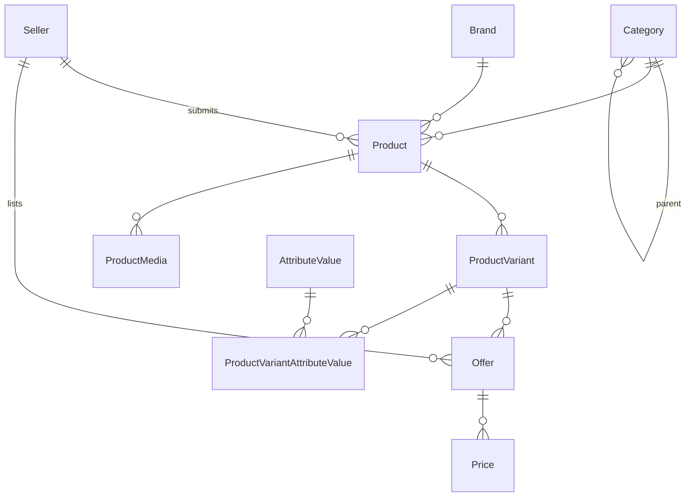
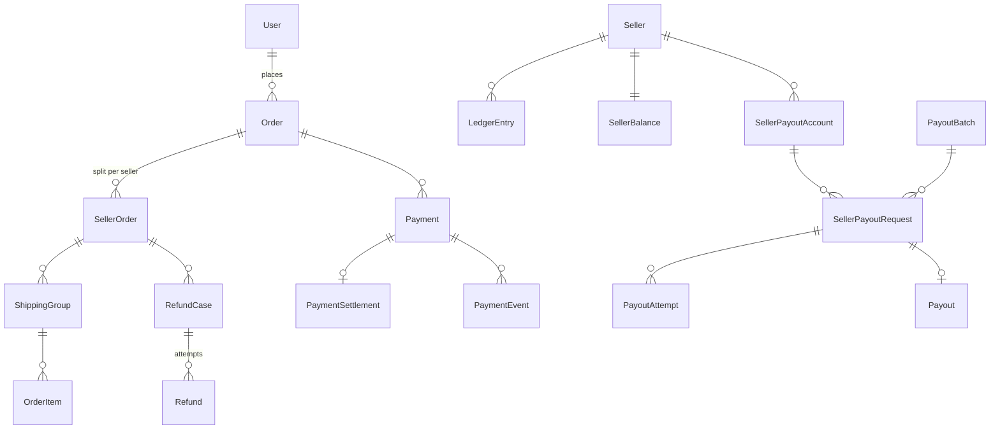
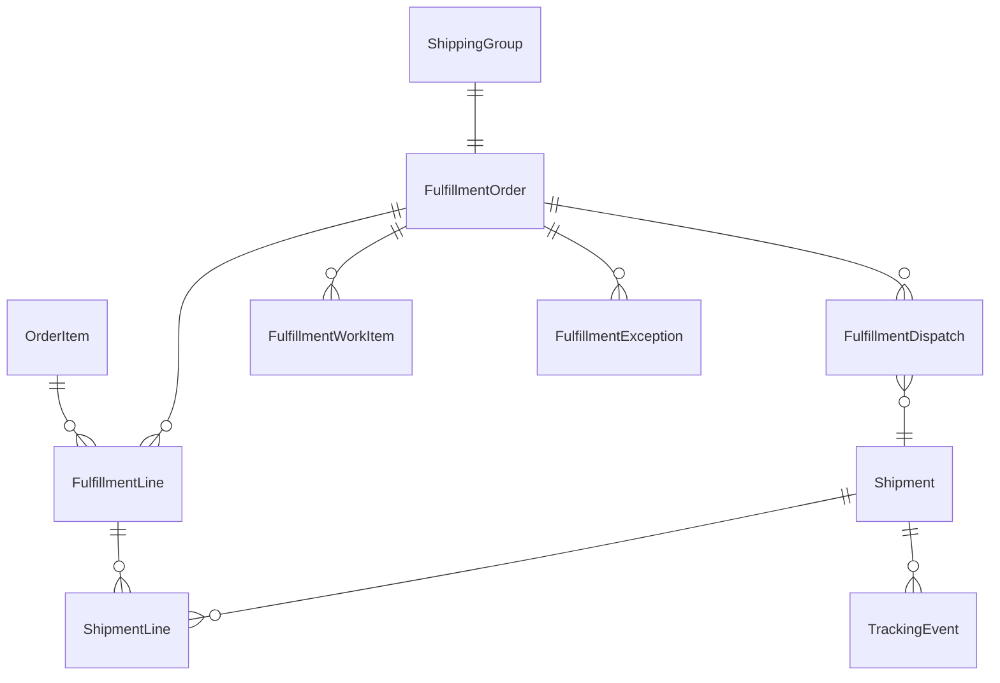

# Data model

> The PostgreSQL schema, grouped by domain. The source of truth is [prisma/schema.prisma](../../services/commerce-api/prisma/schema.prisma); this page is a map of it.

## Conventions

- **Naming.** Tables and columns are `snake_case` via `@@map` / `@map`, while Prisma models and fields are `PascalCase` / `camelCase`. Primary keys are UUIDs.
- **Money.** Money columns are `Int` in minor units. Nearly every monetary row also stores `currency` (ISO-4217), and ZMW is the only order currency.
- **Snapshots.** Once an order has been placed, it copies the data it depends on rather than referencing it. It keeps the delivery address, prices, the offer and seller at purchase time, and shipping quotes. Payout requests likewise copy their destination. Later edits upstream therefore never change history.
- **Append-only history tables.** These record every transition and are never updated:
  - `*Event` tables: `PaymentEvent`, `FulfillmentEvent`, `ReturnEvent`, `RefundEvent`, `PayoutRequestEvent`, `ReviewModerationEvent`, `TrackingEvent`
  - `*Revision` tables
  - `InventoryMovement`
  - `LedgerEntry`
  - `AuditEvent`
- **Constraints.** Idempotency and uniqueness are enforced by database constraints, not only by checks in code. For example: `(userId, idempotencyKey)` on orders, `(type, referenceType, referenceId)` on ledger entries, one review per order item, and `CarrierWebhookDelivery` dedupe keys.
- **Concurrency.** Aggregates that are edited concurrently carry `version Int @default(0)`.

## Domains

### Identity and access

| Model                                          | Purpose                                                                                                                                                                                                  |
| ---------------------------------------------- | -------------------------------------------------------------------------------------------------------------------------------------------------------------------------------------------------------- |
| `User`                                         | Account. `role` (`Role`: CUSTOMER, SELLER, STAFF, ADMIN), `isActive`, `emailVerifiedAt`, `verificationGraceUntil`                                                                                        |
| `Address`                                      | The user's address book. One default per user                                                                                                                                                            |
| `Session`                                      | One row per issued refresh token. Rows are grouped into rotation families (`familyId`). The row also holds revocation state, the encrypted 30 s `recoveryData`, and IP / user-agent / last-used metadata |
| `PasswordResetToken`, `EmailVerificationToken` | Hashed single-use tokens. The verification token is bound to `targetEmail`                                                                                                                               |
| `HandoffToken`                                 | Single-use 60 s code for signing in across apps                                                                                                                                                          |
| `EmailDelivery`                                | Outbound email queue row, with encrypted template variables (`EmailDeliveryStatus`: PENDING, SENT, FAILED)                                                                                               |

### Platform

| Model             | Purpose                                                                                                                               |
| ----------------- | ------------------------------------------------------------------------------------------------------------------------------------- |
| `AuditEvent`      | Who did what to which target, with redacted metadata, IP and user agent                                                               |
| `BackgroundJob`   | Job queue (`BackgroundJobStatus`: PENDING, RUNNING, SUCCEEDED, DEAD_LETTER). See [background-processing.md](background-processing.md) |
| `OutboxEvent`     | Domain event log (`OutboxEventStatus`: PENDING, PUBLISHED, DEAD_LETTER)                                                               |
| `CacheEntry`      | Key/value cache with TTL. `CacheService` exists, but no module uses it                                                                |
| `SequenceCounter` | Per-prefix, per-year counters used by `NumberingService` (`PO-2026-000123` etc.)                                                      |
| `MediaAsset`      | An uploaded file (`MediaStatus`: PENDING_UPLOAD, AVAILABLE, DELETED). `verificationLocked` marks seller KYC documents                 |
| `FxRate`          | Cached exchange rates (rate string, `quoteId`, `expiresAt`)                                                                           |

### Sellers

| Model            | Purpose                                                                                                                         |
| ---------------- | ------------------------------------------------------------------------------------------------------------------------------- |
| `Seller`         | A seller account owned by one `User`, with storefront slug and profile (`SellerStatus`: PENDING, APPROVED, REJECTED, SUSPENDED) |
| `SellerDocument` | KYC documents linked to `MediaAsset`                                                                                            |
| `SavedSeller`    | Sellers a user follows or has saved                                                                                             |

### Catalog

| Model                                            | Purpose                                                                                                                                                                                                                                                      |
| ------------------------------------------------ | ------------------------------------------------------------------------------------------------------------------------------------------------------------------------------------------------------------------------------------------------------------ |
| `Category`                                       | Tree via `parent` / `children`                                                                                                                                                                                                                               |
| `Brand`, `Attribute`, `AttributeValue`           | Reference data                                                                                                                                                                                                                                               |
| `Product`                                        | The canonical product (`ProductStatus`: DRAFT, PUBLISHED, ARCHIVED). A seller-submitted product carries `createdBySeller` and a `ProductSubmissionStatus` (PENDING, APPROVED, REJECTED). Has a return policy (`returnWindowDays`, returnable)                |
| `ProductVariant`, `ProductVariantAttributeValue` | Sellable variants and their attribute values                                                                                                                                                                                                                 |
| `ProductMedia`                                   | Links a product to its images                                                                                                                                                                                                                                |
| `Offer`                                          | A listing of a variant by the platform (`seller = null`) or by a seller. It has a status (reuses `ProductStatus`), `OfferCondition`, `OfferStockSource` (PLATFORM or SELLER), `OfferFulfillmentMode` (PLATFORM or SELLER), shipping settings and a `version` |
| `Price`                                          | Time-bounded price rows per offer (`startsAt`, `endsAt`). The open row is the current price                                                                                                                                                                  |

### Inventory

| Model               | Purpose                                                                                                                                                     |
| ------------------- | ----------------------------------------------------------------------------------------------------------------------------------------------------------- |
| `Warehouse`         | Platform warehouse                                                                                                                                          |
| `InventoryRecord`   | Stock level (`onHand`, `reserved`, `reorderPoint`, `version`). It is kept either per (warehouse, variant) for platform stock, or per offer for seller stock |
| `InventoryMovement` | Append-only change log (`InventoryMovementType`: RECEIPT, ADJUSTMENT, RESERVATION, RELEASE, COMMITMENT, RETURN)                                             |
| `Reservation`       | A stock hold for an order item (`ReservationStatus`: ACTIVE, COMMITTED, RELEASED, EXPIRED)                                                                  |

### Cart and wishlist

| Model          | Purpose                                                                                                    |
| -------------- | ---------------------------------------------------------------------------------------------------------- |
| `Cart`         | A cart owned by a user or a guest (`CartStatus`: ACTIVE, MERGED). A guest cart is keyed by its guest token |
| `CartItem`     | An offer and a quantity                                                                                    |
| `WishlistItem` | An offer a user has saved                                                                                  |

### Orders, payments and financials

| Model                           | Purpose                                                                                                                                                                                                              |
| ------------------------------- | -------------------------------------------------------------------------------------------------------------------------------------------------------------------------------------------------------------------- |
| `Order`                         | The customer's order (`OrderStatus`: PENDING_PAYMENT, PAID, CANCELLED, PARTIALLY_REFUNDED, REFUNDED). Holds totals, the address snapshot and `idempotencyKey`                                                        |
| `SellerOrder`                   | The part of an order for one seller (the platform is `seller = null`). It has its own status and `refundedAmount`                                                                                                    |
| `ShippingGroup`                 | A shipping unit inside a seller order, with its quote snapshot (rate, provider and carrier codes)                                                                                                                    |
| `OrderItem`                     | One line: offer, price and seller snapshots, quantity, and its seller order and shipping group                                                                                                                       |
| `Payment`                       | One charge attempt for an order (`PaymentStatus`: PENDING … REFUNDED). Holds `provider`, `providerReference`, `requiresReconciliation` and `idempotencyKey`                                                          |
| `PaymentSettlement`             | The FX settlement quote for a card payment converted from ZMW                                                                                                                                                        |
| `PaymentEvent`                  | Deduplicated provider events (`providerEventId`)                                                                                                                                                                     |
| `RefundCase`                    | A refund owed on one seller order (`RefundCaseSource`: RETURN, FULFILLMENT_CANCELLATION, ADMIN; `RefundCaseStatus`: PENDING, PROCESSING, SUCCEEDED, PARTIALLY_SUCCEEDED, FAILED, RECONCILIATION_REQUIRED, CANCELLED) |
| `RefundCaseItem`, `RefundEvent` | Lines and history of a refund case                                                                                                                                                                                   |
| `Refund`                        | One provider refund attempt (`RefundStatus`)                                                                                                                                                                         |
| `LedgerEntry`                   | Seller ledger (`LedgerEntryType`: SALE, REFUND, PAYOUT) with gross, commission and net amounts and `availableAt`                                                                                                     |
| `SellerBalance`                 | Current balances for one seller: `balance` (available), `heldBalance`, `pendingPayoutBalance`, `paidBalance`, plus the settlement currency                                                                           |
| `SellerPayoutAccount`           | Where payouts go (`PayoutAccountMethod`: BANK, MOBILE_MONEY; `PayoutAccountStatus`: PENDING_VERIFICATION, VERIFIED, REJECTED, DISABLED)                                                                              |
| `SellerPayoutRequest`           | A request to withdraw (`SellerPayoutStatus`: REQUESTED, APPROVED, PROCESSING, SUCCEEDED, FAILED, CANCELLED, RECONCILIATION_REQUIRED), with a snapshot of its destination                                             |
| `PayoutBatch`                   | A batch of approved requests (`PayoutBatchStatus`: OPEN, PROCESSING, COMPLETED, COMPLETED_WITH_ERRORS)                                                                                                               |
| `PayoutAttempt`                 | One provider submission (`PayoutAttemptStatus`)                                                                                                                                                                      |
| `PayoutRequestEvent`            | History of a payout request                                                                                                                                                                                          |
| `Payout`                        | A completed payout. Created by the request pipeline or by the older direct admin route                                                                                                                               |

### Procurement

| Model                                                              | Purpose                                                                                                                                                                                                                     |
| ------------------------------------------------------------------ | --------------------------------------------------------------------------------------------------------------------------------------------------------------------------------------------------------------------------- |
| `Supplier` (`SupplierStatus`: ACTIVE, INACTIVE), `SupplierProduct` | Suppliers and the variants each one supplies, with cost                                                                                                                                                                     |
| `PurchaseOrder`                                                    | A purchase order (`PurchaseOrderStatus`: DRAFT, SUBMITTED, APPROVED, REJECTED, ORDERED, PARTIALLY_RECEIVED, RECEIVED, CLOSED_SHORT, CANCELLED). A revision links to the order it replaces via `supersedes` / `supersededBy` |
| `PurchaseOrderLine`                                                | Quantity, unit cost, discount and tax (bps), plus the quantity received so far                                                                                                                                              |
| `GoodsReceipt`                                                     | A delivery received against a PO (`GoodsReceiptStatus`: DRAFT, POSTED, REVERSED). A reversal links to the receipt it reverses via `reversalOf` / `reversedBy`                                                               |
| `GoodsReceiptLine`                                                 | Delivered, accepted, rejected and damaged quantities, and the reason for any discrepancy                                                                                                                                    |
| `ProcurementDocument`                                              | Supporting files (`ProcurementDocumentType`: supplier quotation, PO, delivery note, inspection report, invoice, other)                                                                                                      |

### Fulfillment and shipments

| Model                                            | Purpose                                                                                                                                                                                                             |
| ------------------------------------------------ | ------------------------------------------------------------------------------------------------------------------------------------------------------------------------------------------------------------------- |
| `FulfillmentOrder`                               | One per shipping group. Platform mode has a `warehouse`; seller mode has none. Status is **derived** (`FulfillmentStatus`, 13 values)                                                                               |
| `FulfillmentLine`                                | Allocated, picked, packed, dispatched and cancelled quantities for each order item                                                                                                                                  |
| `FulfillmentWorkItem`                            | Tasks, which can be assigned to STAFF (`FulfillmentWorkItemType`: PICK, PACK; `FulfillmentWorkItemStatus`: PENDING, IN_PROGRESS, COMPLETED, CANCELLED)                                                              |
| `FulfillmentException`                           | `FulfillmentExceptionType`: SHORT_PICK, DAMAGED, MISSING; `FulfillmentExceptionStatus`: OPEN, RESOLVED. Dispatch is blocked while one is open                                                                       |
| `FulfillmentDispatch`, `FulfillmentDispatchLine` | Dispatches, each linked to a shipment                                                                                                                                                                               |
| `FulfillmentEvent`                               | History of a fulfillment order                                                                                                                                                                                      |
| `Shipment`                                       | A shipment (`ShipmentStatus`: PENDING_BOOKING, BOOKED, DISPATCHED, IN_TRANSIT, OUT_FOR_DELIVERY, DELIVERED, DELIVERY_FAILED, EXCEPTION, RETURN_TO_SENDER, RETURNED, CANCELLED), with carrier and tracking reference |
| `ShipmentLine`                                   | The fulfillment lines and quantities in a shipment. Delivered lines are what start the return window                                                                                                                |
| `TrackingEvent`                                  | Status events (`TrackingEventSource`: CARRIER_WEBHOOK, CARRIER_POLL, ADMIN_MANUAL, ADMIN_CORRECTION, SELLER_MANUAL)                                                                                                 |
| `CarrierWebhookDelivery`                         | Deduplicates incoming carrier webhooks (`CarrierWebhookDeliveryStatus`)                                                                                                                                             |

### Returns

| Model                                      | Purpose                                                                                                                                                                                                                                      |
| ------------------------------------------ | -------------------------------------------------------------------------------------------------------------------------------------------------------------------------------------------------------------------------------------------- |
| `ReturnRequest`                            | A return (RMA) (`ReturnStatus`: REQUESTED, APPROVED, REJECTED, CANCELLED, RECEIVING, RECEIVED, INSPECTING, CLOSED_NO_REFUND, REFUND_PENDING, PARTIALLY_REFUNDED, REFUNDED, REFUND_FAILED). Can be assigned to a warehouse and a staff member |
| `ReturnItem`                               | Order item, quantity and `ReturnReasonCode`                                                                                                                                                                                                  |
| `ReturnItemAllocation`                     | Ties returned quantity to the delivered shipment lines it came from                                                                                                                                                                          |
| `ReturnReceipt`, `ReturnReceiptLine`       | Goods physically received back                                                                                                                                                                                                               |
| `ReturnInspection`, `ReturnInspectionLine` | Inspection results: accepted quantity and `ReturnDisposition` (RESTOCK, QUARANTINE, DAMAGED, DISPOSE)                                                                                                                                        |
| `ReturnEvent`                              | History of a return                                                                                                                                                                                                                          |

A return that is finished and accepted creates one `RefundCase` for each seller order.

### Reviews

| Model                                           | Purpose                                                                                                                                                                   |
| ----------------------------------------------- | ------------------------------------------------------------------------------------------------------------------------------------------------------------------------- |
| `ProductReview`                                 | One per order item, from a verified purchase. `ReviewVisibility` (PUBLISHED, HIDDEN, REMOVED, WITHDRAWN), `ReviewModerationState` (PENDING, APPROVED, FLAGGED), `version` |
| `SellerRating`                                  | One per seller order                                                                                                                                                      |
| `ProductReviewRevision`, `SellerRatingRevision` | Edit history (`ReviewRevisionSource`: SUBMISSION, CUSTOMER_EDIT)                                                                                                          |
| `ReviewReport`                                  | A user's report on a review (`ReviewReportReason`, `ReviewReportStatus`: OPEN, DISMISSED, ACTIONED)                                                                       |
| `ReviewModerationEvent`                         | History of moderation actions (`ReviewModerationAction`, `ReviewTargetType`)                                                                                              |
| `ProductRatingSummary`, `SellerRatingSummary`   | Rating totals, always fully recalculated from PUBLISHED rows                                                                                                              |

## Migrations

- **History.** 37 migrations in [prisma/migrations/](../../services/commerce-api/prisma/migrations/), from `20260910145124_initial_auth` to `20260928150000_email_verification_rollout`.
- **Creating one.** Use `npm run prisma:migrate --workspace @commerce/commerce-api -- --name describe_change` locally; this needs `SHADOW_DATABASE_URL`.
- **Deploying.** `npm run prisma:deploy`, or the `migrate` container in [deploy/](../../deploy/README.md).
- **Never edit a migration that has been deployed.** Add a new one instead.
- **Data migrations.** Some backfill or restructure data, for example `20260919130000_backfill_paid_balances`. Those can take table locks. Read their SQL and [backend-release-1-verification.md](../backend-release-1-verification.md) before applying them to production.
- **Seed.** `npm run prisma:seed` ([prisma/seed.ts](../../services/commerce-api/prisma/seed.ts)) upserts three demo categories and creates the demo catalog products. It also creates or keeps an admin account from `SEED_ADMIN_EMAIL` and `SEED_ADMIN_PASSWORD`, defaulting to `admin@example.test` / `DemoAdmin123!`. **Override both outside local development.** The seed refuses to continue if that email already belongs to an account that is not an active admin ([seed.ts:253-271](../../services/commerce-api/prisma/seed.ts#L253-L271)).
