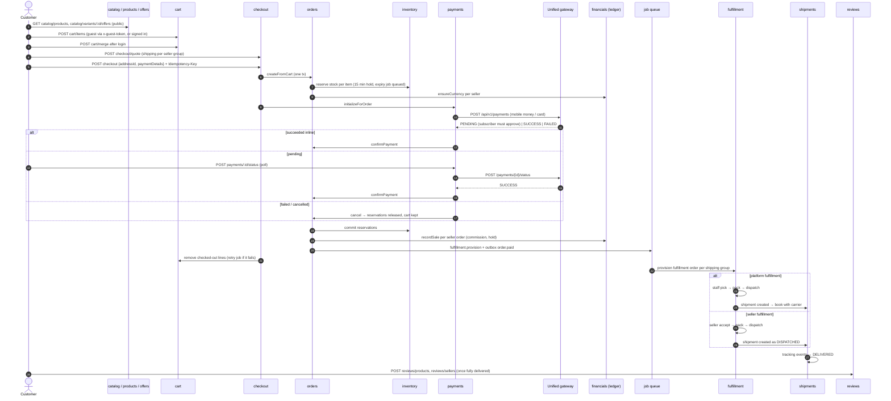
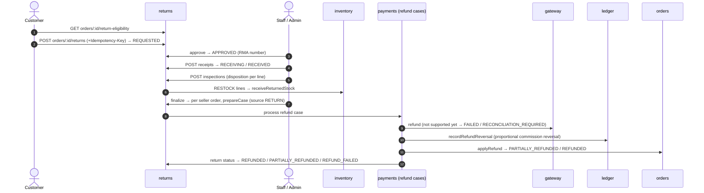
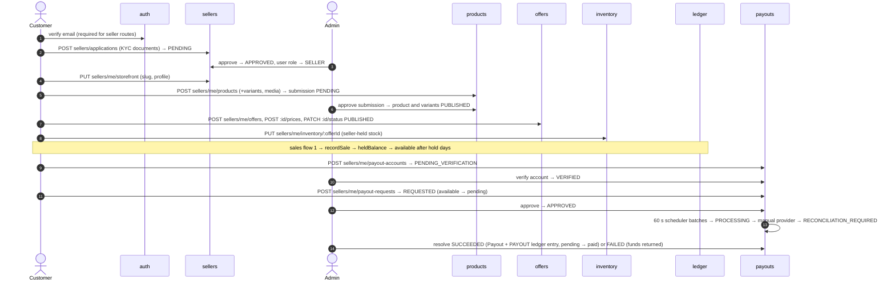
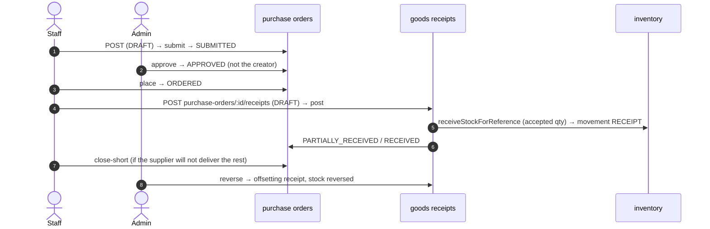

# End-to-end flows

> The main business flows as they run through the modules. Each step links to the module doc that has the detail.

Paths below leave out the `/api/v1` prefix.

## 1. Purchase: browse → pay → deliver → review

### Key rules along the way

- **Checkout idempotency.** Sending the same `Idempotency-Key` again returns the order and payment that already exist. If the first attempt never reached payment, the key is released and checkout starts over. See [checkout.md](modules/checkout.md).
- **Order split.** An order splits into one **SellerOrder per seller** (the platform counts as seller `null`), and each of those into **ShippingGroups**. Every shipping group is quoted, fulfilled and shipped on its own. See [orders.md](modules/orders.md).
- **Unknown payment outcome.** If the gateway times out or its answer is unclear, the payment is kept, flagged `requiresReconciliation`, and **stock stays reserved**. The order is never cancelled on a guess. See [payments.md](modules/payments.md).
- **No verified gateway webhooks yet.** Pending unified payments can settle through `POST payments/:id/status` or the background reconciliation scheduler/job. Referenced attempts can also expire through that worker. This does not prove safe late-success recovery. See [integrations.md](integrations.md#payments).
- **Reservation expiry race.** The stock hold is 15 minutes, and the gateway's mobile-money window in its sample responses is also 15 minutes. When the `inventory.expire_reservation` job runs, it marks the reservation `EXPIRED` but **leaves the order in `PENDING_PAYMENT`**. If the customer approves the charge after that, `confirmPayment` tries to commit an `EXPIRED` reservation and fails with 409 ([orders.service.ts:593-597](../../services/commerce-api/src/modules/orders/orders.service.ts#L593-L597), [inventory.service.ts:694-698](../../services/commerce-api/src/modules/inventory/inventory.service.ts#L694-L698)). The money is taken, but the order is never marked paid. See [known-gaps.md](known-gaps.md#high-impact).
- **Late success after cancellation.** A payment success that arrives after the order was cancelled also returns 409 and needs manual reconciliation.
- **Seller money.** Sale proceeds, net of `MARKETPLACE_COMMISSION_BPS`, go to the seller's **held** balance until `SELLER_PAYOUT_HOLD_DAYS` has passed. See [financials.md](modules/financials.md).

## 2. Return → refund

- **Eligibility.** The product must be returnable, and the return must be within `returnWindowDays` (default 30) of **each delivered shipment line**. Quantities already claimed by other active returns are excluded. See [returns.md](modules/returns.md).
- **Refunds do not restock.** Only inspection with the `RESTOCK` disposition returns goods to inventory.
- **Cancellation refunds.** Cancelling a _paid_ fulfillment quantity takes the same refund path, through the `refunds.process_fulfillment_cancellation` job (source `FULFILLMENT_CANCELLATION`). Admins can also refund a seller order directly: `POST admin/seller-orders/:id/refund`.
- **Refunds cannot complete today.** The gateway has no refund contract, so a refund case ends in `FAILED` or `RECONCILIATION_REQUIRED`, and an admin retries or reconciles it (`POST admin/refunds/:id/status`, `POST admin/returns/:id/refund-cases/:caseId/retry`). See [known-gaps.md](known-gaps.md).

## 3. Seller lifecycle: apply → sell → get paid

- **Email verification.** Seller routes need a verified email. Sellers who existed before `20260928150000_email_verification_rollout` were given a 30-day grace period. See [auth-and-access.md](auth-and-access.md#email-verification).
- **Offers.** A seller can list an existing platform product without submitting a new one, by creating an offer on a published variant. See [offers.md](modules/offers.md).
- **Suspension.** Suspending a seller hides the storefront and blocks every seller write, because those writes go through `lockApproved`. See [sellers.md](modules/sellers.md).

## 4. Procurement → stock

See [procurement.md](modules/procurement.md).
