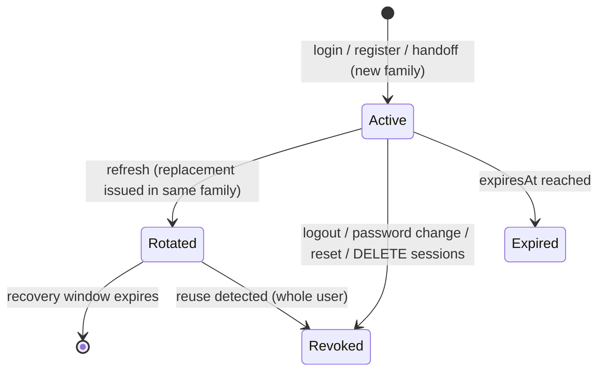

# Auth

> Registration, login, rotating refresh sessions, password reset, email verification, cross-app handoff and session management.

The mechanics are explained in [../auth-and-access.md](../auth-and-access.md): token formats, how refresh rotation and reuse detection work, the guards, and the grace period. This page is the module reference. The session-management routes also have their own note in [auth-sessions.md](auth-sessions.md).

> **Being changed right now.** The session routes (`GET/DELETE /auth/sessions*`) and the session metadata (`ipAddress`, `userAgent`, `lastUsedAt`) were being edited while this was written. Check the code before relying on the details below.

## Purpose and features

- A **customer** can:
  - register with email and password and sign in straight away
  - verify their email address
  - reset a forgotten password by email
  - change their password
  - see and revoke their signed-in devices
  - move a session to another app (storefront → seller portal) without signing in again
- **Every app** gets a short-lived access token and a rotating refresh token. Revoking a session takes effect on the next request.
- Every auth event is audited: register, login success and failure, logout, password changes, resets, verification, handoff, revocations and reuse detection.

## Routes

All routes are under `/api/v1/auth`. "Brute-force" means the 5 requests / 60 s limit.

| Method | Path                                      | Access                     | Idempotency            | Description                                                                                                           |
| ------ | ----------------------------------------- | -------------------------- | ---------------------- | --------------------------------------------------------------------------------------------------------------------- |
| POST   | `/api/v1/auth/register`                   | Public, brute-force        | –                      | Creates a CUSTOMER, queues a verification email, returns tokens. 409 if the email already exists                      |
| POST   | `/api/v1/auth/login`                      | Public, brute-force        | –                      | Returns tokens. The same 401 message whether the email is unknown, the password is wrong or the account is inactive   |
| POST   | `/api/v1/auth/refresh`                    | Public                     | Safe to retry for 30 s | Rotates the refresh token. See [rotation](../auth-and-access.md#refresh-rotation-and-reuse-detection)                 |
| POST   | `/api/v1/auth/logout`                     | Authenticated              | Repeatable             | Revokes the session behind `refreshToken`. 404 if it isn't the caller's. 204                                          |
| GET    | `/api/v1/auth/me`                         | Authenticated              | –                      | `{ id, email, role, emailVerified }`                                                                                  |
| PATCH  | `/api/v1/auth/me/password`                | Authenticated              | –                      | Checks `currentPassword`, sets `newPassword` (min 8), and revokes the user's other login families. 204                |
| POST   | `/api/v1/auth/password-reset/request`     | Public, brute-force        | –                      | Always 204. Sends an email only if the account exists and no reset was requested in the last 60 s                     |
| POST   | `/api/v1/auth/password-reset/confirm`     | Public                     | Single-use token       | Sets a new password, uses up every other reset token, revokes all sessions and queues a `password-changed` email. 204 |
| POST   | `/api/v1/auth/email-verification/resend`  | Authenticated, brute-force | 60 s cooldown          | Replaces any unused token and queues a new email. Does nothing if already verified. 204                               |
| POST   | `/api/v1/auth/email-verification/confirm` | Public, brute-force        | Single-use token       | Marks the email verified and clears the grace period. 401 if the token is invalid, expired or for an old address      |
| POST   | `/api/v1/auth/handoff`                    | Authenticated, brute-force | –                      | Creates a 60 s single-use handoff code `{ code, expiresIn }`                                                          |
| POST   | `/api/v1/auth/handoff/exchange`           | Public                     | Single-use code        | Redeems a code for a new token pair in a new family                                                                   |
| GET    | `/api/v1/auth/sessions`                   | Authenticated              | –                      | Active sessions, newest first, with `isCurrent`                                                                       |
| DELETE | `/api/v1/auth/sessions/others`            | Authenticated              | Repeatable             | Revokes every other family. 204                                                                                       |
| DELETE | `/api/v1/auth/sessions/:id`               | Authenticated              | Repeatable             | Revokes one family. 404 if unknown or not the caller's. 204                                                           |

Token responses have the shape `{ accessToken, refreshToken, tokenType: 'Bearer', expiresIn, refreshExpiresIn, refreshExpiresAt, user }` ([auth-response.ts](../../../services/commerce-api/src/modules/auth/auth-response.ts)).

## Services

| Class                                                                                  | Responsibility                                                                                                                                                                                                                                                                                                                                                                                                                                               |
| -------------------------------------------------------------------------------------- | ------------------------------------------------------------------------------------------------------------------------------------------------------------------------------------------------------------------------------------------------------------------------------------------------------------------------------------------------------------------------------------------------------------------------------------------------------------ |
| [`AuthService`](../../../services/commerce-api/src/modules/auth/auth.service.ts)       | All of the flows above. `withUserLock(userId, fn)` runs each change to a user's credentials, sessions or tokens inside a transaction that holds `SELECT … FROM users FOR UPDATE`, so two concurrent refreshes for one user happen one after the other ([auth.service.ts:875](../../../services/commerce-api/src/modules/auth/auth.service.ts#L875)). `issueTokens` signs the JWT and creates the `Session` row. `cleanupExpiredRecoveryData` runs every 60 s |
| [`password.util.ts`](../../../services/commerce-api/src/modules/auth/password.util.ts) | bcrypt hash and verify, cost 12                                                                                                                                                                                                                                                                                                                                                                                                                              |
| [`token.util.ts`](../../../services/commerce-api/src/modules/auth/token.util.ts)       | Random opaque tokens and their SHA-256 hashes                                                                                                                                                                                                                                                                                                                                                                                                                |

The guards themselves live in `src/common/auth/` and are registered by this module ([auth.module.ts:35-37](../../../services/commerce-api/src/modules/auth/auth.module.ts#L35-L37)).

## Business rules

- **Token lifetimes.** Password reset 1 h, email verification 24 h, handoff 60 s ([auth.service.ts:32-36](../../../services/commerce-api/src/modules/auth/auth.service.ts#L32-L36)).
- **Cooldowns.** One reset request and one verification resend per user per 60 s. A request inside the cooldown still returns 204 but sends nothing.
- **Family lifetime.** A refresh family lasts at most 30 days from its first login, no matter how often it is rotated ([auth.service.ts:43](../../../services/commerce-api/src/modules/auth/auth.service.ts#L43)).
- **Recovery window.** For 30 s after a rotation, presenting the old refresh token returns the same new pair again, provided the replacement is still active ([auth.service.ts:49](../../../services/commerce-api/src/modules/auth/auth.service.ts#L49)).
- **Reuse.** Presenting a rotated token after that window revokes **all** of the user's sessions and audits `auth.session.reuse_detected` ([auth.service.ts:286-318](../../../services/commerce-api/src/modules/auth/auth.service.ts#L286-L318)). A token revoked for any other reason (logout, password change and so on) just gets a 401.
- **Revocation reasons**, stored in `Session.revokedReason`: `logout`, `password_change`, `password_reset`, `session_revoked`, `rotated`, `reuse_detected` ([auth.service.ts:51-58](../../../services/commerce-api/src/modules/auth/auth.service.ts#L51-L58)).
- **Verification tokens** are bound to the `targetEmail` they were created for. If the account's email has changed, the token no longer works, and the email job will not send it.
- **Handoff** is claimed with a conditional `updateMany` on `usedAt: null`, under the user lock. It fails for a user who has become inactive ([auth.service.ts:681-722](../../../services/commerce-api/src/modules/auth/auth.service.ts#L681-L722)).
- **Password rules.** At least 8 characters for register, change and reset. No other strength rules.

## Data

- **Writes:**
  - `User`, via `UsersService`: create, password hash, `emailVerifiedAt`, `verificationGraceUntil`
  - `Session`, `PasswordResetToken`, `EmailVerificationToken`, `HandoffToken`
  - `EmailDelivery` and `BackgroundJob`, via `EmailDeliveriesService`
  - `AuditEvent`, via `AuditService`
- **Reads:** `User`.

## Dependencies

- **Imports:** `UsersModule`, `AuditModule`, `EmailModule`, `JwtModule` (secret `JWT_SECRET`), `ConfigModule`.
- **Used by:** the guards registered here protect every other module. `apps/web`, `apps/seller` and `apps/admin` call these routes, in particular handoff for moving between apps.

## Jobs and events

- Queues `email.send` jobs for the `email-verification`, `password-reset` and `password-changed` templates.
- `@Interval(60_000)` `cleanupExpiredRecoveryData` ([auth.service.ts:860](../../../services/commerce-api/src/modules/auth/auth.service.ts#L860)).
- No outbox events.

## Configuration

`JWT_SECRET`, `ACCESS_TOKEN_TTL_SECONDS`, `REFRESH_TOKEN_TTL_SECONDS`, `REFRESH_RECOVERY_ENCRYPTION_ACTIVE_KEY_ID`, `REFRESH_RECOVERY_ENCRYPTION_KEYS`, `CUSTOMER_WEB_URL`. See [../configuration.md](../configuration.md#auth-and-sessions).

## Tests

| Spec                                                                                                                  | Covers                                                                            |
| --------------------------------------------------------------------------------------------------------------------- | --------------------------------------------------------------------------------- |
| [auth.service.spec.ts](../../../services/commerce-api/src/modules/auth/auth.service.spec.ts)                          | Unit tests of every flow: rotation, recovery, reuse, cooldowns, handoff, sessions |
| [password-dto.spec.ts](../../../services/commerce-api/src/modules/auth/dto/password-dto.spec.ts)                      | Rejects credentials that aren't strings                                           |
| `src/common/auth/*.guard.spec.ts`                                                                                     | JWT, roles and email-verification guards                                          |
| [test/auth.e2e-spec.ts](../../../services/commerce-api/test/auth.e2e-spec.ts)                                         | HTTP flows against the fake Prisma                                                |
| [test/auth-concurrency.integration-spec.ts](../../../services/commerce-api/test/auth-concurrency.integration-spec.ts) | Concurrent refresh, revocation and handoff against real PostgreSQL                |

## Known gaps

- **No email on password change.** Changing the password while signed in (`PATCH /auth/me/password`) sends no notification; only a reset sends `password-changed`.
- **Weak password policy.** Minimum length only: no check against breached passwords and no complexity rules.
- **Email address is fixed.** There is no endpoint to change a user's email.
- **No self-service deactivation.** A user cannot delete or deactivate their own account.
- **No API for staff roles.** STAFF and ADMIN can only be granted in the database or by the seed.
- **Two "who am I" routes.** `GET /auth/me` and `GET /users/me` return different shapes. See [users.md](users.md#known-gaps).
