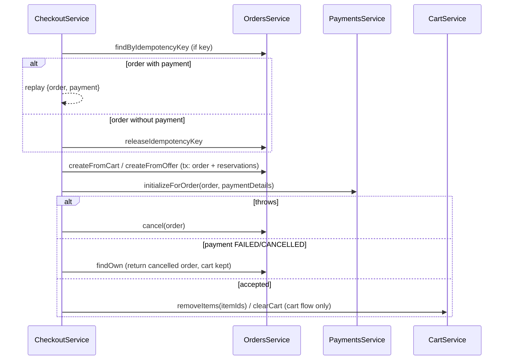

# Checkout

> Thin orchestration over orders, payments and cart: create an order from the cart (whole or partial) or from one offer, start its payment, clean up the cart, and replay retries by Idempotency-Key. Also exposes the no-side-effect cost quotes.

## Purpose and features

- **Customers** check out the whole cart, a subset of cart lines (`itemIds`), or a single offer ("buy now"), passing payment details (mobile money or card).
- **Customers** get a quote (subtotal, shipping per group, total) for either flow before paying, once they have picked an address.
- A retried checkout with the same Idempotency-Key returns the original order and payment instead of charging again.
- Cart lines are removed only after the payment is accepted; a failed cart write is retried by a background job.

## Routes

Conventions (prefix, guards, envelope, Idempotency-Key format): see [../architecture.md](../architecture.md), [../auth-and-access.md](../auth-and-access.md). No route has `@Public`, `@Roles` or `@RequireVerifiedEmail`.

| Method | Path                           | Access        | Idempotency                                             | Description                                                                                                                                              |
| ------ | ------------------------------ | ------------- | ------------------------------------------------------- | -------------------------------------------------------------------------------------------------------------------------------------------------------- |
| POST   | /api/v1/checkout               | Authenticated | Optional Idempotency-Key (UUID v4), per user on `Order` | Order from cart or `itemIds`, then payment ([checkout.controller.ts:29](../../../services/commerce-api/src/modules/checkout/checkout.controller.ts#L29)) |
| POST   | /api/v1/checkout/buy-now       | Authenticated | Optional Idempotency-Key (UUID v4)                      | Order from one offer, cart untouched ([checkout.controller.ts:46](../../../services/commerce-api/src/modules/checkout/checkout.controller.ts#L46))       |
| POST   | /api/v1/checkout/quote         | Authenticated | n/a (no writes)                                         | Cost breakdown for a cart checkout ([checkout.controller.ts:68](../../../services/commerce-api/src/modules/checkout/checkout.controller.ts#L68))         |
| POST   | /api/v1/checkout/buy-now/quote | Authenticated | n/a                                                     | Cost breakdown for buy-now ([checkout.controller.ts:82](../../../services/commerce-api/src/modules/checkout/checkout.controller.ts#L82))                 |

An absent key means no dedup; a present non-UUID-v4 key -> 400 ([checkout.controller.ts:18](../../../services/commerce-api/src/modules/checkout/checkout.controller.ts#L18)). The quote routes reuse the checkout DTOs, so they also accept (and ignore) `paymentDetails`.

**Request bodies**

- `CreateCheckoutDto` ([create-checkout.dto.ts:15](../../../services/commerce-api/src/modules/checkout/dto/create-checkout.dto.ts#L15)): `shippingAddressId` UUID; `currency` in `SUPPORTED_CURRENCIES` (only `ZMW`), default `ZMW`; optional `itemIds` array of UUID v4 (cart item ids); optional nested `paymentDetails` (`PaymentDetailsDto`, see [payments.md](payments.md#unifiedpaymentprovider)).
- `CreateBuyNowCheckoutDto` ([create-buy-now-checkout.dto.ts:17](../../../services/commerce-api/src/modules/checkout/dto/create-buy-now-checkout.dto.ts#L17)): `offerId` UUID; `quantity` int >= 1, default 1; `shippingAddressId`; `currency`; optional `paymentDetails`.

**Response** `CheckoutResult = { order, payment }` ([checkout.types.ts:4](../../../services/commerce-api/src/modules/checkout/checkout.types.ts#L4)); `payment` may carry `redirectUrl`, `gatewayStatus`, `requiresReconciliation`. Quotes return `CheckoutQuote` from orders.

## Services

| Service                                                                                                            | Responsibility                                                                                        |
| ------------------------------------------------------------------------------------------------------------------ | ----------------------------------------------------------------------------------------------------- |
| `CheckoutService` ([checkout.service.ts](../../../services/commerce-api/src/modules/checkout/checkout.service.ts)) | `checkout`, `checkoutOffer`, `quote`, `quoteOffer`, private `replay` and `cleanUpCart`. Not exported. |

## Business rules

- **Replay** ([checkout.service.ts:198](../../../services/commerce-api/src/modules/checkout/checkout.service.ts#L198)): with a key, an existing order for `(userId, key)` that has a payment is returned together with `PaymentsService.getForOrder`. An order without a payment (payment preparation threw before the row was written) has its key released, and the call proceeds as a fresh checkout ([:209](../../../services/commerce-api/src/modules/checkout/checkout.service.ts#L209)). A concurrent duplicate that loses the unique race gets 409 from orders.
- **Order creation** is delegated entirely to `OrdersService` (selection, availability, grouping, shipping quotes, reservations); see [orders.md](orders.md#business-rules).
- **Payment failure** ([checkout.service.ts:60](../../../services/commerce-api/src/modules/checkout/checkout.service.ts#L60)): any exception from `initializeForOrder` cancels the order (releasing reservations) and is rethrown; the cart is left alone.
- **Inline decline** ([checkout.service.ts:75](../../../services/commerce-api/src/modules/checkout/checkout.service.ts#L75)): if the payment comes back `FAILED`/`CANCELLED`, payments has already cancelled the order; the fresh order is re-read with `findOwn` and returned, the cart is kept.
- **Cart cleanup** (cart flow only, [checkout.service.ts:93](../../../services/commerce-api/src/modules/checkout/checkout.service.ts#L93)): `removeItems` for a partial checkout, `clearCart` otherwise. It runs for PENDING and ambiguous payments too. A failure is logged and handed to the `cart.cleanup_items` job; it never fails the response.
- **Buy now** ([checkout.service.ts:118](../../../services/commerce-api/src/modules/checkout/checkout.service.ts#L118)): same flow, never reads or writes the cart.
- **Quotes** ([checkout.service.ts:161](../../../services/commerce-api/src/modules/checkout/checkout.service.ts#L161)): pass straight through to `OrdersService.quoteFromCart` / `quoteFromOffer`.

## Data

No direct Prisma access. Writes happen through `OrdersService` (`Order`, `SellerOrder`, `ShippingGroup`, `OrderItem`, reservations), `PaymentsService` (`Payment`, `PaymentSettlement`, `PaymentEvent`), `CartService` (`CartItem`) and `BackgroundJobsService` (`BackgroundJob`).

## Dependencies

- Imports `OrdersModule`, `PaymentsModule`, `CartModule` ([checkout.module.ts:10](../../../services/commerce-api/src/modules/checkout/checkout.module.ts#L10)); uses the global `BackgroundJobsService`.

## Jobs and events

- Enqueues `cart.cleanup_items {userId, itemIds}` (empty `itemIds` = clear all) when cart cleanup fails ([checkout.service.ts:106](../../../services/commerce-api/src/modules/checkout/checkout.service.ts#L106)). Handled by [cart-cleanup.handler.ts](../../../services/commerce-api/src/modules/cart/jobs/cart-cleanup.handler.ts); see [cart.md](cart.md#jobs-and-events).
- Order/payment events (`order.paid`, `fulfillment.provision`) are emitted by orders when the payment settles.

## Configuration

None of its own. Payment behavior depends on `PAYMENTS_PROVIDER` and the gateway/FX settings in [payments.md](payments.md#configuration).

## Tests

- [checkout.service.spec.ts](../../../services/commerce-api/src/modules/checkout/checkout.service.spec.ts): cart cleared after success, order cancelled and cart kept on payment failure, cleanup failure -> job without failing, inline decline keeps cart and returns cancelled order, partial checkout removes only selected lines, buy-now never touches cart, replay by key, key freed when no payment.
- [checkout.e2e-spec.ts](../../../services/commerce-api/test/checkout.e2e-spec.ts): full HTTP flow with a fake provider (reserve, webhook confirm), buy-now, empty cart, seller split.

## Known gaps

- Idempotency-Key is optional, so a client that omits it can double-charge on retry ([checkout.controller.ts:17](../../../services/commerce-api/src/modules/checkout/checkout.controller.ts#L17)).
- A replay does not compare the request body with the original: the same key with a different cart, address or offer returns the old order with 200, not 409 ([checkout.service.ts:198](../../../services/commerce-api/src/modules/checkout/checkout.service.ts#L198)). This contradicts the convention in [../architecture.md](../architecture.md#conventions).
- After a definite payment failure the payment row exists (FAILED), so the key is not released; a retry with the same key replays the failed order instead of trying again ([checkout.service.ts:208](../../../services/commerce-api/src/modules/checkout/checkout.service.ts#L208)).
- Replayed payments lose `redirectUrl` and `requiresReconciliation`, since `getForOrder` returns the bare row.
- On success the returned `order` is the one read before payment, so an inline SUCCESS still shows `PENDING_PAYMENT` ([checkout.service.ts:83](../../../services/commerce-api/src/modules/checkout/checkout.service.ts#L83)).
- The cart is cleared even when the payment outcome is ambiguous (`requiresReconciliation`) or still pending and later fails; the customer must re-add items.
- No `@RequireVerifiedEmail()` on checkout routes.
- `quantity` on buy-now has no upper bound in the DTO; limits rely on stock reservation ([create-buy-now-checkout.dto.ts:21](../../../services/commerce-api/src/modules/checkout/dto/create-buy-now-checkout.dto.ts#L21)).
