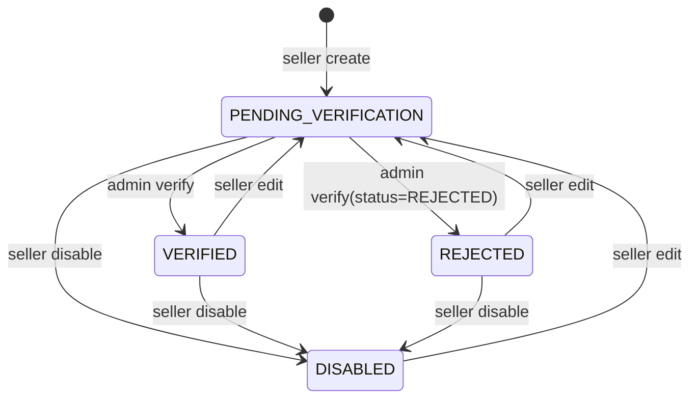
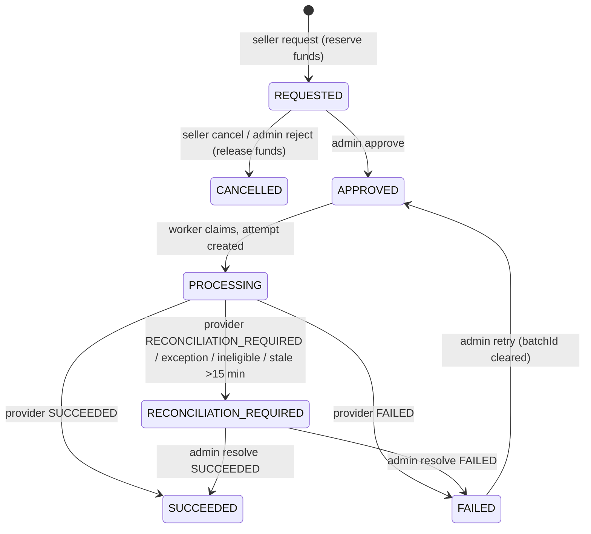
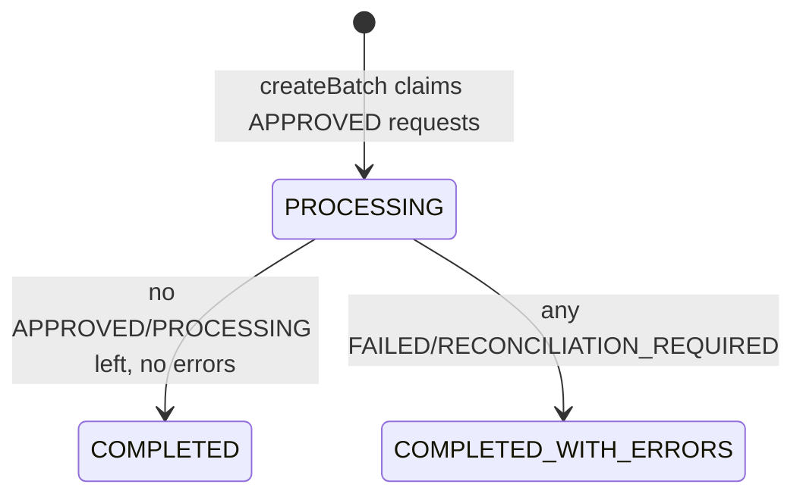

# Financials

> Seller ledger and balance buckets, payout destinations, seller payout requests, admin review, batch processing through a pluggable `PayoutProvider`, and a legacy manual payout path.

## Purpose and features

- **Sellers** (approved, verified email) see their balance buckets (available / held / pending payout / paid) and paginated ledger; register payout destinations (bank or mobile money); request, list, view and cancel payouts.
- **Admins** view any seller's balance, ledger and a read-only integrity report; verify or reject payout accounts and view the unmasked destination (audited); approve, reject, retry and manually reconcile payout requests; trigger and inspect payout batches; record a legacy "external" payout directly against a balance.
- **System** books sale revenue net of commission at order payment, reverses it on refunds, releases held proceeds after the hold window, and runs a 60 s payout worker.

## Routes

Conventions (prefix, guards, envelope, Idempotency-Key format): see [../architecture.md](../architecture.md), [../auth-and-access.md](../auth-and-access.md).

| Method | Path                                           | Access                                             | Idempotency                                           | Description                                                                                                                                                                                      |
| ------ | ---------------------------------------------- | -------------------------------------------------- | ----------------------------------------------------- | ------------------------------------------------------------------------------------------------------------------------------------------------------------------------------------------------ |
| GET    | /api/v1/sellers/me/balance                     | Authenticated + verified email + `requireApproved` | n/a                                                   | Own balance buckets ([seller-financials.controller.ts:19](../../../services/commerce-api/src/modules/financials/seller-financials.controller.ts#L19))                                            |
| GET    | /api/v1/sellers/me/ledger                      | Authenticated + verified email + `requireApproved` | n/a                                                   | Own ledger, newest first ([seller-financials.controller.ts:27](../../../services/commerce-api/src/modules/financials/seller-financials.controller.ts#L27))                                       |
| GET    | /api/v1/sellers/me/payout-accounts             | Authenticated + verified email + `requireApproved` | n/a                                                   | List own payout accounts (masked) ([seller-payouts.controller.ts:47](../../../services/commerce-api/src/modules/financials/seller-payouts.controller.ts#L47))                                    |
| POST   | /api/v1/sellers/me/payout-accounts             | Authenticated + verified email + `requireApproved` | None                                                  | Create payout account ([seller-payouts.controller.ts:54](../../../services/commerce-api/src/modules/financials/seller-payouts.controller.ts#L54))                                                |
| PATCH  | /api/v1/sellers/me/payout-accounts/:id         | Authenticated + verified email + `requireApproved` | Body `version`                                        | Edit account; resets to PENDING_VERIFICATION ([seller-payouts.controller.ts:62](../../../services/commerce-api/src/modules/financials/seller-payouts.controller.ts#L62))                         |
| POST   | /api/v1/sellers/me/payout-accounts/:id/disable | Authenticated + verified email + `requireApproved` | Body `version`                                        | Disable account ([seller-payouts.controller.ts:71](../../../services/commerce-api/src/modules/financials/seller-payouts.controller.ts#L71))                                                      |
| GET    | /api/v1/sellers/me/payout-requests             | Authenticated + verified email + `requireApproved` | n/a                                                   | Own requests, filter `status` ([seller-payouts.controller.ts:80](../../../services/commerce-api/src/modules/financials/seller-payouts.controller.ts#L80))                                        |
| GET    | /api/v1/sellers/me/payout-requests/:id         | Authenticated + verified email + `requireApproved` | n/a                                                   | Own request with attempts and events ([seller-payouts.controller.ts:88](../../../services/commerce-api/src/modules/financials/seller-payouts.controller.ts#L88))                                 |
| POST   | /api/v1/sellers/me/payout-requests             | Authenticated + verified email + `requireApproved` | **Idempotency-Key required** (UUID v4) + request hash | Request payout; reserves funds ([seller-payouts.controller.ts:96](../../../services/commerce-api/src/modules/financials/seller-payouts.controller.ts#L96))                                       |
| POST   | /api/v1/sellers/me/payout-requests/:id/cancel  | Authenticated + verified email + `requireApproved` | **Idempotency-Key required** + body `version`         | Cancel a REQUESTED request ([seller-payouts.controller.ts:105](../../../services/commerce-api/src/modules/financials/seller-payouts.controller.ts#L105))                                         |
| GET    | /api/v1/admin/sellers/:id/balance/integrity    | Roles(ADMIN)                                       | n/a                                                   | Read-only balance vs ledger reconciliation ([admin-financials.controller.ts:32](../../../services/commerce-api/src/modules/financials/admin-financials.controller.ts#L32))                       |
| GET    | /api/v1/admin/sellers/:id/balance              | Roles(ADMIN)                                       | n/a                                                   | Seller balance ([admin-financials.controller.ts:39](../../../services/commerce-api/src/modules/financials/admin-financials.controller.ts#L39))                                                   |
| GET    | /api/v1/admin/sellers/:id/ledger               | Roles(ADMIN)                                       | n/a                                                   | Seller ledger ([admin-financials.controller.ts:46](../../../services/commerce-api/src/modules/financials/admin-financials.controller.ts#L46))                                                    |
| POST   | /api/v1/admin/sellers/:id/payouts              | Roles(ADMIN)                                       | **Idempotency-Key required** (stored on `Payout`)     | Legacy manual payout ([admin-financials.controller.ts:54](../../../services/commerce-api/src/modules/financials/admin-financials.controller.ts#L54))                                             |
| POST   | /api/v1/admin/sellers/:id/payouts/external     | Roles(ADMIN)                                       | **Idempotency-Key required**                          | Alias of the legacy route ([admin-financials.controller.ts:76](../../../services/commerce-api/src/modules/financials/admin-financials.controller.ts#L76))                                        |
| GET    | /api/v1/admin/payouts                          | Roles(ADMIN)                                       | n/a                                                   | All `Payout` rows, newest first ([admin-financials.controller.ts:96](../../../services/commerce-api/src/modules/financials/admin-financials.controller.ts#L96))                                  |
| GET    | /api/v1/admin/payout-accounts                  | Roles(ADMIN)                                       | n/a                                                   | List accounts (masked), optional `sellerId` (UUID v4), unpaginated ([admin-payouts.controller.ts:47](../../../services/commerce-api/src/modules/financials/admin-payouts.controller.ts#L47))     |
| POST   | /api/v1/admin/payout-accounts/:id/verify       | Roles(ADMIN)                                       | Body `version`                                        | Verify or reject a pending account ([admin-payouts.controller.ts:55](../../../services/commerce-api/src/modules/financials/admin-payouts.controller.ts#L55))                                     |
| GET    | /api/v1/admin/payout-accounts/:id              | Roles(ADMIN)                                       | n/a                                                   | Full account incl. raw destination; audited ([admin-payouts.controller.ts:69](../../../services/commerce-api/src/modules/financials/admin-payouts.controller.ts#L69))                            |
| GET    | /api/v1/admin/payout-requests                  | Roles(ADMIN)                                       | n/a                                                   | Requests, filter `status`, `sellerId` ([admin-payouts.controller.ts:77](../../../services/commerce-api/src/modules/financials/admin-payouts.controller.ts#L77))                                  |
| GET    | /api/v1/admin/payout-requests/:id              | Roles(ADMIN)                                       | n/a                                                   | Request detail ([admin-payouts.controller.ts:82](../../../services/commerce-api/src/modules/financials/admin-payouts.controller.ts#L82))                                                         |
| POST   | /api/v1/admin/payout-requests/:id/approve      | Roles(ADMIN)                                       | **Idempotency-Key required** + body `version`         | REQUESTED -> APPROVED ([admin-payouts.controller.ts:87](../../../services/commerce-api/src/modules/financials/admin-payouts.controller.ts#L87))                                                  |
| POST   | /api/v1/admin/payout-requests/:id/reject       | Roles(ADMIN)                                       | **Idempotency-Key required** + body `version`         | REQUESTED -> CANCELLED, releases funds ([admin-payouts.controller.ts:97](../../../services/commerce-api/src/modules/financials/admin-payouts.controller.ts#L97))                                 |
| POST   | /api/v1/admin/payout-requests/:id/retry        | Roles(ADMIN)                                       | **Idempotency-Key required** + body `version`         | FAILED -> APPROVED ([admin-payouts.controller.ts:107](../../../services/commerce-api/src/modules/financials/admin-payouts.controller.ts#L107))                                                   |
| POST   | /api/v1/admin/payout-requests/:id/resolve      | Roles(ADMIN)                                       | **Idempotency-Key required** + body `version`         | Reconcile RECONCILIATION_REQUIRED to SUCCEEDED/FAILED ([admin-payouts.controller.ts:117](../../../services/commerce-api/src/modules/financials/admin-payouts.controller.ts#L117))                |
| POST   | /api/v1/admin/payout-batches/process           | Roles(ADMIN)                                       | None (claims use `SKIP LOCKED`)                       | Create one batch (<=100) and process it; returns `{batchId}` or null ([admin-payouts.controller.ts:127](../../../services/commerce-api/src/modules/financials/admin-payouts.controller.ts#L127)) |
| GET    | /api/v1/admin/payout-batches                   | Roles(ADMIN)                                       | n/a                                                   | Batches, newest first ([admin-payouts.controller.ts:134](../../../services/commerce-api/src/modules/financials/admin-payouts.controller.ts#L134))                                                |
| GET    | /api/v1/admin/payout-batches/:id               | Roles(ADMIN)                                       | n/a                                                   | Batch with its requests ([admin-payouts.controller.ts:139](../../../services/commerce-api/src/modules/financials/admin-payouts.controller.ts#L139))                                              |

Idempotency-Key is validated in-controller as UUID v4 (400 otherwise) ([admin-payouts.controller.ts:35](../../../services/commerce-api/src/modules/financials/admin-payouts.controller.ts#L35), [admin-financials.controller.ts:61](../../../services/commerce-api/src/modules/financials/admin-financials.controller.ts#L61)).

## Services

| Service                                                                                                                                                | Responsibility                                                                                                                                                                                                                                                                                                                                      |
| ------------------------------------------------------------------------------------------------------------------------------------------------------ | --------------------------------------------------------------------------------------------------------------------------------------------------------------------------------------------------------------------------------------------------------------------------------------------------------------------------------------------------- |
| `LedgerService` ([ledger.service.ts](../../../services/commerce-api/src/modules/financials/ledger.service.ts))                                         | Append-only ledger + `SellerBalance` projection: `ensureCurrency`, `recordSale`, `recordRefundReversal`, legacy `recordPayout`, `releaseMaturedFunds`, `getBalance`, `listEntries`, `listPayouts`, `checkIntegrity`. Exported.                                                                                                                      |
| `PayoutsService` ([payouts.service.ts](../../../services/commerce-api/src/modules/financials/payouts/payouts.service.ts))                              | Payout accounts, payout requests, admin transitions, batching, provider submission, reconciliation, stale-attempt recovery. Exported.                                                                                                                                                                                                               |
| `ManualPayoutProvider` ([manual-payout.provider.ts](../../../services/commerce-api/src/modules/financials/payouts/manual-payout.provider.ts))          | Bound to `PAYOUT_PROVIDER` ([financials.module.ts:27](../../../services/commerce-api/src/modules/financials/financials.module.ts#L27)). Always returns `RECONCILIATION_REQUIRED` with reference `manual:<attemptId>` ([manual-payout.provider.ts:18](../../../services/commerce-api/src/modules/financials/payouts/manual-payout.provider.ts#L18)). |
| `PayoutProcessingService` ([payout-processing.service.ts](../../../services/commerce-api/src/modules/financials/payouts/payout-processing.service.ts)) | `@Interval(60_000)` worker; see Jobs.                                                                                                                                                                                                                                                                                                               |

`PayoutProvider` contract ([payout-provider.ts:22](../../../services/commerce-api/src/modules/financials/payouts/payout-provider.ts#L22)): `submit({requestId, attemptId, idempotencyKey, amount, currency, destination})` -> `SUCCEEDED | FAILED | RECONCILIATION_REQUIRED` + optional `providerReference`, `failureReason`, `response`. The idempotency key passed is the attempt id ([payouts.service.ts:766](../../../services/commerce-api/src/modules/financials/payouts/payouts.service.ts#L766)); providers must deduplicate on it.

## Business rules

### Balance buckets

`SellerBalance` columns: `balance` (available; exposed also as deprecated alias `balance`), `heldBalance`, `pendingPayoutBalance`, `paidBalance`, `currency` ([ledger.service.ts:21](../../../services/commerce-api/src/modules/financials/ledger.service.ts#L21)). All amounts are integer minor units.

| Event                        | available | held | pending | paid | Ledger row                |
| ---------------------------- | --------- | ---- | ------- | ---- | ------------------------- |
| Sale, hold window > 0        |           | +net |         |      | SALE (releasedAt null)    |
| Sale, hold 0                 | +net      |      |         |      | SALE (releasedAt now)     |
| Hold matures                 | +net      | -net |         |      | SALE.releasedAt set       |
| Refund reversal              | -net      |      |         |      | REFUND                    |
| Payout request created       | -amt      |      | +amt    |      | none                      |
| Request cancelled / rejected | +amt      |      | -amt    |      | none                      |
| Request succeeded            |           |      | -amt    | +amt | PAYOUT (`payout_request`) |
| Legacy manual payout         | -amt      |      |         | +amt | PAYOUT (`payout`)         |

Sources: [ledger.service.ts:428](../../../services/commerce-api/src/modules/financials/ledger.service.ts#L428), [:332](../../../services/commerce-api/src/modules/financials/ledger.service.ts#L332), [payouts.service.ts:349](../../../services/commerce-api/src/modules/financials/payouts/payouts.service.ts#L349), [:1200](../../../services/commerce-api/src/modules/financials/payouts/payouts.service.ts#L1200), [:985](../../../services/commerce-api/src/modules/financials/payouts/payouts.service.ts#L985), [ledger.service.ts:268](../../../services/commerce-api/src/modules/financials/ledger.service.ts#L268).

### Ledger

- Settlement currency is fixed per seller: `ensureCurrency` upserts the balance row, locks it `FOR UPDATE`, and 409s on mismatch ([ledger.service.ts:114](../../../services/commerce-api/src/modules/financials/ledger.service.ts#L114)). Checkout calls it before charging (`orders.service.ts`).
- Every append goes through `appendEntry`: currency check, then idempotent on `(sellerId, type, referenceType, referenceId)` (also a DB unique). A replay with identical amounts is a no-op; different amounts -> 409 ([ledger.service.ts:402](../../../services/commerce-api/src/modules/financials/ledger.service.ts#L402)).
- Sale: skipped when `sellerOrder.sellerId` is null (platform sale). Commission `round(total * MARKETPLACE_COMMISSION_BPS / 10000)`; net = total - commission; `availableAt = now + SELLER_PAYOUT_HOLD_DAYS` ([ledger.service.ts:135](../../../services/commerce-api/src/modules/financials/ledger.service.ts#L135), [:397](../../../services/commerce-api/src/modules/financials/ledger.service.ts#L397)).
- Refund reversal: requires exactly one matching SALE with `grossAmount == total` and same currency, else 409 "requires reconciliation" ([ledger.service.ts:177](../../../services/commerce-api/src/modules/financials/ledger.service.ts#L177)); cumulative refunds must not exceed total ([:195](../../../services/commerce-api/src/modules/financials/ledger.service.ts#L195)). Commission is reversed proportionally from the original sale commission with cumulative half-up rounding (BigInt), so a full refund reverses exactly ([:202](../../../services/commerce-api/src/modules/financials/ledger.service.ts#L202)). Keyed by `refundId`.
- `releaseMaturedFunds(limit=100)`: SALE rows with `releasedAt null` and `availableAt <= now`, oldest first; each release locks the balance and CAS-sets `releasedAt` so it happens once ([ledger.service.ts:331](../../../services/commerce-api/src/modules/financials/ledger.service.ts#L331)).
- `getBalance` returns a zero view in `ZMW` when no balance row exists ([ledger.service.ts:320](../../../services/commerce-api/src/modules/financials/ledger.service.ts#L320)).
- Integrity report (RepeatableRead, no writes) ([ledger.service.ts:47](../../../services/commerce-api/src/modules/financials/ledger.service.ts#L47)): expected `held = sum(unreleased SALE.net)`, `pending = sum(request.amount where status not in SUCCEEDED,CANCELLED)`, `paid = sum(Payout.amount)`, `available = sum(ledger.net) - held - pending`. Discrepancy codes: each mismatched bucket name, `missing_balance`, `mixed_currency` (ledger, payouts or requests in another currency).

### Legacy manual payout (`recordPayout`)

- Amount must be a positive safe integer ([ledger.service.ts:236](../../../services/commerce-api/src/modules/financials/ledger.service.ts#L236)).
- Locks the balance first, then replays by `Payout.idempotencyKey`; same key with different seller/amount/reference/note -> 409 ([ledger.service.ts:242](../../../services/commerce-api/src/modules/financials/ledger.service.ts#L242)).
- Requires a balance row in `ZMW` and `amount <= available`; guarded decrement ([ledger.service.ts:260](../../../services/commerce-api/src/modules/financials/ledger.service.ts#L260)).

### Payout accounts

- `destination` is an object of 1-20 string fields; keys 1-50 chars, values trimmed 1-500 chars ([payouts.service.ts:1295](../../../services/commerce-api/src/modules/financials/payouts/payouts.service.ts#L1295)).
- `maskedReference` = last 4 chars of the first of `accountNumber, phoneNumber, mobileNumber, iban, reference` (else first string value), prefixed with 4-12 `*` ([payouts.service.ts:1322](../../../services/commerce-api/src/modules/financials/payouts/payouts.service.ts#L1322)). Only admins' single-account read returns the raw destination, and it is audited `payout_account.destination_viewed` ([payouts.service.ts:248](../../../services/commerce-api/src/modules/financials/payouts/payouts.service.ts#L248)).
- Edit has no status precondition; always resets to `PENDING_VERIFICATION` and clears verification fields ([payouts.service.ts:187](../../../services/commerce-api/src/modules/financials/payouts/payouts.service.ts#L187)).
- Disable requires `status != DISABLED` ([payouts.service.ts:220](../../../services/commerce-api/src/modules/financials/payouts/payouts.service.ts#L220)).
- Verify: only from `PENDING_VERIFICATION`, target must be `VERIFIED` or `REJECTED`; `note` required (<=500); CAS on version ([payouts.service.ts:265](../../../services/commerce-api/src/modules/financials/payouts/payouts.service.ts#L265)). `DISABLED` is refused in the controller ([admin-payouts.controller.ts:61](../../../services/commerce-api/src/modules/financials/admin-payouts.controller.ts#L61)).

### Payout requests

- Create ([payouts.service.ts:307](../../../services/commerce-api/src/modules/financials/payouts/payouts.service.ts#L307)): runs a global `releaseMaturedFunds()` first; `amount >= SELLER_PAYOUT_MINIMUM_MINOR` and <= 2^31-1; `requestHash = sha256({sellerId, ...dto})`. Inside a tx that locks the balance row: replay by `idempotencyKey` (different hash -> 409); account must be the seller's and `VERIFIED`; balance must exist and be `ZMW`; guarded move available -> pending; `destinationSnapshot` copied from the account; `REQUESTED` event written.
- Every transition writes a `PayoutRequestEvent` (action, from/to, actor, idempotencyKey, requestHash, metadata). Admin/seller transitions are idempotent through the event's unique `idempotencyKey`: same key + same hash -> returns current state; same key + different hash or request -> 409 ([payouts.service.ts:1261](../../../services/commerce-api/src/modules/financials/payouts/payouts.service.ts#L1261)).
- Approve / retry use `transition()` (row lock + CAS on version and allowed from-status) ([payouts.service.ts:1122](../../../services/commerce-api/src/modules/financials/payouts/payouts.service.ts#L1122)). Approve sets `reviewedByUserId/At`; retry clears `failureReason` and `batchId` ([:505](../../../services/commerce-api/src/modules/financials/payouts/payouts.service.ts#L505)).
- Cancel (seller, action `CANCELLED_BY_SELLER`) and reject (admin, action `REJECTED`, reason required) both use `releaseRequest()`: lock balance + request, CAS from `REQUESTED`, move pending -> available ([payouts.service.ts:1165](../../../services/commerce-api/src/modules/financials/payouts/payouts.service.ts#L1165), [:472](../../../services/commerce-api/src/modules/financials/payouts/payouts.service.ts#L472)).
- Processing ([payouts.service.ts:697](../../../services/commerce-api/src/modules/financials/payouts/payouts.service.ts#L697)): lock request (must be `APPROVED`), `FOR SHARE` on seller and account, create a `PayoutAttempt`, move to `PROCESSING`. Eligibility = seller `APPROVED`, account belongs to seller and is `VERIFIED`, and `hash(account.destination) == hash(destinationSnapshot)` ([:713](../../../services/commerce-api/src/modules/financials/payouts/payouts.service.ts#L713)). Ineligible -> reconciliation without calling the provider ([:753](../../../services/commerce-api/src/modules/financials/payouts/payouts.service.ts#L753)). Provider exceptions -> reconciliation, never auto-failed ([:801](../../../services/commerce-api/src/modules/financials/payouts/payouts.service.ts#L801)).
- Success ([payouts.service.ts:952](../../../services/commerce-api/src/modules/financials/payouts/payouts.service.ts#L952)): lock balance + request; `assertCompletion` checks version, expected status (`PROCESSING` for worker, `RECONCILIATION_REQUIRED` for manual), and that the attempt is the latest and in the matching status ([:810](../../../services/commerce-api/src/modules/financials/payouts/payouts.service.ts#L810)); guarded pending -> paid; creates `Payout` (idempotencyKey = request id, unique `payoutRequestId`) and PAYOUT ledger entry; attempt `SUCCEEDED`.
- Failure keeps funds in `pendingPayoutBalance` (no release) ([payouts.service.ts:1062](../../../services/commerce-api/src/modules/financials/payouts/payouts.service.ts#L1062)).
- `markUnknown` never overwrites a non-PROCESSING request or a newer attempt ([payouts.service.ts:851](../../../services/commerce-api/src/modules/financials/payouts/payouts.service.ts#L851)).
- Resolve: request must be `RECONCILIATION_REQUIRED` with matching version, otherwise it is treated as a replay (or 409); uses the latest attempt ([payouts.service.ts:510](../../../services/commerce-api/src/modules/financials/payouts/payouts.service.ts#L510)).
- Stale recovery: `PROCESSING` requests with `updatedAt` older than 15 min become `RECONCILIATION_REQUIRED` (event `PROCESSING_TIMEOUT`) instead of being retried, to avoid double payment ([payouts.service.ts:892](../../../services/commerce-api/src/modules/financials/payouts/payouts.service.ts#L892)).
- Views strip `destinationSnapshot` and `requestHash` ([payouts.service.ts:1246](../../../services/commerce-api/src/modules/financials/payouts/payouts.service.ts#L1246)).

### Payout batches

- `createBatch(limit=100, 1..1000)`: `SELECT ... WHERE status='APPROVED' AND batch_id IS NULL ORDER BY created_at, id FOR UPDATE SKIP LOCKED`; creates batch already `PROCESSING` with `requestCount`, `totalAmount`, currency of the first request; returns null when nothing is claimable ([payouts.service.ts:561](../../../services/commerce-api/src/modules/financials/payouts/payouts.service.ts#L561)).
- `processBatch` processes each APPROVED request sequentially, then under a batch row lock closes the batch only when no request is `APPROVED`/`PROCESSING` ([payouts.service.ts:601](../../../services/commerce-api/src/modules/financials/payouts/payouts.service.ts#L601)).
- `resumeBatches` reprocesses up to 100 batches that are `OPEN`/`PROCESSING` or still have APPROVED/PROCESSING requests ([payouts.service.ts:641](../../../services/commerce-api/src/modules/financials/payouts/payouts.service.ts#L641)).

## Data

| Model                 | Access                                                                                    |
| --------------------- | ----------------------------------------------------------------------------------------- |
| `LedgerEntry`         | create (SALE, REFUND, PAYOUT), update `releasedAt`, read/aggregate                        |
| `SellerBalance`       | upsert, guarded updates, lock `FOR UPDATE`, read                                          |
| `SellerPayoutAccount` | create, update, read; `FOR SHARE` during processing                                       |
| `SellerPayoutRequest` | create, update, lock `FOR UPDATE` / `SKIP LOCKED`, read                                   |
| `PayoutAttempt`       | create, update                                                                            |
| `PayoutRequestEvent`  | create, read (idempotency)                                                                |
| `PayoutBatch`         | create, update, read                                                                      |
| `Payout`              | create, read                                                                              |
| `Seller`              | read / `FOR SHARE`                                                                        |
| `AuditEvent`          | via `AuditService.record` (`payout_account.created`, `payout_account.destination_viewed`) |

## Dependencies

- Imports `SellersModule` (`requireApproved`) and `AuditModule` ([financials.module.ts:16](../../../services/commerce-api/src/modules/financials/financials.module.ts#L16)).
- `ConfigService` for commission, hold days, minimum.
- Callers: `orders.service.ts` (`ensureCurrency`, `recordSale`), `payments/refund-cases.service.ts` (`recordRefundReversal`).

## Jobs and events

- `PayoutProcessingService.poll` — `@Interval(60_000)`, guarded by an in-process `running` flag ([payout-processing.service.ts:17](../../../services/commerce-api/src/modules/financials/payouts/payout-processing.service.ts#L17)). Order: `releaseMaturedFunds` -> `recoverStaleProcessing` -> `resumeBatches` -> loop `createBatch`/`processBatch` until nothing is claimable. Errors are logged, not rethrown. See [../background-processing.md](../background-processing.md).
- No outbox topics and no BackgroundJobsService jobs.

## Configuration

| Env var                       | Default                       | Use                                                                                                                                      |
| ----------------------------- | ----------------------------- | ---------------------------------------------------------------------------------------------------------------------------------------- |
| `MARKETPLACE_COMMISSION_BPS`  | 1000 (10%)                    | Sale commission ([ledger.service.ts:398](../../../services/commerce-api/src/modules/financials/ledger.service.ts#L398))                  |
| `SELLER_PAYOUT_HOLD_DAYS`     | 0                             | Hold window for sale proceeds ([ledger.service.ts:145](../../../services/commerce-api/src/modules/financials/ledger.service.ts#L145))    |
| `SELLER_PAYOUT_MINIMUM_MINOR` | 1                             | Minimum request amount ([payouts.service.ts:314](../../../services/commerce-api/src/modules/financials/payouts/payouts.service.ts#L314)) |
| `SELLER_PAYOUT_PROVIDER`      | `manual` (only allowed value) | Validated in env but not read by the module                                                                                              |

Defaults from `src/infrastructure/config/env.validation.ts`.

## Tests

- [ledger.service.spec.ts](../../../services/commerce-api/src/modules/financials/ledger.service.spec.ts): platform sales skipped, commission, duplicate sale, replay conflict, mixed currency, proportional refund reversal, missing sale, payout validation/ZMW/insufficient balance/guarded debit/idempotent replay/key reuse.
- [ledger-integrity.spec.ts](../../../services/commerce-api/src/modules/financials/ledger-integrity.spec.ts): bucket accounting, missing projection, no writes.
- [payouts.service.spec.ts](../../../services/commerce-api/src/modules/financials/payouts/payouts.service.spec.ts): batch not closed with in-flight request, transport error -> reconciliation, provider rejection -> FAILED, success-persistence error not retried, suspended seller, edited destination, reconciliation version recheck.
- [payout-processing.service.spec.ts](../../../services/commerce-api/src/modules/financials/payouts/payout-processing.service.spec.ts): worker step order.
- No tests for payout account CRUD/verify or controller-level Idempotency-Key checks.

## Known gaps

- `SELLER_PAYOUT_PROVIDER` is validated but unused; `PAYOUT_PROVIDER` is hard-bound to `ManualPayoutProvider` ([financials.module.ts:27](../../../services/commerce-api/src/modules/financials/financials.module.ts#L27)), so every request ends in `RECONCILIATION_REQUIRED` and requires admin `resolve`.
- `FAILED` requests keep funds in `pendingPayoutBalance`; the only exit is admin `retry`. There is no cancel/release path from FAILED or RECONCILIATION_REQUIRED ([payouts.service.ts:1097](../../../services/commerce-api/src/modules/financials/payouts/payouts.service.ts#L1097), [:394](../../../services/commerce-api/src/modules/financials/payouts/payouts.service.ts#L394)).
- Refund reversals always debit the available `balance`, even when the sale is still held, and there is no floor, so `balance` can go negative ([ledger.service.ts:433](../../../services/commerce-api/src/modules/financials/ledger.service.ts#L433)).
- Payouts are hard-coded to `ZMW` ([ledger.service.ts:264](../../../services/commerce-api/src/modules/financials/ledger.service.ts#L264), [payouts.service.ts:347](../../../services/commerce-api/src/modules/financials/payouts/payouts.service.ts#L347)); sellers settling in another currency cannot be paid out.
- No self-approval check: an admin who owns a seller account can approve/resolve that seller's payout (contrast `sellers.service.ts:197`).
- Admin endpoints rely on the JWT role only; no DB re-check of the admin (unlike `SellersService.admin`).
- Audit coverage is partial: account update/disable/verify, request transitions, legacy payouts and batch runs are not written to `AuditEvent` (only `PayoutRequestEvent` for requests).
- Seller account edit has no status precondition, so a `DISABLED` account can be re-enabled into `PENDING_VERIFICATION` by editing it ([payouts.service.ts:188](../../../services/commerce-api/src/modules/financials/payouts/payouts.service.ts#L188)).
- Seller cancel goes through `requireApproved`, so a suspended seller cannot cancel a pending request ([payouts.service.ts:389](../../../services/commerce-api/src/modules/financials/payouts/payouts.service.ts#L389)).
- `createRequest` triggers a global `releaseMaturedFunds()` (any seller, 100 rows) outside the request transaction ([payouts.service.ts:313](../../../services/commerce-api/src/modules/financials/payouts/payouts.service.ts#L313)).
- `PayoutBatchStatus.OPEN` is never written by code (batches are created as `PROCESSING`).
- Legacy `recordPayout` does not check seller status and bypasses the request/approval workflow.
- `GET /admin/payout-accounts` is unpaginated; `sellerId` is validated manually rather than via DTO.
- `POST /admin/payout-batches/process` runs synchronously in the request and has no Idempotency-Key.
