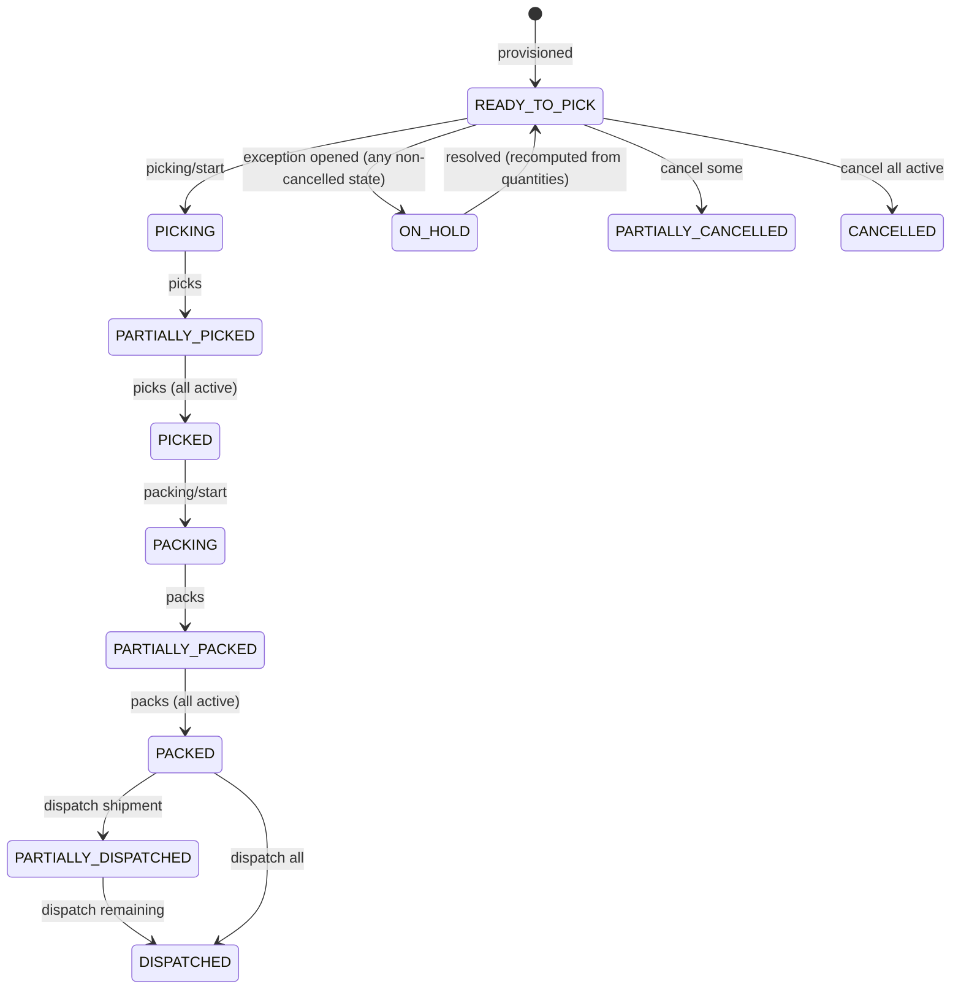
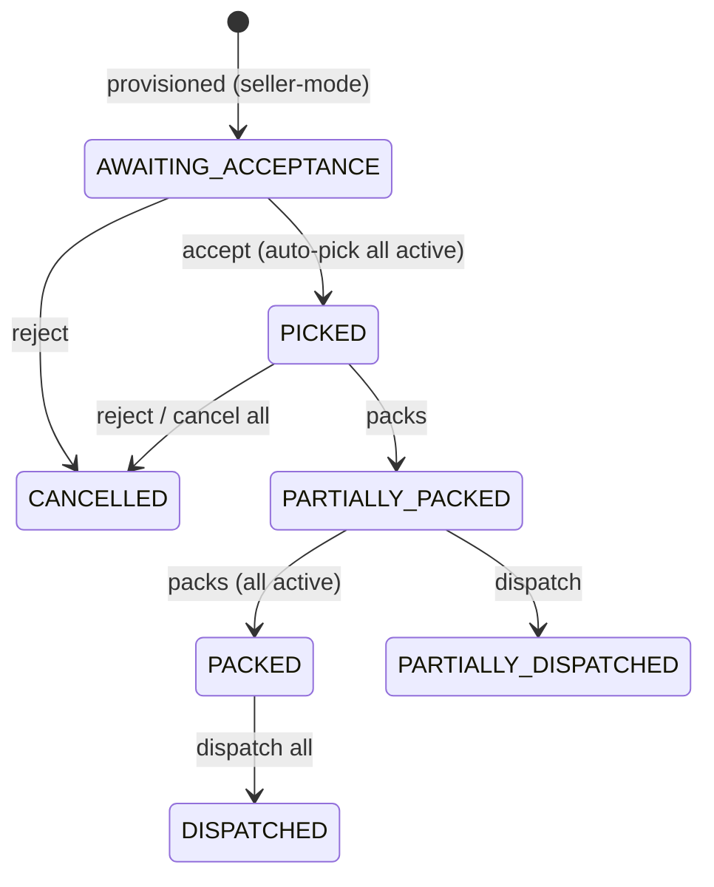
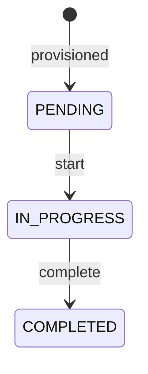

# Fulfillment

> Turns paid orders into fulfillment orders, runs the platform pick/pack/dispatch workflow with staff work items and exceptions, and exposes the seller self-fulfillment commands (accept, reject, pack, cancel, dispatch) for SELLER-mode shipping groups.

## Purpose and features

- **System** provisions `FulfillmentOrder` rows from a paid order through the `fulfillment.provision` job: one per `(shippingGroupId, warehouseId)` for PLATFORM-mode groups, one `warehouseId: null` row per SELLER-mode group.
- **Staff** (assigned) and **admins** start, record and complete PICK and PACK work, raise exceptions and dispatch booked shipments.
- **Admins** also assign work items to staff, resolve exceptions (resume or cancel the affected quantity) and cancel line quantities. Cancellation returns stock and enqueues a refund job.
- **Approved sellers** (verified email) accept or reject their own seller-mode fulfillment orders, record packs, cancel undispatched quantity and dispatch in one atomic call that creates the shipment.
- **Customers** never call this module. `deriveCustomerFulfillmentSummary` collapses statuses into `PREPARING | PACKED | PARTIALLY_DISPATCHED | DISPATCHED | CANCELLED` for order reads ([customer-fulfillment-summary.ts:33](../../../services/commerce-api/src/modules/fulfillment/customer-fulfillment-summary.ts#L33), used by `orders.service.ts:831`).
- Sellers read their fulfillment orders through `/sellers/me/orders` (orders module); this module has no seller GET route.

## Routes

Conventions (prefix, guards, envelope): see [../architecture.md](../architecture.md) and [../auth-and-access.md](../auth-and-access.md).

| Method | Path                                                           | Access                                                     | Idempotency                                                                   | Description                                                                                                                                                                                                                                               |
| ------ | -------------------------------------------------------------- | ---------------------------------------------------------- | ----------------------------------------------------------------------------- | --------------------------------------------------------------------------------------------------------------------------------------------------------------------------------------------------------------------------------------------------------- |
| GET    | /api/v1/admin/fulfillments                                     | Roles(STAFF, ADMIN)                                        | n/a                                                                           | Paginated list, filters `status`, `orderId`, `warehouseId`, `assignedUserId`; ordered `priority desc, createdAt asc` ([admin-fulfillments.controller.ts:54](../../../services/commerce-api/src/modules/fulfillment/admin-fulfillments.controller.ts#L54)) |
| GET    | /api/v1/admin/fulfillments/:id                                 | Roles(STAFF, ADMIN)                                        | n/a                                                                           | Detail with lines, work items, exceptions ([admin-fulfillments.controller.ts:59](../../../services/commerce-api/src/modules/fulfillment/admin-fulfillments.controller.ts#L59))                                                                            |
| GET    | /api/v1/admin/fulfillments/:id/events                          | Roles(STAFF, ADMIN)                                        | n/a                                                                           | Event history, newest first ([admin-fulfillments.controller.ts:66](../../../services/commerce-api/src/modules/fulfillment/admin-fulfillments.controller.ts#L66))                                                                                          |
| POST   | /api/v1/admin/fulfillments/:id/work-items/:type/assign         | Roles(ADMIN)                                               | Body `version` (work item)                                                    | Assign `pick`/`pack` to an active STAFF user ([admin-fulfillments.controller.ts:74](../../../services/commerce-api/src/modules/fulfillment/admin-fulfillments.controller.ts#L74))                                                                         |
| POST   | /api/v1/admin/fulfillments/:id/picking/start                   | Roles(STAFF, ADMIN)                                        | Body `version` (work item)                                                    | PICK PENDING -> IN_PROGRESS ([admin-fulfillments.controller.ts:90](../../../services/commerce-api/src/modules/fulfillment/admin-fulfillments.controller.ts#L90))                                                                                          |
| POST   | /api/v1/admin/fulfillments/:id/picks                           | Roles(STAFF, ADMIN)                                        | **Idempotency-Key required** (UUID v4)                                        | Record pick deltas ([admin-fulfillments.controller.ts:105](../../../services/commerce-api/src/modules/fulfillment/admin-fulfillments.controller.ts#L105))                                                                                                 |
| POST   | /api/v1/admin/fulfillments/:id/picking/complete                | Roles(STAFF, ADMIN)                                        | Body `version` (work item)                                                    | PICK IN_PROGRESS -> COMPLETED ([admin-fulfillments.controller.ts:122](../../../services/commerce-api/src/modules/fulfillment/admin-fulfillments.controller.ts#L122))                                                                                      |
| POST   | /api/v1/admin/fulfillments/:id/packing/start                   | Roles(STAFF, ADMIN)                                        | Body `version` (work item)                                                    | PACK PENDING -> IN_PROGRESS ([admin-fulfillments.controller.ts:137](../../../services/commerce-api/src/modules/fulfillment/admin-fulfillments.controller.ts#L137))                                                                                        |
| POST   | /api/v1/admin/fulfillments/:id/packs                           | Roles(STAFF, ADMIN)                                        | **Idempotency-Key required**                                                  | Record pack deltas ([admin-fulfillments.controller.ts:152](../../../services/commerce-api/src/modules/fulfillment/admin-fulfillments.controller.ts#L152))                                                                                                 |
| POST   | /api/v1/admin/fulfillments/:id/packing/complete                | Roles(STAFF, ADMIN)                                        | Body `version` (work item)                                                    | PACK IN_PROGRESS -> COMPLETED ([admin-fulfillments.controller.ts:169](../../../services/commerce-api/src/modules/fulfillment/admin-fulfillments.controller.ts#L169))                                                                                      |
| POST   | /api/v1/admin/fulfillments/:id/exceptions                      | Roles(STAFF, ADMIN)                                        | None                                                                          | Open an exception on a line (puts order ON_HOLD) ([admin-fulfillments.controller.ts:184](../../../services/commerce-api/src/modules/fulfillment/admin-fulfillments.controller.ts#L184))                                                                   |
| POST   | /api/v1/admin/fulfillments/:id/exceptions/:exceptionId/resolve | Roles(ADMIN)                                               | Replay-safe (already RESOLVED -> no-op)                                       | `resume` or `cancel_quantity` ([admin-fulfillments.controller.ts:194](../../../services/commerce-api/src/modules/fulfillment/admin-fulfillments.controller.ts#L194))                                                                                      |
| POST   | /api/v1/admin/fulfillments/:id/dispatches                      | Roles(STAFF, ADMIN)                                        | **Idempotency-Key required** (stored on `FulfillmentDispatch`)                | Dispatch one BOOKED shipment ([admin-fulfillments.controller.ts:204](../../../services/commerce-api/src/modules/fulfillment/admin-fulfillments.controller.ts#L204))                                                                                       |
| POST   | /api/v1/admin/fulfillments/:id/cancellations                   | Roles(ADMIN)                                               | **Idempotency-Key required**                                                  | Cancel line quantities, return stock, enqueue refund ([admin-fulfillments.controller.ts:220](../../../services/commerce-api/src/modules/fulfillment/admin-fulfillments.controller.ts#L220))                                                               |
| POST   | /api/v1/sellers/me/fulfillments/:id/accept                     | Authenticated + verified email + in-service `lockApproved` | Body `version` (fulfillment order)                                            | AWAITING_ACCEPTANCE -> accepted ([seller-fulfillments.controller.ts:43](../../../services/commerce-api/src/modules/fulfillment/seller-fulfillments.controller.ts#L43))                                                                                    |
| POST   | /api/v1/sellers/me/fulfillments/:id/reject                     | Authenticated + verified email + `lockApproved`            | **Idempotency-Key required** + request hash + body `version`                  | Cancel all undispatched quantity ([seller-fulfillments.controller.ts:56](../../../services/commerce-api/src/modules/fulfillment/seller-fulfillments.controller.ts#L56))                                                                                   |
| POST   | /api/v1/sellers/me/fulfillments/:id/packs                      | Authenticated + verified email + `lockApproved`            | **Idempotency-Key required** + request hash                                   | Record pack deltas ([seller-fulfillments.controller.ts:73](../../../services/commerce-api/src/modules/fulfillment/seller-fulfillments.controller.ts#L73))                                                                                                 |
| POST   | /api/v1/sellers/me/fulfillments/:id/cancellations              | Authenticated + verified email + `lockApproved`            | **Idempotency-Key required** + request hash                                   | Cancel selected line quantities ([seller-fulfillments.controller.ts:89](../../../services/commerce-api/src/modules/fulfillment/seller-fulfillments.controller.ts#L89))                                                                                    |
| POST   | /api/v1/sellers/me/fulfillments/:id/dispatches                 | Authenticated + verified email + `lockApproved`            | **Idempotency-Key required** + request hash (stored on `FulfillmentDispatch`) | Create DISPATCHED shipment + dispatch atomically ([seller-fulfillments.controller.ts:106](../../../services/commerce-api/src/modules/fulfillment/seller-fulfillments.controller.ts#L106))                                                                 |

- `@Roles(Role.STAFF, Role.ADMIN)` is class level on the admin controller ([admin-fulfillments.controller.ts:49](../../../services/commerce-api/src/modules/fulfillment/admin-fulfillments.controller.ts#L49)). Assign, resolve and cancel narrow it to ADMIN per method. The seller controller has no `@Roles`. It is gated by `@RequireVerifiedEmail()` at class level plus in-service ownership checks ([seller-fulfillments.controller.ts:39](../../../services/commerce-api/src/modules/fulfillment/seller-fulfillments.controller.ts#L39)).
- The Idempotency-Key is checked in the controller as a UUID v4, else 400 ([admin-fulfillments.controller.ts:42](../../../services/commerce-api/src/modules/fulfillment/admin-fulfillments.controller.ts#L42), [seller-fulfillments.controller.ts:28](../../../services/commerce-api/src/modules/fulfillment/seller-fulfillments.controller.ts#L28)). `:type` must be `pick` or `pack` in any case, else 400 ([admin-fulfillments.controller.ts:33](../../../services/commerce-api/src/modules/fulfillment/admin-fulfillments.controller.ts#L33)).
- **Two version counters.** `version` on start/complete/assign is the **work item's** version. On accept/reject it is the **fulfillment order's** version. Every mutation bumps the fulfillment order version through `recomputeStatus` ([fulfillments.service.ts:1426](../../../services/commerce-api/src/modules/fulfillment/fulfillments.service.ts#L1426)).

## Services

| Service                                                                                                                                                                           | Responsibility                                                                                                                                                                                                                                                                                                                                                                                                |
| --------------------------------------------------------------------------------------------------------------------------------------------------------------------------------- | ------------------------------------------------------------------------------------------------------------------------------------------------------------------------------------------------------------------------------------------------------------------------------------------------------------------------------------------------------------------------------------------------------------- |
| `FulfillmentsService` ([fulfillments.service.ts](../../../services/commerce-api/src/modules/fulfillment/fulfillments.service.ts))                                                 | Admin reads, work items, quantities, exceptions, dispatch, cancellation, seller commands. Exports `assignShipmentQuantity` / `releaseShipmentQuantity` ([:610](../../../services/commerce-api/src/modules/fulfillment/fulfillments.service.ts#L610), [:639](../../../services/commerce-api/src/modules/fulfillment/fulfillments.service.ts#L639)), which `ShipmentsService` calls inside its own transaction. |
| `FulfillmentProvisioningService` ([fulfillment-provisioning.service.ts](../../../services/commerce-api/src/modules/fulfillment/provisioning/fulfillment-provisioning.service.ts)) | `provisionForOrder(orderId)` and `backfillSellerFulfillments()`.                                                                                                                                                                                                                                                                                                                                              |
| `FulfillmentProvisionHandler` ([fulfillment-provision.handler.ts](../../../services/commerce-api/src/modules/fulfillment/jobs/fulfillment-provision.handler.ts))                  | Job handler for `fulfillment.provision`. Payload must be `{ orderId: string }`, else it throws ([:22](../../../services/commerce-api/src/modules/fulfillment/jobs/fulfillment-provision.handler.ts#L22)).                                                                                                                                                                                                     |
| `deriveFulfillmentStatus` ([fulfillment-status.ts](../../../services/commerce-api/src/modules/fulfillment/fulfillment-status.ts))                                                 | Pure function; the only source of `FulfillmentOrder.status`.                                                                                                                                                                                                                                                                                                                                                  |
| `deriveCustomerFulfillmentSummary` ([customer-fulfillment-summary.ts](../../../services/commerce-api/src/modules/fulfillment/customer-fulfillment-summary.ts))                    | Pure function; the customer-facing summary.                                                                                                                                                                                                                                                                                                                                                                   |

Every command runs in one transaction that first takes `SELECT ... FOR UPDATE` on the `fulfillment_orders` row ([fulfillments.service.ts:1380](../../../services/commerce-api/src/modules/fulfillment/fulfillments.service.ts#L1380)). Seller commands then take `SellersService.lockApproved` in the same transaction, so the lock order is fulfillment order first, then seller ([:702](../../../services/commerce-api/src/modules/fulfillment/fulfillments.service.ts#L702)).

## Business rules

### Provisioning

- The `fulfillment.provision` job is enqueued by `OrdersService.confirmPayment` in the same transaction that marks the order PAID (`orders.service.ts:617`).
- A missing order returns without error, so there is no retry ([fulfillment-provisioning.service.ts:63](../../../services/commerce-api/src/modules/fulfillment/provisioning/fulfillment-provisioning.service.ts#L63)).
- **PLATFORM groups.** Each item resolves `reservationId -> Reservation -> InventoryRecord.warehouseId`. Items with no reservation, record or warehouse are skipped silently. Lines are grouped by warehouse, and one fulfillment order is created per warehouse with a PICK and a PACK work item ([:120](../../../services/commerce-api/src/modules/fulfillment/provisioning/fulfillment-provisioning.service.ts#L120), [:243](../../../services/commerce-api/src/modules/fulfillment/provisioning/fulfillment-provisioning.service.ts#L243)).
- **SELLER groups.** Only items whose inventory record has **no** warehouse are used. The service creates at most one fulfillment order, with `warehouseId: null`, `status: AWAITING_ACCEPTANCE` and **no work items** ([:175](../../../services/commerce-api/src/modules/fulfillment/provisioning/fulfillment-provisioning.service.ts#L175), [:297](../../../services/commerce-api/src/modules/fulfillment/provisioning/fulfillment-provisioning.service.ts#L297)).
- Each fulfillment order is created in its own transaction together with its `FF-` number (`NumberingService.nextFulfillmentNumber`), the `fulfillment.created` event, the `fulfillment.order.created` audit row and the `fulfillment.provisioned` outbox event.
- **Idempotency.** It relies on `@@unique([shippingGroupId, warehouseId])` and the partial unique index `fulfillment_orders_seller_shipping_group_key` for null warehouses. **Any** P2002 is swallowed as a replay ([:280](../../../services/commerce-api/src/modules/fulfillment/provisioning/fulfillment-provisioning.service.ts#L280)).
- Each line snapshots `orderItemId` (unique), `variantId`, `reservationId`, `inventoryRecordId` and `allocatedQuantity = item.quantity`.

### Derived status

`FulfillmentOrder.status` is never set directly. After every mutation `recomputeStatus` reloads lines, work items and the open-exception count, then writes `deriveFulfillmentStatus(...)`. It passes `requiresAcceptance = warehouseId === null` ([fulfillments.service.ts:1397](../../../services/commerce-api/src/modules/fulfillment/fulfillments.service.ts#L1397)). Here active = sum(allocated) - sum(cancelled). The first matching rule wins ([fulfillment-status.ts:46](../../../services/commerce-api/src/modules/fulfillment/fulfillment-status.ts#L46)):

| #   | Condition                                           | Status                              |
| --- | --------------------------------------------------- | ----------------------------------- |
| 1   | active <= 0                                         | CANCELLED                           |
| 2   | seller-mode and `acceptedAt` null                   | AWAITING_ACCEPTANCE                 |
| 3   | any OPEN exception                                  | ON_HOLD                             |
| 4   | dispatched >= active / > 0                          | DISPATCHED / PARTIALLY_DISPATCHED   |
| 5   | packed >= active / > 0 / PACK work item IN_PROGRESS | PACKED / PARTIALLY_PACKED / PACKING |
| 6   | picked >= active / > 0 / PICK work item IN_PROGRESS | PICKED / PARTIALLY_PICKED / PICKING |
| 7   | cancelled > 0                                       | PARTIALLY_CANCELLED                 |
| 8   | otherwise                                           | READY_TO_PICK                       |

Platform flow (derived, happy path):

Seller flow:

### Quantity invariants

Enforced by CHECK constraints (migration `20260917010000_add_shipping_tracking_module`) and pre-checked in code:
`0 <= dispatched <= shipmentAssigned <= packed <= picked <= allocated` and `cancelled + dispatched <= allocated` (see the schema comment on `FulfillmentLine`).

### Work items (platform only)

- **Assign.** The assignee must be an active user with role exactly `STAFF`, else 400. The update is a CAS on the work item version ([fulfillments.service.ts:160](../../../services/commerce-api/src/modules/fulfillment/fulfillments.service.ts#L160)).
- **Who may mutate.** An ADMIN may act on any work item. A STAFF user may only act on work items assigned to them, else 403 ([:1330](../../../services/commerce-api/src/modules/fulfillment/fulfillments.service.ts#L1330)). This applies to start, record and complete.
- **Start.** Requires `PENDING` and a CAS on version ([:195](../../../services/commerce-api/src/modules/fulfillment/fulfillments.service.ts#L195)).
- **Complete.** Requires `IN_PROGRESS`, no OPEN exception, and every active unit picked or packed. Per line, done is capped at `allocated - cancelled` ([:242](../../../services/commerce-api/src/modules/fulfillment/fulfillments.service.ts#L242)).
- **Record picks/packs** ([:295](../../../services/commerce-api/src/modules/fulfillment/fulfillments.service.ts#L295)):
  - The work item must be `IN_PROGRESS`.
  - Deltas are positive integers.
  - Pick ceiling: `picked + delta <= allocated - cancelled`. Pack ceiling: `packed + delta <= picked` ([:332](../../../services/commerce-api/src/modules/fulfillment/fulfillments.service.ts#L332), [:343](../../../services/commerce-api/src/modules/fulfillment/fulfillments.service.ts#L343)).
  - Any invalid line rolls back the whole request.
- `FulfillmentWorkItemStatus.CANCELLED` exists in the enum but is never written.

### Idempotency

- **Admin picks/packs/cancel.** The key is stored on `FulfillmentEvent.idempotencyKey`, which is globally unique. A replay must match the fulfillment order, the event type and the payload (`stableStringify` of `metadata`). A match returns the current state; anything else returns 409 ([fulfillments.service.ts:1358](../../../services/commerce-api/src/modules/fulfillment/fulfillments.service.ts#L1358)).
- **Seller reject/pack/cancel.** These use the same column, but compare `requestHash`: sha256 of the command with lines sorted by id ([:1150](../../../services/commerce-api/src/modules/fulfillment/fulfillments.service.ts#L1150), [:1154](../../../services/commerce-api/src/modules/fulfillment/fulfillments.service.ts#L1154)).
- **Dispatch (both paths).** The key is stored on `FulfillmentDispatch.idempotencyKey`. Admin replay requires the same fulfillment order and `shipmentId` ([:479](../../../services/commerce-api/src/modules/fulfillment/fulfillments.service.ts#L479)). Seller replay requires the same fulfillment order and `requestHash` ([:1004](../../../services/commerce-api/src/modules/fulfillment/fulfillments.service.ts#L1004)).
- Any P2002 raised while writing the event or dispatch maps to 409 "Idempotency-Key already used" ([:1457](../../../services/commerce-api/src/modules/fulfillment/fulfillments.service.ts#L1457)).

### Exceptions

- **Create.** The line must belong to the fulfillment order. Types are `SHORT_PICK | DAMAGED | MISSING`, `quantity >= 1`, and `reason` is required. There is no status or quantity check and no idempotency. The order goes ON_HOLD ([fulfillments.service.ts:374](../../../services/commerce-api/src/modules/fulfillment/fulfillments.service.ts#L374)).
- **Resolve** ([:411](../../../services/commerce-api/src/modules/fulfillment/fulfillments.service.ts#L411)):
  - An exception on another fulfillment order returns 404. An already-resolved exception returns the current state.
  - The exception is marked `RESOLVED` with the resolver, `resolution` and time.
  - `cancel_quantity` runs `applyCancellation` for `exception.quantity` on the exception's line.
  - An open exception blocks complete and admin dispatch.

### Admin dispatch

- **Preconditions** ([fulfillments.service.ts:470](../../../services/commerce-api/src/modules/fulfillment/fulfillments.service.ts#L470)):
  - No OPEN exception.
  - The shipment belongs to this fulfillment order and is `BOOKED`.
  - Every shipment line `quantity <= shipmentAssigned - dispatched` on its fulfillment line ([:526](../../../services/commerce-api/src/modules/fulfillment/fulfillments.service.ts#L526)).
- **Effects:**
  - Increments `dispatchedQuantity`.
  - Creates the `FulfillmentDispatch` with a `DSP-` number and dispatch lines.
  - Sets the shipment to `DISPATCHED` with `dispatchedAt`.
  - Adds an `ADMIN_MANUAL` DISPATCHED tracking event, emits the `dispatched` event and the `fulfillment.dispatched` outbox event ([:563](../../../services/commerce-api/src/modules/fulfillment/fulfillments.service.ts#L563)).
- Quantity reaches a shipment through booking. `assignShipmentQuantity` claims `packed - shipmentAssigned` ([:623](../../../services/commerce-api/src/modules/fulfillment/fulfillments.service.ts#L623)). `releaseShipmentQuantity` decrements the claim on shipment cancel. See [shipments.md](shipments.md).

### Cancellation (admin)

- **Ceiling.** Per line, `quantity <= allocated - cancelled - dispatched` ([fulfillments.service.ts:1272](../../../services/commerce-api/src/modules/fulfillment/fulfillments.service.ts#L1272)). Picked and packed counters are left unchanged as history.
- Stock goes back through `InventoryService.returnCancelledStock(warehouseId, variantId, qty, {referenceType: 'fulfillment_cancellation_line', referenceId: line.id})` ([:1289](../../../services/commerce-api/src/modules/fulfillment/fulfillments.service.ts#L1289)).
- **Refund.** It records the `fulfillment.refund_required` outbox event and enqueues `refunds.process_fulfillment_cancellation` with `{orderId, sellerOrderId, lines[{fulfillmentLineId, orderItemId, quantity}], reason}` ([:1309](../../../services/commerce-api/src/modules/fulfillment/fulfillments.service.ts#L1309)). Refund handling lives in payments.

### Seller self-fulfillment

- **Ownership.** Every seller command requires `lockApproved` (403 if the seller is not approved). It then 404s unless `warehouseId === null` and `sellerOrder.sellerId` is the caller's seller ([fulfillments.service.ts:1172](../../../services/commerce-api/src/modules/fulfillment/fulfillments.service.ts#L1172)).
- **Accept** ([:711](../../../services/commerce-api/src/modules/fulfillment/fulfillments.service.ts#L711)):
  - Requires `AWAITING_ACCEPTANCE`.
  - CAS on `version` + status sets `acceptedAt` and `acceptedByUserId`. A second accept returns 409, not a no-op.
  - Sets `pickedQuantity = allocated - cancelled` on every active line (auto-pick), so status lands on PICKED.
- **Reject** ([:763](../../../services/commerce-api/src/modules/fulfillment/fulfillments.service.ts#L763)):
  - Requires `version` to match. There is **no status check**, so an accepted or partly packed order can still be rejected.
  - Refused (409) if anything has been dispatched.
  - Cancels `allocated - cancelled - dispatched` on every line.
- **Pack.** Refused while `AWAITING_ACCEPTANCE`. Ceiling: `delta <= allocated - cancelled - packed` ([:849](../../../services/commerce-api/src/modules/fulfillment/fulfillments.service.ts#L849)).
- **Cancel.** Ceiling: `quantity <= allocated - cancelled - shipmentAssigned` ([:933](../../../services/commerce-api/src/modules/fulfillment/fulfillments.service.ts#L933)).
- **Seller cancel and reject** both use `applySellerCancellation` ([:1187](../../../services/commerce-api/src/modules/fulfillment/fulfillments.service.ts#L1187)):
  - Stock goes back through `returnCancelledOfferStock(offerId, ...)`, with the offer resolved via `OrderItem`.
  - It writes the same outbox event and refund job as the admin path.
- **Dispatch** ([:977](../../../services/commerce-api/src/modules/fulfillment/fulfillments.service.ts#L977)):
  - Each line needs `quantity <= packed - dispatched`, and at least one line.
  - Increments both `shipmentAssignedQuantity` and `dispatchedQuantity` in one update, to satisfy the CHECK constraint ([:1045](../../../services/commerce-api/src/modules/fulfillment/fulfillments.service.ts#L1045)).
  - Creates a `Shipment` with `providerCode 'SELLER'`, `carrierCode = methodCode = input.carrierCode`, `warehouseId null` and status `DISPATCHED`, bypassing the carrier registry. Its `bookingIdempotencyKey` is `seller-dispatch:<key>` ([:1060](../../../services/commerce-api/src/modules/fulfillment/fulfillments.service.ts#L1060)).
  - Also creates the `FulfillmentDispatch` and a `SELLER_MANUAL` DISPATCHED tracking event keyed `seller-dispatch-tracking:<key>` ([:1123](../../../services/commerce-api/src/modules/fulfillment/fulfillments.service.ts#L1123)).
  - Returns the fulfillment order with `lines` and `shipments`.
  - Emits no outbox event (unlike admin dispatch).

### Customer summary

Rules ([customer-fulfillment-summary.ts:33](../../../services/commerce-api/src/modules/fulfillment/customer-fulfillment-summary.ts#L33)), checked in order:

1. No fulfillment orders yet -> PREPARING.
2. All CANCELLED -> CANCELLED.
3. All DISPATCHED or CANCELLED -> DISPATCHED.
4. Any DISPATCHED or PARTIALLY_DISPATCHED -> PARTIALLY_DISPATCHED.
5. All PACKED or CANCELLED -> PACKED.
6. Otherwise -> PREPARING. This includes ON_HOLD.

### Backfill script

[scripts/backfill-seller-fulfillments.ts](../../../services/commerce-api/scripts/backfill-seller-fulfillments.ts) provisions seller-mode fulfillment orders for orders paid before #37 shipped.

- **Run it with** `npx ts-node scripts/backfill-seller-fulfillments.ts`. It wires the services by hand, without Nest.
- **What it scans.** It finds SELLER-mode shipping groups that have no fulfillment order, on orders with status `PAID | PARTIALLY_REFUNDED | REFUNDED`. It then runs `provisionSellerShippingGroup` for each ([fulfillment-provisioning.service.ts:89](../../../services/commerce-api/src/modules/fulfillment/provisioning/fulfillment-provisioning.service.ts#L89)).
- **Output.** It prints `scanned` and `provisioned`. It is safe to re-run.

## Data

| Model                                                                           | Access                                                                        |
| ------------------------------------------------------------------------------- | ----------------------------------------------------------------------------- |
| `FulfillmentOrder`                                                              | create (provisioning), `FOR UPDATE` lock, status/version/accept updates, read |
| `FulfillmentLine`                                                               | create, quantity counter updates, read                                        |
| `FulfillmentWorkItem`                                                           | create (platform only), CAS updates                                           |
| `FulfillmentException`                                                          | create, resolve                                                               |
| `FulfillmentDispatch`, `FulfillmentDispatchLine`                                | create (immutable), read (idempotency)                                        |
| `FulfillmentEvent`                                                              | append (history + idempotency keys)                                           |
| `Shipment`, `ShipmentLine`                                                      | read/update (admin dispatch), create (seller dispatch)                        |
| `TrackingEvent`                                                                 | create (initial DISPATCHED event)                                             |
| `Order`, `ShippingGroup`, `OrderItem`, `Reservation`, `InventoryRecord`, `User` | read                                                                          |
| `AuditEvent`                                                                    | `fulfillment.order.created` only, via `AuditService.record`                   |

## Dependencies

- Imports `AuditModule`, `InventoryModule` (`returnCancelledStock`, `returnCancelledOfferStock`), `NumberingModule` (FF/DSP/shipment numbers), `SellersModule` (`lockApproved`) ([fulfillment.module.ts:14](../../../services/commerce-api/src/modules/fulfillment/fulfillment.module.ts#L14)).
- Uses `BackgroundJobsService`, `OutboxService` (global infra) and the job type constant from `payments/jobs/fulfillment-cancellation-refund.handler.ts`.
- Exports all three providers. `ShipmentsModule` uses `FulfillmentsService`. `WorkersModule` registers `FulfillmentProvisionHandler`. `OrdersService` uses the job type and the customer summary.

## Jobs and events

- **Consumes:** `fulfillment.provision` job (see [../background-processing.md](../background-processing.md#job-queue)).
- **Enqueues:** `refunds.process_fulfillment_cancellation` on every cancellation (admin cancel, exception `cancel_quantity`, seller cancel/reject).
- **Outbox:** `fulfillment.provisioned`, `fulfillment.dispatched` (admin dispatch only), `fulfillment.refund_required`.
- **FulfillmentEvent types:** `fulfillment.created`, `work_item.assigned`, `pick.started|completed`, `pack.started|completed`, `picks.recorded`, `packs.recorded`, `exception.created`, `exception.resolved`, `dispatched`, `lines.cancelled`, `seller.accepted|rejected|packed|cancelled|dispatched`.

## Configuration

None.

## Tests

- [fulfillment-status.spec.ts](../../../services/commerce-api/src/modules/fulfillment/fulfillment-status.spec.ts): every derived state, priority ordering, cancellation-adjusted totals, and the acceptance gate.
- [customer-fulfillment-summary.spec.ts](../../../services/commerce-api/src/modules/fulfillment/customer-fulfillment-summary.spec.ts): every summary bucket.
- [fulfillments.service.spec.ts](../../../services/commerce-api/src/modules/fulfillment/fulfillments.service.spec.ts): assignment rules, start/complete guards, pick/pack ceilings and idempotent replay, exceptions, dispatch preconditions, cancellation, and every seller command (ownership 404, accept auto-pick, reject after dispatch, pack/cancel ceilings, atomic dispatch + replay).
- [fulfillment-provisioning.service.spec.ts](../../../services/commerce-api/src/modules/fulfillment/provisioning/fulfillment-provisioning.service.spec.ts): missing order, skipped lines, per-warehouse grouping, P2002 replay.
- Integration (real Postgres): [fulfillment.integration-spec.ts](../../../services/commerce-api/test/fulfillment.integration-spec.ts) covers partial flows, row-lock serialisation, rollback, cancel-retry restoring stock once, and CHECK constraints. [seller-fulfillment.integration-spec.ts](../../../services/commerce-api/test/seller-fulfillment.integration-spec.ts) and [seller-fulfillment-http.integration-spec.ts](../../../services/commerce-api/test/seller-fulfillment-http.integration-spec.ts) cover the seller flow over the service and over HTTP.
- No test for the backfill script or `FulfillmentProvisionHandler` payload parsing.

## Known gaps

- **Admin cancel on seller-mode orders.** Admin `cancellations` and exception `cancel_quantity` are not restricted to platform orders. On a seller-mode order (`warehouseId null`), `applyCancellation` passes `fo.warehouseId!` (null) to `returnCancelledStock` ([fulfillments.service.ts:1291](../../../services/commerce-api/src/modules/fulfillment/fulfillments.service.ts#L1291)).
- **Admin cancel ignores booked shipments.** The ceiling ignores `shipmentAssignedQuantity` ([fulfillments.service.ts:1272](../../../services/commerce-api/src/modules/fulfillment/fulfillments.service.ts#L1272)). Quantity already booked onto an undispatched shipment can be cancelled, and dispatching that shipment then violates `cancelled + dispatched <= allocated` at the DB. The seller path does handle this ([:933](../../../services/commerce-api/src/modules/fulfillment/fulfillments.service.ts#L933)).
- **Platform pack ceiling ignores cancellations.** The ceiling is `packed <= picked` ([fulfillments.service.ts:343](../../../services/commerce-api/src/modules/fulfillment/fulfillments.service.ts#L343)). Units picked and then cancelled can still be packed and booked, leading to the same CHECK failure at dispatch.
- **Seller commands ignore exceptions.** Admins/staff can open exceptions on seller-mode orders, but seller pack and dispatch never check open exceptions, so ON_HOLD does not block the seller ([:825](../../../services/commerce-api/src/modules/fulfillment/fulfillments.service.ts#L825), [:977](../../../services/commerce-api/src/modules/fulfillment/fulfillments.service.ts#L977)).
- **STAFF limits.** Any STAFF user can dispatch any fulfillment order and open exceptions; the assignment check covers only work items.
- **Exception creation is unguarded.** It has no idempotency, no quantity-vs-line check and no status guard (it works even on DISPATCHED or CANCELLED orders) ([fulfillments.service.ts:374](../../../services/commerce-api/src/modules/fulfillment/fulfillments.service.ts#L374)).
- **Seller reject has no status guard.** An accepted, partly packed order can be rejected ([fulfillments.service.ts:785](../../../services/commerce-api/src/modules/fulfillment/fulfillments.service.ts#L785)).
- **Seller dispatch skips the outbox.** It writes no `fulfillment.dispatched` outbox event, unlike admin dispatch ([fulfillments.service.ts:1136](../../../services/commerce-api/src/modules/fulfillment/fulfillments.service.ts#L1136)). `carrierCode` is free text and `estimatedDeliveryAt` is not validated.
- **Provisioning swallows every P2002**, including a `fulfillmentNumber` collision. Items that cannot be resolved are skipped with no log, so a paid line can silently end up with no fulfillment ([fulfillment-provisioning.service.ts:137](../../../services/commerce-api/src/modules/fulfillment/provisioning/fulfillment-provisioning.service.ts#L137), [:281](../../../services/commerce-api/src/modules/fulfillment/provisioning/fulfillment-provisioning.service.ts#L281)).
- **P2002 always reads as a reused key.** `mapWriteError` turns any P2002, including number collisions, into "Idempotency-Key already used" ([fulfillments.service.ts:1457](../../../services/commerce-api/src/modules/fulfillment/fulfillments.service.ts#L1457)).
- **`releaseShipmentQuantity` does not validate lines.** It does not check that lines belong to the fulfillment order before decrementing ([fulfillments.service.ts:645](../../../services/commerce-api/src/modules/fulfillment/fulfillments.service.ts#L645)).
- **Dead schema fields.** `FulfillmentOrder.heldReason` and `priority` are never written by any code, and `FulfillmentWorkItemStatus.CANCELLED` is never used. Work items stay PENDING/IN_PROGRESS after full cancellation.
- **`GET /admin/fulfillments/:id/events` never 404s.** An unknown id returns `[]` ([fulfillments.service.ts:137](../../../services/commerce-api/src/modules/fulfillment/fulfillments.service.ts#L137)).
- **Only creation is audited.** Only provisioning writes `AuditEvent`. Admin cancellations, exception resolutions and seller rejects are recorded only in `FulfillmentEvent`.
