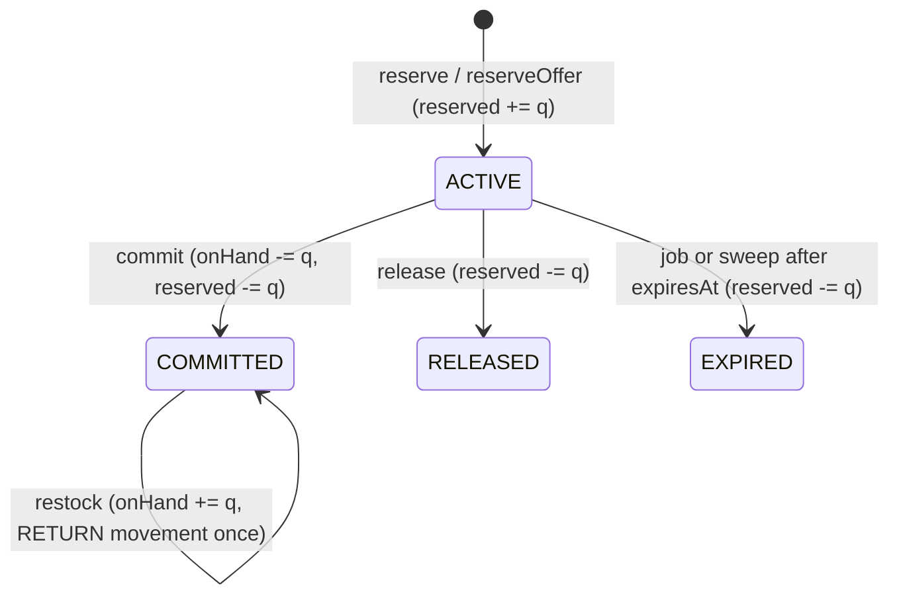

# Inventory

> Stock counters per warehouse and per seller offer, the movement ledger, time-limited reservations with a background expiry job, warehouses, and the transaction-scoped stock primitives that orders, fulfillment, procurement and returns call.

## Purpose and features

- **Staff and admins** manage warehouses, list platform inventory records, receive and adjust stock, set a reorder point, and read a record's movements and reservations. Adjustments are audited and accept an optional retry key.
- **Approved sellers** (role `SELLER`, verified email) set absolute on-hand quantities for their `SELLER`-stock offers, singly or in bulk (<=100), with optimistic concurrency, and read their movements.
- **Other modules** use `InventoryService`: availability reads (products, cart, wishlist), `reserve`/`reserveOffer`/`commit`/`release` (orders), `receiveStockForReference`/`reverseReceiptStock` (procurement), `returnCancelledStock`/`returnCancelledOfferStock` (fulfillment), `receiveReturnedStock` (returns).
- **Background:** each reservation enqueues an `inventory.expire_reservation` job at its expiry time.

Two kinds of `InventoryRecord` exist ([schema.prisma:646](../../../services/commerce-api/prisma/schema.prisma#L646)):

| Kind     | Key                                          | Used by                                                                |
| -------- | -------------------------------------------- | ---------------------------------------------------------------------- |
| Platform | `(warehouseId, variantId)`, `offerId = NULL` | `PLATFORM`-stock offers of that variant, shared across all such offers |
| Seller   | `offerId` (unique), `warehouseId = NULL`     | One `SELLER`-stock offer                                               |

`available` is never stored; it is always `onHand - reserved`.

## Routes

Conventions (prefix, guards, envelope): see [../architecture.md](../architecture.md) and [../auth-and-access.md](../auth-and-access.md).

| Method | Path                                            | Access                                          | Idempotency                          | Description                                                                                                                                                                                              |
| ------ | ----------------------------------------------- | ----------------------------------------------- | ------------------------------------ | -------------------------------------------------------------------------------------------------------------------------------------------------------------------------------------------------------- |
| GET    | /api/v1/admin/inventory                         | Roles(STAFF, ADMIN)                             | n/a                                  | Platform records, optional `warehouseId`/`variantId` query (not validated) ([admin-inventory.controller.ts:25](../../../services/commerce-api/src/modules/inventory/admin-inventory.controller.ts#L25))  |
| POST   | /api/v1/admin/inventory/receive                 | Roles(STAFF, ADMIN)                             | **None**: every call adds stock      | Increment on-hand, `RECEIPT` movement ([admin-inventory.controller.ts:33](../../../services/commerce-api/src/modules/inventory/admin-inventory.controller.ts#L33))                                       |
| POST   | /api/v1/admin/inventory/adjust                  | Roles(STAFF, ADMIN)                             | Optional UUID-v4 `Idempotency-Key`, scoped to actor | Signed delta, reserved-stock floor, actor audit and original-response replay ([admin-inventory.controller.ts](../../../services/commerce-api/src/modules/inventory/admin-inventory.controller.ts)) |
| GET    | /api/v1/admin/inventory/:id/movements           | Roles(STAFF, ADMIN)                             | n/a                                  | Movements of any record, newest first ([admin-inventory.controller.ts:53](../../../services/commerce-api/src/modules/inventory/admin-inventory.controller.ts#L53))                                       |
| PATCH  | /api/v1/admin/inventory/:id/reorder-point       | Roles(STAFF, ADMIN)                             | Naturally idempotent                 | Set `reorderPoint` (platform records only) ([admin-inventory.controller.ts:60](../../../services/commerce-api/src/modules/inventory/admin-inventory.controller.ts#L60))                                  |
| GET    | /api/v1/admin/inventory/:id/reservations        | Roles(STAFF, ADMIN)                             | n/a                                  | Reservations of any record, newest first ([admin-inventory.controller.ts:68](../../../services/commerce-api/src/modules/inventory/admin-inventory.controller.ts#L68))                                    |
| GET    | /api/v1/admin/inventory/warehouses              | Roles(STAFF, ADMIN)                             | n/a                                  | All warehouses, `name asc` ([admin-warehouses.controller.ts:25](../../../services/commerce-api/src/modules/inventory/warehouses/admin-warehouses.controller.ts#L25))                                     |
| GET    | /api/v1/admin/inventory/warehouses/:id          | Roles(STAFF, ADMIN)                             | n/a                                  | One warehouse ([admin-warehouses.controller.ts:30](../../../services/commerce-api/src/modules/inventory/warehouses/admin-warehouses.controller.ts#L30))                                                  |
| POST   | /api/v1/admin/inventory/warehouses              | Roles(STAFF, ADMIN)                             | None (unique `code` -> 409)          | Create ([admin-warehouses.controller.ts:35](../../../services/commerce-api/src/modules/inventory/warehouses/admin-warehouses.controller.ts#L35))                                                         |
| PATCH  | /api/v1/admin/inventory/warehouses/:id          | Roles(STAFF, ADMIN)                             | Naturally idempotent                 | `name`, `code`, `isActive` ([admin-warehouses.controller.ts:40](../../../services/commerce-api/src/modules/inventory/warehouses/admin-warehouses.controller.ts#L40))                                     |
| DELETE | /api/v1/admin/inventory/warehouses/:id          | Roles(STAFF, ADMIN)                             | Second call returns 404              | Hard delete, 204 ([admin-warehouses.controller.ts:48](../../../services/commerce-api/src/modules/inventory/warehouses/admin-warehouses.controller.ts#L48))                                               |
| GET    | /api/v1/sellers/me/inventory                    | Roles(SELLER) + verified email                  | n/a                                  | Every own `SELLER`-stock offer with counters (zeros before the first set) ([seller-inventory.controller.ts:32](../../../services/commerce-api/src/modules/inventory/seller-inventory.controller.ts#L32)) |
| PUT    | /api/v1/sellers/me/inventory/:offerId           | Roles(SELLER) + verified email + `lockApproved` | Body `version`                       | Set absolute on-hand ([seller-inventory.controller.ts:37](../../../services/commerce-api/src/modules/inventory/seller-inventory.controller.ts#L37))                                                      |
| PATCH  | /api/v1/sellers/me/inventory/bulk               | Roles(SELLER) + verified email + `lockApproved` | Per-item `version`, all-or-nothing   | Set up to 100 offers in one transaction ([seller-inventory.controller.ts:46](../../../services/commerce-api/src/modules/inventory/seller-inventory.controller.ts#L46))                                   |
| GET    | /api/v1/sellers/me/inventory/:offerId/movements | Roles(SELLER) + verified email                  | n/a                                  | Movements of an own offer's record; `[]` if none yet ([seller-inventory.controller.ts:54](../../../services/commerce-api/src/modules/inventory/seller-inventory.controller.ts#L54))                      |

Admin record responses are `InventoryRecord & { available }`; seller responses are `SellerInventoryView` ([inventory.types.ts:5](../../../services/commerce-api/src/modules/inventory/inventory.types.ts#L5)).

## Services

| Service                                                                                                                                                                            | Responsibility                                                                        | Key public methods                                                                                                                                                                                                                                                                                                                                                                                                                                                                                                                                                                                                                                                                                                                                                                                                                                                                                                                                                                                                                                                                                                                                                                                                                                                                                                                                                                                                                                                                                                                                                                                                                                                                                                                                                                                     |
| ---------------------------------------------------------------------------------------------------------------------------------------------------------------------------------- | ------------------------------------------------------------------------------------- | ------------------------------------------------------------------------------------------------------------------------------------------------------------------------------------------------------------------------------------------------------------------------------------------------------------------------------------------------------------------------------------------------------------------------------------------------------------------------------------------------------------------------------------------------------------------------------------------------------------------------------------------------------------------------------------------------------------------------------------------------------------------------------------------------------------------------------------------------------------------------------------------------------------------------------------------------------------------------------------------------------------------------------------------------------------------------------------------------------------------------------------------------------------------------------------------------------------------------------------------------------------------------------------------------------------------------------------------------------------------------------------------------------------------------------------------------------------------------------------------------------------------------------------------------------------------------------------------------------------------------------------------------------------------------------------------------------------------------------------------------------------------------------------------------------ |
| `InventoryService` ([inventory.service.ts](../../../services/commerce-api/src/modules/inventory/inventory.service.ts))                                                             | Counters, movements, reservations. Methods taking `tx` join the caller's transaction. | `getAvailableQuantities` ([:71](../../../services/commerce-api/src/modules/inventory/inventory.service.ts#L71)), `getAvailableOfferQuantities` ([:91](../../../services/commerce-api/src/modules/inventory/inventory.service.ts#L91)), `receiveStock` ([:163](../../../services/commerce-api/src/modules/inventory/inventory.service.ts#L163)), `receiveStockForReference` ([:200](../../../services/commerce-api/src/modules/inventory/inventory.service.ts#L200)), `returnCancelledStock` ([:241](../../../services/commerce-api/src/modules/inventory/inventory.service.ts#L241)), `returnCancelledOfferStock` ([:283](../../../services/commerce-api/src/modules/inventory/inventory.service.ts#L283)), `receiveReturnedStock` ([:322](../../../services/commerce-api/src/modules/inventory/inventory.service.ts#L322)), `reverseReceiptStock` ([:371](../../../services/commerce-api/src/modules/inventory/inventory.service.ts#L371)), `adjustStock` ([:418](../../../services/commerce-api/src/modules/inventory/inventory.service.ts#L418)), `reserve` ([:462](../../../services/commerce-api/src/modules/inventory/inventory.service.ts#L462)), `reserveOffer` ([:563](../../../services/commerce-api/src/modules/inventory/inventory.service.ts#L563)), `setOfferQuantity` ([:586](../../../services/commerce-api/src/modules/inventory/inventory.service.ts#L586)), `release` ([:651](../../../services/commerce-api/src/modules/inventory/inventory.service.ts#L651)), `expireReservation` ([:668](../../../services/commerce-api/src/modules/inventory/inventory.service.ts#L668)), `commit` ([:684](../../../services/commerce-api/src/modules/inventory/inventory.service.ts#L684)), `restock` ([:723](../../../services/commerce-api/src/modules/inventory/inventory.service.ts#L723)) |
| `SellerInventoryService` ([seller-inventory.service.ts](../../../services/commerce-api/src/modules/inventory/seller-inventory.service.ts))                                         | Seller-facing list/set/bulk/movements over `SELLER`-stock offers. Not exported.       | `list`, `set`, `updateMany` ([:61](../../../services/commerce-api/src/modules/inventory/seller-inventory.service.ts#L61)), `movements`                                                                                                                                                                                                                                                                                                                                                                                                                                                                                                                                                                                                                                                                                                                                                                                                                                                                                                                                                                                                                                                                                                                                                                                                                                                                                                                                                                                                                                                                                                                                                                                                                                                                 |
| `WarehousesService` ([warehouses.service.ts](../../../services/commerce-api/src/modules/inventory/warehouses/warehouses.service.ts))                                               | Warehouse CRUD. Exported; used by purchase orders.                                    | `findAll`, `findById`, `create`, `update`, `remove`                                                                                                                                                                                                                                                                                                                                                                                                                                                                                                                                                                                                                                                                                                                                                                                                                                                                                                                                                                                                                                                                                                                                                                                                                                                                                                                                                                                                                                                                                                                                                                                                                                                                                                                                                    |
| `InventoryExpireReservationHandler` ([inventory-expire-reservation.handler.ts](../../../services/commerce-api/src/modules/inventory/jobs/inventory-expire-reservation.handler.ts)) | Job handler for `inventory.expire_reservation`.                                       | `handle(payload)`                                                                                                                                                                                                                                                                                                                                                                                                                                                                                                                                                                                                                                                                                                                                                                                                                                                                                                                                                                                                                                                                                                                                                                                                                                                                                                                                                                                                                                                                                                                                                                                                                                                                                                                                                                                      |

## Business rules

**Counters** (conditional SQL updates or a locked adjustment transaction prevent races below each floor)

- Reserve claims with `WHERE on_hand - reserved >= q` ([inventory.service.ts:516](../../../services/commerce-api/src/modules/inventory/inventory.service.ts#L516)); commit with `on_hand >= q AND reserved >= q` ([:699](../../../services/commerce-api/src/modules/inventory/inventory.service.ts#L699)); release/expire with `reserved >= q`, else 409 "require reconciliation" ([:775](../../../services/commerce-api/src/modules/inventory/inventory.service.ts#L775)).
- Admin adjustment locks the record and requires the resulting `onHand` to remain within the PostgreSQL integer range and at least `reserved`; receipt reversal and seller set use the same reserved-stock floor. Database checks enforce `onHand >= 0`, `reserved >= 0` and `reserved <= onHand`.
- All quantity inputs must be > 0 (400) except `adjustStock` (non-zero) and seller set (>= 0).
- Platform records are created lazily by `getOrCreateRecord`; a lost create race (P2002) re-reads the winner ([inventory.service.ts:147](../../../services/commerce-api/src/modules/inventory/inventory.service.ts#L147)).

**Reservations**

- `reserve(variantId, q, opts, tx?)`: candidate platform records for the variant (optionally one warehouse); none -> 404. Expired reservations on each candidate are swept first, then the first record with enough available stock is claimed; there is no split across warehouses and no ordering among candidates ([inventory.service.ts:473](../../../services/commerce-api/src/modules/inventory/inventory.service.ts#L473)). Insufficient -> 409.
- `reserveOffer(offerId, ...)`: the offer's own record, same sweep and claim ([inventory.service.ts:563](../../../services/commerce-api/src/modules/inventory/inventory.service.ts#L563)).
- Default TTL 15 minutes (`ttlSeconds` overrides) ([inventory.service.ts:20](../../../services/commerce-api/src/modules/inventory/inventory.service.ts#L20)). The claim, reservation row, `RESERVATION` movement and expiry job are one transaction (the caller's if `tx` is passed) ([inventory.service.ts:548](../../../services/commerce-api/src/modules/inventory/inventory.service.ts#L548)).
- `release`, `commit`, `restock` and `expireReservation` take `SELECT ... FOR UPDATE` on the reservation ([inventory.service.ts:798](../../../services/commerce-api/src/modules/inventory/inventory.service.ts#L798)). Release of a non-ACTIVE reservation and commit of a COMMITTED one are no-ops; commit of RELEASED/EXPIRED -> 409 ([inventory.service.ts:693](../../../services/commerce-api/src/modules/inventory/inventory.service.ts#L693)).
- Expiry only acts on `ACTIVE` with `expiresAt <= now`, so an early or duplicate job does nothing ([inventory.service.ts:671](../../../services/commerce-api/src/modules/inventory/inventory.service.ts#L671)).

**Idempotency of the reference-based helpers**

- `receiveReturnedStock` and `restock` skip if a `RETURN` movement with the same reference already exists ([inventory.service.ts:334](../../../services/commerce-api/src/modules/inventory/inventory.service.ts#L334), [:733](../../../services/commerce-api/src/modules/inventory/inventory.service.ts#L733)). `receiveStockForReference`, `reverseReceiptStock`, `returnCancelledStock` and `returnCancelledOfferStock` rely on their callers for idempotency.

**Seller inventory**

- Duplicate offer ids in one request -> 400 before any transaction ([seller-inventory.service.ts:66](../../../services/commerce-api/src/modules/inventory/seller-inventory.service.ts#L66)).
- Inside one transaction: `lockApproved`, every offer must be the seller's (404) and `stockSource=SELLER` (400), then updates run in sorted `offerId` order for a stable lock order ([seller-inventory.service.ts:69](../../../services/commerce-api/src/modules/inventory/seller-inventory.service.ts#L69)).
- `setOfferQuantity`: missing record is created only when `version === 0`; the update is `updateMany where { id, version, reserved <= quantity }` with `version + 1`; mismatch -> 409; the movement stores the **signed** delta with reference `seller_user:<userId>` ([inventory.service.ts:607](../../../services/commerce-api/src/modules/inventory/inventory.service.ts#L607)).
- Reads use `SellersService.mine`, so suspended sellers can still read.

**Warehouses**

- `code` `^[A-Z0-9_-]+$`, unique (P2002 -> 409) ([create-warehouse.dto.ts:9](../../../services/commerce-api/src/modules/inventory/warehouses/dto/create-warehouse.dto.ts#L9)). `isActive` is only settable on update.
- Delete cascades to the warehouse's inventory records, and through them to movements and reservations ([schema.prisma:649](../../../services/commerce-api/prisma/schema.prisma#L649)). POs, receipts, fulfillment orders, shipments and return receipts `Restrict` it; that FK error is not mapped ([warehouses.service.ts:48](../../../services/commerce-api/src/modules/inventory/warehouses/warehouses.service.ts#L48)).

## Data

| Model               | Access                                                                                                                                                                                                                |
| ------------------- | --------------------------------------------------------------------------------------------------------------------------------------------------------------------------------------------------------------------- |
| `InventoryRecord`   | Read/write, raw SQL for counters; `version` only bumped by seller set ([schema.prisma:646](../../../services/commerce-api/prisma/schema.prisma#L646))                                                                 |
| `InventoryMovement` | Append-only ledger: `RECEIPT`, `ADJUSTMENT`, `RESERVATION`, `RELEASE`, `COMMITMENT`, `RETURN`; `referenceType/referenceId` without FK ([schema.prisma:673](../../../services/commerce-api/prisma/schema.prisma#L673)) |
| `StockAdjustmentReceipt` | Actor-scoped optional retry key, canonical request hash and immutable original response for admin adjustments |
| `Reservation`       | Create, status updates, row locks ([schema.prisma:690](../../../services/commerce-api/prisma/schema.prisma#L690))                                                                                                     |
| `Warehouse`         | Read/write ([schema.prisma:626](../../../services/commerce-api/prisma/schema.prisma#L626))                                                                                                                            |
| `BackgroundJob`     | Enqueue via `BackgroundJobsService`                                                                                                                                                                                   |

## Dependencies

- Imports `WarehousesModule`, `OffersModule` (`OfferReadService`), `SellersModule` (`mine`, `lockApproved`) ([inventory.module.ts:13](../../../services/commerce-api/src/modules/inventory/inventory.module.ts#L13)); `BackgroundJobsService` from infrastructure.
- Exports `InventoryService` and the job handler ([inventory.module.ts:20](../../../services/commerce-api/src/modules/inventory/inventory.module.ts#L20)); consumed by products, cart, wishlist, orders, fulfillment, procurement, returns and `WorkersModule`.

## Jobs and events

- `inventory.expire_reservation`, payload `{ reservationId }`, `runAt = expiresAt`, default 5 attempts ([inventory.service.ts:548](../../../services/commerce-api/src/modules/inventory/inventory.service.ts#L548)). The handler throws on a malformed payload so it dead-letters ([inventory-expire-reservation.handler.ts:21](../../../services/commerce-api/src/modules/inventory/jobs/inventory-expire-reservation.handler.ts#L21)). See [../background-processing.md](../background-processing.md#job-queue).
- Expired reservations are also swept inline before each reserve ([inventory.service.ts:755](../../../services/commerce-api/src/modules/inventory/inventory.service.ts#L755)).
- No outbox topics and no audit rows.

## Configuration

None. The 15-minute TTL is a constant.

## Tests

- [inventory.service.spec.ts](../../../services/commerce-api/src/modules/inventory/inventory.service.spec.ts): availability sums and batching, seller/platform separation, `setOfferQuantity` concurrency and signed movement, expiry deadline, restock idempotency, receive/adjust validation and floor, reserve not-found/insufficient/sweep/job enqueue, release/expire/commit idempotency and counters, `returnCancelledStock`, `receiveStockForReference`, `reverseReceiptStock`.
- [seller-inventory.service.spec.ts](../../../services/commerce-api/src/modules/inventory/seller-inventory.service.spec.ts): zero defaults, other seller's offer, duplicate ids, single transaction with sorted lock order.
- [inventory-expire-reservation.handler.spec.ts](../../../services/commerce-api/src/modules/inventory/jobs/inventory-expire-reservation.handler.spec.ts): job type and payload parsing.
- [warehouses.service.spec.ts](../../../services/commerce-api/src/modules/inventory/warehouses/warehouses.service.spec.ts): P2002 -> 409, other errors preserved, unknown update.
- [test/inventory.e2e-spec.ts](../../../services/commerce-api/test/inventory.e2e-spec.ts): receive/reserve/release with accurate availability, over-reserve rejected, expiry through the job worker, commit.
- [test/inventory-adjustments.integration-spec.ts](../../../services/commerce-api/test/inventory-adjustments.integration-spec.ts) (real PostgreSQL): reserved floor, signed history, actor audit, identical/conflicting retries, concurrent requests, keyless calls, integer overflow and transactional rollback.

## Known gaps

- `sweepExpired` always uses `this.prisma` and `expireReservation` opens its own transaction, even when `reserve` runs inside the caller's `tx` ([inventory.service.ts:488](../../../services/commerce-api/src/modules/inventory/inventory.service.ts#L488), [:756](../../../services/commerce-api/src/modules/inventory/inventory.service.ts#L756)). If the caller's transaction already updated that record (two order lines on the same variant), the sweep's `UPDATE` waits on the caller's row lock until the interactive transaction times out.
- `reserve` does not skip inactive warehouses, and picks the first candidate with enough stock without a deterministic order ([inventory.service.ts:473](../../../services/commerce-api/src/modules/inventory/inventory.service.ts#L473)).
- Historical `ADJUSTMENT` rows written before migration `20260930170000_inventory_adjustment_safety` are not rewritten, so an old positive quantity may represent either direction. New admin adjustments and receipt reversals are signed.
- Admin receive still has no `Idempotency-Key` or actor audit; a retried receive request can double-count stock.
- `receiveStock` creates the record outside its transaction, and receive/adjust do not check that the warehouse or variant is active; a bad id surfaces as an unmapped P2003 (500).
- `GET /admin/inventory` passes `warehouseId`/`variantId` unvalidated into Prisma; a non-UUID gives 500 ([admin-inventory.controller.ts:27](../../../services/commerce-api/src/modules/inventory/admin-inventory.controller.ts#L27)).
- Deleting a warehouse silently deletes its stock, movements and reservations when nothing else references it ([schema.prisma:649](../../../services/commerce-api/prisma/schema.prisma#L649)).
- `restock` and `getAvailableQuantity` have no callers outside tests ([inventory.service.ts:723](../../../services/commerce-api/src/modules/inventory/inventory.service.ts#L723), [:45](../../../services/commerce-api/src/modules/inventory/inventory.service.ts#L45)).
- Platform `InventoryRecord.version` is never incremented by admin paths, so it is not a usable concurrency token there.
- `reorderPoint` is stored but nothing reports or alerts on low stock.
