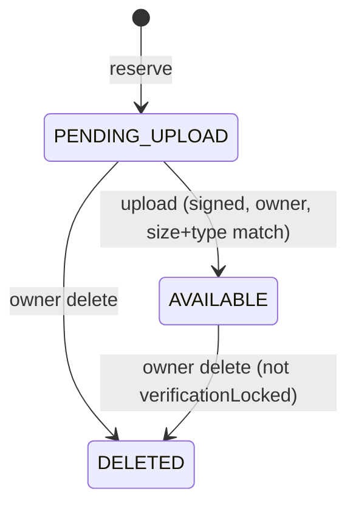

# Media

> Owner-scoped file uploads via reserve-then-upload with HMAC-signed URLs, local or S3-compatible storage behind a `StorageProvider` seam, and the asset checks products and seller verification rely on.

## Purpose and features

- **Any signed-in user** reserves an upload (file name, MIME type, byte size), gets a short-lived signed upload URL, sends the file as multipart, then can request a signed download URL or soft-delete the asset.
- **Anyone holding a valid signed URL** can download the content. No bearer token is needed.
- **Products** attach `AVAILABLE` assets as product images and embed long-lived signed URLs in catalog responses (`createProductDownloadUrl`).
- **Sellers** lock their uploaded assets as verification documents (`lockVerificationDocuments`). A locked asset cannot be deleted, re-uploaded or attached to a product. See [sellers.md](sellers.md).
- Storage selects `LocalStorageProvider` or `S3StorageProvider` using `MEDIA_STORAGE_DRIVER`. The seam is the `STORAGE_PROVIDER` token ([storage-provider.ts:1](../../../services/commerce-api/src/infrastructure/storage/storage-provider.ts#L1)); see [../integrations.md](../integrations.md).

## Routes

Conventions (prefix, guards, envelope): see [../architecture.md](../architecture.md) and [../auth-and-access.md](../auth-and-access.md). `:id` goes through `ParseUUIDPipe`.

| Method | Path                                           | Access                                       | Idempotency                                      | Description                                                                                                                                                                          |
| ------ | ---------------------------------------------- | -------------------------------------------- | ------------------------------------------------ | ------------------------------------------------------------------------------------------------------------------------------------------------------------------------------------ |
| POST   | /api/v1/media/uploads                          | Authenticated                                | None (every call creates a `PENDING_UPLOAD` row) | Reserve an asset; returns `{ asset, upload: { url, expiresAt } }` ([media.controller.ts:44](../../../services/commerce-api/src/modules/media/media.controller.ts#L44))               |
| PUT    | /api/v1/media/:id/content?expires=&signature=  | Authenticated owner + valid upload signature | One-shot: second upload is 409                   | Multipart field `file`; flips the asset to `AVAILABLE`, 204 ([media.controller.ts:55](../../../services/commerce-api/src/modules/media/media.controller.ts#L55))                     |
| GET    | /api/v1/media/:id/url                          | Authenticated owner                          | n/a                                              | Signed download URL (`MEDIA_URL_TTL_SECONDS`) ([media.controller.ts:69](../../../services/commerce-api/src/modules/media/media.controller.ts#L69))                                   |
| GET    | /api/v1/media/:id/download?expires=&signature= | Public + valid download signature            | n/a                                              | Streams the bytes with the stored MIME type; bypasses the envelope via `@Res()` ([media.controller.ts:77](../../../services/commerce-api/src/modules/media/media.controller.ts#L77)) |
| DELETE | /api/v1/media/:id                              | Authenticated owner                          | Second call returns 404                          | Soft delete + remove the file, 204 ([media.controller.ts:89](../../../services/commerce-api/src/modules/media/media.controller.ts#L89))                                              |

Responses serialise `byteSize` (a `BigInt` column) as a number ([media.service.ts:263](../../../services/commerce-api/src/modules/media/media.service.ts#L263)).

## Services

| Service                                                                                                                                   | Responsibility                                                                                                                                                                                                      | Key public methods                                                                                                                                                                                                                                                                                                                                                                                                                                                                                                                                                                                                                                                                                                                                                                                                                                                                                                                                   |
| ----------------------------------------------------------------------------------------------------------------------------------------- | ------------------------------------------------------------------------------------------------------------------------------------------------------------------------------------------------------------------- | ---------------------------------------------------------------------------------------------------------------------------------------------------------------------------------------------------------------------------------------------------------------------------------------------------------------------------------------------------------------------------------------------------------------------------------------------------------------------------------------------------------------------------------------------------------------------------------------------------------------------------------------------------------------------------------------------------------------------------------------------------------------------------------------------------------------------------------------------------------------------------------------------------------------------------------------------------- |
| `MediaService` ([media.service.ts](../../../services/commerce-api/src/modules/media/media.service.ts))                                    | Reservations, upload/download, signing, and eligibility checks for other modules.                                                                                                                                   | `reserve` ([:88](../../../services/commerce-api/src/modules/media/media.service.ts#L88)), `upload` ([:114](../../../services/commerce-api/src/modules/media/media.service.ts#L114)), `createDownloadUrl` ([:155](../../../services/commerce-api/src/modules/media/media.service.ts#L155)), `download` ([:165](../../../services/commerce-api/src/modules/media/media.service.ts#L165)), `delete` ([:177](../../../services/commerce-api/src/modules/media/media.service.ts#L177)), `requireProductAsset` ([:38](../../../services/commerce-api/src/modules/media/media.service.ts#L38)), `lockForProductAttachment(id, tx)` ([:50](../../../services/commerce-api/src/modules/media/media.service.ts#L50)), `lockVerificationDocuments(userId, ids, tx)` ([:64](../../../services/commerce-api/src/modules/media/media.service.ts#L64)), `createProductDownloadUrl` ([:213](../../../services/commerce-api/src/modules/media/media.service.ts#L213)) |
| `LocalStorageProvider` ([local-storage.provider.ts](../../../services/commerce-api/src/infrastructure/storage/local-storage.provider.ts)) | `put`/`get`/`delete` under `MEDIA_STORAGE_PATH`. Bound to `STORAGE_PROVIDER` by the global `StorageModule` ([storage.module.ts:6](../../../services/commerce-api/src/infrastructure/storage/storage.module.ts#L6)). | `put(key, body, mimeType)`, `get(key)`, `delete(key)`                                                                                                                                                                                                                                                                                                                                                                                                                                                                                                                                                                                                                                                                                                                                                                                                                                                                                                |

## Business rules

`verificationLocked` is a separate flag, not a status. Once set it is never cleared, and it blocks delete, upload and product attachment.

**Reservation**

- DTO: `fileName` string <=255, `mimeType` one of `image/jpeg`, `image/png`, `image/webp`, `application/pdf`, `byteSize` int >=1 ([reserve-upload.dto.ts:4](../../../services/commerce-api/src/modules/media/dto/reserve-upload.dto.ts#L4)).
- `byteSize` above `MEDIA_MAX_FILE_SIZE_BYTES` is rejected with 400 ([media.service.ts:96](../../../services/commerce-api/src/modules/media/media.service.ts#L96)).
- The storage key is `<ownerUserId>/<random UUID>`, never derived from the file name ([media.service.ts:102](../../../services/commerce-api/src/modules/media/media.service.ts#L102)).

**Signed URLs**

- Signature: HMAC-SHA256 with `MEDIA_SIGNING_SECRET` over `"<action>:<id>:<expires>"`, hex encoded; `action` is `upload` or `download`, so an upload URL cannot be used to download ([media.service.ts:254](../../../services/commerce-api/src/modules/media/media.service.ts#L254)).
- `expires` is Unix seconds. A non-numeric or past value gives 403 "expired"; a mismatch gives 403 "invalid", compared with `timingSafeEqual` ([media.service.ts:237](../../../services/commerce-api/src/modules/media/media.service.ts#L237)).
- TTLs: upload and owner download use `MEDIA_URL_TTL_SECONDS` ([media.service.ts:227](../../../services/commerce-api/src/modules/media/media.service.ts#L227)); product image URLs use `MEDIA_PUBLIC_URL_TTL_SECONDS` because they sit inside client-cached catalog responses ([media.service.ts:213](../../../services/commerce-api/src/modules/media/media.service.ts#L213)).
- URLs are relative paths (`/api/v1/media/<id>/content|download?...`) ([media.service.ts:232](../../../services/commerce-api/src/modules/media/media.service.ts#L232)).

**Upload**

- Order of checks: owner (404 if missing/deleted, **403** if someone else's) ([media.service.ts:190](../../../services/commerce-api/src/modules/media/media.service.ts#L190)), signature, then status must be `PENDING_UPLOAD` and not locked (409) ([media.service.ts:123](../../../services/commerce-api/src/modules/media/media.service.ts#L123)).
- The uploaded part's `mimetype` and `size` must equal the reservation exactly, else 400. `contentMatchesMediaType(file.buffer, asset.mimeType)` also checks the content signature against the reserved type; this is not malware scanning ([media.service.ts](../../../services/commerce-api/src/modules/media/media.service.ts)).
- The status flip is a conditional `updateMany` and the file write happens inside the same transaction, so a failed write rolls the status back ([media.service.ts:140](../../../services/commerce-api/src/modules/media/media.service.ts#L140)).

**Download**

- Signature is checked before the DB lookup; the asset must be `AVAILABLE` (404 otherwise) ([media.service.ts:170](../../../services/commerce-api/src/modules/media/media.service.ts#L170)). No ownership check: the URL is the capability.
- Owner download URL requires `AVAILABLE` ([media.service.ts:160](../../../services/commerce-api/src/modules/media/media.service.ts#L160)). Admins reading a seller's verification document go through `SellersService`, which calls `createDownloadUrl` on behalf of the seller's owner.

**Delete**

- Soft delete (`status=DELETED`, `deletedAt`) via `updateMany where verificationLocked=false`; a locked asset gives 409 "retained for review" ([media.service.ts:179](../../../services/commerce-api/src/modules/media/media.service.ts#L179)). The file is then removed from storage.

**Checks used by other modules**

- `requireProductAsset`: exists, `AVAILABLE`, not locked, else 400 ([media.service.ts:38](../../../services/commerce-api/src/modules/media/media.service.ts#L38)). It does not check the owner; the seller path in products adds its own owner check.
- `lockForProductAttachment(id, tx)`: touches `updatedAt` with `where status=AVAILABLE, verificationLocked=false` inside the caller's transaction, so a concurrent verification lock or delete serialises against it ([media.service.ts:50](../../../services/commerce-api/src/modules/media/media.service.ts#L50)).
- `lockVerificationDocuments(userId, ids, tx)`: every id must be owned by `userId`, `AVAILABLE`, `deletedAt IS NULL`; sets `verificationLocked=true`; count mismatch -> 400 ([media.service.ts:73](../../../services/commerce-api/src/modules/media/media.service.ts#L73)).

**Local storage**

- `safePath` resolves the key under the root and throws if it escapes it (path traversal guard) ([local-storage.provider.ts:44](../../../services/commerce-api/src/infrastructure/storage/local-storage.provider.ts#L44)).
- The MIME type is stored in a sidecar `<key>.mime` file and served back from there ([local-storage.provider.ts:20](../../../services/commerce-api/src/infrastructure/storage/local-storage.provider.ts#L20)). A read failure maps to 404.

## Data

| Model                                                   | Access                                                                                                                                                                           |
| ------------------------------------------------------- | -------------------------------------------------------------------------------------------------------------------------------------------------------------------------------- |
| `MediaAsset`                                            | Create, conditional status updates, `verificationLocked`, soft delete ([schema.prisma:404](../../../services/commerce-api/prisma/schema.prisma#L404)). Cascades on owner delete. |
| `ProductMedia`, `SellerDocument`, `ProcurementDocument` | Not touched here; they reference `MediaAsset` (`ProductMedia` cascades, `ProcurementDocument` restricts).                                                                        |
| Filesystem                                              | `<MEDIA_STORAGE_PATH>/<ownerUserId>/<uuid>` plus `.mime` sidecar.                                                                                                                |

## Dependencies

- Imports: `PrismaService`, `ConfigService`, `STORAGE_PROVIDER` (global `StorageModule`).
- `MediaService` is exported ([media.module.ts:9](../../../services/commerce-api/src/modules/media/media.module.ts#L9)) and consumed by `ProductsModule`, `OffersModule` (`MarketplaceOffersService` image URLs) and `SellersModule`.

## Jobs and events

None. No audit rows, outbox topics or cleanup jobs.

## Configuration

`MEDIA_STORAGE_PATH`, `MEDIA_SIGNING_SECRET`, `MEDIA_MAX_FILE_SIZE_BYTES`, `MEDIA_URL_TTL_SECONDS`, `MEDIA_PUBLIC_URL_TTL_SECONDS`. See [../configuration.md](../configuration.md#media-storage).

## Tests

- `media.service.spec.ts` and `media-signature.spec.ts` cover service checks and content signatures. Storage selection and S3 operations have mocked unit specs; no dedicated `LocalStorageProvider` spec exists.
- [test/app.e2e-spec.ts](../../../services/commerce-api/test/app.e2e-spec.ts): OpenAPI shape only (multipart `file` on upload; download has empty security and a binary response).
- Consumers mock `MediaService` in [products.service.spec.ts](../../../services/commerce-api/src/modules/products/products.service.spec.ts), [marketplace-offers.service.spec.ts](../../../services/commerce-api/src/modules/offers/marketplace-offers.service.spec.ts) and [sellers.service.spec.ts](../../../services/commerce-api/src/modules/sellers/sellers.service.spec.ts).
- Real object-store behavior, upload transport limits and crash cleanup require separate verification; see the [baseline](../baseline-verification.md).

## Known gaps

- `FileInterceptor('file')` has no `limits`, so multer buffers any size of upload in memory before the service compares it to the reservation; `MEDIA_MAX_FILE_SIZE_BYTES` only limits the declared size ([media.controller.ts:56](../../../services/commerce-api/src/modules/media/media.controller.ts#L56)).
- Byte signatures are checked against the reserved MIME type by `contentMatchesMediaType`; this does not provide malware scanning or an early multipart size limit.
- Someone else's asset returns 403 instead of the usual 404, revealing that the id exists ([media.service.ts:197](../../../services/commerce-api/src/modules/media/media.service.ts#L197)).
- Deleting an asset does not check `ProductMedia`; the product keeps the link and public reads silently drop the image ([media.service.ts:177](../../../services/commerce-api/src/modules/media/media.service.ts#L177)).
- `requireProductAsset` has no owner check, so the admin attach path can attach any user's unlocked asset ([media.service.ts:38](../../../services/commerce-api/src/modules/media/media.service.ts#L38)).
- `PENDING_UPLOAD` reservations and soft-deleted rows are never cleaned up.
- The file write runs inside the DB transaction; if the commit then fails, the file is orphaned on disk ([media.service.ts:151](../../../services/commerce-api/src/modules/media/media.service.ts#L151)).
- Signed download URLs cannot be revoked before expiry; product image URLs stay valid for 24 h by default after the product is unpublished.
- The local adapter needs shared storage across replicas; the S3 adapter exists, but real bucket and multi-replica operation still need verification.
