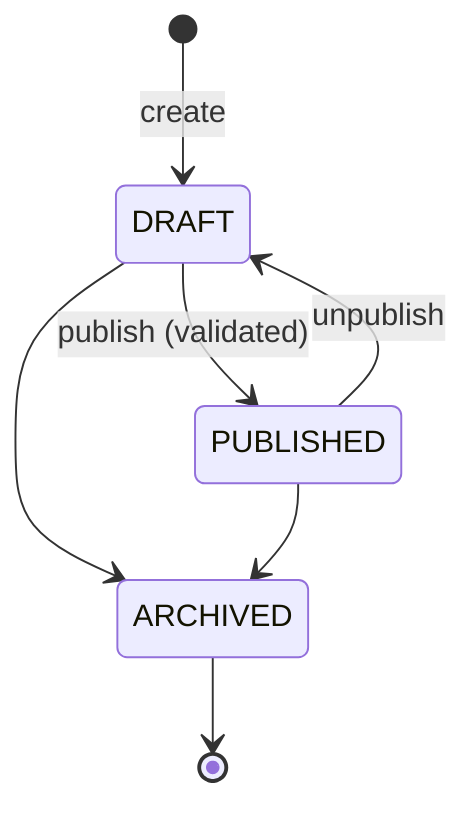

# Offers

> Sellable listings against a product variant: first-party offers managed by staff, marketplace offers managed by approved sellers, their price history, public offer comparison, and the `OfferReadService` read contract used by cart, wishlist, orders and inventory.

## Purpose and features

- **Staff and admins** create first-party offers (`sellerId = null`) for any variant, set their status, add price rows, set a flat informational shipping cost, and delete them. They cannot change seller offers.
- **Approved sellers** (role `SELLER`, verified email) create offers on published variants with their own SKU, title, condition, stock source and fulfillment mode; edit them while `DRAFT`; publish/unpublish/archive them; and replace the current price. Every write is audited.
- **Anyone** compares the offers on a published variant, lists an approved storefront's offers, or reads one offer by id, each with its current ZMW price and one product image.
- **Other modules** read offers through `OfferReadService` (a fixed projection with prices and seller status) instead of querying `Offer`/`Price` themselves.

An offer's `stockSource` decides where availability comes from: `PLATFORM` uses the variant's shared inventory record, `SELLER` its own per-offer record (see [inventory.md](inventory.md)).

## Routes

Conventions (prefix, guards, envelope): see [../architecture.md](../architecture.md) and [../auth-and-access.md](../auth-and-access.md). `:id` uses `ParseUUIDPipe` on every route.

| Method | Path                                      | Access                                          | Idempotency                                  | Description                                                                                                                                                                           |
| ------ | ----------------------------------------- | ----------------------------------------------- | -------------------------------------------- | ------------------------------------------------------------------------------------------------------------------------------------------------------------------------------------- |
| GET    | /api/v1/admin/catalog/offers/:id          | Roles(STAFF, ADMIN)                             | n/a                                          | Any offer with prices, newest `startsAt` first ([admin-offers.controller.ts:27](../../../services/commerce-api/src/modules/offers/admin-offers.controller.ts#L27))                    |
| POST   | /api/v1/admin/catalog/offers              | Roles(STAFF, ADMIN)                             | None (each call creates an offer)            | Create a first-party `DRAFT` offer for `variantId` ([admin-offers.controller.ts:32](../../../services/commerce-api/src/modules/offers/admin-offers.controller.ts#L32))                |
| PATCH  | /api/v1/admin/catalog/offers/:id/status   | Roles(STAFF, ADMIN)                             | Naturally idempotent                         | Set status (first-party only) ([admin-offers.controller.ts:37](../../../services/commerce-api/src/modules/offers/admin-offers.controller.ts#L37))                                     |
| DELETE | /api/v1/admin/catalog/offers/:id          | Roles(STAFF, ADMIN)                             | Second call returns 404                      | Hard delete (first-party only), 204 ([admin-offers.controller.ts:45](../../../services/commerce-api/src/modules/offers/admin-offers.controller.ts#L45))                               |
| POST   | /api/v1/admin/catalog/offers/:id/prices   | Roles(STAFF, ADMIN)                             | None (each call adds a row)                  | Add a price row (first-party only) ([admin-offers.controller.ts:51](../../../services/commerce-api/src/modules/offers/admin-offers.controller.ts#L51))                                |
| PATCH  | /api/v1/admin/catalog/offers/:id/shipping | Roles(STAFF, ADMIN)                             | Naturally idempotent                         | Set or clear (`amount: null`) the flat shipping cost ([admin-offers.controller.ts:59](../../../services/commerce-api/src/modules/offers/admin-offers.controller.ts#L59))              |
| GET    | /api/v1/sellers/me/offers                 | Roles(SELLER) + verified email                  | n/a                                          | Own offers, paginated, newest first ([seller-offers.controller.ts:34](../../../services/commerce-api/src/modules/offers/seller-offers.controller.ts#L34))                             |
| GET    | /api/v1/sellers/me/offers/:id             | Roles(SELLER) + verified email                  | n/a                                          | One own offer; others' -> 404 ([seller-offers.controller.ts:41](../../../services/commerce-api/src/modules/offers/seller-offers.controller.ts#L41))                                   |
| POST   | /api/v1/sellers/me/offers                 | Roles(SELLER) + verified email + `lockApproved` | None (unique `(sellerId, sellerSku)` -> 409) | Create a `DRAFT` offer ([seller-offers.controller.ts:48](../../../services/commerce-api/src/modules/offers/seller-offers.controller.ts#L48))                                          |
| PATCH  | /api/v1/sellers/me/offers/:id             | Roles(SELLER) + verified email + `lockApproved` | Body `version`                               | Replace listing details (DRAFT only) ([seller-offers.controller.ts:55](../../../services/commerce-api/src/modules/offers/seller-offers.controller.ts#L55))                            |
| PATCH  | /api/v1/sellers/me/offers/:id/status      | Roles(SELLER) + verified email + `lockApproved` | Body `version`                               | Change status ([seller-offers.controller.ts:63](../../../services/commerce-api/src/modules/offers/seller-offers.controller.ts#L63))                                                   |
| POST   | /api/v1/sellers/me/offers/:id/prices      | Roles(SELLER) + verified email + `lockApproved` | Body `version`                               | Replace the current price ([seller-offers.controller.ts:71](../../../services/commerce-api/src/modules/offers/seller-offers.controller.ts#L71))                                       |
| GET    | /api/v1/catalog/variants/:id/offers       | Public                                          | n/a                                          | Paginated offer comparison for a published variant, `?currency` ([public-offers.controller.ts:14](../../../services/commerce-api/src/modules/offers/public-offers.controller.ts#L14)) |
| GET    | /api/v1/catalog/offers/:id                | Public                                          | n/a                                          | One publicly visible offer ([public-offers.controller.ts:21](../../../services/commerce-api/src/modules/offers/public-offers.controller.ts#L21))                                      |
| GET    | /api/v1/storefronts/:slug/offers          | Public                                          | n/a                                          | Paginated offers of an approved storefront ([public-offers.controller.ts:28](../../../services/commerce-api/src/modules/offers/public-offers.controller.ts#L28))                      |

Seller and public list routes return `{ items, total, page, limit }` (`OfferPage`), not the shared `paginatedResult` shape ([marketplace-offers.service.ts:65](../../../services/commerce-api/src/modules/offers/marketplace-offers.service.ts#L65)). Public routes return `ComparableOffer` ([marketplace-offers.service.ts:31](../../../services/commerce-api/src/modules/offers/marketplace-offers.service.ts#L31)).

## Services

| Service                                                                                                                                       | Responsibility                                                                                                                                                                                                                                                               | Key public methods                                                                                                                                                                                                                                                                                                                                                                                                                                                                                                                                                                                                                                                                                                                                                          |
| --------------------------------------------------------------------------------------------------------------------------------------------- | ---------------------------------------------------------------------------------------------------------------------------------------------------------------------------------------------------------------------------------------------------------------------------- | --------------------------------------------------------------------------------------------------------------------------------------------------------------------------------------------------------------------------------------------------------------------------------------------------------------------------------------------------------------------------------------------------------------------------------------------------------------------------------------------------------------------------------------------------------------------------------------------------------------------------------------------------------------------------------------------------------------------------------------------------------------------------- |
| `OffersService` ([offers.service.ts](../../../services/commerce-api/src/modules/offers/offers.service.ts))                                    | Admin first-party offers. Every mutation calls `requireFirstParty` ([:105](../../../services/commerce-api/src/modules/offers/offers.service.ts#L105)).                                                                                                                       | `create`, `updateStatus`, `remove`, `addPrice`, `updateShipping`, `findByIdAdmin`                                                                                                                                                                                                                                                                                                                                                                                                                                                                                                                                                                                                                                                                                           |
| `MarketplaceOffersService` ([marketplace-offers.service.ts](../../../services/commerce-api/src/modules/offers/marketplace-offers.service.ts)) | Seller offer lifecycle and public read views. Not exported.                                                                                                                                                                                                                  | `create` ([:107](../../../services/commerce-api/src/modules/offers/marketplace-offers.service.ts#L107)), `update` ([:147](../../../services/commerce-api/src/modules/offers/marketplace-offers.service.ts#L147)), `status` ([:169](../../../services/commerce-api/src/modules/offers/marketplace-offers.service.ts#L169)), `price` ([:190](../../../services/commerce-api/src/modules/offers/marketplace-offers.service.ts#L190)), `compare` ([:226](../../../services/commerce-api/src/modules/offers/marketplace-offers.service.ts#L226)), `storefrontOffers` ([:235](../../../services/commerce-api/src/modules/offers/marketplace-offers.service.ts#L235)), `findPublic` ([:253](../../../services/commerce-api/src/modules/offers/marketplace-offers.service.ts#L253)) |
| `OfferReadService` ([offer-read.service.ts](../../../services/commerce-api/src/modules/offers/offer-read.service.ts))                         | Read contract: id, variant, seller id + status, status, stock source, fulfillment mode, SKU, title, all prices ([:8](../../../services/commerce-api/src/modules/offers/offer-read.service.ts#L8)). Returns unavailable offers too, so carts can explain them. Optional `tx`. | `find`, `findMany` (dedupes, empty -> no query) ([:31](../../../services/commerce-api/src/modules/offers/offer-read.service.ts#L31)), `findSellerOffers` (`stockSource=SELLER` only) ([:42](../../../services/commerce-api/src/modules/offers/offer-read.service.ts#L42))                                                                                                                                                                                                                                                                                                                                                                                                                                                                                                   |

## Business rules

Seller offer status (`ProductStatus`), as enforced in `status()`:

Admin first-party status has no transition rules and no publish validation ([offers.service.ts:48](../../../services/commerce-api/src/modules/offers/offers.service.ts#L48)).

**Seller writes** (all in one transaction via `write`, P2002 -> 409 "Seller SKU is already in use" ([marketplace-offers.service.ts:442](../../../services/commerce-api/src/modules/offers/marketplace-offers.service.ts#L442)))

- Each write starts with `SellersService.lockApproved(userId, tx)`, so a concurrent suspension serialises against it ([marketplace-offers.service.ts:112](../../../services/commerce-api/src/modules/offers/marketplace-offers.service.ts#L112)).
- Ownership: `findFirst where { id, sellerId }`, else 404 ([marketplace-offers.service.ts:415](../../../services/commerce-api/src/modules/offers/marketplace-offers.service.ts#L415)).
- Optimistic concurrency: `updateMany where { id, sellerId, version }` with `version + 1`; mismatch -> 409 ([marketplace-offers.service.ts:428](../../../services/commerce-api/src/modules/offers/marketplace-offers.service.ts#L428)). The price route bumps the version before touching prices, so a stale version retires nothing.
- DTO: `sellerSku` 1-100 non-blank (trimmed before save), `listingTitle` 2-200 non-blank, `condition` (`NEW`/`USED`/`REFURBISHED`), `stockSource` and `fulfillmentMode` (`PLATFORM`/`SELLER`) ([seller-offer.dto.ts:21](../../../services/commerce-api/src/modules/offers/dto/seller-offer.dto.ts#L21)). Update replaces all five fields.
- Create requires a published variant on a published product ([marketplace-offers.service.ts:113](../../../services/commerce-api/src/modules/offers/marketplace-offers.service.ts#L113)).
- Edit only while `DRAFT` (409 "Unpublish the offer before editing") ([marketplace-offers.service.ts:155](../../../services/commerce-api/src/modules/offers/marketplace-offers.service.ts#L155)).
- `ARCHIVED` is terminal for status and price changes ([marketplace-offers.service.ts:177](../../../services/commerce-api/src/modules/offers/marketplace-offers.service.ts#L177)).
- Publish requires a complete storefront (`storefrontSlug` + `displayName`), SKU and title, a published variant, and a current ZMW price > 0 ([marketplace-offers.service.ts:394](../../../services/commerce-api/src/modules/offers/marketplace-offers.service.ts#L394)).
- Price: `amount` 1..2^31-1, `currency` `[A-Z]{3}` and in `SUPPORTED_CURRENCIES` (ZMW) ([seller-offer.dto.ts:64](../../../services/commerce-api/src/modules/offers/dto/seller-offer.dto.ts#L64)). Any existing price row in another currency -> 400. All open price rows get `endsAt = now` and a new row starts at `now`, so the history is kept ([marketplace-offers.service.ts:205](../../../services/commerce-api/src/modules/offers/marketplace-offers.service.ts#L205)). Allowed while `PUBLISHED`.
- Reads (`listOwn`, `findOwn`) use `SellersService.mine`, so a suspended seller can still see their offers ([marketplace-offers.service.ts:127](../../../services/commerce-api/src/modules/offers/marketplace-offers.service.ts#L127)).

**Admin writes**

- Create checks `variantExists` (400 if not) and always sets `sellerId: null` ([offers.service.ts:37](../../../services/commerce-api/src/modules/offers/offers.service.ts#L37)). It does not require the variant to be published.
- Any mutation of a seller offer -> 400 "Seller offers must use the seller workflow" ([offers.service.ts:105](../../../services/commerce-api/src/modules/offers/offers.service.ts#L105)).
- Price: `amount` int >=0, `currency` ZMW (uppercased), optional `startsAt`/`endsAt`; `endsAt <= startsAt` -> 400 only when both are given ([offers.service.ts:71](../../../services/commerce-api/src/modules/offers/offers.service.ts#L71)). Rows may overlap; the newest `startsAt` in force wins ([current-price.ts:34](../../../services/commerce-api/src/common/catalog/current-price.ts#L34)).
- Shipping: `amount: null` clears both fields; otherwise int >=0 plus a supported `currency` ([update-offer-shipping.dto.ts:12](../../../services/commerce-api/src/modules/offers/dto/update-offer-shipping.dto.ts#L12)). It is display-only; checkout quotes come from shipping.

**Public visibility** (same rule as the product catalog)

- Offer, variant and product all `PUBLISHED`, and the offer is first-party or its seller is `APPROVED` with `storefrontSlug`, `displayName` and an active owner ([marketplace-offers.service.ts:325](../../../services/commerce-api/src/modules/offers/marketplace-offers.service.ts#L325)).
- Comparison and storefront lists also require a price in the requested currency in force now, and return only that price; order is `createdAt asc, id asc`, not price ([marketplace-offers.service.ts:320](../../../services/commerce-api/src/modules/offers/marketplace-offers.service.ts#L320), [:361](../../../services/commerce-api/src/modules/offers/marketplace-offers.service.ts#L361)).
- `compare` first 404s unless the variant and product are published ([marketplace-offers.service.ts:231](../../../services/commerce-api/src/modules/offers/marketplace-offers.service.ts#L231)); `storefrontOffers` 404s unless the storefront is public ([marketplace-offers.service.ts:240](../../../services/commerce-api/src/modules/offers/marketplace-offers.service.ts#L240)).
- `findPublic` does not filter on currency; `currentPrice` is null when there is none ([marketplace-offers.service.ts:253](../../../services/commerce-api/src/modules/offers/marketplace-offers.service.ts#L253)).
- The product image is the primary `AVAILABLE` image, else the first by position ([marketplace-offers.service.ts:59](../../../services/commerce-api/src/modules/offers/marketplace-offers.service.ts#L59)).

## Data

| Model                                                 | Access                                                                                                                                                                                                                                                                                        |
| ----------------------------------------------------- | --------------------------------------------------------------------------------------------------------------------------------------------------------------------------------------------------------------------------------------------------------------------------------------------- |
| `Offer`                                               | Read/write. Unique `(sellerId, sellerSku)`; `seller` is `onDelete: Restrict` ([schema.prisma:561](../../../services/commerce-api/prisma/schema.prisma#L561))                                                                                                                                  |
| `Price`                                               | Create; seller path also closes rows (`endsAt`) ([schema.prisma:596](../../../services/commerce-api/prisma/schema.prisma#L596))                                                                                                                                                               |
| `AuditEvent`                                          | Written directly with `tx.auditEvent.create`: `offer.created`, `offer.updated`, `offer.status_changed` (`{from,to}`), `offer.price_changed` (`{amount,currency}`) ([marketplace-offers.service.ts:457](../../../services/commerce-api/src/modules/offers/marketplace-offers.service.ts#L457)) |
| `ProductVariant`, `Product`, `ProductMedia`, `Seller` | Read                                                                                                                                                                                                                                                                                          |

## Dependencies

- Imports `ProductReferencesModule` (`variantExists`, `requirePublishedVariant`), `SellersModule` (`lockApproved`, `mine`, `StorefrontsService.findPublic`, `PUBLIC_STOREFRONT_SELECT`), `MediaModule` (image URLs) ([offers.module.ts:14](../../../services/commerce-api/src/modules/offers/offers.module.ts#L14)).
- Exports `OfferReadService` and `OffersService` ([offers.module.ts:21](../../../services/commerce-api/src/modules/offers/offers.module.ts#L21)). `OfferReadService` is used by `CartService`, `WishlistService`, `OrdersService` and `SellerInventoryService`.

## Jobs and events

None. Audit rows only (seller path); no outbox topics.

## Configuration

None.

## Tests

- [marketplace-offers.service.spec.ts](../../../services/commerce-api/src/modules/offers/marketplace-offers.service.spec.ts): suspended seller rejected before any change, lookup scoped to the seller, stale version retires no prices, currency change rejected, storefront required to publish.
- [offers.service.spec.ts](../../../services/commerce-api/src/modules/offers/offers.service.spec.ts): admin create always first-party, unknown variant, `endsAt` after `startsAt`, currency uppercased, not-found.
- [offer-read.service.spec.ts](../../../services/commerce-api/src/modules/offers/offer-read.service.spec.ts): id dedupe, no query for empty ids, seller reads scoped to `SELLER` stock.
- [test/catalog.e2e-spec.ts](../../../services/commerce-api/test/catalog.e2e-spec.ts): admin offer + price + publish over HTTP.
- Untested: public comparison/storefront views, publish price rule, archived terminal state.

## Known gaps

- A seller can create an offer with `stockSource: PLATFORM`; orders then reserve from the platform's shared variant stock for that seller's offer ([seller-offer.dto.ts:37](../../../services/commerce-api/src/modules/offers/dto/seller-offer.dto.ts#L37), [orders.service.ts:527](../../../services/commerce-api/src/modules/orders/orders.service.ts#L527)). Nothing restricts the combination of `stockSource` and `fulfillmentMode` either.
- Admin `updateStatus` publishes a first-party offer without any checks (no price, unpublished variant allowed) ([offers.service.ts:48](../../../services/commerce-api/src/modules/offers/offers.service.ts#L48)); admin offer changes are not audited.
- Admin `remove` hard-deletes, which cascades to `Price`, `CartItem`, `WishlistItem` and `OrderItem` rows ([schema.prisma:964](../../../services/commerce-api/prisma/schema.prisma#L964)); a restricting FK (review) surfaces as 500 ([offers.service.ts:62](../../../services/commerce-api/src/modules/offers/offers.service.ts#L62)).
- Admin prices accept `amount: 0` and an `endsAt` in the past when `startsAt` is omitted ([offers.service.ts:71](../../../services/commerce-api/src/modules/offers/offers.service.ts#L71)).
- There is no admin route to list offers, or to archive/unpublish a seller offer; the only lever is suspending the seller.
- Audit rows bypass `AuditService.record` and its redaction ([marketplace-offers.service.ts:464](../../../services/commerce-api/src/modules/offers/marketplace-offers.service.ts#L464)).
- `checkoutSupported` is always `true` ([marketplace-offers.service.ts:307](../../../services/commerce-api/src/modules/offers/marketplace-offers.service.ts#L307)); comparison results carry no stock information and are not sorted by price.
- `OfferPage` uses `{ items, total, page, limit }` instead of the shared pagination shape.
