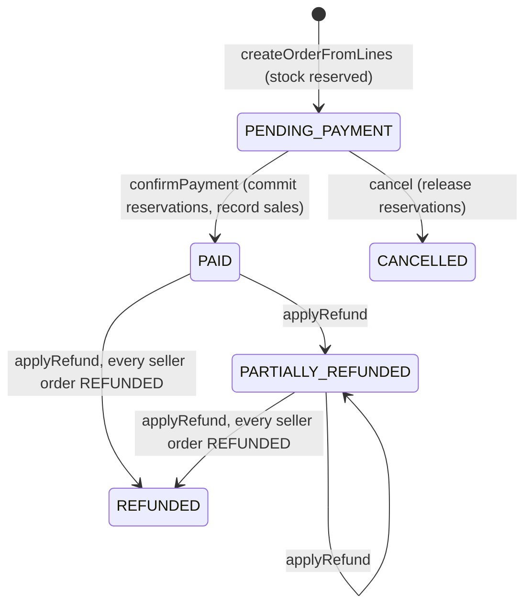

# Orders

> Order creation from cart lines or a single offer (split into seller orders and shipping groups, with stock reserved in the same transaction), checkout cost quotes, the order payment/refund state machine, and customer, staff and seller read views.

## Purpose and features

- **Checkout** (see [checkout.md](checkout.md)) asks `OrdersService` to build an order from the cart, from a partial cart selection, or from one offer ("buy now"), and to quote the same breakdown without creating anything.
- **Payments** drive the state machine: `confirmPayment` (reservations committed, sale booked, fulfillment job enqueued), `cancel` (reservations released) and `applyRefund` per seller order. See [payments.md](payments.md).
- **Customers** list and read their own orders, with their payment status and a derived fulfillment summary.
- **Staff/admins** list all orders (paginated) and read any order.
- **Approved sellers** list and read their own seller orders with fulfillment, shipment and return summaries; the delivery address stays coarse until they accept their own SELLER-mode fulfillment order.

## Routes

Conventions (prefix, guards, envelope, pagination): see [../architecture.md](../architecture.md), [../auth-and-access.md](../auth-and-access.md). All routes are reads; the write paths are reached only through checkout, payments and returns.

| Method | Path                          | Access                                             | Idempotency | Description                                                                                                                                                                                                             |
| ------ | ----------------------------- | -------------------------------------------------- | ----------- | ----------------------------------------------------------------------------------------------------------------------------------------------------------------------------------------------------------------------- |
| GET    | /api/v1/orders                | Authenticated                                      | n/a         | Own orders, newest first, unpaginated ([orders.controller.ts:11](../../../services/commerce-api/src/modules/orders/orders.controller.ts#L11))                                                                           |
| GET    | /api/v1/orders/:id            | Authenticated (owner, else 404)                    | n/a         | Own order with payment + fulfillment summary ([orders.controller.ts:16](../../../services/commerce-api/src/modules/orders/orders.controller.ts#L16))                                                                    |
| GET    | /api/v1/admin/orders          | Roles(STAFF, ADMIN)                                | n/a         | All orders, `page`/`limit`, `status` ([admin-orders.controller.ts:13](../../../services/commerce-api/src/modules/orders/admin-orders.controller.ts#L13))                                                                |
| GET    | /api/v1/admin/orders/:id      | Roles(STAFF, ADMIN)                                | n/a         | Any order, no fulfillment summary ([admin-orders.controller.ts:21](../../../services/commerce-api/src/modules/orders/admin-orders.controller.ts#L21))                                                                   |
| GET    | /api/v1/sellers/me/orders     | Authenticated + verified email + `requireApproved` | n/a         | Own seller orders; filters `status`, `fulfillmentStatus`, `fulfillmentMode`, `dateFrom`, `dateTo` ([seller-orders.controller.ts:19](../../../services/commerce-api/src/modules/orders/seller-orders.controller.ts#L19)) |
| GET    | /api/v1/sellers/me/orders/:id | Authenticated + verified email + `requireApproved` | n/a         | Seller order detail ([seller-orders.controller.ts:27](../../../services/commerce-api/src/modules/orders/seller-orders.controller.ts#L27))                                                                               |

Quote routes (`POST /api/v1/checkout/quote`, `/checkout/buy-now/quote`) live in the checkout controller.

## Services

| Service                                                                                                                          | Responsibility                                                                                                                                                                                                                                                                                                                                          |
| -------------------------------------------------------------------------------------------------------------------------------- | ------------------------------------------------------------------------------------------------------------------------------------------------------------------------------------------------------------------------------------------------------------------------------------------------------------------------------------------------------- |
| `OrdersService` ([orders.service.ts](../../../services/commerce-api/src/modules/orders/orders.service.ts))                       | Create (`createFromCart`, `createFromOffer`), quote (`quoteFromCart`, `quoteFromOffer`), idempotency helpers (`findByIdempotencyKey`, `releaseIdempotencyKey`), state machine (`lockForPayment`, `confirmPayment`, `cancel`, `applyRefund`, `getSellerOrderForPayment`), reads (`listOwn`, `findOwn`, `findAny`, `listAll`). Only export of the module. |
| `SellerOrdersService` ([seller-orders.service.ts](../../../services/commerce-api/src/modules/orders/seller-orders.service.ts))   | Seller-scoped list/detail projections.                                                                                                                                                                                                                                                                                                                  |
| `projectDestination` ([destination-summary.ts:28](../../../services/commerce-api/src/modules/orders/destination-summary.ts#L28)) | Full address only for a SELLER-mode group with `acceptedAt`; otherwise `{city, region, country}`.                                                                                                                                                                                                                                                       |

## Business rules

`Order` and each `SellerOrder` share `OrderStatus`. Payment and cancel move all seller orders in lockstep; refunds move one seller order and derive the parent.

**Line selection and quotes**

- Cart source: the user's cart view in the requested currency; `itemIds` restricts to those lines. Any id not in the cart -> 409; empty selection -> 409 `No items selected` / `Cart is empty`; any unavailable line -> 409 ([orders.service.ts:148](../../../services/commerce-api/src/modules/orders/orders.service.ts#L148)). Unavailable lines outside the selection are ignored.
- Offer source: `CartService.previewOfferLine(offerId, quantity, currency)`; unavailable -> 409 ([orders.service.ts:191](../../../services/commerce-api/src/modules/orders/orders.service.ts#L191)). The cart is never read.
- Quotes run exactly the same selection/validation, then `quoteLines`: address must be the user's (`AddressesService.findOne`), lines grouped by seller, each group priced by `ShippingService.quoteSellerGroups` against the destination country ([orders.service.ts:228](../../../services/commerce-api/src/modules/orders/orders.service.ts#L228), [:283](../../../services/commerce-api/src/modules/orders/orders.service.ts#L283)). Nothing is written.
- Grouping re-reads offers and 409s if an offer is missing or its `sellerId` differs from the cart line's ([orders.service.ts:858](../../../services/commerce-api/src/modules/orders/orders.service.ts#L858)). `sellerId: null` is the first-party group; groups are processed sorted by seller id ([:347](../../../services/commerce-api/src/modules/orders/orders.service.ts#L347)).
- `total = subtotal + shippingAmount`, subtotal = sum of cart `lineTotal`s.

**Order creation** ([orders.service.ts:417](../../../services/commerce-api/src/modules/orders/orders.service.ts#L417))

- One transaction: `Order` (`PENDING_PAYMENT`, address snapshot, optional `idempotencyKey`), then per seller group `LedgerService.ensureCurrency` (marketplace sellers only), a `SellerOrder`, one `ShippingGroup` per quoted group (rate, carrier, method, quote id/expiry, delivery estimate) with its `OrderItem`s nested ([:445](../../../services/commerce-api/src/modules/orders/orders.service.ts#L445)).
- Each item is reserved inside the same tx: `reserveOffer` for `stockSource=SELLER`, else `reserve(variantId)`, holder `order_item:<id>`; `reservationId` stored on the item ([:521](../../../services/commerce-api/src/modules/orders/orders.service.ts#L521)). Any failure rolls back the whole order.
- `(userId, idempotencyKey)` is unique; a P2002 with a key -> 409 "A checkout with this idempotency key is already in progress" ([:556](../../../services/commerce-api/src/modules/orders/orders.service.ts#L556)). `releaseIdempotencyKey` nulls the key on an order that never reached payment ([:410](../../../services/commerce-api/src/modules/orders/orders.service.ts#L410)).

**State transitions**

- `lockForPayment` = `SELECT ... FROM orders ... FOR UPDATE` ([orders.service.ts:566](../../../services/commerce-api/src/modules/orders/orders.service.ts#L566)); every transition takes it first.
- `confirmPayment` ([:573](../../../services/commerce-api/src/modules/orders/orders.service.ts#L573)): no-op if already PAID/PARTIALLY_REFUNDED/REFUNDED; 409 unless `PENDING_PAYMENT`. Commits reservations (sorted by item id), sets all seller orders PAID, `LedgerService.recordSale` per seller order (sorted by seller id), order PAID, enqueues `fulfillment.provision` and writes outbox `order.paid`, all in the caller's tx.
- `cancel` ([:703](../../../services/commerce-api/src/modules/orders/orders.service.ts#L703)): no-op if CANCELLED; 409 "A paid order must be refunded, not cancelled" unless `PENDING_PAYMENT`; releases reservations, cancels all seller orders.
- `applyRefund` ([:645](../../../services/commerce-api/src/modules/orders/orders.service.ts#L645)): seller order must be PAID/PARTIALLY_REFUNDED and `amount <= total - refundedAmount`; sets `REFUNDED` when fully refunded else `PARTIALLY_REFUNDED`; parent becomes `REFUNDED` only when every seller order is. Refunds never restock; restocking happens only through returns disposition ([:681](../../../services/commerce-api/src/modules/orders/orders.service.ts#L681)).

**Reads**

- Customer reads include `payment {id, status, failureReason}` ([orders.service.ts:89](../../../services/commerce-api/src/modules/orders/orders.service.ts#L89)), `fulfillmentSummary` (from `deriveCustomerFulfillmentSummary`) and `packedAt` = latest completed PACK work item, only when the summary is PACKED or (partially) DISPATCHED ([:794](../../../services/commerce-api/src/modules/orders/orders.service.ts#L794)).
- Admin list is ordered `createdAt desc, id desc` ([orders.service.ts:764](../../../services/commerce-api/src/modules/orders/orders.service.ts#L764)).
- Seller list ([seller-orders.service.ts:74](../../../services/commerce-api/src/modules/orders/seller-orders.service.ts#L74)): scoped to `sellerId`; `fulfillmentStatus` = some fulfillment order at that status; `fulfillmentMode` = some shipping group of that mode; date range on `createdAt`. Each row gets fulfillment-order summaries (`awaitingAcceptance`), shipment counts by status, and return-item counts by parent `ReturnRequest.status` ([:268](../../../services/commerce-api/src/modules/orders/seller-orders.service.ts#L268)).
- Seller detail ([seller-orders.service.ts:127](../../../services/commerce-api/src/modules/orders/seller-orders.service.ts#L127)): other seller's order -> 404. Destination is full only when the group is SELLER-mode and **every** fulfillment order on it is accepted ([:195](../../../services/commerce-api/src/modules/orders/seller-orders.service.ts#L195)). Fulfillment-order `id` is null for PLATFORM-mode groups ([:207](../../../services/commerce-api/src/modules/orders/seller-orders.service.ts#L207)). Includes line quantities, fulfillment events, shipments with tracking, and projected return items.

## Data

| Model                                                               | Access                                                           |
| ------------------------------------------------------------------- | ---------------------------------------------------------------- |
| `Order`                                                             | create, update (status, idempotencyKey), lock `FOR UPDATE`, read |
| `SellerOrder`                                                       | create, update (status, refundedAmount), read                    |
| `ShippingGroup`, `OrderItem`                                        | create (nested), update `reservationId`, read                    |
| `Payment`                                                           | read (customer select)                                           |
| `FulfillmentOrder`, `FulfillmentWorkItem`, `Shipment`, `ReturnItem` | read (summaries, seller views)                                   |
| `Reservation`, `InventoryRecord`                                    | via `InventoryService` (reserve, commit, release)                |
| `LedgerEntry`, `SellerBalance`                                      | via `LedgerService` (`ensureCurrency`, `recordSale`)             |
| `BackgroundJob`, `OutboxEvent`                                      | via `BackgroundJobsService`, `OutboxService`                     |

## Dependencies

- Imports `OffersModule`, `CartModule`, `InventoryModule`, `AddressesModule`, `SellersModule`, `ShippingModule`, `FinancialsModule` ([orders.module.ts:17](../../../services/commerce-api/src/modules/orders/orders.module.ts#L17)).
- Callers: checkout (create/quote/idempotency/cancel/findOwn), payments (`lockForPayment`, `confirmPayment`, `cancel`, `applyRefund`, `getSellerOrderForPayment`).

## Jobs and events

- Enqueues `fulfillment.provision {orderId}` and records outbox `order.paid` in `confirmPayment` ([orders.service.ts:617](../../../services/commerce-api/src/modules/orders/orders.service.ts#L617)). See [../background-processing.md](../background-processing.md).
- Reservation expiry jobs are enqueued by `InventoryService` when stock is reserved.

## Configuration

None specific to this module (commission/hold settings belong to financials; shipping rates to shipping).

## Tests

- [orders.service.spec.ts](../../../services/commerce-api/src/modules/orders/orders.service.spec.ts): empty/unavailable/partial selection, reservation per line, seller split, atomic rollback, buy-now without cart, quotes match checkout, `confirmPayment` effects, `applyRefund` bounds and no restock, `cancel`, `findOwn` ownership.
- [seller-orders.service.spec.ts](../../../services/commerce-api/src/modules/orders/seller-orders.service.spec.ts): cross-seller 404, destination reveal/redaction (SELLER vs PLATFORM), own return items only, list scoping and filters.
- [checkout.e2e-spec.ts](../../../services/commerce-api/test/checkout.e2e-spec.ts): reserve on checkout, confirm on webhook, per-seller split.
- No tests for the admin controller or `listAll`.

## Known gaps

- Abandoned `PENDING_PAYMENT` orders are never cancelled. Reservations expire after 15 min, but the order stays pending, and a late payment success then fails in `confirmPayment` because `commit` rejects an EXPIRED reservation ([orders.service.ts:597](../../../services/commerce-api/src/modules/orders/orders.service.ts#L597), [inventory.service.ts:694](../../../services/commerce-api/src/modules/inventory/inventory.service.ts#L694)).
- `GET /admin/orders?status=...` is probably rejected with 400: `status` is read with a separate `@Query('status')`, but the `@Query()` `PaginationQueryDto` is validated with `forbidNonWhitelisted`. There is also no enum validation of `status` ([admin-orders.controller.ts:15](../../../services/commerce-api/src/modules/orders/admin-orders.controller.ts#L15)).
- `GET /orders` is unpaginated ([orders.service.ts:728](../../../services/commerce-api/src/modules/orders/orders.service.ts#L728)).
- `unitAmount` falls back to `0` when a line has no `unitPrice` ([orders.service.ts:508](../../../services/commerce-api/src/modules/orders/orders.service.ts#L508)). It relies on `isAvailable` guaranteeing a price.
- A partial refund of one seller order marks the parent `PARTIALLY_REFUNDED` even if other seller orders are untouched ([orders.service.ts:695](../../../services/commerce-api/src/modules/orders/orders.service.ts#L695)).
- Admin order reads have no audit trail and no DB re-check of the staff role.
- Seller return summary counts return **items**, not return requests ([seller-orders.service.ts:286](../../../services/commerce-api/src/modules/orders/seller-orders.service.ts#L286)).
- Seller-order status only mirrors payment/refund; seller-side fulfillment progress lives in the fulfillment module.
