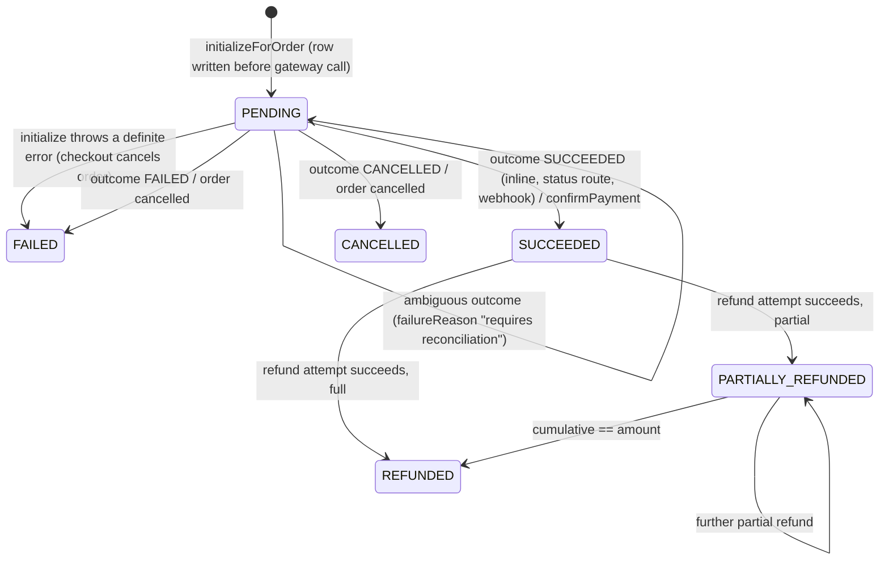
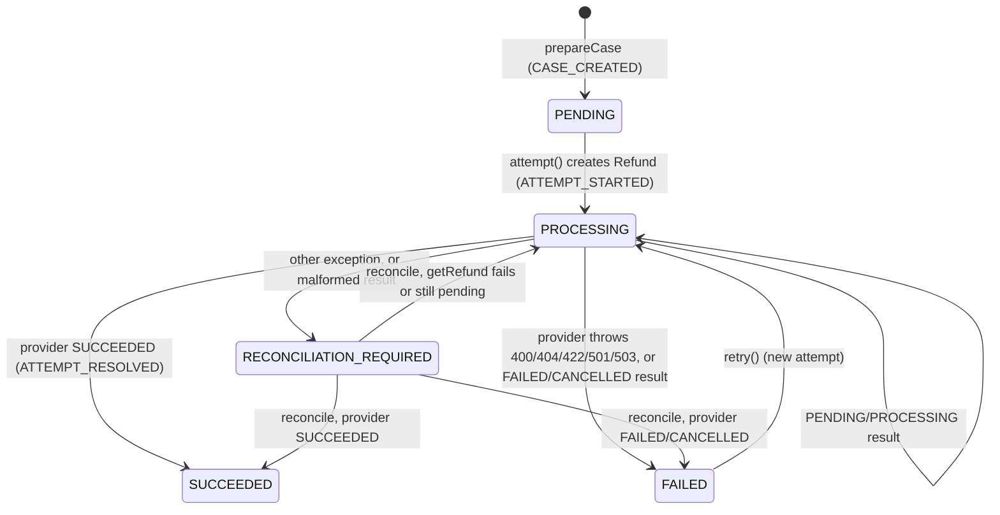

# Payments

> Charging an order through a pluggable `PaymentProvider`, applying gateway outcomes to orders, refund cases per seller order, card settlement in USD/GBP through FX quotes, and the hourly FX refresh.

## Purpose and features

- **Checkout** calls `PaymentsService.initializeForOrder` once per order. A `Payment` row (ZMW, idempotency key = order id) is persisted before the gateway is contacted; card payments also persist a private `PaymentSettlement` quote in USD/GBP.
- **Customers** read their payment's live gateway state, ask the gateway for status (which also applies a terminal outcome locally) and request gateway-side cancellation of a pending payment.
- **Admins** list gateway payments, open a refund case against a seller order, and reconcile a refund attempt.
- **System** applies gateway outcomes idempotently (order confirm or cancel), opens refund cases for fulfillment cancellations through a job, projects refund state onto return requests, and refreshes FX rates hourly.
- Wire-level gateway details (envelope, headers, error codes): see [../integrations.md](../integrations.md#payments). FX source: [../integrations.md](../integrations.md#fx-rates).

## Routes

Conventions (prefix, guards, envelope, Idempotency-Key format): see [../architecture.md](../architecture.md), [../auth-and-access.md](../auth-and-access.md).

| Method | Path                                              | Access                             | Idempotency                                                    | Description                                                                                                                                                                                                           |
| ------ | ------------------------------------------------- | ---------------------------------- | -------------------------------------------------------------- | --------------------------------------------------------------------------------------------------------------------------------------------------------------------------------------------------------------------- |
| POST   | /api/v1/payments/webhook                          | `@Public`                          | Dedupe on `PaymentEvent.providerEventId`                       | Gateway callback; needs raw body + `x-webhook-signature`, else 400. Always fails today (see Known gaps) ([payments.controller.ts:24](../../../services/commerce-api/src/modules/payments/payments.controller.ts#L24)) |
| GET    | /api/v1/payments/:id                              | Authenticated (owner of the order) | n/a                                                            | Local payment + gateway view ([gateway-payments.controller.ts:32](../../../services/commerce-api/src/modules/payments/gateway-payments.controller.ts#L32))                                                            |
| POST   | /api/v1/payments/:id/status                       | Authenticated (owner)              | Outcome dedupe key `gateway:<ref>:<status>`                    | Ask the gateway, apply a terminal outcome ([gateway-payments.controller.ts:39](../../../services/commerce-api/src/modules/payments/gateway-payments.controller.ts#L39))                                               |
| POST   | /api/v1/payments/:id/cancel                       | Authenticated (owner)              | None                                                           | Gateway-side cancel of a pending payment; body `reason` 3-500; audited ([gateway-payments.controller.ts:46](../../../services/commerce-api/src/modules/payments/gateway-payments.controller.ts#L46))                  |
| GET    | /api/v1/admin/payments                            | Roles(ADMIN) + DB re-check         | n/a                                                            | Gateway payment list, `page` (0-based), `size` 1-100, `sortBy=createdAt`, `descending` ([gateway-payments.controller.ts:54](../../../services/commerce-api/src/modules/payments/gateway-payments.controller.ts#L54))  |
| POST   | /api/v1/admin/payments/:id/refund                 | Roles(ADMIN) + DB re-check         | **Idempotency-Key required** (UUID v4), then ignored           | Validates and audits, then always 501 ([gateway-payments.controller.ts:62](../../../services/commerce-api/src/modules/payments/gateway-payments.controller.ts#L62))                                                   |
| POST   | /api/v1/admin/seller-orders/:sellerOrderId/refund | Roles(ADMIN)                       | **Idempotency-Key required** (UUID v4), stored on `RefundCase` | Open an ADMIN refund case, return its first `Refund` attempt ([admin-refunds.controller.ts:25](../../../services/commerce-api/src/modules/payments/admin-refunds.controller.ts#L25))                                  |
| POST   | /api/v1/admin/refunds/:refundId/status            | Roles(ADMIN)                       | n/a (re-applies are no-ops)                                    | Reconcile the refund's case with the provider ([admin-refunds.controller.ts:42](../../../services/commerce-api/src/modules/payments/admin-refunds.controller.ts#L42))                                                 |

Both refund bodies use `RefundPaymentDto`: `amount` int 1..2^31-1 minor units, `reason` 3-500 non-blank ([gateway-payment.dto.ts:13](../../../services/commerce-api/src/modules/payments/dto/gateway-payment.dto.ts#L13)). Idempotency-Key is checked in the controller ([admin-refunds.controller.ts:31](../../../services/commerce-api/src/modules/payments/admin-refunds.controller.ts#L31), [gateway-payments.controller.ts:70](../../../services/commerce-api/src/modules/payments/gateway-payments.controller.ts#L70)).

## Services

| Service                                                                                                                                         | Responsibility                                                                                                                                                                                                                                                             |
| ----------------------------------------------------------------------------------------------------------------------------------------------- | -------------------------------------------------------------------------------------------------------------------------------------------------------------------------------------------------------------------------------------------------------------------------- |
| `PaymentsService` ([payments.service.ts](../../../services/commerce-api/src/modules/payments/payments.service.ts))                              | `initializeForOrder`, `getForOrder`, `handleWebhook`, `reconcile`, `applyProviderResult`, `refundSellerOrder`, `reconcileRefund`. Exported.                                                                                                                                |
| `GatewayPaymentsService` ([gateway-payments.service.ts](../../../services/commerce-api/src/modules/payments/gateway-payments.service.ts))       | Customer/admin gateway routes. Talks to `UnifiedPaymentProvider` directly, not through `PAYMENT_PROVIDER`. Re-checks the actor in the DB (active; `ADMIN` for admin calls) ([:175](../../../services/commerce-api/src/modules/payments/gateway-payments.service.ts#L175)). |
| `RefundCasesService` ([refund-cases.service.ts](../../../services/commerce-api/src/modules/payments/refund-cases.service.ts))                   | Refund obligations: `createCase`, `prepareCase` (in caller's tx), `processPending`, `retry`, `reconcile`, `findById`, `listForSellerOrder`. Exported; used by returns.                                                                                                     |
| `PendingPaymentProvider` ([pending-payment.provider.ts](../../../services/commerce-api/src/modules/payments/pending-payment.provider.ts))       | Name `pending-integration`. Every method rejects with 503 "awaiting the external provider API" ([:53](../../../services/commerce-api/src/modules/payments/pending-payment.provider.ts#L53)).                                                                               |
| `UnifiedPaymentProvider` ([unified-payment.provider.ts](../../../services/commerce-api/src/modules/payments/unified-payment.provider.ts))       | Name `unified`. HTTP client for the Unified Payments gateway: initialize, get/status/cancel/list; refunds and webhooks not implemented.                                                                                                                                    |
| `PaymentCurrencyConverter` ([payment-currency-converter.ts](../../../services/commerce-api/src/modules/payments/payment-currency-converter.ts)) | Plain class (not a provider), built per call. ZMW minor units -> USD/GBP minor units.                                                                                                                                                                                      |
| `FxRatesService` ([fx-rates.service.ts](../../../services/commerce-api/src/modules/payments/fx-rates.service.ts))                               | In-memory rate cache hydrated from `FxRate` at boot and after each refresh. Exported.                                                                                                                                                                                      |
| `ExchangeRateApiProvider` ([exchange-rate-api.provider.ts](../../../services/commerce-api/src/modules/payments/exchange-rate-api.provider.ts))  | Bound to `FX_RATE_PROVIDER` ([payments.module.ts:56](../../../services/commerce-api/src/modules/payments/payments.module.ts#L56)).                                                                                                                                         |
| `FxRatesRefreshScheduler`, `FulfillmentCancellationRefundHandler`                                                                               | See Jobs and events.                                                                                                                                                                                                                                                       |

### PaymentProvider seam

`PAYMENT_PROVIDER` is chosen by `resolvePaymentProvider`: `PAYMENTS_PROVIDER === 'unified'` -> `UnifiedPaymentProvider`, anything else -> `PendingPaymentProvider` ([payments.module.ts:26](../../../services/commerce-api/src/modules/payments/payments.module.ts#L26)). Contract ([payment-provider.ts:52](../../../services/commerce-api/src/modules/payments/payment-provider.ts#L52)):

| Method                                                | Contract                                                                                                                                                                                                                                                                                                                                                                 |
| ----------------------------------------------------- | ------------------------------------------------------------------------------------------------------------------------------------------------------------------------------------------------------------------------------------------------------------------------------------------------------------------------------------------------------------------------ |
| `name`                                                | Stored on `Payment.provider`; every read path refuses payments whose provider differs from the bound one.                                                                                                                                                                                                                                                                |
| `prepareInput?(input)`                                | Optional. May rewrite amount/currency and attach a `settlement` quote.                                                                                                                                                                                                                                                                                                   |
| `validateInput?(input)`                               | Optional. Called before the `Payment` row is written.                                                                                                                                                                                                                                                                                                                    |
| `initialize(input)`                                   | Returns `providerReference`, `status` (`PENDING`, `REQUIRES_ACTION`, `PROCESSING`, `SUCCEEDED`, `FAILED`, `CANCELLED`), optional `redirectUrl`, `gatewayStatus`, `failureCode/Message`. Throwing `PaymentOutcomeUnknownException` (503) means "unknown, do not retry" ([gateway-errors.ts:3](../../../services/commerce-api/src/modules/payments/gateway-errors.ts#L3)). |
| `getPayment(ref)`                                     | Same shape plus `amount`/`currency`/`reference` for reconciliation.                                                                                                                                                                                                                                                                                                      |
| `verifyWebhook(raw, sig)`                             | Returns a `VerifiedPaymentEvent {id, providerReference, type, status, payload}`.                                                                                                                                                                                                                                                                                         |
| `refund(ref, amount, reason, key)` / `getRefund(ref)` | `ProviderRefundResult {providerReference, status}`.                                                                                                                                                                                                                                                                                                                      |

### UnifiedPaymentProvider

- `prepareInput` ([unified-payment.provider.ts:96](../../../services/commerce-api/src/modules/payments/unified-payment.provider.ts#L96)): order currency must be `ZMW` (400). Mobile money passes through unchanged. Card: `UNIFIED_PAYMENTS_CARD_CURRENCY` must be `USD` or `GBP` (else 503), then `PaymentCurrencyConverter.quote` replaces `amount`/`currency` and returns the `settlement`.
- `validateInput` ([:175](../../../services/commerce-api/src/modules/payments/unified-payment.provider.ts#L175)): connection configured; amount a positive safe integer; `details` required and re-validated against `PaymentDetailsDto` with `forbidNonWhitelisted`; mobile money requires ZMW and no `card`; card requires USD/GBP and no `phoneNumber`/`provider`.
- `PaymentDetailsDto` ([payment-details.dto.ts:38](../../../services/commerce-api/src/modules/payments/dto/payment-details.dto.ts#L38)): `paymentMethod` `MOBILE_MONEY | CARD`; mobile `phoneNumber` `^(?:0|\+?260)[579]\d{8}$`, optional `provider` `AIRTEL | MTN`; card `number` 13-19 digits, `expiryMonth` 01-12, `expiryYear` `20xx`, `securityCode` 3 digits, `holderName`, nested `billing` (names, address, ISO-2 `country`, email).
- `initialize` ([:117](../../../services/commerce-api/src/modules/payments/unified-payment.provider.ts#L117)): `POST /api/v1/payments` with `amount = minor / 100`, `reference` (order id), method fields, and optional `merchantId`, `description`, `callbackUrl`, `metadata` (`orderId`, `paymentId`, `channel: web`), all omitted when empty; `Idempotency-Key` = order id. The echoed `reference`, `currency` and `round(amount*100)` must equal what was sent, else `PaymentOutcomeUnknownException` ([:153](../../../services/commerce-api/src/modules/payments/unified-payment.provider.ts#L153)).
- Status mapping: only `SUCCESS -> SUCCEEDED` and `FAILED -> FAILED`; every other gateway string maps to `PENDING` ([:53](../../../services/commerce-api/src/modules/payments/unified-payment.provider.ts#L53)). `REQUIRES_ACTION`, `PROCESSING` and `CANCELLED` are never produced.
- Payment parser ([:307](../../../services/commerce-api/src/modules/payments/unified-payment.provider.ts#L307)): requires `paymentId` `^pay_[A-Za-z0-9_-]+$`, `status` `^[A-Z_]{1,50}$`, non-negative finite `amount`, 3-letter `currency`, string `reference`. When `requestedAmount` is present it is used as `amount` (the order's own figure) and `serviceCharge` is kept alongside; a malformed `requestedAmount`/`serviceCharge` or an `amount` below `requestedAmount` -> unknown outcome ([:325](../../../services/commerce-api/src/modules/payments/unified-payment.provider.ts#L325)). Optional `failureCode`, `failureMessage`, `completedAt`, `expiresAt` kept only when non-blank strings.
- `getPayment` uses `GET /payments/{id}` (side-effect free); `checkStatus` uses `POST .../status`; `cancelPayment` `POST .../cancel` ([:211](../../../services/commerce-api/src/modules/payments/unified-payment.provider.ts#L211)). Ids are validated before building paths ([:301](../../../services/commerce-api/src/modules/payments/unified-payment.provider.ts#L301)).
- `refund`/`getRefund` reject with 501; `verifyWebhook` throws 501 ([:282](../../../services/commerce-api/src/modules/payments/unified-payment.provider.ts#L282)). `requestRefund` exists but has no caller ([:235](../../../services/commerce-api/src/modules/payments/unified-payment.provider.ts#L235)).
- Connection ([:376](../../../services/commerce-api/src/modules/payments/unified-payment.provider.ts#L376)): needs `PAYMENTS_PROVIDER=unified`, API key and base URL (else 503). Base must be a bare origin (no credentials, path, query, hash); `https:` only unless `NODE_ENV` is development/test or `UNIFIED_PAYMENTS_ALLOW_HTTP=true`.
- Transport ([:415](../../../services/commerce-api/src/modules/payments/unified-payment.provider.ts#L415)): `redirect: 'error'`, `X-API-Key`, timeout `UNIFIED_PAYMENTS_TIMEOUT_MS`. Network error, timeout, non-JSON, non-2xx or `success !== true` -> `PaymentOutcomeUnknownException`. Error codes: `OPERATION_NOT_SUPPORTED` -> 501, `PAYMENT_NOT_FOUND` -> 404, other 4xx -> 400 ([:457](../../../services/commerce-api/src/modules/payments/unified-payment.provider.ts#L457)). `correlationId` is logged.

## Business rules

### Payment lifecycle

`REQUIRES_ACTION` and `PROCESSING` are treated like `PENDING` everywhere ([payments.service.ts:43](../../../services/commerce-api/src/modules/payments/payments.service.ts#L43)).

**Initialization** ([payments.service.ts:87](../../../services/commerce-api/src/modules/payments/payments.service.ts#L87))

- `prepareInput` then `validateInput` run before any write; a throw there leaves no `Payment` (checkout then cancels the order and frees its idempotency key).
- `Payment` stores the ZMW `order.total`; any settlement quote is nested-created in the same insert ([:102](../../../services/commerce-api/src/modules/payments/payments.service.ts#L102)). `orderId` and `idempotencyKey` (= order id) are unique, so one payment per order.
- An already-expired settlement quote -> 503 and the payment is marked FAILED ([:118](../../../services/commerce-api/src/modules/payments/payments.service.ts#L118)).
- On return, `providerReference` is saved and the result is applied through `applyProviderResult`, so an inline SUCCESS confirms the order and an inline decline cancels it in the same request ([:148](../../../services/commerce-api/src/modules/payments/payments.service.ts#L148)).
- If the gateway accepted the call, or threw `PaymentOutcomeUnknownException`, any later error is swallowed: the payment stays PENDING with `failureReason = 'Gateway outcome requires reconciliation'` and `requiresReconciliation: true` is returned ([:165](../../../services/commerce-api/src/modules/payments/payments.service.ts#L165)). Any other error marks it FAILED with the error message and rethrows ([:178](../../../services/commerce-api/src/modules/payments/payments.service.ts#L178)).
- Response adds `redirectUrl`, `gatewayStatus` and `requiresReconciliation = gatewayStatus !== 'PENDING'` ([:157](../../../services/commerce-api/src/modules/payments/payments.service.ts#L157)).

**Applying outcomes** (`applyProviderResult` -> `applyEvent`)

- For `unified` payments the result must match the stored reference, amount and currency (settlement's if present, else payment's) and `reference == orderId`, else 409 ([payments.service.ts:252](../../../services/commerce-api/src/modules/payments/payments.service.ts#L252)).
- Nothing is applied unless the payment is reconcilable (same provider, has a reference, still pending) and the mapped status is not `PENDING` ([:268](../../../services/commerce-api/src/modules/payments/payments.service.ts#L268)).
- The synthetic event id is `gateway:<providerReference>:<gatewayStatus|status>`, stable across checkout, status route and reconcile ([:276](../../../services/commerce-api/src/modules/payments/payments.service.ts#L276)).
- `applyEvent` ([:298](../../../services/commerce-api/src/modules/payments/payments.service.ts#L298)): in one tx, lock the order `FOR UPDATE`, re-read the payment, dedupe on `PaymentEvent.providerEventId` (same id on another payment -> 409). If the payment is neither settled nor rejected: SUCCEEDED -> `OrdersService.confirmPayment`; FAILED/CANCELLED -> `OrdersService.cancel`; then update status and `failureReason` (`code: message`, only for FAILED/CANCELLED) ([:56](../../../services/commerce-api/src/modules/payments/payments.service.ts#L56)). A SUCCEEDED event on a FAILED/CANCELLED payment -> 409 "reconciliation is required" ([:342](../../../services/commerce-api/src/modules/payments/payments.service.ts#L342)). Stale failures on a settled payment are recorded but change nothing. The `PaymentEvent` commits with the effects, so a failed tx stays retryable.
- `reconcile(paymentId)` ([:217](../../../services/commerce-api/src/modules/payments/payments.service.ts#L217)): a SUCCEEDED payment re-runs `confirmPayment` (idempotent) without a gateway call; pending ones call `getPayment` and apply.

**Customer gateway routes** ([gateway-payments.service.ts](../../../services/commerce-api/src/modules/payments/gateway-payments.service.ts))

- Ownership through `order.userId`; otherwise 404 ([:120](../../../services/commerce-api/src/modules/payments/gateway-payments.service.ts#L120)). Payment must be `unified` with a saved reference, else 409 ([:129](../../../services/commerce-api/src/modules/payments/gateway-payments.service.ts#L129)).
- Every snapshot checks gateway id, reference, currency and amount against the local record (settlement first) -> 409 on mismatch; the returned `gateway.amount/currency` are replaced with the ZMW values ([:139](../../../services/commerce-api/src/modules/payments/gateway-payments.service.ts#L139)). `requiresReconciliation` = unmapped non-`PENDING` gateway status, or gateway success not yet reflected locally ([:169](../../../services/commerce-api/src/modules/payments/gateway-payments.service.ts#L169)).
- `status` verifies the snapshot first, then applies the result ([:58](../../../services/commerce-api/src/modules/payments/gateway-payments.service.ts#L58)).
- `cancel` requires a local pending status (else 409), writes audit `payment.cancel_requested`, calls the gateway and makes no local transition ([:77](../../../services/commerce-api/src/modules/payments/gateway-payments.service.ts#L77)).
- Admin `refund` checks `SUCCEEDED` and `amount <= payment.amount`, audits `payment.refund_requested`, then throws 501 pointing to the seller-order route ([:100](../../../services/commerce-api/src/modules/payments/gateway-payments.service.ts#L100)).

### Refund cases

`PARTIALLY_SUCCEEDED` and `CANCELLED` exist in the enum but are never written.

- One case per seller order. Sources: `ADMIN` (admin route), `FULFILLMENT_CANCELLATION` (job), `RETURN` (returns module via `prepareCase` + `processPending`).
- `createCase` = `prepareCase` in its own tx, then `processPending` after commit, so the provider is never called inside the obligation tx ([refund-cases.service.ts:80](../../../services/commerce-api/src/modules/payments/refund-cases.service.ts#L80)). A replayed key whose case is still `PENDING` resumes processing; otherwise the stored case is returned. Provider-side outcomes never throw; only validation does ([:72](../../../services/commerce-api/src/modules/payments/refund-cases.service.ts#L72)).
- `prepareCase` ([:93](../../../services/commerce-api/src/modules/payments/refund-cases.service.ts#L93)):
  - `amount` positive safe int; `0 <= shippingAmount <= amount` (409 otherwise).
  - Locks the parent order (`lockForPayment`), then idempotency on `RefundCase.idempotencyKey`: seller order, amounts, currency, reason, source, return request and the sorted item list must all match, else 409 ([:115](../../../services/commerce-api/src/modules/payments/refund-cases.service.ts#L115)).
  - Payment must exist, belong to the bound provider with a reference, be `SUCCEEDED`/`PARTIALLY_REFUNDED`; seller order `PAID`/`PARTIALLY_REFUNDED`; currencies equal ([:161](../../../services/commerce-api/src/modules/payments/refund-cases.service.ts#L161)).
  - Amount must fit both `payment.amount - refunded - held` and `sellerOrder.total - refunded - held`, where held = open cases (`PENDING`, `PROCESSING`, `RECONCILIATION_REQUIRED`) ([:180](../../../services/commerce-api/src/modules/payments/refund-cases.service.ts#L180)).
  - Shipping portion must fit `sellerOrder.shippingAmount` minus shipping on non-FAILED/CANCELLED cases ([:206](../../../services/commerce-api/src/modules/payments/refund-cases.service.ts#L206)).
- Attempt ([:345](../../../services/commerce-api/src/modules/payments/refund-cases.service.ts#L345)): creates `Refund` (full case amount) with key `<caseKey>:attempt:<n>`; a P2002 on that key returns the case (concurrent attempt). Case -> PROCESSING, then `provider.refund`. 503 counts as definitive because `PendingPaymentProvider` returns it for everything ([:49](../../../services/commerce-api/src/modules/payments/refund-cases.service.ts#L49)). An ambiguous failure leaves the `Refund` PENDING for reconciliation.
- Outcome ([:426](../../../services/commerce-api/src/modules/payments/refund-cases.service.ts#L426)): in a tx that locks the order before re-reading, skip if the attempt is no longer PENDING/PROCESSING. On SUCCEEDED: `payment.refundedAmount + amount` must not exceed `payment.amount` (409); `OrdersService.applyRefund`; `LedgerService.recordRefundReversal` keyed by refund id; payment -> `REFUNDED` or `PARTIALLY_REFUNDED`. The case update is a CAS on `version` ([:529](../../../services/commerce-api/src/modules/payments/refund-cases.service.ts#L529)).
- `retry` only from `FAILED` (returns module route) ([:285](../../../services/commerce-api/src/modules/payments/refund-cases.service.ts#L285)). `reconcile` asks `getRefund` about the latest PENDING/PROCESSING attempt with a reference; a provider error is treated as `PENDING` ([:542](../../../services/commerce-api/src/modules/payments/refund-cases.service.ts#L542)).
- Return projection ([:565](../../../services/commerce-api/src/modules/payments/refund-cases.service.ts#L565)): after each case transition, a linked `ReturnRequest` becomes `REFUNDED` (all cases succeeded), `PARTIALLY_REFUNDED` (some), `REFUND_FAILED` (any FAILED/RECONCILIATION_REQUIRED) or `REFUND_PENDING`, with a `REFUND_STATUS_PROJECTED` `ReturnEvent`.
- Legacy admin route returns the case's first `Refund` row by `createdAt` ([payments.service.ts:394](../../../services/commerce-api/src/modules/payments/payments.service.ts#L394)).

### Currency conversion

- Orders, payments, refunds and seller balances stay in ZMW; only `PaymentSettlement` holds the USD/GBP figure (schema comment on `PaymentSettlement`).
- `quote(amount, currency)` ([payment-currency-converter.ts:42](../../../services/commerce-api/src/modules/payments/payment-currency-converter.ts#L42)): amount positive safe int (400); currency `^[A-Z]{3}$`; rate source is the live `FxRatesService` entry if present, else `PAYMENT_FX_QUOTES` JSON (`rate` `^\d{1,12}(\.\d{1,12})?$`, `quoteId` 1-200, `expiresAt` string) ([:77](../../../services/commerce-api/src/modules/payments/payment-currency-converter.ts#L77)). Expired or non-positive -> 503.
- Integer maths with BigInt: `amount * rate * 10^targetDigits / 100`, half-up once; target digits from `Intl.NumberFormat`; result must be 1..2^31-1 ([:56](../../../services/commerce-api/src/modules/payments/payment-currency-converter.ts#L56)).
- Live quote id is `fx:<rowId>:<fetchedAtMs>` ([fx-rates.service.ts:72](../../../services/commerce-api/src/modules/payments/fx-rates.service.ts#L72)); expiry = fetch time + 2 refresh intervals (2 h) ([:11](../../../services/commerce-api/src/modules/payments/fx-rates.service.ts#L11)).
- `ExchangeRateApiProvider` calls `https://v6.exchangerate-api.com/v6/<key>/latest/<base>` (10 s timeout, no redirects), keeps 3-letter codes with finite positive numbers as `toFixed(8)` strings; any failure -> 503 ([exchange-rate-api.provider.ts:22](../../../services/commerce-api/src/modules/payments/exchange-rate-api.provider.ts#L22)). `refresh` drops the base currency and upserts `FxRate` rows by `targetCurrency` in one tx ([fx-rates.service.ts:34](../../../services/commerce-api/src/modules/payments/fx-rates.service.ts#L34)).

## Data

| Model                          | Access                                                                                                                                                                                                        |
| ------------------------------ | ------------------------------------------------------------------------------------------------------------------------------------------------------------------------------------------------------------- |
| `Payment`                      | create, update (status, reference, failureReason, refundedAmount), read                                                                                                                                       |
| `PaymentSettlement`            | nested create with payment, read for matching                                                                                                                                                                 |
| `PaymentEvent`                 | create (dedupe, unique `providerEventId`), read                                                                                                                                                               |
| `RefundCase`                   | create, update (status, CAS `version`), read                                                                                                                                                                  |
| `RefundCaseItem`               | nested create, read (idempotency compare)                                                                                                                                                                     |
| `Refund`                       | create (one per attempt, unique `idempotencyKey`), update, read                                                                                                                                               |
| `RefundEvent`                  | create: `CASE_CREATED`, `ATTEMPT_STARTED`, `ATTEMPT_REJECTED`, `ATTEMPT_AMBIGUOUS`, `ATTEMPT_RESOLVED`                                                                                                        |
| `ReturnRequest`, `ReturnEvent` | status projection                                                                                                                                                                                             |
| `FxRate`                       | upsert, read                                                                                                                                                                                                  |
| `Order`, `SellerOrder`         | lock `FOR UPDATE`, updated via `OrdersService`                                                                                                                                                                |
| `OrderItem`                    | read (job)                                                                                                                                                                                                    |
| `AuditEvent`                   | direct `auditEvent.create` (`payment.cancel_requested`, `payment.refund_requested`) ([gateway-payments.service.ts:181](../../../services/commerce-api/src/modules/payments/gateway-payments.service.ts#L181)) |

## Dependencies

- Imports `UsersModule` (actor re-check), `OrdersModule` (`lockForPayment`, `confirmPayment`, `cancel`, `applyRefund`, `getSellerOrderForPayment`), `FinancialsModule` (`recordRefundReversal`) ([payments.module.ts:37](../../../services/commerce-api/src/modules/payments/payments.module.ts#L37)).
- Exports `PAYMENT_PROVIDER`, `PaymentsService`, `RefundCasesService`, `FulfillmentCancellationRefundHandler`, `FxRatesService`.
- Callers: checkout (`initializeForOrder`, `getForOrder`), returns (`prepareCase`, `processPending`, `retry`), fulfillment (enqueues the refund job), `WorkersModule` (registers the handler).
- `main.ts` keeps the raw request body for the webhook ([main.ts:38](../../../services/commerce-api/src/main.ts#L38)).

## Jobs and events

- **`refunds.process_fulfillment_cancellation`** ([fulfillment-cancellation-refund.handler.ts:9](../../../services/commerce-api/src/modules/payments/jobs/fulfillment-cancellation-refund.handler.ts#L9)), enqueued by fulfillment. Payload `{orderId, sellerOrderId, reason, lines[{fulfillmentLineId, orderItemId, quantity>0}]}`; malformed -> throws (retries then dead-letters). Amount = sum of `orderItem.unitAmount * quantity` (no shipping); currency from the first item; idempotency key `fulfillment-cancel:<sorted fulfillmentLineIds>`; reason prefixed `Fulfillment cancellation:` ([:71](../../../services/commerce-api/src/modules/payments/jobs/fulfillment-cancellation-refund.handler.ts#L71)). Provider failures do not fail the job (the case records them).
- **FX refresh** — `@Interval(1 h)` plus once in `onModuleInit` unless `NODE_ENV=test`; errors are logged, never thrown ([fx-rates-refresh.scheduler.ts:31](../../../services/commerce-api/src/modules/payments/fx-rates-refresh.scheduler.ts#L31)). No-op without `PAYMENT_FX_API_KEY`. `FxRatesService.onModuleInit` hydrates the cache from `FxRate` regardless.
- Order effects of a settled payment (fulfillment job, `order.paid` outbox) are written by `OrdersService.confirmPayment`, see [orders.md](orders.md). This module writes no outbox topics itself. See [../background-processing.md](../background-processing.md).

## Configuration

| Env var                                                 | Default   | Use                                                                                                                                                          |
| ------------------------------------------------------- | --------- | ------------------------------------------------------------------------------------------------------------------------------------------------------------ |
| `PAYMENTS_PROVIDER`                                     | `pending` | `unified` binds the gateway ([payments.module.ts:31](../../../services/commerce-api/src/modules/payments/payments.module.ts#L31))                            |
| `UNIFIED_PAYMENTS_BASE_URL`, `UNIFIED_PAYMENTS_API_KEY` | –         | Required when `unified`                                                                                                                                      |
| `UNIFIED_PAYMENTS_MERCHANT_ID`                          | empty     | Sent only when set                                                                                                                                           |
| `UNIFIED_PAYMENTS_CARD_CURRENCY`                        | `USD`     | Card settlement currency; only USD/GBP work                                                                                                                  |
| `UNIFIED_PAYMENTS_CALLBACK_URL`                         | –         | Sent only when a valid http(s) URL ([unified-payment.provider.ts:360](../../../services/commerce-api/src/modules/payments/unified-payment.provider.ts#L360)) |
| `UNIFIED_PAYMENTS_TIMEOUT_MS`                           | 15000     | Per-call timeout                                                                                                                                             |
| `UNIFIED_PAYMENTS_ALLOW_HTTP`                           | –         | Not in the schema; `true` allows `http:` outside dev/test                                                                                                    |
| `PAYMENT_FX_API_KEY`                                    | –         | Enables live FX refresh                                                                                                                                      |
| `PAYMENT_FX_BASE_CURRENCY`                              | `ZMW`     | Base for fetched rates                                                                                                                                       |
| `PAYMENT_FX_QUOTES`                                     | `{}`      | Manual fallback quotes                                                                                                                                       |

Full table: [../configuration.md](../configuration.md#payments).

## Tests

- [payments.service.spec.ts](../../../services/commerce-api/src/modules/payments/payments.service.spec.ts): settlement persisted in ZMW, ambiguous outcome kept pending, inline success confirms order, accepted-but-unsaved not reported as declined, FAILED on provider error; refund delegation (success/rejected/ambiguous); webhook dedupe, same-tx effects, no dedupe row on failure, no downgrade of settled payment; reconcile success/failure detail/unknown status/already settled.
- [unified-payment.provider.spec.ts](../../../services/commerce-api/src/modules/payments/unified-payment.provider.spec.ts): minor-unit conversion, mobile/card field separation, HTTPS origin, status route, optional fields, callback URL, undocumented status -> PENDING, decline with reason, timeouts, `requestedAmount`/`serviceCharge`, unsupported refund/cancel, not-found mapping, pagination, webhook rejection.
- [gateway-payments.service.spec.ts](../../../services/commerce-api/src/modules/payments/gateway-payments.service.spec.ts): owner lookup first, admin re-check, mismatch 409, ZMW-only snapshot, cancel without local transition, missing reference, 501 refund, excessive refund.
- [payment-currency-converter.spec.ts](../../../services/commerce-api/src/modules/payments/payment-currency-converter.spec.ts), [fx-rates.service.spec.ts](../../../services/commerce-api/src/modules/payments/fx-rates.service.spec.ts), [exchange-rate-api.provider.spec.ts](../../../services/commerce-api/src/modules/payments/exchange-rate-api.provider.spec.ts), [fx-rates-refresh.scheduler.spec.ts](../../../services/commerce-api/src/modules/payments/fx-rates-refresh.scheduler.spec.ts), [payments.module.spec.ts](../../../services/commerce-api/src/modules/payments/payments.module.spec.ts), [payment-details.dto.spec.ts](../../../services/commerce-api/src/modules/payments/dto/payment-details.dto.spec.ts).
- Integration: [checkout.e2e-spec.ts](../../../services/commerce-api/test/checkout.e2e-spec.ts) (fake `PAYMENT_PROVIDER`, webhook confirm), [returns.integration-spec.ts](../../../services/commerce-api/test/returns.integration-spec.ts), [seller-fulfillment.integration-spec.ts](../../../services/commerce-api/test/seller-fulfillment.integration-spec.ts).
- No unit spec for `RefundCasesService` or the fulfillment-cancellation handler.

## Known gaps

- **No refund can succeed with a wired provider.** `PendingPaymentProvider` returns 503 and `UnifiedPaymentProvider.refund` returns 501; both count as definitive, so every case ends `FAILED` ([refund-cases.service.ts:55](../../../services/commerce-api/src/modules/payments/refund-cases.service.ts#L55), [unified-payment.provider.ts:287](../../../services/commerce-api/src/modules/payments/unified-payment.provider.ts#L287)).
- **Webhook always fails**: pending -> 503, unified -> 501 (`INTERNAL_ERROR`). Settlement relies on inline results and the customer `POST /payments/:id/status` ([unified-payment.provider.ts:282](../../../services/commerce-api/src/modules/payments/unified-payment.provider.ts#L282)).
- `PaymentsService.reconcile` has no caller (no route, no sweeper), so a PENDING payment nobody polls stays PENDING ([payments.service.ts:217](../../../services/commerce-api/src/modules/payments/payments.service.ts#L217)). Reservations expire after 15 min while the order stays `PENDING_PAYMENT`; a success applied after that fails in `confirmPayment` (`Cannot commit a reservation with status EXPIRED`, [inventory.service.ts:694](../../../services/commerce-api/src/modules/inventory/inventory.service.ts#L694)), leaving a charged customer with a pending order.
- Gateway-side cancel is never reflected locally: the gateway's `CANCELLED` (or any status other than `SUCCESS`/`FAILED`) maps to `PENDING`, so the payment and order stay pending ([unified-payment.provider.ts:53](../../../services/commerce-api/src/modules/payments/unified-payment.provider.ts#L53), [gateway-payments.service.ts:88](../../../services/commerce-api/src/modules/payments/gateway-payments.service.ts#L88)).
- Inline SUCCESS returns `requiresReconciliation: true`, because the flag is `gatewayStatus !== 'PENDING'` ([payments.service.ts:160](../../../services/commerce-api/src/modules/payments/payments.service.ts#L160)).
- `RECONCILIATION_REQUIRED` -> `reconcile` -> provider can't answer -> case moves to `PROCESSING`. It then has no exit: `retry` needs `FAILED`, `processPending` needs `PENDING`, and nothing reports it for reconciliation ([refund-cases.service.ts:548](../../../services/commerce-api/src/modules/payments/refund-cases.service.ts#L548), [:523](../../../services/commerce-api/src/modules/payments/refund-cases.service.ts#L523)).
- A crash between `transitionCase(PROCESSING)` and the provider call leaves a case `PROCESSING` with a `Refund` without a reference; `reconcile` returns early and no sweeper exists ([refund-cases.service.ts:324](../../../services/commerce-api/src/modules/payments/refund-cases.service.ts#L324)).
- `transitionCase` updates status without a version or from-status check, unlike `applyOutcome` ([refund-cases.service.ts:557](../../../services/commerce-api/src/modules/payments/refund-cases.service.ts#L557)).
- The refundable-balance check loads **every** open refund case in the system, then filters in memory ([refund-cases.service.ts:180](../../../services/commerce-api/src/modules/payments/refund-cases.service.ts#L180)).
- Fulfillment-cancellation job: does not check that the order items belong to `sellerOrderId`, and a second partial cancellation of the same fulfillment lines reuses the same key with a different amount -> 409, which dead-letters ([fulfillment-cancellation-refund.handler.ts:102](../../../services/commerce-api/src/modules/payments/jobs/fulfillment-cancellation-refund.handler.ts#L102)).
- `POST /admin/payments/:id/refund` requires an Idempotency-Key, writes an audit row, then always 501s ([gateway-payments.service.ts:113](../../../services/commerce-api/src/modules/payments/gateway-payments.service.ts#L113)). `requestRefund` is dead code.
- Audit rows are written with `prisma.auditEvent.create`, bypassing `AuditService` redaction; admin refund routes in `AdminRefundsController` are not audited at all.
- `AdminRefundsController` relies on the JWT role only; `GatewayPaymentsService` re-checks the DB role.
- `PAYMENT_FX_BASE_CURRENCY` is configurable, but the converter assumes ZMW (divides by 100, and `prepareInput` requires ZMW); a non-ZMW base would produce wrong settlement amounts ([payment-currency-converter.ts:64](../../../services/commerce-api/src/modules/payments/payment-currency-converter.ts#L64)).
- The FX cache is per process and only refreshed by that replica's own scheduler; with `SCHEDULED_WORKERS_ENABLED=false` a replica keeps its boot-time rates until they expire, then card payments return 503.
- Checkout replay returns the stored payment without `requiresReconciliation`/`redirectUrl` ([payments.service.ts:193](../../../services/commerce-api/src/modules/payments/payments.service.ts#L193)).
