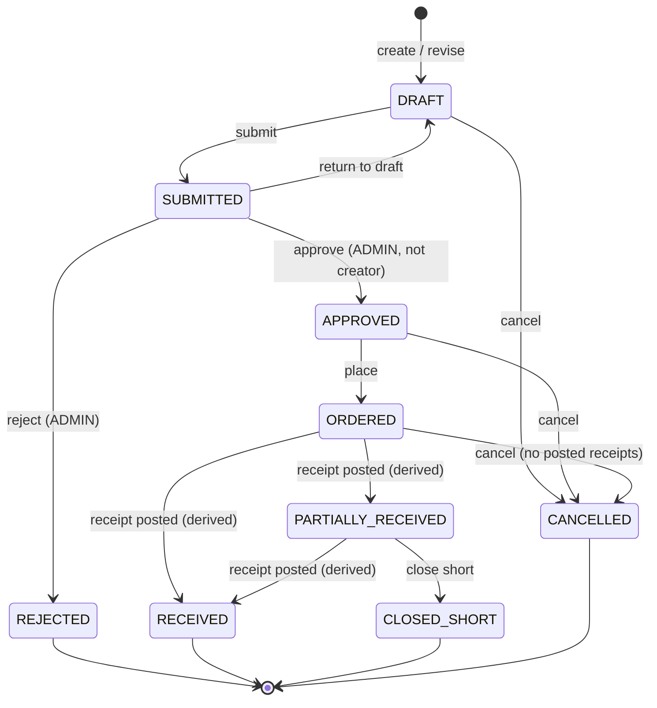

# Procurement

> Buying stock from suppliers: the supplier master and supplier-variant mappings, purchase orders with an approval workflow and revisions, and goods receipts that post stock into inventory (and can be reversed).

## Purpose and features

- **Staff and admins** maintain suppliers (create, edit with `version`, deactivate) and each supplier's variant mappings (SKU, pack size, MOQ, costs, lead time).
- **Staff and admins** draft purchase orders against an active supplier and an active warehouse, submit them, return them to draft, place approved orders, cancel, close short, and create a numbered revision of an approved/ordered PO.
- **Admins only** approve or reject submitted POs (never their own), authorize over-receipts, and reverse posted goods receipts.
- **Staff and admins** receive deliveries against a PO: create a receipt and post it in one call (the default) or keep it as a draft to edit/delete first. Posting increases on-hand stock, advances PO line quantities and derives the PO status.
- Every workflow step is audited through `AuditService.record`; key steps also write outbox events.

`ProcurementModule` only wraps `SuppliersModule`, `PurchaseOrdersModule` and `GoodsReceiptsModule` ([procurement.module.ts:8](../../../services/commerce-api/src/modules/procurement/procurement.module.ts#L8)).

## Routes

Conventions (prefix, guards, envelope): see [../architecture.md](../architecture.md) and [../auth-and-access.md](../auth-and-access.md). All `:id`-style params use `ParseUUIDPipe`. The PO and goods-receipt controllers set `@Roles` per method, not per class.

| Method | Path                                                                | Access              | Idempotency                                                      | Description                                                                                                                                                                                                                    |
| ------ | ------------------------------------------------------------------- | ------------------- | ---------------------------------------------------------------- | ------------------------------------------------------------------------------------------------------------------------------------------------------------------------------------------------------------------------------ |
| GET    | /api/v1/admin/procurement/suppliers                                 | Roles(STAFF, ADMIN) | n/a                                                              | Paginated, `legalName asc`, optional `status` (not validated) ([suppliers.controller.ts:27](../../../services/commerce-api/src/modules/procurement/suppliers/suppliers.controller.ts#L27))                                     |
| GET    | /api/v1/admin/procurement/suppliers/:id                             | Roles(STAFF, ADMIN) | n/a                                                              | One supplier ([suppliers.controller.ts:35](../../../services/commerce-api/src/modules/procurement/suppliers/suppliers.controller.ts#L35))                                                                                      |
| POST   | /api/v1/admin/procurement/suppliers                                 | Roles(STAFF, ADMIN) | None (unique `code` -> 409)                                      | Create ([suppliers.controller.ts:40](../../../services/commerce-api/src/modules/procurement/suppliers/suppliers.controller.ts#L40))                                                                                            |
| PATCH  | /api/v1/admin/procurement/suppliers/:id                             | Roles(STAFF, ADMIN) | Body `version`                                                   | Partial update ([suppliers.controller.ts:48](../../../services/commerce-api/src/modules/procurement/suppliers/suppliers.controller.ts#L48))                                                                                    |
| POST   | /api/v1/admin/procurement/suppliers/:id/deactivate                  | Roles(STAFF, ADMIN) | Body `version`                                                   | Set `INACTIVE` ([suppliers.controller.ts:57](../../../services/commerce-api/src/modules/procurement/suppliers/suppliers.controller.ts#L57))                                                                                    |
| GET    | /api/v1/admin/procurement/suppliers/:supplierId/products            | Roles(STAFF, ADMIN) | n/a                                                              | The supplier's variant mappings ([supplier-products.controller.ts:24](../../../services/commerce-api/src/modules/procurement/suppliers/supplier-products.controller.ts#L24))                                                   |
| POST   | /api/v1/admin/procurement/suppliers/:supplierId/products            | Roles(STAFF, ADMIN) | None (unique `(supplierId, variantId)` -> 409)                   | Create a mapping ([supplier-products.controller.ts:31](../../../services/commerce-api/src/modules/procurement/suppliers/supplier-products.controller.ts#L31))                                                                  |
| PATCH  | /api/v1/admin/procurement/suppliers/:supplierId/products/:id        | Roles(STAFF, ADMIN) | Naturally idempotent                                             | Update a mapping; `supplierId` in the path is ignored ([supplier-products.controller.ts:39](../../../services/commerce-api/src/modules/procurement/suppliers/supplier-products.controller.ts#L39))                             |
| GET    | /api/v1/admin/procurement/purchase-orders                           | Roles(STAFF, ADMIN) | n/a                                                              | Paginated; `status`, `supplierId`, `warehouseId`, `overdue`, `awaitingApproval` ([purchase-orders.controller.ts:29](../../../services/commerce-api/src/modules/procurement/purchase-orders/purchase-orders.controller.ts#L29)) |
| GET    | /api/v1/admin/procurement/purchase-orders/:id                       | Roles(STAFF, ADMIN) | n/a                                                              | PO with lines ([purchase-orders.controller.ts:35](../../../services/commerce-api/src/modules/procurement/purchase-orders/purchase-orders.controller.ts#L35))                                                                   |
| POST   | /api/v1/admin/procurement/purchase-orders                           | Roles(STAFF, ADMIN) | None (each call allocates a PO number)                           | Create a `DRAFT` PO with lines ([purchase-orders.controller.ts:43](../../../services/commerce-api/src/modules/procurement/purchase-orders/purchase-orders.controller.ts#L43))                                                  |
| PATCH  | /api/v1/admin/procurement/purchase-orders/:id                       | Roles(STAFF, ADMIN) | Body `version`                                                   | Edit a `DRAFT`; `lines` replaces all lines ([purchase-orders.controller.ts:52](../../../services/commerce-api/src/modules/procurement/purchase-orders/purchase-orders.controller.ts#L52))                                      |
| POST   | /api/v1/admin/procurement/purchase-orders/:id/submit                | Roles(STAFF, ADMIN) | Body `version`                                                   | DRAFT -> SUBMITTED ([purchase-orders.controller.ts:62](../../../services/commerce-api/src/modules/procurement/purchase-orders/purchase-orders.controller.ts#L62))                                                              |
| POST   | /api/v1/admin/procurement/purchase-orders/:id/return-to-draft       | Roles(STAFF, ADMIN) | Body `version` + `reason`                                        | SUBMITTED -> DRAFT ([purchase-orders.controller.ts:72](../../../services/commerce-api/src/modules/procurement/purchase-orders/purchase-orders.controller.ts#L72))                                                              |
| POST   | /api/v1/admin/procurement/purchase-orders/:id/approve               | Roles(ADMIN)        | Body `version`                                                   | SUBMITTED -> APPROVED, not by the creator ([purchase-orders.controller.ts:87](../../../services/commerce-api/src/modules/procurement/purchase-orders/purchase-orders.controller.ts#L87))                                       |
| POST   | /api/v1/admin/procurement/purchase-orders/:id/reject                | Roles(ADMIN)        | Body `version` + `reason`                                        | SUBMITTED -> REJECTED ([purchase-orders.controller.ts:97](../../../services/commerce-api/src/modules/procurement/purchase-orders/purchase-orders.controller.ts#L97))                                                           |
| POST   | /api/v1/admin/procurement/purchase-orders/:id/place                 | Roles(STAFF, ADMIN) | Body `version`                                                   | APPROVED -> ORDERED ([purchase-orders.controller.ts:112](../../../services/commerce-api/src/modules/procurement/purchase-orders/purchase-orders.controller.ts#L112))                                                           |
| POST   | /api/v1/admin/procurement/purchase-orders/:id/cancel                | Roles(STAFF, ADMIN) | Body `version` + `reason`                                        | -> CANCELLED if no posted receipts ([purchase-orders.controller.ts:122](../../../services/commerce-api/src/modules/procurement/purchase-orders/purchase-orders.controller.ts#L122))                                            |
| POST   | /api/v1/admin/procurement/purchase-orders/:id/close-short           | Roles(STAFF, ADMIN) | Body `version` + `reason`                                        | PARTIALLY_RECEIVED -> CLOSED_SHORT ([purchase-orders.controller.ts:137](../../../services/commerce-api/src/modules/procurement/purchase-orders/purchase-orders.controller.ts#L137))                                            |
| POST   | /api/v1/admin/procurement/purchase-orders/:id/revise                | Roles(STAFF, ADMIN) | None (second revision -> 500, see gaps)                          | New DRAFT copy of an APPROVED/ORDERED PO ([purchase-orders.controller.ts:152](../../../services/commerce-api/src/modules/procurement/purchase-orders/purchase-orders.controller.ts#L152))                                      |
| GET    | /api/v1/admin/procurement/purchase-orders/:purchaseOrderId/receipts | Roles(STAFF, ADMIN) | n/a                                                              | Receipts of a PO, newest first ([purchase-order-receipts.controller.ts:35](../../../services/commerce-api/src/modules/procurement/goods-receipts/purchase-order-receipts.controller.ts#L35))                                   |
| POST   | /api/v1/admin/procurement/purchase-orders/:purchaseOrderId/receipts | Roles(STAFF, ADMIN) | Optional `Idempotency-Key` (UUID v4)                             | Create a receipt; posts it unless `post: false` ([purchase-order-receipts.controller.ts:42](../../../services/commerce-api/src/modules/procurement/goods-receipts/purchase-order-receipts.controller.ts#L42))                  |
| GET    | /api/v1/admin/procurement/goods-receipts/:id                        | Roles(STAFF, ADMIN) | n/a                                                              | Receipt with lines ([goods-receipts.controller.ts:39](../../../services/commerce-api/src/modules/procurement/goods-receipts/goods-receipts.controller.ts#L39))                                                                 |
| PATCH  | /api/v1/admin/procurement/goods-receipts/:id                        | Roles(STAFF, ADMIN) | Naturally idempotent (full replace)                              | Replace a DRAFT receipt ([goods-receipts.controller.ts:47](../../../services/commerce-api/src/modules/procurement/goods-receipts/goods-receipts.controller.ts#L47))                                                            |
| DELETE | /api/v1/admin/procurement/goods-receipts/:id                        | Roles(STAFF, ADMIN) | Second call returns 404                                          | Delete a DRAFT receipt, 204 ([goods-receipts.controller.ts:57](../../../services/commerce-api/src/modules/procurement/goods-receipts/goods-receipts.controller.ts#L57))                                                        |
| POST   | /api/v1/admin/procurement/goods-receipts/:id/post                   | Roles(STAFF, ADMIN) | Status-guarded (re-post returns it) + optional `Idempotency-Key` | Post a DRAFT receipt ([goods-receipts.controller.ts:67](../../../services/commerce-api/src/modules/procurement/goods-receipts/goods-receipts.controller.ts#L67))                                                               |
| POST   | /api/v1/admin/procurement/goods-receipts/:id/reverse                | Roles(ADMIN)        | Returns the existing reversal on retry                           | Reverse a POSTED receipt ([goods-receipts.controller.ts:82](../../../services/commerce-api/src/modules/procurement/goods-receipts/goods-receipts.controller.ts#L82))                                                           |

Supplier and PO lists return `{ items, total, page, limit }`, not the shared `paginatedResult` shape.

## Services

| Service                                                                                                                                                   | Responsibility                                                                                                                                                                                                                                                                                                                                                                    | Key public methods                                                                                                                                                                                                                                                                                                                                                                                                                                                                                                                                                                                                                                                                                                                                                                                                                                                                                                                                                                                                                                                                                                                                                                                                                                                                                                                       |
| --------------------------------------------------------------------------------------------------------------------------------------------------------- | --------------------------------------------------------------------------------------------------------------------------------------------------------------------------------------------------------------------------------------------------------------------------------------------------------------------------------------------------------------------------------- | ---------------------------------------------------------------------------------------------------------------------------------------------------------------------------------------------------------------------------------------------------------------------------------------------------------------------------------------------------------------------------------------------------------------------------------------------------------------------------------------------------------------------------------------------------------------------------------------------------------------------------------------------------------------------------------------------------------------------------------------------------------------------------------------------------------------------------------------------------------------------------------------------------------------------------------------------------------------------------------------------------------------------------------------------------------------------------------------------------------------------------------------------------------------------------------------------------------------------------------------------------------------------------------------------------------------------------------------- |
| `SuppliersService` ([suppliers.service.ts](../../../services/commerce-api/src/modules/procurement/suppliers/suppliers.service.ts))                        | Supplier CRUD with CAS, audit.                                                                                                                                                                                                                                                                                                                                                    | `findAll`, `create` ([:63](../../../services/commerce-api/src/modules/procurement/suppliers/suppliers.service.ts#L63)), `update` ([:90](../../../services/commerce-api/src/modules/procurement/suppliers/suppliers.service.ts#L90)), `deactivate` ([:128](../../../services/commerce-api/src/modules/procurement/suppliers/suppliers.service.ts#L128)), `requireActive` ([:155](../../../services/commerce-api/src/modules/procurement/suppliers/suppliers.service.ts#L155))                                                                                                                                                                                                                                                                                                                                                                                                                                                                                                                                                                                                                                                                                                                                                                                                                                                             |
| `SupplierProductsService` ([supplier-products.service.ts](../../../services/commerce-api/src/modules/procurement/suppliers/supplier-products.service.ts)) | Supplier-variant mappings.                                                                                                                                                                                                                                                                                                                                                        | `listForSupplier`, `create` ([:39](../../../services/commerce-api/src/modules/procurement/suppliers/supplier-products.service.ts#L39)), `update` ([:67](../../../services/commerce-api/src/modules/procurement/suppliers/supplier-products.service.ts#L67)), `requireActiveMapping` ([:88](../../../services/commerce-api/src/modules/procurement/suppliers/supplier-products.service.ts#L88))                                                                                                                                                                                                                                                                                                                                                                                                                                                                                                                                                                                                                                                                                                                                                                                                                                                                                                                                           |
| `PurchaseOrdersService` ([purchase-orders.service.ts](../../../services/commerce-api/src/modules/procurement/purchase-orders/purchase-orders.service.ts)) | PO CRUD, workflow, revisions; receiving hooks for goods receipts.                                                                                                                                                                                                                                                                                                                 | `create` ([:104](../../../services/commerce-api/src/modules/procurement/purchase-orders/purchase-orders.service.ts#L104)), `update` ([:170](../../../services/commerce-api/src/modules/procurement/purchase-orders/purchase-orders.service.ts#L170)), `approve` ([:329](../../../services/commerce-api/src/modules/procurement/purchase-orders/purchase-orders.service.ts#L329)), `cancel` ([:428](../../../services/commerce-api/src/modules/procurement/purchase-orders/purchase-orders.service.ts#L428)), `closeShort` ([:470](../../../services/commerce-api/src/modules/procurement/purchase-orders/purchase-orders.service.ts#L470)), `createRevision` ([:540](../../../services/commerce-api/src/modules/procurement/purchase-orders/purchase-orders.service.ts#L540)), `lockForReceiving` ([:611](../../../services/commerce-api/src/modules/procurement/purchase-orders/purchase-orders.service.ts#L611)), `lockRow` ([:627](../../../services/commerce-api/src/modules/procurement/purchase-orders/purchase-orders.service.ts#L627)), `applyReceivedQuantities` ([:645](../../../services/commerce-api/src/modules/procurement/purchase-orders/purchase-orders.service.ts#L645)), `reverseReceivedQuantities` ([:677](../../../services/commerce-api/src/modules/procurement/purchase-orders/purchase-orders.service.ts#L677)) |
| `GoodsReceiptsService` ([goods-receipts.service.ts](../../../services/commerce-api/src/modules/procurement/goods-receipts/goods-receipts.service.ts))     | Draft, post, reverse receipts.                                                                                                                                                                                                                                                                                                                                                    | `createAndMaybePost` ([:65](../../../services/commerce-api/src/modules/procurement/goods-receipts/goods-receipts.service.ts#L65)), `updateDraft` ([:170](../../../services/commerce-api/src/modules/procurement/goods-receipts/goods-receipts.service.ts#L170)), `deleteDraft` ([:238](../../../services/commerce-api/src/modules/procurement/goods-receipts/goods-receipts.service.ts#L238)), `post` ([:280](../../../services/commerce-api/src/modules/procurement/goods-receipts/goods-receipts.service.ts#L280)), `reverse` ([:473](../../../services/commerce-api/src/modules/procurement/goods-receipts/goods-receipts.service.ts#L473))                                                                                                                                                                                                                                                                                                                                                                                                                                                                                                                                                                                                                                                                                           |
| Pure helpers                                                                                                                                              | `PURCHASE_ORDER_TRANSITIONS` / `assertPurchaseOrderTransition` ([purchase-order-status.ts:10](../../../services/commerce-api/src/modules/procurement/purchase-orders/purchase-order-status.ts#L10)); `computeLineAmounts`, `computeOrderTotals` ([purchase-order-math.ts:21](../../../services/commerce-api/src/modules/procurement/purchase-orders/purchase-order-math.ts#L21)). |                                                                                                                                                                                                                                                                                                                                                                                                                                                                                                                                                                                                                                                                                                                                                                                                                                                                                                                                                                                                                                                                                                                                                                                                                                                                                                                                          |

## Business rules

**Purchase order status**

- Manual transitions go through `transition()`: `assertPurchaseOrderTransition` against the table ([purchase-order-status.ts:10](../../../services/commerce-api/src/modules/procurement/purchase-orders/purchase-order-status.ts#L10)), then CAS `updateMany where { id, version }` with `version + 1`, then audit/outbox effects in the same transaction ([purchase-orders.service.ts:725](../../../services/commerce-api/src/modules/procurement/purchase-orders/purchase-orders.service.ts#L725)). A bad transition or stale version is 409.
- Receiving statuses are **derived**, not transitioned: after every post or reversal, all lines with `received + cancelled >= ordered` -> `RECEIVED`, else any received -> `PARTIALLY_RECEIVED`, else `ORDERED` ([purchase-orders.service.ts:707](../../../services/commerce-api/src/modules/procurement/purchase-orders/purchase-orders.service.ts#L707)). `completedAt` is set only for `RECEIVED`.
- Approve: 403 if the actor is the PO's `createdByUserId` ([purchase-orders.service.ts:335](../../../services/commerce-api/src/modules/procurement/purchase-orders/purchase-orders.service.ts#L335)).
- Cancel: 409 if any receipt on the PO is `POSTED` ("use close-short instead") ([purchase-orders.service.ts:440](../../../services/commerce-api/src/modules/procurement/purchase-orders/purchase-orders.service.ts#L440)).
- Close short: moves every line's outstanding quantity into `cancelledQuantity`, keeping `orderedQuantity` as history ([purchase-orders.service.ts:501](../../../services/commerce-api/src/modules/procurement/purchase-orders/purchase-orders.service.ts#L501)).
- Revise: only from `APPROVED`/`ORDERED`; creates a new `DRAFT` with a new PO number, `revisionNumber + 1`, `supersedesId`, and copies of the lines (received quantities reset); the original is left untouched until someone cancels it ([purchase-orders.service.ts:545](../../../services/commerce-api/src/modules/procurement/purchase-orders/purchase-orders.service.ts#L545)).

**Creating and editing POs**

- Supplier must be `ACTIVE` (409) ([suppliers.service.ts:155](../../../services/commerce-api/src/modules/procurement/suppliers/suppliers.service.ts#L155)); warehouse must exist and be active (409) ([purchase-orders.service.ts:108](../../../services/commerce-api/src/modules/procurement/purchase-orders/purchase-orders.service.ts#L108)).
- DTO: `currency` any `[A-Z]{3}`, `shippingAmount?` >= 0, `expectedDeliveryDate?` ISO date, >=1 line; each line `variantId`, `orderedQuantity` >= 1, `unitCostAmount` >= 0, `discountAmount?` >= 0, `taxRateBasisPoints?` 0-10000, `packSize?` >= 1 (default 1) ([create-purchase-order-line.dto.ts:11](../../../services/commerce-api/src/modules/procurement/purchase-orders/dto/create-purchase-order-line.dto.ts#L11)).
- Money (integer minor units): `net = qty * unitCost - discount`, `tax = round(net * bps / 10000)`, `gross = net + tax`; PO `subtotal = sum(net)`, `tax = sum(tax)`, `total = subtotal + tax + shipping` ([purchase-order-math.ts:21](../../../services/commerce-api/src/modules/procurement/purchase-orders/purchase-order-math.ts#L21)).
- PO numbers come from `NumberingService.nextPurchaseOrderNumber` (`PO` prefix) inside the create transaction ([purchase-orders.service.ts:129](../../../services/commerce-api/src/modules/procurement/purchase-orders/purchase-orders.service.ts#L129)).
- Update only in `DRAFT` (409); a supplied `lines` array deletes and recreates all lines and recomputes totals; CAS on `version` ([purchase-orders.service.ts:176](../../../services/commerce-api/src/modules/procurement/purchase-orders/purchase-orders.service.ts#L176)).
- `overdue` = open status (`DRAFT`..`PARTIALLY_RECEIVED`) with `expectedDeliveryDate < now`; `awaitingApproval` = `SUBMITTED` and overrides `status` ([purchase-orders.service.ts:66](../../../services/commerce-api/src/modules/procurement/purchase-orders/purchase-orders.service.ts#L66)).

**Goods receipts**

```mermaid
stateDiagram-v2
    [*] --> DRAFT: create (post: false)
    DRAFT --> POSTED: post
    DRAFT --> [*]: delete draft
    [*] --> POSTED: create (default)
    POSTED --> REVERSED: reverse (ADMIN; creates a POSTED reversal receipt)
```

- Line checks at create, update and post: `delivered = accepted + rejected + damaged` (400) ([goods-receipts.service.ts:600](../../../services/commerce-api/src/modules/procurement/goods-receipts/goods-receipts.service.ts#L600)); each line must reference a line of this PO, once (400 on create, 409 on post; DB unique `(goodsReceiptId, purchaseOrderLineId)`) ([goods-receipts.service.ts:97](../../../services/commerce-api/src/modules/procurement/goods-receipts/goods-receipts.service.ts#L97)).
- Rejected, damaged or excess quantity requires a non-blank `discrepancyReason` (400) ([goods-receipts.service.ts:615](../../../services/commerce-api/src/modules/procurement/goods-receipts/goods-receipts.service.ts#L615)). Non-zero `authorizedExcessQty` requires `ADMIN` (403) ([goods-receipts.service.ts:634](../../../services/commerce-api/src/modules/procurement/goods-receipts/goods-receipts.service.ts#L634)).
- A `supplierDeliveryNoteRef` already used on a non-reversed receipt of the same supplier -> 409 (create only) ([goods-receipts.service.ts:646](../../../services/commerce-api/src/modules/procurement/goods-receipts/goods-receipts.service.ts#L646)).
- Draft update/delete lock the receipt row and re-check `DRAFT` inside the transaction, so they cannot race a post ([goods-receipts.service.ts:255](../../../services/commerce-api/src/modules/procurement/goods-receipts/goods-receipts.service.ts#L255)).
- **Post** is one transaction ([goods-receipts.service.ts:286](../../../services/commerce-api/src/modules/procurement/goods-receipts/goods-receipts.service.ts#L286)): lock the receipt (already `POSTED` -> return it; `REVERSED` -> 409); check the idempotency key is not used by another receipt; lock the PO via `lockForReceiving` (status `ORDERED`/`PARTIALLY_RECEIVED`, else 409); receipt warehouse must equal the PO warehouse (409); accepted beyond outstanding must be covered by `authorizedExcessQty` (409) ([:360](../../../services/commerce-api/src/modules/procurement/goods-receipts/goods-receipts.service.ts#L360)); stock is received as `accepted * packSize` with reference `goods_receipt_line:<id>` ([:371](../../../services/commerce-api/src/modules/procurement/goods-receipts/goods-receipts.service.ts#L371)); PO lines advance and the PO status is derived.
- The PO row lock serialises concurrent receipts, so two full-outstanding receipts cannot both succeed (integration-tested).
- **Idempotency-Key** (optional, UUID v4 or 400) ([goods-receipts.controller.ts:26](../../../services/commerce-api/src/modules/procurement/goods-receipts/goods-receipts.controller.ts#L26)): on create, an existing receipt with the same key and PO is returned (and posted if still a draft) ([goods-receipts.service.ts:72](../../../services/commerce-api/src/modules/procurement/goods-receipts/goods-receipts.service.ts#L72)); stored in a unique column, P2002 -> 409.
- **Reverse** ([goods-receipts.service.ts:478](../../../services/commerce-api/src/modules/procurement/goods-receipts/goods-receipts.service.ts#L478)): lock receipt, must be `POSTED`; an existing reversal is returned; lock the PO with no status check; create a `POSTED` receipt with `reversalOfId`, one line per accepted line, `reverseReceiptStock` (floors on-hand at `reserved`, else 409), decrement PO received quantities, re-derive status, mark the original `REVERSED`.

**Suppliers and mappings**

- Supplier `code` `^[A-Z0-9_-]+$`, unique (P2002 -> 409); `defaultCurrency` defaults to ZMW; addresses are free JSON objects ([create-supplier.dto.ts:12](../../../services/commerce-api/src/modules/procurement/suppliers/dto/create-supplier.dto.ts#L12)). `code` and `defaultCurrency` cannot be changed after create.
- Update and deactivate are CAS on `version`; a miss re-reads to tell 404 from 409 ([suppliers.service.ts:98](../../../services/commerce-api/src/modules/procurement/suppliers/suppliers.service.ts#L98)). There is no reactivate route.
- Mapping create checks the supplier exists and sets `lastUnitCost = defaultUnitCost` ([supplier-products.service.ts:56](../../../services/commerce-api/src/modules/procurement/suppliers/supplier-products.service.ts#L56)); `isActive` is only settable on update.

## Data

| Model                                  | Access                                                                                                                                                                                                                                                                              |
| -------------------------------------- | ----------------------------------------------------------------------------------------------------------------------------------------------------------------------------------------------------------------------------------------------------------------------------------- |
| `Supplier`, `SupplierProduct`          | Read/write ([schema.prisma:1305](../../../services/commerce-api/prisma/schema.prisma#L1305), [:1337](../../../services/commerce-api/prisma/schema.prisma#L1337))                                                                                                                    |
| `PurchaseOrder`, `PurchaseOrderLine`   | Read/write; `supersedesId` unique; line `variant` is `Restrict` ([schema.prisma:1366](../../../services/commerce-api/prisma/schema.prisma#L1366), [:1410](../../../services/commerce-api/prisma/schema.prisma#L1410))                                                               |
| `GoodsReceipt`, `GoodsReceiptLine`     | Read/write; `reversalOfId` and `idempotencyKey` unique ([schema.prisma:1441](../../../services/commerce-api/prisma/schema.prisma#L1441))                                                                                                                                            |
| `SequenceCounter`                      | Via `NumberingService` (`PO`, `GR` numbers)                                                                                                                                                                                                                                         |
| `InventoryRecord`, `InventoryMovement` | Via `InventoryService.receiveStockForReference` / `reverseReceiptStock`                                                                                                                                                                                                             |
| `AuditEvent`                           | Via `AuditService.record`: `procurement.supplier.created/updated/deactivated`, `procurement.purchase_order.created/updated/submitted/returned_to_draft/approved/rejected/ordered/cancelled/closed_short/revised`, `procurement.goods_receipt.drafted/draft_deleted/posted/reversed` |
| `ProcurementDocument`                  | Defined in the schema ([schema.prisma:1505](../../../services/commerce-api/prisma/schema.prisma#L1505)) but no code reads or writes it                                                                                                                                              |

## Dependencies

- `SuppliersModule` imports `AuditModule`. `PurchaseOrdersModule` imports `AuditModule`, `WarehousesModule`, `SuppliersModule`, `NumberingModule` ([purchase-orders.module.ts:11](../../../services/commerce-api/src/modules/procurement/purchase-orders/purchase-orders.module.ts#L11)). `GoodsReceiptsModule` imports `AuditModule`, `InventoryModule`, `PurchaseOrdersModule` ([goods-receipts.module.ts:11](../../../services/commerce-api/src/modules/procurement/goods-receipts/goods-receipts.module.ts#L11)).
- `OutboxService` comes from infrastructure. Nothing outside procurement consumes its services.

## Jobs and events

Outbox topics, written in the same transaction as the change (no consumer yet; see [../background-processing.md](../background-processing.md#outbox)):

| Topic                                                     | Written by                                                                                                                                                                                  |
| --------------------------------------------------------- | ------------------------------------------------------------------------------------------------------------------------------------------------------------------------------------------- |
| `procurement.po.submitted`, `.po.approved`, `.po.ordered` | PO `submit`, `approve`, `place` ([purchase-orders.service.ts:289](../../../services/commerce-api/src/modules/procurement/purchase-orders/purchase-orders.service.ts#L289))                  |
| `procurement.receipt.posted`                              | Every post ([goods-receipts.service.ts:428](../../../services/commerce-api/src/modules/procurement/goods-receipts/goods-receipts.service.ts#L428))                                          |
| `procurement.receipt.discrepancy_detected`                | Post with rejected/damaged or accepted != delivered ([goods-receipts.service.ts:438](../../../services/commerce-api/src/modules/procurement/goods-receipts/goods-receipts.service.ts#L438)) |
| `procurement.po.completed`                                | Post that derives `RECEIVED` ([goods-receipts.service.ts:456](../../../services/commerce-api/src/modules/procurement/goods-receipts/goods-receipts.service.ts#L456))                        |
| `procurement.receipt.reversed`                            | Reverse ([goods-receipts.service.ts:583](../../../services/commerce-api/src/modules/procurement/goods-receipts/goods-receipts.service.ts#L583))                                             |

No background jobs.

## Configuration

None.

## Tests

- [suppliers.service.spec.ts](../../../services/commerce-api/src/modules/procurement/suppliers/suppliers.service.spec.ts): duplicate code, audit on create, stale version, deactivate, `requireActive`.
- [purchase-orders.service.spec.ts](../../../services/commerce-api/src/modules/procurement/purchase-orders/purchase-orders.service.spec.ts): totals persisted, inactive supplier, self-approval, approve only from SUBMITTED, cancel blocked by posted receipt.
- [purchase-order-status.spec.ts](../../../services/commerce-api/src/modules/procurement/purchase-orders/purchase-order-status.spec.ts), [purchase-order-math.spec.ts](../../../services/commerce-api/src/modules/procurement/purchase-orders/purchase-order-math.spec.ts): transition table; net/tax/gross, rounding, shipping.
- [goods-receipts.service.spec.ts](../../../services/commerce-api/src/modules/procurement/goods-receipts/goods-receipts.service.spec.ts): reconciliation, admin-only excess, foreign PO line, re-post replay, reversed post, unauthorized excess, post effects, packSize conversion, duplicate lines, discrepancy reason, draft update/delete racing a post, reversal.
- [test/procurement.integration-spec.ts](../../../services/commerce-api/test/procurement.integration-spec.ts) (real Postgres): unique index, end-to-end post, double post adds stock once, concurrent receipts serialised by the PO lock.
- Untested: close short, revise, reversal against a closed-short PO, supplier-product routes.

## Known gaps

- A reversal receipt is itself `POSTED` with no `reversalOfId` pointing at it, so `reverse` accepts it and removes the same stock and PO received quantity a second time instead of restoring it ([goods-receipts.service.ts:485](../../../services/commerce-api/src/modules/procurement/goods-receipts/goods-receipts.service.ts#L485)). No DB check stops `receivedQuantity` going negative.
- Reversing a receipt on a `CLOSED_SHORT` or `RECEIVED` PO re-derives the status, which can reopen a closed PO to `PARTIALLY_RECEIVED`/`ORDERED` outside the transition table ([purchase-orders.service.ts:693](../../../services/commerce-api/src/modules/procurement/purchase-orders/purchase-orders.service.ts#L693)).
- A second `revise` of the same PO hits the unique `supersedesId` and surfaces as an unmapped P2002 (500) ([purchase-orders.service.ts:557](../../../services/commerce-api/src/modules/procurement/purchase-orders/purchase-orders.service.ts#L557), [schema.prisma:1383](../../../services/commerce-api/prisma/schema.prisma#L1383)). The original stays receivable while its revision exists.
- The Idempotency-Key does not compare payloads: a retry with the same key and a different body silently returns the first receipt, unlike the platform convention of 409 ([goods-receipts.service.ts:72](../../../services/commerce-api/src/modules/procurement/goods-receipts/goods-receipts.service.ts#L72)).
- Draft receipts can be created against a PO in any status and with a warehouse different from the PO's; both are only caught at post. `updateDraft` skips the delivery-note duplicate check and is not audited ([goods-receipts.service.ts:170](../../../services/commerce-api/src/modules/procurement/goods-receipts/goods-receipts.service.ts#L170)). The delivery-note check itself is a non-unique read, so concurrent creates can both pass.
- `discountAmount` is not bounded by `qty * unitCost`, so line and PO totals can go negative ([purchase-order-math.ts:22](../../../services/commerce-api/src/modules/procurement/purchase-orders/purchase-order-math.ts#L22)). PO currency is any 3-letter code, not restricted to ZMW.
- Unknown `variantId` on a PO line or supplier mapping surfaces as an unmapped P2003/P2025 (500).
- `PATCH .../suppliers/:supplierId/products/:id` ignores `supplierId`, so a mapping can be edited through another supplier's URL ([supplier-products.service.ts:67](../../../services/commerce-api/src/modules/procurement/suppliers/supplier-products.service.ts#L67)). Mapping changes are not audited.
- `requireActiveMapping` is documented as feeding PO unit costs, but nothing calls it; `lastUnitCost` is never updated after create ([supplier-products.service.ts:88](../../../services/commerce-api/src/modules/procurement/suppliers/supplier-products.service.ts#L88)).
- Self-approval is checked against the PO creator only; the user who submitted it (not recorded) or who created a revision is not considered ([purchase-orders.service.ts:335](../../../services/commerce-api/src/modules/procurement/purchase-orders/purchase-orders.service.ts#L335)).
- Supplier audit rows are written after the write, outside a transaction ([suppliers.service.ts:79](../../../services/commerce-api/src/modules/procurement/suppliers/suppliers.service.ts#L79)); the supplier list `status` query is not validated; there is no supplier reactivation.
- Outbox has no events for reject, cancel, close short or revise. Receipt reversals now write a negative `ADJUSTMENT`; historical unsigned adjustment rows remain unchanged.
- `ProcurementDocument` is modelled but has no API.
