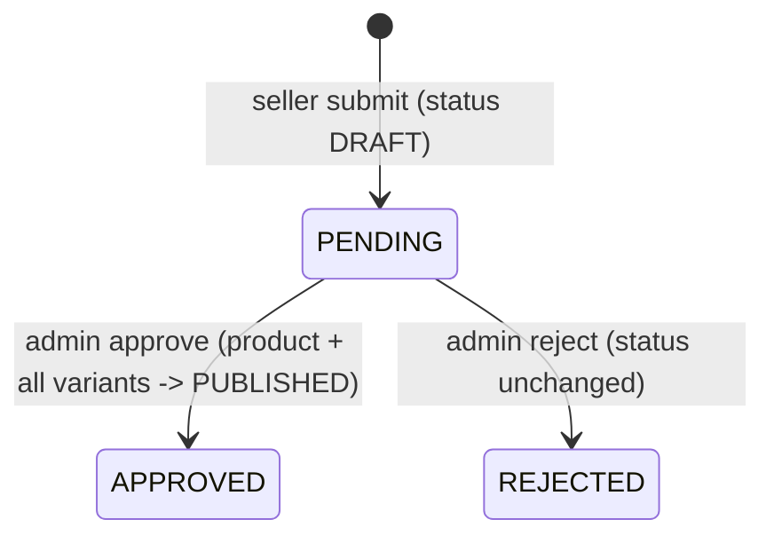

# Products

> The product/variant catalog: public search and detail with prices, stock and ratings; staff CRUD for products, variants and images; seller product submissions with an admin review queue; and `ProductReferencesService`, a small cycle-free lookup other modules use.

## Purpose and features

- **Anyone** searches published products (text, category, brand, attribute values; paginated, sortable), reads one by slug with its published variants, publicly eligible offers, current ZMW price, in-stock flag, shipping cost, image URLs and rating aggregate, and lists its published reviews.
- **Staff and admins** create and edit products, set product and variant status (`DRAFT`/`PUBLISHED`/`ARCHIVED`), manage variants (SKU, name, attribute values) and images, delete any of them, and work the seller-submission queue (approve publishes, reject leaves a draft).
- **Approved sellers** with a verified email submit a brand-new product for review, add variants and attach their own images while it is `PENDING`, and list/read their submissions.
- **Other modules** (offers, sellers) use `ProductReferencesService` to check that a variant exists or is published, and whether media assets are used as product images, without importing the whole products module.

Offers and prices are managed in [offers.md](offers.md); stock in [inventory.md](inventory.md); taxonomy in [catalog.md](catalog.md); upload of images in [media.md](media.md).

## Routes

Conventions (prefix, guards, envelope): see [../architecture.md](../architecture.md) and [../auth-and-access.md](../auth-and-access.md). `:id`, `:variantId`, `:mediaId` use `ParseUUIDPipe`. The public controller is `@Public()` at class level ([products.controller.ts:11](../../../services/commerce-api/src/modules/products/products.controller.ts#L11)); the admin controller is `@Roles(Role.STAFF, Role.ADMIN)` ([admin-products.controller.ts:29](../../../services/commerce-api/src/modules/products/admin-products.controller.ts#L29)); the seller controller is `@RequireVerifiedEmail()` with no `@Roles`, gated in the service ([seller-products.controller.ts:33](../../../services/commerce-api/src/modules/products/seller-products.controller.ts#L33)).

| Method | Path                                                          | Access                                                 | Idempotency                                       | Description                                                                                                                                                                                                |
| ------ | ------------------------------------------------------------- | ------------------------------------------------------ | ------------------------------------------------- | ---------------------------------------------------------------------------------------------------------------------------------------------------------------------------------------------------------- |
| GET    | /api/v1/catalog/products                                      | Public                                                 | n/a                                               | Paginated search: `q`, `categorySlug`, `brandSlug`, `attributeValueId[]`, `sort`, `currency` ([products.controller.ts:16](../../../services/commerce-api/src/modules/products/products.controller.ts#L16)) |
| GET    | /api/v1/catalog/products/:slug                                | Public                                                 | n/a                                               | Published product detail, `?currency` ([products.controller.ts:23](../../../services/commerce-api/src/modules/products/products.controller.ts#L23))                                                        |
| GET    | /api/v1/catalog/products/:slug/reviews                        | Public                                                 | n/a                                               | Published reviews, paginated, `rating`/`sort` ([products.controller.ts:31](../../../services/commerce-api/src/modules/products/products.controller.ts#L31))                                                |
| GET    | /api/v1/admin/catalog/products                                | Roles(STAFF, ADMIN)                                    | n/a                                               | All products with full relations, newest first, unpaginated ([admin-products.controller.ts:34](../../../services/commerce-api/src/modules/products/admin-products.controller.ts#L34))                      |
| GET    | /api/v1/admin/catalog/products/submissions/pending            | Roles(STAFF, ADMIN)                                    | n/a                                               | Seller submissions still `PENDING`, oldest first ([admin-products.controller.ts:42](../../../services/commerce-api/src/modules/products/admin-products.controller.ts#L42))                                 |
| GET    | /api/v1/admin/catalog/products/:id                            | Roles(STAFF, ADMIN)                                    | n/a                                               | One product with relations and signed image URLs ([admin-products.controller.ts:47](../../../services/commerce-api/src/modules/products/admin-products.controller.ts#L47))                                 |
| POST   | /api/v1/admin/catalog/products                                | Roles(STAFF, ADMIN)                                    | None (unique `slug` -> 409)                       | Create a platform product (`DRAFT`, submission `APPROVED`) ([admin-products.controller.ts:54](../../../services/commerce-api/src/modules/products/admin-products.controller.ts#L54))                       |
| PATCH  | /api/v1/admin/catalog/products/:id                            | Roles(STAFF, ADMIN)                                    | Naturally idempotent                              | Partial update ([admin-products.controller.ts:59](../../../services/commerce-api/src/modules/products/admin-products.controller.ts#L59))                                                                   |
| PATCH  | /api/v1/admin/catalog/products/:id/status                     | Roles(STAFF, ADMIN)                                    | Naturally idempotent                              | Set product status ([admin-products.controller.ts:67](../../../services/commerce-api/src/modules/products/admin-products.controller.ts#L67))                                                               |
| DELETE | /api/v1/admin/catalog/products/:id                            | Roles(STAFF, ADMIN)                                    | Second call returns 404                           | Hard delete, 204 ([admin-products.controller.ts:75](../../../services/commerce-api/src/modules/products/admin-products.controller.ts#L75))                                                                 |
| POST   | /api/v1/admin/catalog/products/:id/submissions/approve        | Roles(STAFF, ADMIN)                                    | Guarded by status (`PENDING` only; repeat -> 409) | Approve and publish product + all variants ([admin-products.controller.ts:83](../../../services/commerce-api/src/modules/products/admin-products.controller.ts#L83))                                       |
| POST   | /api/v1/admin/catalog/products/:id/submissions/reject         | Roles(STAFF, ADMIN)                                    | Guarded by status                                 | Reject with reason ([admin-products.controller.ts:92](../../../services/commerce-api/src/modules/products/admin-products.controller.ts#L92))                                                               |
| POST   | /api/v1/admin/catalog/products/:id/variants                   | Roles(STAFF, ADMIN)                                    | None (unique `skuCode` -> 409)                    | Add a variant ([admin-products.controller.ts:101](../../../services/commerce-api/src/modules/products/admin-products.controller.ts#L101))                                                                  |
| PATCH  | /api/v1/admin/catalog/products/:id/variants/:variantId        | Roles(STAFF, ADMIN)                                    | Naturally idempotent                              | Update SKU/name; `attributeValueIds` replaces the full set ([admin-products.controller.ts:109](../../../services/commerce-api/src/modules/products/admin-products.controller.ts#L109))                     |
| PATCH  | /api/v1/admin/catalog/products/:id/variants/:variantId/status | Roles(STAFF, ADMIN)                                    | Naturally idempotent                              | Set variant status ([admin-products.controller.ts:118](../../../services/commerce-api/src/modules/products/admin-products.controller.ts#L118))                                                             |
| DELETE | /api/v1/admin/catalog/products/:id/variants/:variantId        | Roles(STAFF, ADMIN)                                    | Second call returns 404                           | Hard delete, 204 ([admin-products.controller.ts:127](../../../services/commerce-api/src/modules/products/admin-products.controller.ts#L127))                                                               |
| POST   | /api/v1/admin/catalog/products/:id/media                      | Roles(STAFF, ADMIN)                                    | None (unique `(productId, mediaAssetId)` -> 409)  | Attach an image ([admin-products.controller.ts:136](../../../services/commerce-api/src/modules/products/admin-products.controller.ts#L136))                                                                |
| PATCH  | /api/v1/admin/catalog/products/:id/media/:mediaId             | Roles(STAFF, ADMIN)                                    | Naturally idempotent                              | `position`, `isPrimary` ([admin-products.controller.ts:144](../../../services/commerce-api/src/modules/products/admin-products.controller.ts#L144))                                                        |
| DELETE | /api/v1/admin/catalog/products/:id/media/:mediaId             | Roles(STAFF, ADMIN)                                    | Second call returns 404                           | Detach (asset itself untouched), 204 ([admin-products.controller.ts:153](../../../services/commerce-api/src/modules/products/admin-products.controller.ts#L153))                                           |
| GET    | /api/v1/sellers/me/products                                   | Verified email + seller record                         | n/a                                               | Own submissions, any status ([seller-products.controller.ts:37](../../../services/commerce-api/src/modules/products/seller-products.controller.ts#L37))                                                    |
| GET    | /api/v1/sellers/me/products/:id                               | Verified email + seller record                         | n/a                                               | One own submission; others' -> 404 ([seller-products.controller.ts:44](../../../services/commerce-api/src/modules/products/seller-products.controller.ts#L44))                                             |
| POST   | /api/v1/sellers/me/products                                   | Verified email + `requireApproved`                     | None (unique `slug` -> 409)                       | Submit a product (`PENDING`) ([seller-products.controller.ts:52](../../../services/commerce-api/src/modules/products/seller-products.controller.ts#L52))                                                   |
| POST   | /api/v1/sellers/me/products/:id/variants                      | Verified email + `requireApproved` + owner + `PENDING` | None (unique `skuCode`)                           | Add a variant ([seller-products.controller.ts:60](../../../services/commerce-api/src/modules/products/seller-products.controller.ts#L60))                                                                  |
| POST   | /api/v1/sellers/me/products/:id/media                         | Verified email + `requireApproved` + owner + `PENDING` | None (unique pair)                                | Attach an own image ([seller-products.controller.ts:69](../../../services/commerce-api/src/modules/products/seller-products.controller.ts#L69))                                                            |

Response shapes: public routes return `PublicProduct` / `PublicProductReview` ([products.types.ts:108](../../../services/commerce-api/src/modules/products/products.types.ts#L108)); admin and seller routes return `ProductWithRelations` (raw rows plus `media[].url`) ([products.types.ts:69](../../../services/commerce-api/src/modules/products/products.types.ts#L69)). Asset rows are projected with a `select` that leaves out the `BigInt` `byteSize` and storage details ([products.service.ts:65](../../../services/commerce-api/src/modules/products/products.service.ts#L65)).

## Services

| Service                                                                                                                                         | Responsibility                                                                                                                                                                                               | Key public methods                                                                                                                                                                                                                                                                                                                                                                                                                                                                                                                                  |
| ----------------------------------------------------------------------------------------------------------------------------------------------- | ------------------------------------------------------------------------------------------------------------------------------------------------------------------------------------------------------------ | --------------------------------------------------------------------------------------------------------------------------------------------------------------------------------------------------------------------------------------------------------------------------------------------------------------------------------------------------------------------------------------------------------------------------------------------------------------------------------------------------------------------------------------------------- |
| `ProductsService` ([products.service.ts](../../../services/commerce-api/src/modules/products/products.service.ts))                              | Public reads, admin CRUD, seller submissions and review.                                                                                                                                                     | `findPublished` ([:124](../../../services/commerce-api/src/modules/products/products.service.ts#L124)), `findPublishedBySlug` ([:180](../../../services/commerce-api/src/modules/products/products.service.ts#L180)), `findPublicReviews` ([:232](../../../services/commerce-api/src/modules/products/products.service.ts#L232)), `submitProduct` ([:550](../../../services/commerce-api/src/modules/products/products.service.ts#L550)), `reviewSubmission` ([:688](../../../services/commerce-api/src/modules/products/products.service.ts#L688)) |
| `ProductReferencesService` ([product-references.service.ts](../../../services/commerce-api/src/modules/products/product-references.service.ts)) | Cycle-free lookups; its module imports nothing ([product-references.module.ts:4](../../../services/commerce-api/src/modules/products/product-references.module.ts#L4)). All methods accept an optional `tx`. | `variantExists` ([:9](../../../services/commerce-api/src/modules/products/product-references.service.ts#L9)), `requirePublishedVariant` (variant **and** product `PUBLISHED`, else 404) ([:18](../../../services/commerce-api/src/modules/products/product-references.service.ts#L18)), `hasMediaAssignments` (dedupes ids) ([:32](../../../services/commerce-api/src/modules/products/product-references.service.ts#L32))                                                                                                                          |

## Business rules

This is `Product.submissionStatus`. Admin-created products start at `APPROVED` (schema default). Product and variant `status` (`DRAFT`/`PUBLISHED`/`ARCHIVED`) has no guarded transitions: the status routes set any value in any direction ([products.service.ts:370](../../../services/commerce-api/src/modules/products/products.service.ts#L370), [:458](../../../services/commerce-api/src/modules/products/products.service.ts#L458)).

**Public catalog**

- Only `status=PUBLISHED` products; within them only `PUBLISHED` variants and `PUBLISHED` offers that are **publicly eligible**: first-party (`sellerId` null) or a seller that is `APPROVED`, has `storefrontSlug` and `displayName`, and an active owner ([products.service.ts:85](../../../services/commerce-api/src/modules/products/products.service.ts#L85)).
- `q` matches product name or description (case-insensitive) or the `displayName` of an eligible seller with a published offer on a published variant ([products.service.ts:819](../../../services/commerce-api/src/modules/products/products.service.ts#L819)). `categorySlug`/`brandSlug` are exact matches; `attributeValueId` matches any variant with any of the values ([products.service.ts:858](../../../services/commerce-api/src/modules/products/products.service.ts#L858)).
- Sort fields allowed: `name`, `createdAt`; others are dropped silently; default `createdAt desc` ([products.service.ts:871](../../../services/commerce-api/src/modules/products/products.service.ts#L871)).
- `currency` must be in `SUPPORTED_CURRENCIES`, which is `['ZMW']` ([current-price.ts:7](../../../services/commerce-api/src/common/catalog/current-price.ts#L7)). `currentPrice` is the ZMW price whose window contains now, newest `startsAt` winning ([current-price.ts:34](../../../services/commerce-api/src/common/catalog/current-price.ts#L34)); `null` when none.
- Stock is batched in two queries: `PLATFORM`-stock offers read the variant's shared record, `SELLER`-stock offers their own record; `inStock = available > 0` ([products.service.ts:893](../../../services/commerce-api/src/modules/products/products.service.ts#L893)).
- Ratings come from `ProductRatingSummary`, never recomputed; a missing row means zeros ([products.service.ts:923](../../../services/commerce-api/src/modules/products/products.service.ts#L923)).
- Only `AVAILABLE` images are listed, each with a long-TTL signed URL ([products.service.ts:950](../../../services/commerce-api/src/modules/products/products.service.ts#L950)).
- Public reviews: `visibility=PUBLISHED` only, optional exact `rating`; the projection omits author id, order item and moderation data ([products.service.ts:245](../../../services/commerce-api/src/modules/products/products.service.ts#L245)).

**Admin writes**

- DTO: `name` non-empty, `slug` kebab-case, `description?`, `brandId?`/`categoryId?` UUID, `isReturnable?`, `returnWindowDays?` int >=0 ([create-product.dto.ts:13](../../../services/commerce-api/src/modules/products/dto/create-product.dto.ts#L13)). Update allows `null` for `brandId`, `categoryId`, `returnWindowDays` ([update-product.dto.ts:29](../../../services/commerce-api/src/modules/products/dto/update-product.dto.ts#L29)).
- Write errors: P2002 -> 409, P2003 (unknown brand/category/attribute value id) -> 400 ([products.service.ts:1004](../../../services/commerce-api/src/modules/products/products.service.ts#L1004)).
- Variant create/update and its attribute links run in one transaction; on update, a supplied `attributeValueIds` array (even empty) replaces all links ([products.service.ts:434](../../../services/commerce-api/src/modules/products/products.service.ts#L434)). Nothing checks that the values belong to distinct attributes.
- Child resources are scoped to the product in the path: a variant or product media of another product is 404 ([products.service.ts:776](../../../services/commerce-api/src/modules/products/products.service.ts#L776), [:791](../../../services/commerce-api/src/modules/products/products.service.ts#L791)).
- Attach image: `requireProductAsset` (exists, `AVAILABLE`, not verification-locked) then, in a transaction, `lockForProductAttachment`, clear other `isPrimary` if this one is primary, create the link ([products.service.ts:476](../../../services/commerce-api/src/modules/products/products.service.ts#L476)). The same primary-clearing applies on media update ([products.service.ts:520](../../../services/commerce-api/src/modules/products/products.service.ts#L520)).

**Seller submissions**

- `submitProduct` requires `requireApproved` and creates with `createdBySellerId` and `submissionStatus=PENDING` ([products.service.ts:554](../../../services/commerce-api/src/modules/products/products.service.ts#L554)).
- Every submission write goes through `ownedSubmission`: approved seller, product owned (else 404), still `PENDING` (else 409) ([products.service.ts:735](../../../services/commerce-api/src/modules/products/products.service.ts#L735)).
- A seller may attach only an asset they uploaded (400 otherwise) ([products.service.ts:753](../../../services/commerce-api/src/modules/products/products.service.ts#L753)).
- Reads use `SellersService.mine`, so a suspended or rejected seller can still list and read submissions ([products.service.ts:645](../../../services/commerce-api/src/modules/products/products.service.ts#L645)).
- Sellers cannot edit, delete, remove variants/images, or resubmit; there is no route for it.

**Review**

- `reason` 3-1000 chars, non-blank, required for both decisions ([review-product-submission.dto.ts:9](../../../services/commerce-api/src/modules/products/dto/review-product-submission.dto.ts#L9)).
- Only seller-created products (404 otherwise); CAS `updateMany where submissionStatus=PENDING`, 0 rows -> 409; records `reviewReason/reviewedBy/reviewedAt`; approve also sets `status=PUBLISHED` and publishes every variant in the same transaction ([products.service.ts:699](../../../services/commerce-api/src/modules/products/products.service.ts#L699)). There is no `version` column.

## Data

| Model                                   | Access                                                                                                                         |
| --------------------------------------- | ------------------------------------------------------------------------------------------------------------------------------ |
| `Product`                               | Read/write ([schema.prisma:477](../../../services/commerce-api/prisma/schema.prisma#L477))                                     |
| `ProductVariant`                        | Read/write; `skuCode` globally unique ([schema.prisma:515](../../../services/commerce-api/prisma/schema.prisma#L515))          |
| `ProductVariantAttributeValue`          | createMany / deleteMany                                                                                                        |
| `ProductMedia`                          | Read/write; unique `(productId, mediaAssetId)` ([schema.prisma:546](../../../services/commerce-api/prisma/schema.prisma#L546)) |
| `Offer`, `Price`, `Seller`              | Read (included in product reads)                                                                                               |
| `ProductReview`, `ProductRatingSummary` | Read                                                                                                                           |
| `MediaAsset`                            | Read (owner check); lock via `MediaService`                                                                                    |

## Dependencies

- Imports `MediaModule` (asset checks, signed URLs), `InventoryModule` (`getAvailableQuantities`, `getAvailableOfferQuantities`), `SellersModule` (`requireApproved`, `mine`, `PUBLIC_STOREFRONT_SELECT`) ([products.module.ts:12](../../../services/commerce-api/src/modules/products/products.module.ts#L12)).
- Reuses review helpers from `../reviews` (`reviewOrderBy`, `formatReviewerLabel`, rating-summary utils, `ReviewListQueryDto`).
- Exports `ProductsService`, which no other module injects. `ProductReferencesModule` is imported by `OffersModule` and `SellersModule`.

## Jobs and events

None. No audit rows or outbox events for product changes or submission decisions.

## Configuration

None directly. Image URL TTL is `MEDIA_PUBLIC_URL_TTL_SECONDS` (see [media.md](media.md)).

## Tests

- [products.service.spec.ts](../../../services/commerce-api/src/modules/products/products.service.spec.ts): price resolution and pagination, out-of-stock, public offer eligibility, seller storefront on offers, filters and seller-name search, not-found, rating defaults/histogram, review projection/visibility/rating filter/pagination, slug and SKU conflicts, variant transaction, unavailable media, submission gate/ownership/pending, foreign media, review CAS, approve publishes variants, reject leaves variants.
- [product-references.service.spec.ts](../../../services/commerce-api/src/modules/products/product-references.service.spec.ts): published variant and product required; media ids deduplicated.
- [test/catalog.e2e-spec.ts](../../../services/commerce-api/test/catalog.e2e-spec.ts): draft hidden (404), then variant + offer + price + publish makes it publicly visible with the ZMW price.
- Untested: delete cascades, admin media update/detach, seller routes over HTTP.

## Known gaps

- Deleting a product or variant cascades `ProductVariant -> Offer -> OrderItem/CartItem/InventoryRecord` ([schema.prisma:564](../../../services/commerce-api/prisma/schema.prisma#L564), [:964](../../../services/commerce-api/prisma/schema.prisma#L964)). Unpaid order lines can be silently deleted; when a `Restrict` FK blocks it (fulfillment line, PO line, review), `remove` does not map P2003 and returns 500 ([products.service.ts:382](../../../services/commerce-api/src/modules/products/products.service.ts#L382), [:471](../../../services/commerce-api/src/modules/products/products.service.ts#L471)). Archiving via status is the safe path.
- `updateStatus` ignores `submissionStatus`, so staff can publish a `PENDING` or `REJECTED` seller submission directly ([products.service.ts:370](../../../services/commerce-api/src/modules/products/products.service.ts#L370)).
- `reviewSubmission` does not re-check the admin in the DB, block self-review, or audit the decision, unlike seller review ([products.service.ts:688](../../../services/commerce-api/src/modules/products/products.service.ts#L688)).
- No resubmission path after `REJECTED`, and no seller edit route.
- The `attributeValueId` filter does not require the matching variant to be published ([products.service.ts:859](../../../services/commerce-api/src/modules/products/products.service.ts#L859)); products with no purchasable offer still appear in search.
- Admin list and seller list are unpaginated and load every variant, offer and price.
- Deleting the primary image leaves the product with no primary; nothing promotes another one ([products.service.ts:537](../../../services/commerce-api/src/modules/products/products.service.ts#L537)).
