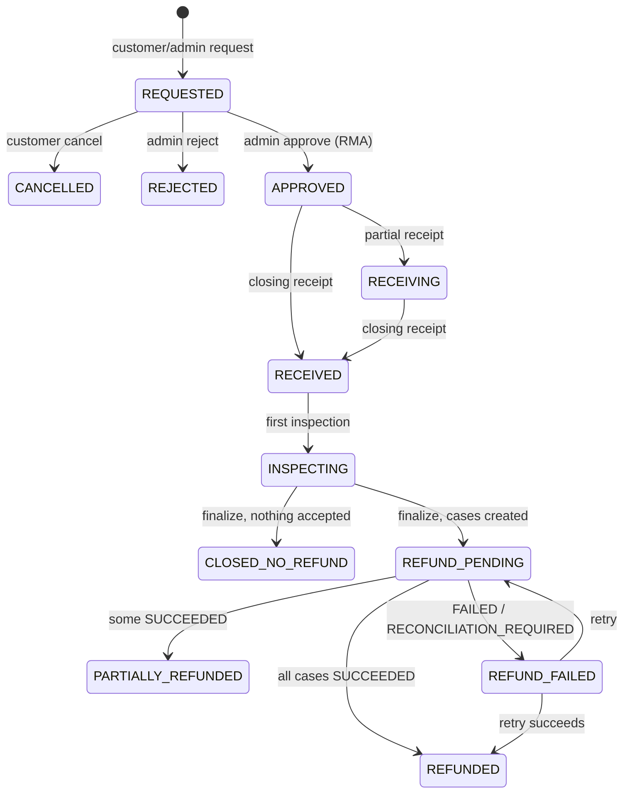

# Returns

> Customer return requests (RMA) against delivered shipment lines. Covers window-based eligibility, admin approval, warehouse receipts, inspections with restock, and the handoff to refund cases. Sellers get a read-only view of their own return lines.

## Purpose and features

- **Customers** check per-item return eligibility for an order, request a return (one or more order items), list and view their returns, and cancel one that is still `REQUESTED`.
- **Admins** create a return on a customer's behalf, approve it (assigning an RMA number, warehouse and optional staff member), reject it, finalize inspection and retry a return's refund case.
- **Staff** assigned to a return (and any admin) post receipts and inspections. A final inspection opens one refund case per seller order.
- **Approved sellers** list the `ReturnItem` rows on their own seller orders, with received/accepted/rejected quantities and refund outcomes. `seller-orders.service.ts` reuses the same projection for order detail.

## Routes

Conventions: see [../architecture.md](../architecture.md) and [../auth-and-access.md](../auth-and-access.md).

| Method | Path                                                       | Access                                             | Idempotency                                           | Description                                                                                                                                                                                             |
| ------ | ---------------------------------------------------------- | -------------------------------------------------- | ----------------------------------------------------- | ------------------------------------------------------------------------------------------------------------------------------------------------------------------------------------------------------- |
| GET    | /api/v1/orders/:orderId/return-eligibility                 | Authenticated (order owner)                        | n/a                                                   | Per-order-item eligibility and delivered chunks ([customer-returns.controller.ts:31](../../../services/commerce-api/src/modules/returns/customer-returns.controller.ts#L31))                            |
| POST   | /api/v1/orders/:orderId/returns                            | Authenticated (order owner)                        | **Idempotency-Key required** (UUID v4) + request hash | Request a return ([customer-returns.controller.ts:39](../../../services/commerce-api/src/modules/returns/customer-returns.controller.ts#L39))                                                           |
| GET    | /api/v1/returns                                            | Authenticated                                      | n/a                                                   | Own returns, newest first, unpaginated ([customer-returns.controller.ts:54](../../../services/commerce-api/src/modules/returns/customer-returns.controller.ts#L54))                                     |
| GET    | /api/v1/returns/:id                                        | Authenticated (owner, else 404)                    | n/a                                                   | Own return with detail ([customer-returns.controller.ts:59](../../../services/commerce-api/src/modules/returns/customer-returns.controller.ts#L59))                                                     |
| POST   | /api/v1/returns/:id/cancel                                 | Authenticated (owner)                              | Body `version`                                        | REQUESTED -> CANCELLED ([customer-returns.controller.ts:67](../../../services/commerce-api/src/modules/returns/customer-returns.controller.ts#L67))                                                     |
| POST   | /api/v1/admin/returns                                      | Roles(ADMIN)                                       | **Idempotency-Key required** + request hash           | Create on behalf of `userId` for `orderId` ([admin-returns.controller.ts:44](../../../services/commerce-api/src/modules/returns/admin-returns.controller.ts#L44))                                       |
| GET    | /api/v1/admin/returns                                      | Roles(STAFF, ADMIN)                                | n/a                                                   | Paginated, filters `status`, `warehouseId`, `assignedStaffId`, `dateFrom/dateTo` ([admin-returns.controller.ts:57](../../../services/commerce-api/src/modules/returns/admin-returns.controller.ts#L57)) |
| GET    | /api/v1/admin/returns/:id                                  | Roles(STAFF, ADMIN)                                | n/a                                                   | Any return with detail ([admin-returns.controller.ts:62](../../../services/commerce-api/src/modules/returns/admin-returns.controller.ts#L62))                                                           |
| POST   | /api/v1/admin/returns/:id/approve                          | Roles(ADMIN)                                       | Body `version`                                        | REQUESTED -> APPROVED, issue RMA ([admin-returns.controller.ts:68](../../../services/commerce-api/src/modules/returns/admin-returns.controller.ts#L68))                                                 |
| POST   | /api/v1/admin/returns/:id/reject                           | Roles(ADMIN)                                       | Body `version`                                        | REQUESTED -> REJECTED ([admin-returns.controller.ts:78](../../../services/commerce-api/src/modules/returns/admin-returns.controller.ts#L78))                                                            |
| POST   | /api/v1/admin/returns/:id/receipts                         | Roles(STAFF, ADMIN); assigned staff or admin       | **Idempotency-Key required** + request hash           | Post a receipt; `isClosing` ends receiving ([admin-returns.controller.ts:87](../../../services/commerce-api/src/modules/returns/admin-returns.controller.ts#L87))                                       |
| POST   | /api/v1/admin/returns/:id/inspections                      | Roles(STAFF, ADMIN); assigned staff or admin       | **Idempotency-Key required** + request hash           | Post inspection lines; `isFinal` finalizes ([admin-returns.controller.ts:103](../../../services/commerce-api/src/modules/returns/admin-returns.controller.ts#L103))                                     |
| POST   | /api/v1/admin/returns/:id/finalize-inspection              | Roles(ADMIN)                                       | Replay-safe (no-op unless INSPECTING)                 | Finalize separately, optional `shippingRefunds` ([admin-returns.controller.ts:121](../../../services/commerce-api/src/modules/returns/admin-returns.controller.ts#L121))                                |
| POST   | /api/v1/admin/returns/:id/refund-cases/:refundCaseId/retry | Roles(ADMIN)                                       | Delegated to `RefundCasesService.retry`               | Retry a refund case of this return ([admin-returns.controller.ts:135](../../../services/commerce-api/src/modules/returns/admin-returns.controller.ts#L135))                                             |
| GET    | /api/v1/sellers/me/returns                                 | Authenticated + verified email + `requireApproved` | n/a                                                   | Own return lines, paginated, filters `status`, `dateFrom/dateTo` ([seller-returns.controller.ts:15](../../../services/commerce-api/src/modules/returns/seller-returns.controller.ts#L15))               |

`@Roles(Role.STAFF, Role.ADMIN)` is set at class level on the admin controller ([admin-returns.controller.ts:38](../../../services/commerce-api/src/modules/returns/admin-returns.controller.ts#L38)). The Idempotency-Key must be a UUID v4, else 400 ([admin-returns.controller.ts:28](../../../services/commerce-api/src/modules/returns/admin-returns.controller.ts#L28)).

## Services

| Service                                                                                                                                                                  | Responsibility                                                                                                             |
| ------------------------------------------------------------------------------------------------------------------------------------------------------------------------ | -------------------------------------------------------------------------------------------------------------------------- |
| `ReturnsService` ([returns.service.ts](../../../services/commerce-api/src/modules/returns/returns.service.ts))                                                           | Eligibility, request/cancel, approve/reject, receipts, inspections, finalize, refund-case fan-out. Exported.               |
| `SellerReturnsService` ([seller-returns.service.ts](../../../services/commerce-api/src/modules/returns/seller-returns.service.ts))                                       | Seller-scoped `ReturnItem` list ([:22](../../../services/commerce-api/src/modules/returns/seller-returns.service.ts#L22)). |
| `computeItemEligibility`, `allocateGreedy` ([return-eligibility.ts](../../../services/commerce-api/src/modules/returns/return-eligibility.ts))                           | Pure eligibility and allocation math.                                                                                      |
| `projectSellerReturnItem` + `SELLER_RETURN_ITEM_INCLUDE` ([seller-return-projection.ts](../../../services/commerce-api/src/modules/returns/seller-return-projection.ts)) | Seller line projection, shared with `seller-orders.service.ts`.                                                            |

## Business rules

### Lifecycle

After finalize, `RefundCasesService.projectReturnStatus` re-projects the return status every time a refund case changes ([refund-cases.service.ts:565](../../../services/commerce-api/src/modules/payments/refund-cases.service.ts#L565)).

### Eligibility

- **Delivered chunks.** A chunk is one `ShipmentLine` on a shipment whose **current** status is `DELIVERED` and which has `deliveredAt` set ([returns.service.ts:139](../../../services/commerce-api/src/modules/returns/returns.service.ts#L139)).
- **Claimed quantity.** This is the sum of `allocation.quantity - releasedQuantity` over returns in any status except `REJECTED`/`CANCELLED`. Completed returns keep their claim ([returns.service.ts:58](../../../services/commerce-api/src/modules/returns/returns.service.ts#L58), [:160](../../../services/commerce-api/src/modules/returns/returns.service.ts#L160)).
- **Item eligibility** ([return-eligibility.ts:42](../../../services/commerce-api/src/modules/returns/return-eligibility.ts#L42)):
  - The product must be `isReturnable`.
  - It must have at least one delivered chunk.
  - Window = `product.returnWindowDays ?? 30`. Each chunk's `eligibleUntil` is `deliveredAt + window`.
  - Eligible when unexpired, unclaimed quantity > 0.
- **Allocation.** Greedy, oldest delivery first, across unexpired chunks. If the full quantity cannot be covered, the whole request fails; there are no partial fills ([return-eligibility.ts:105](../../../services/commerce-api/src/modules/returns/return-eligibility.ts#L105)).

### Request

`requestReturn` ([returns.service.ts:193](../../../services/commerce-api/src/modules/returns/returns.service.ts#L193)):

- **Input.** Order item ids must be unique. The request hash is sha256 of `{orderId, userId, items sorted by orderItemId}`.
- **Replay.** A replay needs the same key, order, user and hash; anything else is 409 ([:210](../../../services/commerce-api/src/modules/returns/returns.service.ts#L210)).
- **Order checks.** The order must belong to `userId` (404 otherwise), including on the admin path. The payment must be `SUCCEEDED | PARTIALLY_REFUNDED | REFUNDED` ([:234](../../../services/commerce-api/src/modules/returns/returns.service.ts#L234)). Every item must belong to the order.
- **Transaction.** It locks the candidate `shipment_lines` `FOR UPDATE` and re-reads the chunks. It checks eligibility and allocates each item; ineligible or short items return 409 ([:274](../../../services/commerce-api/src/modules/returns/returns.service.ts#L274)).
- **Snapshot.** It creates the `ReturnRequest`, one `ReturnItem` per order item and the `ReturnItemAllocation` rows. Each item snapshots `unitAmount`, `currency`, `returnWindowDays` and the first chunk's `deliveredAt`/`eligibleUntil`.
- **Reasons.** Reason codes: `CUSTOMER_REMORSE, WRONG_ITEM, DAMAGED, DEFECTIVE, NOT_AS_DESCRIBED, SIZE_FIT, OTHER`. A `note` is optional.
- **Errors.** P2002 maps to 409 ([:1231](../../../services/commerce-api/src/modules/returns/returns.service.ts#L1231)).

### Cancel, approve, reject

- **Customer cancel.** A CAS on `{id, userId, status: REQUESTED, version}` ([returns.service.ts:394](../../../services/commerce-api/src/modules/returns/returns.service.ts#L394)).
- **Approve** ([returns.service.ts:468](../../../services/commerce-api/src/modules/returns/returns.service.ts#L468)):
  - The status must be `REQUESTED`: checked before the transaction, then again in a CAS with `version`.
  - Sets `warehouseId`, optional `assignedStaffId`, an `rmaNumber` from `NumberingService.nextReturnRmaNumber`, and templated `rmaInstructions`.
- **Reject.** Same guards, with a required `rejectionReason` ([returns.service.ts:514](../../../services/commerce-api/src/modules/returns/returns.service.ts#L514)).

### Receipts

`postReceipt` ([returns.service.ts:559](../../../services/commerce-api/src/modules/returns/returns.service.ts#L559)):

- **Replay.** `ReturnReceipt.idempotencyKey` plus a hash of `{id, warehouseId, isClosing, lines}`.
- **Checks.** Under `FOR UPDATE` on `return_requests`:
  - The caller must be the assigned staff member or an admin, else 403 ([:1199](../../../services/commerce-api/src/modules/returns/returns.service.ts#L1199)).
  - The status must be `APPROVED | RECEIVING`.
  - `warehouseId` must equal the return's warehouse ([:611](../../../services/commerce-api/src/modules/returns/returns.service.ts#L611)).
  - Cumulative received per item must stay at or below the requested quantity ([:628](../../../services/commerce-api/src/modules/returns/returns.service.ts#L628)).
- **Non-closing receipt.** It moves `APPROVED` to `RECEIVING`.
- **Closing receipt.** For each item with unreceived quantity, it releases that quantity from the allocations (last allocation first), which frees it for another return. It then sets `RECEIVED` ([:667](../../../services/commerce-api/src/modules/returns/returns.service.ts#L667)).

### Inspections and restock

`postInspection` ([returns.service.ts:737](../../../services/commerce-api/src/modules/returns/returns.service.ts#L737)):

- **Replay.** `ReturnInspection.idempotencyKey` plus a hash that includes `isFinal` and `shippingRefunds`. An `isFinal` replay re-runs the pending refund processing ([:774](../../../services/commerce-api/src/modules/returns/returns.service.ts#L774)).
- **Access and status.** Assigned staff or an admin. The status must be `RECEIVED | INSPECTING`; the first inspection moves the return to `INSPECTING`.
- **Line rules** ([:952](../../../services/commerce-api/src/modules/returns/returns.service.ts#L952)):
  - The line's warehouse must match the return's.
  - `acceptedQuantity > 0` requires a `disposition` (`RESTOCK | QUARANTINE | DAMAGED | DISPOSE`).
  - `rejectedQuantity > 0` requires a `rejectionReason`.
  - accepted + rejected must be > 0.
  - Cumulative handled quantity must stay at or below received, including lines in the same call.
- **Restock.** Only `RESTOCK` lines with accepted > 0 call `InventoryService.receiveReturnedStock(warehouseId, variantId, accepted, {referenceType: 'return_inspection_line', referenceId: line.id})`. That call is idempotent on its reference. Other dispositions move no stock ([:864](../../../services/commerce-api/src/modules/returns/returns.service.ts#L864)).

### Finalize and refund-case handoff

`finalizeInternal` runs inline for `isFinal`, or via `finalize-inspection` when the return is `INSPECTING` ([returns.service.ts:1005](../../../services/commerce-api/src/modules/returns/returns.service.ts#L1005)):

1. **Completeness.** Every item must have handled >= received, else 409.
2. **Nothing accepted.** If total accepted is 0, the return becomes `CLOSED_NO_REFUND`.
3. **Grouping.** Accepted items are grouped by `orderItem.sellerOrderId`. Items with no seller order are skipped ([:1068](../../../services/commerce-api/src/modules/returns/returns.service.ts#L1068)). The amount is `accepted * unitAmount`.
4. **Shipping refunds.** Each `shippingRefunds[]` entry must name a seller order in the accepted groups, else 400. Shipping defaults to 0 ([:1079](../../../services/commerce-api/src/modules/returns/returns.service.ts#L1079)).
5. **Refund cases.** It calls `RefundCasesService.prepareCase` once per seller order in the same transaction: `source RETURN`, `amount = items + shipping`, idempotency key `return-finalize:<returnId>:<sellerOrderId>` ([:1099](../../../services/commerce-api/src/modules/returns/returns.service.ts#L1099)).
6. **Status.** The return status is set from the case statuses at creation, normally `REFUND_PENDING` ([:1116](../../../services/commerce-api/src/modules/returns/returns.service.ts#L1116)).
7. **Processing.** After commit, each `PENDING` case is processed through `refundCasesService.processPending`, outside the transaction ([:1212](../../../services/commerce-api/src/modules/returns/returns.service.ts#L1212)).

### Seller projection

- `requireApproved` first. The query covers `ReturnItem` rows whose `orderItem.sellerOrder.sellerId` is the caller's, so items from other sellers on the same request are never exposed ([seller-returns.service.ts:26](../../../services/commerce-api/src/modules/returns/seller-returns.service.ts#L26)).
- **Projection.** `status` comes from the parent request. `received`, `accepted` and `rejected` are sums over receipt/inspection lines. `refunds` lists only cases with source `RETURN` ([seller-return-projection.ts:28](../../../services/commerce-api/src/modules/returns/seller-return-projection.ts#L28)).

## Data

| Model                                                | Access                                                                                                |
| ---------------------------------------------------- | ----------------------------------------------------------------------------------------------------- |
| `ReturnRequest`                                      | create, `FOR UPDATE` lock, CAS/status updates, read                                                   |
| `ReturnItem` (unique `returnRequestId, orderItemId`) | create, read                                                                                          |
| `ReturnItemAllocation`                               | create, `releasedQuantity` update                                                                     |
| `ReturnReceipt`, `ReturnReceiptLine`                 | create (immutable), read                                                                              |
| `ReturnInspection`, `ReturnInspectionLine`           | create (immutable), read                                                                              |
| `ReturnEvent`                                        | append (`STATUS_CHANGED`, `RECEIPT_POSTED`, `CLOSING_RECEIPT_RELEASED_QUANTITY`, `INSPECTION_POSTED`) |
| `RefundCase`, `RefundCaseItem`                       | created through `RefundCasesService`                                                                  |
| `ShipmentLine`                                       | `FOR UPDATE` lock, read                                                                               |
| `Order`, `OrderItem`, `Payment`, `Product`           | read                                                                                                  |
| `InventoryRecord`, `InventoryMovement`               | via `InventoryService.receiveReturnedStock`                                                           |

## Dependencies

- Imports `InventoryModule`, `NumberingModule`, `PaymentsModule` (`RefundCasesService`) and `SellersModule` ([returns.module.ts:14](../../../services/commerce-api/src/modules/returns/returns.module.ts#L14)).
- Relies on shipments for `DELIVERED` status and `deliveredAt` ([shipments.md](shipments.md)).
- `seller-orders.service.ts` imports `SELLER_RETURN_ITEM_INCLUDE`.

## Jobs and events

None. There are no outbox topics, no background jobs and no scheduled tasks. Refund processing is called inline after commit. `ReturnEvent` is an internal history table.

## Configuration

None. The default window of 30 days is a constant ([return-eligibility.ts:5](../../../services/commerce-api/src/modules/returns/return-eligibility.ts#L5)).

## Tests

- [returns.service.spec.ts](../../../services/commerce-api/src/modules/returns/returns.service.spec.ts):
  - Eligibility (not returnable, undelivered, custom window, expiry, claimed) and greedy allocation.
  - Cancel CAS and 404; approve/reject guards.
  - Receipt: assignment, partial vs closing, warehouse mismatch.
  - Inspection: disposition/reason rules, quantity cap, RESTOCK-only restock, status move.
  - Finalize: incomplete, no refund, one case per seller order.
- [seller-returns.service.spec.ts](../../../services/commerce-api/src/modules/returns/seller-returns.service.spec.ts): seller scoping within multi-seller requests; filters.
- [test/returns.integration-spec.ts](../../../services/commerce-api/test/returns.integration-spec.ts) (real Postgres): cumulative receipt cap, replay with the same vs changed input, DB uniqueness of one item per order item.
- No tests for `requestReturn` end to end, `finalizeInspection`, `retryRefundCase` or the admin on-behalf path.

## Known gaps

- **Staff can finalize.** `isFinal: true` on `POST /inspections` lets assigned **staff** finalize and open refund cases, although the standalone `finalize-inspection` route is ADMIN-only ([returns.service.ts:881](../../../services/commerce-api/src/modules/returns/returns.service.ts#L881), [admin-returns.controller.ts:120](../../../services/commerce-api/src/modules/returns/admin-returns.controller.ts#L120)).
- **Seller-owned stock is restocked into the platform warehouse.** Restock always credits the return's warehouse through `receiveReturnedStock`, even for items from SELLER-mode offers whose stock is offer-scoped with no warehouse ([returns.service.ts:871](../../../services/commerce-api/src/modules/returns/returns.service.ts#L871)).
- **Items without a seller order are never refunded.** Accepted items with no `sellerOrderId` are skipped. If every accepted item is skipped, the return lands in `REFUND_PENDING` with no refund cases and nothing re-projects it ([returns.service.ts:1068](../../../services/commerce-api/src/modules/returns/returns.service.ts#L1068), [:1116](../../../services/commerce-api/src/modules/returns/returns.service.ts#L1116)).
- **Approve does not validate its inputs.** It does not check that `warehouseId` exists or is active, nor that `assignedStaffId` is an active STAFF user ([returns.service.ts:483](../../../services/commerce-api/src/modules/returns/returns.service.ts#L483)).
- **No audit trail.** There are no `AuditEvent` writes anywhere in returns; admin approve/reject/finalize and on-behalf creation are recorded only in `ReturnEvent`.
- **Eligibility follows the shipment's current status.** A later tracking correction away from `DELIVERED` makes items ineligible, and a correction to `DELIVERED` makes them eligible ([returns.service.ts:147](../../../services/commerce-api/src/modules/returns/returns.service.ts#L147)).
- **Concurrent retries with the same key get 409.** Two concurrent first-time requests with the same Idempotency-Key produce a P2002, which maps to 409 instead of a replay, because the replay check runs outside the transaction ([returns.service.ts:210](../../../services/commerce-api/src/modules/returns/returns.service.ts#L210)).
- **Refund processing can leave cases `PENDING`.** Refunds are processed synchronously after commit. A crash in between leaves `PENDING` cases until admin retry or another replay. No job backs this up ([returns.service.ts:895](../../../services/commerce-api/src/modules/returns/returns.service.ts#L895)).
- **Finalizing an uninspected return is a silent no-op.** `finalize-inspection` on a `RECEIVED` return (no inspection posted yet) returns it unchanged, with no error ([returns.service.ts:923](../../../services/commerce-api/src/modules/returns/returns.service.ts#L923)).
- **`GET /returns` is unpaginated** ([returns.service.ts:368](../../../services/commerce-api/src/modules/returns/returns.service.ts#L368)).
