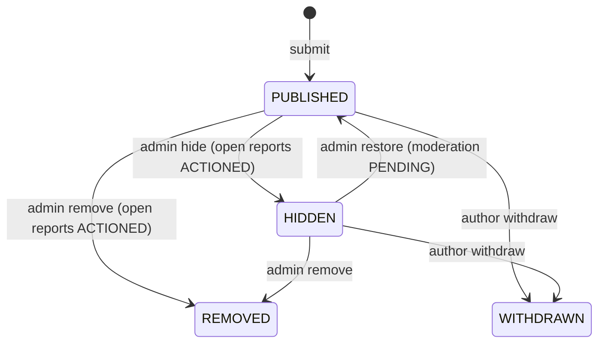
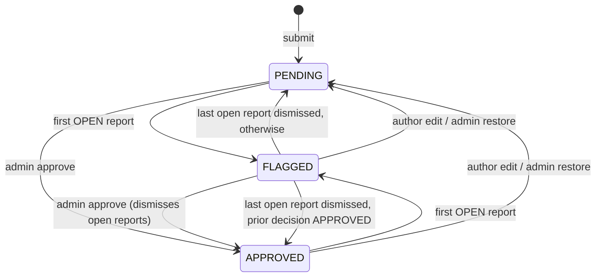

# Reviews

> Verified-purchase product reviews (one per delivered order item) and seller ratings (one per delivered seller order): submission, edit window, withdrawal, reports, admin moderation, and exact per-product/per-seller rating aggregates with a rebuild/check script.

## Purpose and features

- **Customers** check what they can review on an order, submit a product review or seller rating once delivery is complete, edit within 30 days, withdraw, list their own reviews, and report other people's published content.
- **Admins** (`reviews/admin` submodule) work a unified moderation queue across both tables, approve, hide, remove or restore a record, and dismiss individual reports. Every action is audited.
- **Aggregates**: `ProductRatingSummary` / `SellerRatingSummary` are recomputed from scratch from PUBLISHED rows inside every visibility-changing transaction. `scripts/rebuild-review-summaries.ts` repairs or checks them.
- **Publish-then-moderate**: new content is PUBLISHED immediately with moderation state PENDING. Public reads show PUBLISHED records regardless of moderation state.
- Public read routes are owned elsewhere: `GET /api/v1/catalog/products/:slug/reviews` ([products.controller.ts:31](../../../services/commerce-api/src/modules/products/products.controller.ts#L31)) and `GET /api/v1/storefronts/:slug/ratings` ([sellers.md](sellers.md)). Both use this module's `ReviewListQueryDto`, `reviewOrderBy`, `formatReviewerLabel` and rating-summary helpers.

## Routes

Conventions (prefix, guards, envelope, Idempotency-Key format): see [../architecture.md](../architecture.md), [../auth-and-access.md](../auth-and-access.md). "Throttled" = `@Throttle` 10 requests / 60 s instead of the app default ([customer-reviews.controller.ts:32](../../../services/commerce-api/src/modules/reviews/customer-reviews.controller.ts#L32)).

| Method | Path                                     | Access                                | Idempotency                                        | Description                                                                                                                                                                                                                                                                         |
| ------ | ---------------------------------------- | ------------------------------------- | -------------------------------------------------- | ----------------------------------------------------------------------------------------------------------------------------------------------------------------------------------------------------------------------------------------------------------------------------------- |
| GET    | /api/v1/reviews/eligibility              | Authenticated (order owner, else 404) | n/a                                                | Per-item and per-seller-order eligibility for `?orderId=` ([customer-reviews.controller.ts:45](../../../services/commerce-api/src/modules/reviews/customer-reviews.controller.ts#L45))                                                                                              |
| GET    | /api/v1/reviews/me                       | Authenticated                         | n/a                                                | Own reviews + ratings merged, newest first, `page`/`limit` ([customer-reviews.controller.ts:53](../../../services/commerce-api/src/modules/reviews/customer-reviews.controller.ts#L53))                                                                                             |
| POST   | /api/v1/reviews/products                 | Authenticated, throttled              | None; unique `orderItemId` -> 409                  | Submit product review ([customer-reviews.controller.ts:61](../../../services/commerce-api/src/modules/reviews/customer-reviews.controller.ts#L61))                                                                                                                                  |
| POST   | /api/v1/reviews/sellers                  | Authenticated, throttled              | None; unique `sellerOrderId` -> 409                | Submit seller rating ([customer-reviews.controller.ts:70](../../../services/commerce-api/src/modules/reviews/customer-reviews.controller.ts#L70))                                                                                                                                   |
| PATCH  | /api/v1/reviews/products/:id             | Author, throttled                     | **Idempotency-Key required** + body `version`      | Edit review ([customer-reviews.controller.ts:79](../../../services/commerce-api/src/modules/reviews/customer-reviews.controller.ts#L79))                                                                                                                                            |
| PATCH  | /api/v1/reviews/sellers/:id              | Author, throttled                     | **Idempotency-Key required** + body `version`      | Edit rating ([customer-reviews.controller.ts:95](../../../services/commerce-api/src/modules/reviews/customer-reviews.controller.ts#L95))                                                                                                                                            |
| DELETE | /api/v1/reviews/products/:id             | Author                                | **Idempotency-Key required**                       | Withdraw review; 200 with the record ([customer-reviews.controller.ts:111](../../../services/commerce-api/src/modules/reviews/customer-reviews.controller.ts#L111))                                                                                                                 |
| DELETE | /api/v1/reviews/sellers/:id              | Author                                | **Idempotency-Key required**                       | Withdraw rating ([customer-reviews.controller.ts:125](../../../services/commerce-api/src/modules/reviews/customer-reviews.controller.ts#L125))                                                                                                                                      |
| POST   | /api/v1/reviews/products/:id/reports     | Authenticated (not author), throttled | **Idempotency-Key required**                       | Report a PUBLISHED review ([customer-reviews.controller.ts:139](../../../services/commerce-api/src/modules/reviews/customer-reviews.controller.ts#L139))                                                                                                                            |
| POST   | /api/v1/reviews/sellers/:id/reports      | Authenticated (not author), throttled | **Idempotency-Key required**                       | Report a PUBLISHED rating ([customer-reviews.controller.ts:155](../../../services/commerce-api/src/modules/reviews/customer-reviews.controller.ts#L155))                                                                                                                            |
| GET    | /api/v1/admin/reviews                    | Roles(ADMIN)                          | n/a                                                | Unified queue; filters `type`, `moderationState`, `visibility`, `hasOpenReport`, `rating`, `productId`, `sellerId`, `createdFrom/To`, `updatedFrom/To` ([admin-reviews.controller.ts:49](../../../services/commerce-api/src/modules/reviews/admin/admin-reviews.controller.ts#L49)) |
| GET    | /api/v1/admin/reviews/:type/:id          | Roles(ADMIN)                          | n/a                                                | Detail with author, reports and moderation events; `type` = `product` or `seller` ([admin-reviews.controller.ts:54](../../../services/commerce-api/src/modules/reviews/admin/admin-reviews.controller.ts#L54))                                                                      |
| POST   | /api/v1/admin/reviews/:type/:id/approve  | Roles(ADMIN)                          | **Idempotency-Key required** + body `version`      | Set APPROVED, dismiss open reports ([admin-reviews.controller.ts:63](../../../services/commerce-api/src/modules/reviews/admin/admin-reviews.controller.ts#L63))                                                                                                                     |
| POST   | /api/v1/admin/reviews/:type/:id/hide     | Roles(ADMIN)                          | **Idempotency-Key required** + `version`, `reason` | PUBLISHED -> HIDDEN ([admin-reviews.controller.ts:81](../../../services/commerce-api/src/modules/reviews/admin/admin-reviews.controller.ts#L81))                                                                                                                                    |
| POST   | /api/v1/admin/reviews/:type/:id/remove   | Roles(ADMIN)                          | **Idempotency-Key required** + `version`, `reason` | PUBLISHED/HIDDEN -> REMOVED ([admin-reviews.controller.ts:99](../../../services/commerce-api/src/modules/reviews/admin/admin-reviews.controller.ts#L99))                                                                                                                            |
| POST   | /api/v1/admin/reviews/:type/:id/restore  | Roles(ADMIN)                          | **Idempotency-Key required** + `version`, `reason` | HIDDEN -> PUBLISHED ([admin-reviews.controller.ts:117](../../../services/commerce-api/src/modules/reviews/admin/admin-reviews.controller.ts#L117))                                                                                                                                  |
| POST   | /api/v1/admin/review-reports/:id/dismiss | Roles(ADMIN)                          | **Idempotency-Key required** + `reason`            | Dismiss one OPEN report ([admin-reviews.controller.ts:135](../../../services/commerce-api/src/modules/reviews/admin/admin-reviews.controller.ts#L135))                                                                                                                              |

Idempotency-Key must be a UUID v4, checked in both controllers ([customer-reviews.controller.ts:34](../../../services/commerce-api/src/modules/reviews/customer-reviews.controller.ts#L34), [admin-reviews.controller.ts:29](../../../services/commerce-api/src/modules/reviews/admin/admin-reviews.controller.ts#L29)). A bad `:type` -> 400 ([admin-reviews.service.ts:56](../../../services/commerce-api/src/modules/reviews/admin/admin-reviews.service.ts#L56)).

**DTOs**

- Submit review: `orderItemId` UUID, `rating` 1-5, optional `title` <=120, `body` 10-2000 ([submit-product-review.dto.ts:12](../../../services/commerce-api/src/modules/reviews/dto/submit-product-review.dto.ts#L12)). Submit rating: `sellerOrderId`, `rating` 1-5, optional `comment` <=2000 ([submit-seller-rating.dto.ts:3](../../../services/commerce-api/src/modules/reviews/dto/submit-seller-rating.dto.ts#L3)).
- Edits: required `version` >= 0, optional fields with the same limits ([edit-product-review.dto.ts:11](../../../services/commerce-api/src/modules/reviews/dto/edit-product-review.dto.ts#L11), [edit-seller-rating.dto.ts:3](../../../services/commerce-api/src/modules/reviews/dto/edit-seller-rating.dto.ts#L3)). DB CHECKs repeat the rating/length limits (schema comment on `ProductReview`).
- Report: `reason` in `SPAM, HARASSMENT, HATEFUL_CONTENT, PERSONAL_INFORMATION, OFF_TOPIC, FRAUD, OTHER`; `details` <=2000, required for `OTHER` ([report-review.dto.ts:4](../../../services/commerce-api/src/modules/reviews/dto/report-review.dto.ts#L4), [reviews.service.ts:837](../../../services/commerce-api/src/modules/reviews/reviews.service.ts#L837)).
- Admin: approve `{version}`; hide/remove/restore `{version, reason (>=1 char)}`; dismiss `{reason}` ([moderation-action.dto.ts:5](../../../services/commerce-api/src/modules/reviews/admin/dto/moderation-action.dto.ts#L5)).

## Services

| Service                                                                                                                                        | Responsibility                                                                                                                                                                                                                                                                                                                                                                                                                                                                                                                    |
| ---------------------------------------------------------------------------------------------------------------------------------------------- | --------------------------------------------------------------------------------------------------------------------------------------------------------------------------------------------------------------------------------------------------------------------------------------------------------------------------------------------------------------------------------------------------------------------------------------------------------------------------------------------------------------------------------- |
| `ReviewsService` ([reviews.service.ts](../../../services/commerce-api/src/modules/reviews/reviews.service.ts))                                 | Customer commands and `listOwn`.                                                                                                                                                                                                                                                                                                                                                                                                                                                                                                  |
| `ReviewEligibilityService` ([review-eligibility.service.ts](../../../services/commerce-api/src/modules/reviews/review-eligibility.service.ts)) | Delivery-coverage reads for the eligibility route and in-transaction re-checks at submission. Pure maths in [review-eligibility.ts](../../../services/commerce-api/src/modules/reviews/review-eligibility.ts).                                                                                                                                                                                                                                                                                                                    |
| `RatingAggregateService` ([rating-aggregate.service.ts](../../../services/commerce-api/src/modules/reviews/rating-aggregate.service.ts))       | `recalculateProductSummary`, `recalculateSellerSummary` (the "frozen contract" used by admin), `rebuildAllSummaries`, `checkSummaryIntegrity`. The only export of `ReviewsModule` ([reviews.module.ts:13](../../../services/commerce-api/src/modules/reviews/reviews.module.ts#L13)).                                                                                                                                                                                                                                             |
| `AdminReviewsService` ([admin-reviews.service.ts](../../../services/commerce-api/src/modules/reviews/admin/admin-reviews.service.ts))          | Queue, detail, approve/hide/remove/restore, report dismissal.                                                                                                                                                                                                                                                                                                                                                                                                                                                                     |
| Helpers                                                                                                                                        | `reviewOrderBy` (`newest` default, `oldest`, `highest`/`lowest` with `createdAt desc` tiebreak) ([review-sort.ts:17](../../../services/commerce-api/src/modules/reviews/review-sort.ts#L17)); `formatReviewerLabel` ("Jane D." or "Verified customer") ([reviewer-label.ts:10](../../../services/commerce-api/src/modules/reviews/reviewer-label.ts#L10)); `averageRatingFromSummary`, `ratingHistogramFromSummary` ([rating-summary.util.ts:25](../../../services/commerce-api/src/modules/reviews/rating-summary.util.ts#L25)). |

## Business rules

**Visibility** (`ReviewVisibility`)

**Moderation state** (`ReviewModerationState`, independent of visibility)

REMOVED and WITHDRAWN are terminal: no edit, withdraw, approve or visibility change from them.

**Eligibility** (verified delivery)

- Item coverage: required = `quantity - fulfillmentLine.cancelledQuantity`; delivered = sum of `ShipmentLine.quantity` on shipments with status `DELIVERED` and a `deliveredAt`. Eligible only when required > 0 and delivered >= required ([review-eligibility.ts:24](../../../services/commerce-api/src/modules/reviews/review-eligibility.ts#L24)). A fully cancelled item is never eligible ([:40](../../../services/commerce-api/src/modules/reviews/review-eligibility.ts#L40)).
- Seller order: must have a `sellerId` (first-party orders cannot be rated) and every item must be covered ([review-eligibility.ts:68](../../../services/commerce-api/src/modules/reviews/review-eligibility.ts#L68), [review-eligibility.service.ts:162](../../../services/commerce-api/src/modules/reviews/review-eligibility.service.ts#L162)).
- Submission re-computes coverage inside the write transaction; it never trusts a prior eligibility read ([review-eligibility.service.ts:108](../../../services/commerce-api/src/modules/reviews/review-eligibility.service.ts#L108)). Another user's item or seller order -> 404.
- The eligibility route adds `alreadyReviewed` / `alreadyRated` and, for seller orders, "You cannot rate your own seller account" when the caller owns that seller ([review-eligibility.service.ts:27](../../../services/commerce-api/src/modules/reviews/review-eligibility.service.ts#L27)).

**Submission** ([reviews.service.ts:81](../../../services/commerce-api/src/modules/reviews/reviews.service.ts#L81), [:176](../../../services/commerce-api/src/modules/reviews/reviews.service.ts#L176))

- 409 if a review/rating already exists, if not eligible (with the coverage reason), or for a rating of one's own seller. A concurrent duplicate hits the unique index and is mapped to the same 409 ([:903](../../../services/commerce-api/src/modules/reviews/reviews.service.ts#L903)).
- One transaction: create the record (snapshots `productId`, `variantId`, `offerId`, `sellerId`, `deliveredAt` = last delivery, `verifiedAt` = now, `editDeadline` = now + 30 days) ([:32](../../../services/commerce-api/src/modules/reviews/reviews.service.ts#L32)), revision #1 (`SUBMISSION`), a `SUBMITTED` moderation event, the aggregate recalculation, and an outbox event.

**Edit** ([reviews.service.ts:276](../../../services/commerce-api/src/modules/reviews/reviews.service.ts#L276))

- Replay check first: a `ReviewModerationEvent` with the same key, target, action `EDITED` and request hash returns the current record; a mismatch -> 409 ([:877](../../../services/commerce-api/src/modules/reviews/reviews.service.ts#L877)).
- Row lock `FOR UPDATE`; author only (else 404); `version` must match (409); not REMOVED/WITHDRAWN; `editDeadline` not passed ([:298](../../../services/commerce-api/src/modules/reviews/reviews.service.ts#L298)).
- CAS update resets `moderationState` to PENDING, visibility unchanged; appends a `CUSTOMER_EDIT` revision (number = count + 1) and an `EDITED` event carrying the key and hash. The aggregate is recalculated only when PUBLISHED ([:371](../../../services/commerce-api/src/modules/reviews/reviews.service.ts#L371)).

**Withdraw** ([reviews.service.ts:509](../../../services/commerce-api/src/modules/reviews/reviews.service.ts#L509)): replay by key (action `WITHDRAWN`, no hash); lock; author only; not already terminal; set `WITHDRAWN`; recalculate only if it was PUBLISHED.

**Report** ([reviews.service.ts:662](../../../services/commerce-api/src/modules/reviews/reviews.service.ts#L662))

- Replay returns the reporter's OPEN report on that target, if any.
- Target must be PUBLISHED (else 404) and not written by the reporter (409). The first OPEN report on a target sets `moderationState = FLAGGED`; later ones leave it as is. A `REPORTED` event is written ([:700](../../../services/commerce-api/src/modules/reviews/reviews.service.ts#L700)).
- One report per reporter per target (partial unique indexes); a duplicate -> 409.

**Admin moderation** ([admin-reviews.service.ts](../../../services/commerce-api/src/modules/reviews/admin/admin-reviews.service.ts))

- Replay: same key + same hash of `{type, id, action, version, reason}` returns the detail; a different hash -> 409 ([:768](../../../services/commerce-api/src/modules/reviews/admin/admin-reviews.service.ts#L768)).
- An admin cannot moderate their own review/rating or dismiss reports on it (403) ([:760](../../../services/commerce-api/src/modules/reviews/admin/admin-reviews.service.ts#L760)).
- Transitions lock the row and CAS on `version` (plus `visibility IN allowedFrom` for visibility changes) ([:728](../../../services/commerce-api/src/modules/reviews/admin/admin-reviews.service.ts#L728)); each writes a moderation event and an `AuditService.record` (`reviews.moderation.<action>`) in the same transaction.
- Approve ([:233](../../../services/commerce-api/src/modules/reviews/admin/admin-reviews.service.ts#L233)): not from REMOVED/WITHDRAWN; open reports -> DISMISSED; no aggregate change. Hide/remove mark open reports ACTIONED with the admin's reason; restore leaves reports untouched and resets moderation to PENDING ([:318](../../../services/commerce-api/src/modules/reviews/admin/admin-reviews.service.ts#L318)). All three recalculate the aggregate.
- Dismiss report ([:483](../../../services/commerce-api/src/modules/reviews/admin/admin-reviews.service.ts#L483)): lock target and report; CAS `OPEN -> DISMISSED` with note. If none remain OPEN and the target is FLAGGED, the state is inferred from the event history: walk back from the most recent `REPORTED` event; the first `APPROVED` gives APPROVED, the first `EDITED`/`SUBMITTED` gives PENDING ([:603](../../../services/commerce-api/src/modules/reviews/admin/admin-reviews.service.ts#L603)).
- Queue ([:105](../../../services/commerce-api/src/modules/reviews/admin/admin-reviews.service.ts#L105)): fetches the top `page * limit` rows of each table (`createdAt desc, id desc`), merges them and slices the page. `productId` excludes seller ratings. `total` = sum of both counts.

**Aggregates** ([rating-aggregate.service.ts:47](../../../services/commerce-api/src/modules/reviews/rating-aggregate.service.ts#L47))

- Upsert the summary row, lock it `FOR UPDATE`, recount `ratingCount`, `ratingSum`, `star1..5Count` from PUBLISHED rows only, bump `version`, set `recalculatedAt`. Never incremental. The average is computed at read time (`ratingSum / ratingCount`, null when 0).
- `rebuildAllSummaries` covers every product/seller with a review/rating **or** an existing summary (so stale summaries get zeroed), one transaction each ([:96](../../../services/commerce-api/src/modules/reviews/rating-aggregate.service.ts#L96)). `checkSummaryIntegrity` is read-only and also reports entities with feedback but no summary row ([:152](../../../services/commerce-api/src/modules/reviews/rating-aggregate.service.ts#L152)).

## Data

| Model                                                                                        | Access                                                   |
| -------------------------------------------------------------------------------------------- | -------------------------------------------------------- |
| `ProductReview`, `SellerRating`                                                              | create, CAS update, lock `FOR UPDATE`, read              |
| `ProductReviewRevision`, `SellerRatingRevision`                                              | create (append-only), count                              |
| `ReviewReport`                                                                               | create, update status (OPEN -> DISMISSED/ACTIONED), read |
| `ReviewModerationEvent`                                                                      | create (append-only; unique `idempotencyKey`), read      |
| `ProductRatingSummary`, `SellerRatingSummary`                                                | upsert, lock, update, read                               |
| `Order`, `OrderItem`, `SellerOrder`, `FulfillmentLine`, `ShipmentLine`, `Shipment`, `Seller` | read (eligibility)                                       |
| `AuditEvent`                                                                                 | via `AuditService.record` (admin only)                   |
| `OutboxEvent`                                                                                | via `OutboxService.record`                               |

## Dependencies

- `ReviewsModule` has no module imports; it reads order, fulfillment and shipment tables directly through Prisma and uses the global `OutboxService` ([reviews.module.ts:8](../../../services/commerce-api/src/modules/reviews/reviews.module.ts#L8)).
- `AdminReviewsModule` imports `AuditModule` and `ReviewsModule` (for `RatingAggregateService`) ([admin-reviews.module.ts:11](../../../services/commerce-api/src/modules/reviews/admin/admin-reviews.module.ts#L11)).
- Helpers are imported by products (public reviews), sellers (storefront ratings, seller review feed) and saved-sellers.

## Jobs and events

- Outbox topics, written in the command's transaction: `product_review.submitted`, `.edited`, `.withdrawn`; `seller_rating.submitted`, `.edited`, `.withdrawn` ([reviews.service.ts:152](../../../services/commerce-api/src/modules/reviews/reviews.service.ts#L152)). The generic dispatcher drains outbox events, but no review-specific subscriber is registered; see [../background-processing.md](../background-processing.md#outbox). Reports and admin actions write no outbox events.
- **Script** `scripts/rebuild-review-summaries.ts`: `npx ts-node scripts/rebuild-review-summaries.ts` rebuilds every summary; `--check` only compares and sets exit code 1 on any mismatch ([rebuild-review-summaries.ts:7](../../../services/commerce-api/scripts/rebuild-review-summaries.ts#L7)). Intended as a post-deploy repair step; no npm script wraps it.
- No background jobs or schedulers.

## Configuration

None. The edit window (30 days) and write throttle (10/60 s) are constants ([reviews.service.ts:32](../../../services/commerce-api/src/modules/reviews/reviews.service.ts#L32), [customer-reviews.controller.ts:32](../../../services/commerce-api/src/modules/reviews/customer-reviews.controller.ts#L32)).

## Tests

- [reviews.service.spec.ts](../../../services/commerce-api/src/modules/reviews/reviews.service.spec.ts): submit (full write set, duplicate, ineligible, concurrent P2002), own-seller and duplicate rating, edit (stale version first, WITHDRAWN, deadline boundary, revision + PENDING, no recalculation when HIDDEN, replay, key reuse), withdraw, report (OTHER details, self-report, non-PUBLISHED 404, first flag, no re-flag, duplicate).
- [admin-reviews.service.spec.ts](../../../services/commerce-api/src/modules/reviews/admin/admin-reviews.service.spec.ts): approve, hide, remove, restore allowed-from rules, self-moderation, stale version, replay/key reuse, dismissal state inference, remaining open reports, non-OPEN report.
- [rating-aggregate.service.spec.ts](../../../services/commerce-api/src/modules/reviews/rating-aggregate.service.spec.ts), [review-eligibility.spec.ts](../../../services/commerce-api/src/modules/reviews/review-eligibility.spec.ts), [reviewer-label.spec.ts](../../../services/commerce-api/src/modules/reviews/reviewer-label.spec.ts), [review-query.spec.ts](../../../services/commerce-api/src/modules/reviews/review-query.spec.ts).
- Integration (real Postgres): [reviews.integration-spec.ts](../../../services/commerce-api/test/reviews.integration-spec.ts) (concurrent submit, exact summaries, self-rating, replayed edit/report), [admin-review-moderation.integration-spec.ts](../../../services/commerce-api/test/admin-review-moderation.integration-spec.ts) (concurrent hide, hide/restore/remove aggregates, replay), [reviews-http.integration-spec.ts](../../../services/commerce-api/test/reviews-http.integration-spec.ts) (end-to-end HTTP).

## Known gaps

- An author can clear a FLAGGED state by editing: edit always sets `moderationState = PENDING` while the reports stay OPEN ([reviews.service.ts:336](../../../services/commerce-api/src/modules/reviews/reviews.service.ts#L336)).
- Report dedup is per reporter per target for **all** statuses (partial unique index `WHERE product_review_id IS NOT NULL`), so after a dismissal the same user can never report that content again, and the 409 says "already open" ([migration.sql:287](../../../services/commerce-api/prisma/migrations/20260917150100_reviews_ratings_moderation/migration.sql#L287), [reviews.service.ts:745](../../../services/commerce-api/src/modules/reviews/reviews.service.ts#L745)).
- Dismissal state inference ignores `RESTORED` (which resets to PENDING): APPROVED -> hide -> restore -> report -> dismiss yields APPROVED ([admin-reviews.service.ts:611](../../../services/commerce-api/src/modules/reviews/admin/admin-reviews.service.ts#L611)).
- Flagging on report neither locks the row nor bumps `version`, so an admin action on the pre-report version still succeeds, and two concurrent first reports race ([reviews.service.ts:722](../../../services/commerce-api/src/modules/reviews/reviews.service.ts#L722)).
- Withdraw has no `version` check and no throttle ([reviews.service.ts:539](../../../services/commerce-api/src/modules/reviews/reviews.service.ts#L539)).
- Eligibility ignores refunds and returns: a refunded or returned item remains reviewable ([review-eligibility.service.ts:220](../../../services/commerce-api/src/modules/reviews/review-eligibility.service.ts#L220)).
- A seller can review their own product by buying it; only seller ratings check ownership ([reviews.service.ts:93](../../../services/commerce-api/src/modules/reviews/reviews.service.ts#L93)).
- `GET /reviews/me` loads all of the user's reviews and ratings into memory ([reviews.service.ts:64](../../../services/commerce-api/src/modules/reviews/reviews.service.ts#L64)); the admin queue fetches `page * limit` rows from each table with no page cap ([admin-reviews.service.ts:108](../../../services/commerce-api/src/modules/reviews/admin/admin-reviews.service.ts#L108)).
- Admin `reason` fields have no maximum length ([moderation-action.dto.ts:9](../../../services/commerce-api/src/modules/reviews/admin/dto/moderation-action.dto.ts#L9), [dismiss-report.dto.ts:7](../../../services/commerce-api/src/modules/reviews/admin/dto/dismiss-report.dto.ts#L7)).
- Admin routes rely on the JWT role; no DB re-check.
- Customer commands are not written to `AuditEvent` (only `ReviewModerationEvent`); reports and admin actions emit no outbox events.
