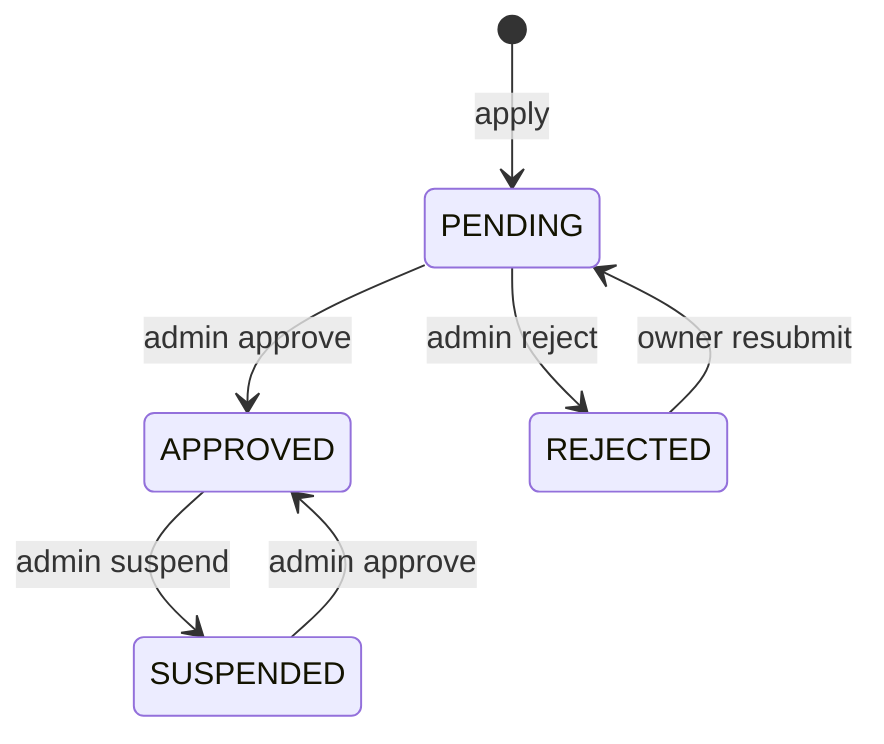

# Sellers

> Seller onboarding (application, admin review, suspension), public storefronts and the seller's read-only review/rating feed.

## Purpose and features

- **Customers** with a verified email apply to become a seller by submitting business details plus 1-10 private verification documents (previously uploaded media assets they own).
- **Rejected applicants** can edit and resubmit; the application returns to `PENDING`.
- **Admins** list/filter applications, view detail, open a signed download URL for a verification document (audited), and approve, reject or suspend (and re-approve a suspended seller).
- **Approved sellers** edit their storefront (slug, display name, description) and read their own product reviews and seller ratings, including moderation state and an "has open report" flag.
- **Anyone** can view an approved seller's public storefront with its rating aggregate and list its published ratings.
- Other modules gate seller features through `SellersService.requireApproved` / `lockApproved` (financials, fulfillment, inventory, offers, orders, products, returns, shipments).

## Routes

Conventions (prefix, guards, envelope): see [../architecture.md](../architecture.md) and [../auth-and-access.md](../auth-and-access.md).

| Method | Path                                                | Access                                             | Idempotency                        | Description                                                                                                                                                                     |
| ------ | --------------------------------------------------- | -------------------------------------------------- | ---------------------------------- | ------------------------------------------------------------------------------------------------------------------------------------------------------------------------------- |
| POST   | /api/v1/sellers/applications                        | Authenticated + verified email                     | None (unique `ownerUserId` -> 409) | Submit application ([sellers.controller.ts:16](../../../services/commerce-api/src/modules/sellers/sellers.controller.ts#L16))                                                   |
| GET    | /api/v1/sellers/me                                  | Authenticated                                      | n/a                                | Own application/seller record with documents ([sellers.controller.ts:25](../../../services/commerce-api/src/modules/sellers/sellers.controller.ts#L25))                         |
| POST   | /api/v1/sellers/me/resubmit                         | Authenticated + verified email                     | Guarded by status + version        | Resubmit a rejected application ([sellers.controller.ts:30](../../../services/commerce-api/src/modules/sellers/sellers.controller.ts#L30))                                      |
| GET    | /api/v1/admin/sellers                               | Roles(ADMIN)                                       | n/a                                | Paginated list, optional `status` filter ([admin-sellers.controller.ts:28](../../../services/commerce-api/src/modules/sellers/admin-sellers.controller.ts#L28))                 |
| GET    | /api/v1/admin/sellers/:id                           | Roles(ADMIN)                                       | n/a                                | Seller detail with documents ([admin-sellers.controller.ts:41](../../../services/commerce-api/src/modules/sellers/admin-sellers.controller.ts#L41))                             |
| GET    | /api/v1/admin/sellers/:id/documents/:documentId/url | Roles(ADMIN)                                       | n/a                                | Signed download URL for a verification document; audited ([admin-sellers.controller.ts:49](../../../services/commerce-api/src/modules/sellers/admin-sellers.controller.ts#L49)) |
| POST   | /api/v1/admin/sellers/:id/approve                   | Roles(ADMIN)                                       | Body `version` (optimistic)        | PENDING/SUSPENDED -> APPROVED ([admin-sellers.controller.ts:58](../../../services/commerce-api/src/modules/sellers/admin-sellers.controller.ts#L58))                            |
| POST   | /api/v1/admin/sellers/:id/reject                    | Roles(ADMIN)                                       | Body `version`                     | PENDING -> REJECTED ([admin-sellers.controller.ts:67](../../../services/commerce-api/src/modules/sellers/admin-sellers.controller.ts#L67))                                      |
| POST   | /api/v1/admin/sellers/:id/suspend                   | Roles(ADMIN)                                       | Body `version`                     | APPROVED -> SUSPENDED ([admin-sellers.controller.ts:76](../../../services/commerce-api/src/modules/sellers/admin-sellers.controller.ts#L76))                                    |
| GET    | /api/v1/storefronts/:slug                           | Public                                             | n/a                                | Public storefront + rating aggregate ([storefronts.controller.ts:20](../../../services/commerce-api/src/modules/sellers/storefronts.controller.ts#L20))                         |
| GET    | /api/v1/storefronts/:slug/ratings                   | Public                                             | n/a                                | Published seller ratings, paginated, `rating`/`sort` filters ([storefronts.controller.ts:26](../../../services/commerce-api/src/modules/sellers/storefronts.controller.ts#L26)) |
| PUT    | /api/v1/sellers/me/storefront                       | Authenticated + in-service `lockApproved`          | Body `version`                     | Update storefront profile ([storefronts.controller.ts:35](../../../services/commerce-api/src/modules/sellers/storefronts.controller.ts#L35))                                    |
| GET    | /api/v1/sellers/me/reviews                          | Authenticated + verified email + `requireApproved` | n/a                                | Own product reviews with moderation state ([seller-reviews.controller.ts:29](../../../services/commerce-api/src/modules/sellers/seller-reviews.controller.ts#L29))              |
| GET    | /api/v1/sellers/me/ratings                          | Authenticated + verified email + `requireApproved` | n/a                                | Own seller ratings with moderation state ([seller-reviews.controller.ts:38](../../../services/commerce-api/src/modules/sellers/seller-reviews.controller.ts#L38))               |

`@RequireVerifiedEmail()` is applied at class level on the reviews controller ([seller-reviews.controller.ts:22](../../../services/commerce-api/src/modules/sellers/seller-reviews.controller.ts#L22)); `@Roles(Role.ADMIN)` at class level on the admin controller ([admin-sellers.controller.ts:23](../../../services/commerce-api/src/modules/sellers/admin-sellers.controller.ts#L23)).

## Services

| Service                                                                                                                            | Responsibility                                                                                                                                                                                                                                                                                            |
| ---------------------------------------------------------------------------------------------------------------------------------- | --------------------------------------------------------------------------------------------------------------------------------------------------------------------------------------------------------------------------------------------------------------------------------------------------------- |
| `SellersService` ([sellers.service.ts](../../../services/commerce-api/src/modules/sellers/sellers.service.ts))                     | Apply, resubmit, admin list/detail/document URL/review; exported `requireApproved` ([:250](../../../services/commerce-api/src/modules/sellers/sellers.service.ts#L250)) and `lockApproved` ([:259](../../../services/commerce-api/src/modules/sellers/sellers.service.ts#L259)) used across the codebase. |
| `StorefrontsService` ([storefronts.service.ts](../../../services/commerce-api/src/modules/sellers/storefronts.service.ts))         | Public storefront reads, public ratings list, storefront update. Exports `PUBLIC_STOREFRONT_SELECT` ([:42](../../../services/commerce-api/src/modules/sellers/storefronts.service.ts#L42)) reused by marketplace offers.                                                                                  |
| `SellerReviewsService` ([seller-reviews.service.ts](../../../services/commerce-api/src/modules/sellers/seller-reviews.service.ts)) | Seller-scoped ProductReview / SellerRating feeds with shared filters ([:174](../../../services/commerce-api/src/modules/sellers/seller-reviews.service.ts#L174)).                                                                                                                                         |

## Business rules

**Application / resubmission**

- One application per user: `Seller.ownerUserId` is unique; a P2002 maps to 409 "You already have a seller application" ([sellers.service.ts:62](../../../services/commerce-api/src/modules/sellers/sellers.service.ts#L62)).
- The user must be active ([sellers.service.ts:286](../../../services/commerce-api/src/modules/sellers/sellers.service.ts#L286)).
- DTO: `businessName` 2-200, `registrationNumber` 2-100, `country` ISO-2 uppercase, `businessAddress` 5-1000, `contactEmail` email <=254, `documentIds` 1-10 unique UUID v4 ([seller-application.dto.ts:14](../../../services/commerce-api/src/modules/sellers/dto/seller-application.dto.ts#L14)).
- Documents are validated by `MediaService.lockVerificationDocuments` (every id must be an `AVAILABLE`, non-deleted asset owned by the applicant; sets `verificationLocked=true`) and must not be assigned as product media ([sellers.service.ts:273](../../../services/commerce-api/src/modules/sellers/sellers.service.ts#L273)).
- Resubmit only from `REJECTED` ([sellers.service.ts:91](../../../services/commerce-api/src/modules/sellers/sellers.service.ts#L91)); CAS on `version` + status; clears `reviewReason/reviewedAt/reviewedBy`, bumps version ([sellers.service.ts:97](../../../services/commerce-api/src/modules/sellers/sellers.service.ts#L97)); replaces all `SellerDocument` rows ([sellers.service.ts:116](../../../services/commerce-api/src/modules/sellers/sellers.service.ts#L116)).

**Admin review**

- Admin role is re-checked in the service against the DB (active + `ADMIN`), so a revoked role fails even with a valid token ([sellers.service.ts:295](../../../services/commerce-api/src/modules/sellers/sellers.service.ts#L295)).
- An admin cannot review their own seller account (403) ([sellers.service.ts:197](../../../services/commerce-api/src/modules/sellers/sellers.service.ts#L197)).
- Allowed transitions are exactly those in the diagram ([sellers.service.ts:201](../../../services/commerce-api/src/modules/sellers/sellers.service.ts#L201)); anything else is 409.
- `reason` (3-1000 chars, non-blank) is required for every decision, including approve ([review-seller.dto.ts:15](../../../services/commerce-api/src/modules/sellers/dto/review-seller.dto.ts#L15)).
- On approve: documents are re-validated and the owner must still be active ([sellers.service.ts:211](../../../services/commerce-api/src/modules/sellers/sellers.service.ts#L211)); after the CAS update, the owner is promoted `CUSTOMER -> SELLER` (no-op for other roles) ([sellers.service.ts:236](../../../services/commerce-api/src/modules/sellers/sellers.service.ts#L236)).
- CAS on `{id, version: dto.version, status: current}`; mismatch -> 409 ([sellers.service.ts:222](../../../services/commerce-api/src/modules/sellers/sellers.service.ts#L222)).
- Document URL: the asset must be one of the seller's documents; the view is audited `seller.document_viewed` before issuing the URL ([sellers.service.ts:171](../../../services/commerce-api/src/modules/sellers/sellers.service.ts#L171)).
- Admin list is ordered `createdAt asc, id asc` ([sellers.service.ts:152](../../../services/commerce-api/src/modules/sellers/sellers.service.ts#L152)).

**Approval checks used by other modules**

- `requireApproved(userId)`: loads the caller's seller (active user required) and 403s unless `APPROVED` ([sellers.service.ts:250](../../../services/commerce-api/src/modules/sellers/sellers.service.ts#L250)). Missing seller -> 404.
- `lockApproved(userId, tx)`: row-locks the seller by `updateMany ... where status=APPROVED` (touching `updatedAt`) inside the caller's transaction, so a concurrent suspension serialises against the marketplace write ([sellers.service.ts:257](../../../services/commerce-api/src/modules/sellers/sellers.service.ts#L257)).

**Storefront**

- Public reads require `status=APPROVED` and an active owner; otherwise 404 ([storefronts.service.ts:76](../../../services/commerce-api/src/modules/sellers/storefronts.service.ts#L76)).
- Public ratings list only `visibility=PUBLISHED`, exposes a formatted reviewer label and `verifiedPurchase: true` ([storefronts.service.ts:102](../../../services/commerce-api/src/modules/sellers/storefronts.service.ts#L102)).
- Rating aggregate reads the persisted `SellerRatingSummary`; never recomputed on read ([storefronts.service.ts:183](../../../services/commerce-api/src/modules/sellers/storefronts.service.ts#L183)).
- Update: slug `^[a-z0-9]+(?:-[a-z0-9]+)*$` 3-100, displayName 2-120 (trimmed), description <=2000 ([update-storefront.dto.ts:10](../../../services/commerce-api/src/modules/sellers/dto/update-storefront.dto.ts#L10)); CAS on version ([storefronts.service.ts:146](../../../services/commerce-api/src/modules/sellers/storefronts.service.ts#L146)); duplicate slug -> 409 ([storefronts.service.ts:174](../../../services/commerce-api/src/modules/sellers/storefronts.service.ts#L174)).

**Seller review feed**

- Scoped to the caller's seller id; ordered `createdAt desc`; filters `rating`, `visibility`, `moderationState`, `dateFrom/dateTo` on `createdAt`, and `reported` (some/none OPEN `ReviewReport`) ([seller-reviews.service.ts:174](../../../services/commerce-api/src/modules/sellers/seller-reviews.service.ts#L174)).
- Projection never exposes author id or report content; only `hasOpenReport` ([seller-reviews.service.ts:17](../../../services/commerce-api/src/modules/sellers/seller-reviews.service.ts#L17)).

## Data

| Model                                                                  | Access                                                                                                                                                                                                                                                                                                                                                                                                          |
| ---------------------------------------------------------------------- | --------------------------------------------------------------------------------------------------------------------------------------------------------------------------------------------------------------------------------------------------------------------------------------------------------------------------------------------------------------------------------------------------------------- |
| `Seller`                                                               | create, update (status, profile, storefront), read                                                                                                                                                                                                                                                                                                                                                              |
| `SellerDocument`                                                       | create, deleteMany/createMany on resubmit, read                                                                                                                                                                                                                                                                                                                                                                 |
| `MediaAsset`                                                           | `verificationLocked` set via MediaService                                                                                                                                                                                                                                                                                                                                                                       |
| `User`                                                                 | read (access check), role promoted via UsersService                                                                                                                                                                                                                                                                                                                                                             |
| `AuditEvent`                                                           | written directly with `tx.auditEvent.create` (actions `seller.applied`, `seller.resubmitted`, `seller.approved/rejected/suspended`, `seller.document_viewed`, `seller.storefront_updated`) ([sellers.service.ts:304](../../../services/commerce-api/src/modules/sellers/sellers.service.ts#L304), [storefronts.service.ts:158](../../../services/commerce-api/src/modules/sellers/storefronts.service.ts#L158)) |
| `SellerRatingSummary`, `SellerRating`, `ProductReview`, `ReviewReport` | read                                                                                                                                                                                                                                                                                                                                                                                                            |

## Dependencies

- Imports `ProductReferencesModule` (product-media check), `UsersModule` (access lookup, role promotion), `MediaModule` (document lock, signed URLs) ([sellers.module.ts:14](../../../services/commerce-api/src/modules/sellers/sellers.module.ts#L14)).
- Reuses review helpers from `../reviews` (`formatReviewerLabel`, `reviewOrderBy`, rating-summary utils, `ReviewListQueryDto`).
- Exports `SellersService`, `StorefrontsService`.

## Jobs and events

None. No outbox topics or background jobs.

## Configuration

None specific to this module (signed-URL settings belong to the media module).

## Tests

- [sellers.service.spec.ts](../../../services/commerce-api/src/modules/sellers/sellers.service.spec.ts): owner binding + audit, document validation, product-media rejection, revoked admin, self-approval, stale version, customer-only promotion, suspended seller blocked, resubmit only from REJECTED, unrelated document URL.
- [storefronts.service.spec.ts](../../../services/commerce-api/src/modules/sellers/storefronts.service.spec.ts): not-found, empty aggregate defaults, average from summary, PUBLISHED-only ratings.
- [seller-reviews.service.spec.ts](../../../services/commerce-api/src/modules/sellers/seller-reviews.service.spec.ts), [seller-reviews.controller.spec.ts](../../../services/commerce-api/src/modules/sellers/seller-reviews.controller.spec.ts): scoping, filters, `reported` flag, `requireApproved` runs first.

## Known gaps

- Audit rows are written directly via `tx.auditEvent.create`, not `AuditService.record` ([sellers.service.ts:311](../../../services/commerce-api/src/modules/sellers/sellers.service.ts#L311)).
- `PUT /sellers/me/storefront` has no `@RequireVerifiedEmail()`, unlike the other seller write routes ([storefronts.controller.ts:35](../../../services/commerce-api/src/modules/sellers/storefronts.controller.ts#L35)).
- Suspension does not revert the owner's `SELLER` role; access is blocked only through `requireApproved`/`lockApproved` checks ([sellers.service.ts:236](../../../services/commerce-api/src/modules/sellers/sellers.service.ts#L236)).
- Resubmission deletes old `SellerDocument` links but leaves the old assets `verificationLocked` ([sellers.service.ts:116](../../../services/commerce-api/src/modules/sellers/sellers.service.ts#L116)).
- No path from `SUSPENDED` or `REJECTED` to a permanent closed state; REJECTED can be resubmitted indefinitely.
- No domain events/outbox on seller status changes; downstream modules learn of a suspension only when they next query seller status.
