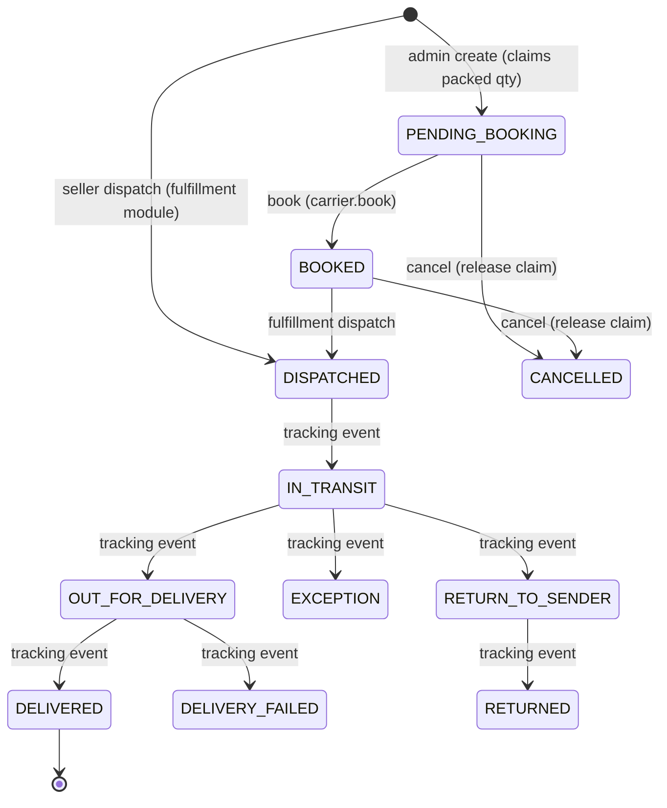

# Shipments

> Shipments booked against fulfillment orders through a pluggable carrier registry. The only carrier today is a manual one. Tracking events are append-only; the status is projected from them by fixed rules, fed by admin/seller entry, carrier webhooks and a 60 s poller.

## Purpose and features

- **Staff/admins** create a shipment from packed fulfillment quantity, book it with the carrier, cancel it before dispatch, and add manual tracking events. Only admins may add corrections.
- **Dispatch** of a booked shipment lives in fulfillment (`POST /admin/fulfillments/:id/dispatches`, see [fulfillment.md](fulfillment.md#admin-dispatch)). Seller-mode shipments are created already `DISPATCHED` by the seller dispatch command.
- **Approved sellers** post carrier progress events for their own seller-fulfilled shipments.
- **Customers** read the shipments and tracking timeline of their own order.
- **Carriers** push webhooks to `/webhooks/shipping/:providerCode`, or are polled for non-terminal shipments.

## Routes

Conventions: see [../architecture.md](../architecture.md) and [../auth-and-access.md](../auth-and-access.md).

| Method | Path                                             | Access                                                     | Idempotency                                                               | Description                                                                                                                                                                                                      |
| ------ | ------------------------------------------------ | ---------------------------------------------------------- | ------------------------------------------------------------------------- | ---------------------------------------------------------------------------------------------------------------------------------------------------------------------------------------------------------------- |
| GET    | /api/v1/admin/shipments                          | Roles(STAFF, ADMIN)                                        | n/a                                                                       | Paginated list, filters `status`, `warehouseId`, `fulfillmentOrderId`; newest first ([admin-shipments.controller.ts:37](../../../services/commerce-api/src/modules/shipments/admin-shipments.controller.ts#L37)) |
| GET    | /api/v1/admin/shipments/:id                      | Roles(STAFF, ADMIN)                                        | n/a                                                                       | Shipment with lines ([admin-shipments.controller.ts:42](../../../services/commerce-api/src/modules/shipments/admin-shipments.controller.ts#L42))                                                                 |
| GET    | /api/v1/admin/shipments/:id/tracking-events      | Roles(STAFF, ADMIN)                                        | n/a                                                                       | Events, `occurredAt desc` ([admin-shipments.controller.ts:47](../../../services/commerce-api/src/modules/shipments/admin-shipments.controller.ts#L47))                                                           |
| POST   | /api/v1/admin/shipments                          | Roles(STAFF, ADMIN)                                        | **Idempotency-Key required** (UUID v4, stored as `bookingIdempotencyKey`) | Create PENDING_BOOKING shipment, claim packed quantity ([admin-shipments.controller.ts:54](../../../services/commerce-api/src/modules/shipments/admin-shipments.controller.ts#L54))                              |
| POST   | /api/v1/admin/shipments/:id/book                 | Roles(STAFF, ADMIN)                                        | Replay-safe (already BOOKED -> returns it)                                | Book with carrier ([admin-shipments.controller.ts:63](../../../services/commerce-api/src/modules/shipments/admin-shipments.controller.ts#L63))                                                                   |
| POST   | /api/v1/admin/shipments/:id/cancel               | Roles(STAFF, ADMIN)                                        | Replay-safe (already CANCELLED -> returns it)                             | Cancel PENDING_BOOKING/BOOKED, release claim ([admin-shipments.controller.ts:71](../../../services/commerce-api/src/modules/shipments/admin-shipments.controller.ts#L71))                                        |
| POST   | /api/v1/admin/shipments/:id/tracking-events      | Roles(STAFF, ADMIN); correction ADMIN only                 | None                                                                      | Manual event or correction ([admin-shipments.controller.ts:80](../../../services/commerce-api/src/modules/shipments/admin-shipments.controller.ts#L80))                                                          |
| GET    | /api/v1/orders/:orderId/shipments                | Authenticated (order owner)                                | n/a                                                                       | Customer shipment view + timeline ([customer-shipments.controller.ts:12](../../../services/commerce-api/src/modules/shipments/customer-shipments.controller.ts#L12))                                             |
| POST   | /api/v1/sellers/me/shipments/:id/tracking-events | Authenticated + verified email + in-service `lockApproved` | **Idempotency-Key required** + request hash                               | Seller tracking event ([seller-shipments.controller.ts:35](../../../services/commerce-api/src/modules/shipments/seller-shipments.controller.ts#L35))                                                             |
| POST   | /api/v1/webhooks/shipping/:providerCode          | Public                                                     | Delivery dedupe (`providerDeliveryId` or payload hash)                    | Carrier webhook intake; 200, no body ([shipping-webhooks.controller.ts:29](../../../services/commerce-api/src/modules/shipments/shipping-webhooks.controller.ts#L29))                                            |

- **Controller gating.** `@Roles(Role.STAFF, Role.ADMIN)` is class level on the admin controller ([admin-shipments.controller.ts:32](../../../services/commerce-api/src/modules/shipments/admin-shipments.controller.ts#L32)). The seller controller has no `@Roles`; it uses class-level `@RequireVerifiedEmail()` ([seller-shipments.controller.ts:30](../../../services/commerce-api/src/modules/shipments/seller-shipments.controller.ts#L30)).
- **Webhook body.** The webhook reads `req.rawBody`: a missing body or invalid JSON returns 400 ([shipping-webhooks.controller.ts:36](../../../services/commerce-api/src/modules/shipments/shipping-webhooks.controller.ts#L36)).

## Services

| Service                                                                                                                                                           | Responsibility                                                                                                                                                                                                                                                                                                                                                                                                                      |
| ----------------------------------------------------------------------------------------------------------------------------------------------------------------- | ----------------------------------------------------------------------------------------------------------------------------------------------------------------------------------------------------------------------------------------------------------------------------------------------------------------------------------------------------------------------------------------------------------------------------------- |
| `ShipmentsService` ([shipments.service.ts](../../../services/commerce-api/src/modules/shipments/shipments.service.ts))                                            | CRUD, booking, cancel, the single tracking-event choke point `recordTrackingEvent` ([:589](../../../services/commerce-api/src/modules/shipments/shipments.service.ts#L589)), webhook ingest, polling. Exported.                                                                                                                                                                                                                     |
| `CarrierProviderRegistry` ([carrier-provider.registry.ts](../../../services/commerce-api/src/modules/shipments/carrier-provider.registry.ts))                     | Map of `providerCode -> CarrierProvider` from the `CARRIER_PROVIDERS` token. `get` throws 404 for an unknown code ([:13](../../../services/commerce-api/src/modules/shipments/carrier-provider.registry.ts#L13)).                                                                                                                                                                                                                   |
| `ManualCarrierProvider` ([manual-carrier.provider.ts](../../../services/commerce-api/src/modules/shipments/providers/manual-carrier.provider.ts))                 | The only registered provider ([shipments.module.ts:29](../../../services/commerce-api/src/modules/shipments/shipments.module.ts#L29)). `providerCode = 'ZONE'`, matching what `ZoneShippingRateProvider` quotes. `book` returns `MANUAL-<shipmentNumber>-<8 hex>`; `cancel` and `poll` are no-ops; it has no `parseWebhook` ([:19](../../../services/commerce-api/src/modules/shipments/providers/manual-carrier.provider.ts#L19)). |
| `ShipmentTrackingPollerService` ([shipment-tracking-poller.service.ts](../../../services/commerce-api/src/modules/shipments/shipment-tracking-poller.service.ts)) | `@Interval(60_000)`; see Jobs.                                                                                                                                                                                                                                                                                                                                                                                                      |
| `projectShipmentStatus` ([tracking-status.ts](../../../services/commerce-api/src/modules/shipments/tracking-status.ts))                                           | Pure status projection.                                                                                                                                                                                                                                                                                                                                                                                                             |

`CarrierProvider` contract ([carrier-provider.interface.ts:48](../../../services/commerce-api/src/modules/shipments/carrier-provider.interface.ts#L48)):

- `book({shipmentId, shipmentNumber, carrierCode, methodCode, destinationCountry}) -> {trackingReference, estimatedDeliveryAt?}`
- `cancel(trackingReference)`
- `poll(trackingReference) -> CarrierTrackingEvent[]` (only new events)
- optional `parseWebhook(payload, headers) -> {providerDeliveryId?, events[{trackingReference, providerEventKey?, normalizedStatus, occurredAt, ...}]}`

## Business rules

### Shipment lifecycle

Tracking events are not validated against this graph. Any non-terminal status can move to any status carried by a newer event (see projection).

### Create

- `lines` must have unique `fulfillmentLineId`s, else 400 ([shipments.service.ts:171](../../../services/commerce-api/src/modules/shipments/shipments.service.ts#L171)).
- **Replay.** It checks `bookingIdempotencyKey` before the transaction and again after `FOR UPDATE` on the fulfillment order. A replay must match the fulfillment order and the exact `lineId:qty` multiset, else 409 ([:175](../../../services/commerce-api/src/modules/shipments/shipments.service.ts#L175), [:687](../../../services/commerce-api/src/modules/shipments/shipments.service.ts#L687)).
- **Quantity claim.** `FulfillmentsService.assignShipmentQuantity` claims `packed - shipmentAssigned` per line, in the same transaction.
- **Carrier fields** are copied from the `ShippingGroup` checkout quote (`providerCode`, `carrierCode`, `methodCode`). The provider must be registered, else 404 before insert ([:196](../../../services/commerce-api/src/modules/shipments/shipments.service.ts#L196)).
- **Records written.** It assigns a shipment number, sets `warehouseId` from the fulfillment order, and writes the `shipment.created` audit row.

### Book

- **Status checks.** Already `BOOKED` returns the shipment unchanged. Any status other than `PENDING_BOOKING` is a 409 ([shipments.service.ts:260](../../../services/commerce-api/src/modules/shipments/shipments.service.ts#L260)).
- **Destination.** The country comes from `order.shippingAddress.country`; a missing country is a 409 ([:675](../../../services/commerce-api/src/modules/shipments/shipments.service.ts#L675)).
- **Effects.** It calls `provider.book` **inside** the DB transaction, then sets `BOOKED`, `trackingReference`, `estimatedDeliveryAt`, `bookedAt` and bumps `version`. It adds an `ADMIN_MANUAL` BOOKED tracking event, the `shipment.booked` audit row and the `shipment.booked` outbox event ([:282](../../../services/commerce-api/src/modules/shipments/shipments.service.ts#L282)).

### Cancel

- **Status checks.** Only `PENDING_BOOKING`/`BOOKED`; `CANCELLED` returns unchanged; anything else is a 409 ([shipments.service.ts:342](../../../services/commerce-api/src/modules/shipments/shipments.service.ts#L342)).
- **Effects.** It calls `provider.cancel`, then `releaseShipmentQuantity` for every line. It sets `CANCELLED` and `cancelledAt`, and writes the `shipment.cancelled` audit row with the `reason` (required, non-empty). No tracking event is written.

### Tracking events and projection

- **Single path.** Every source goes through `recordTrackingEvent` ([shipments.service.ts:589](../../../services/commerce-api/src/modules/shipments/shipments.service.ts#L589)).
- **Steps.** It locks the shipment, reads the latest event by `occurredAt` and inserts the new row. It then projects the status. Only if the status changed does it update `status` (setting `deliveredAt`/`cancelledAt` from `occurredAt` when relevant) and bump `version`.
- **Dedupe.** Uniqueness is `@@unique([shipmentId, source, providerEventKey])`. On a P2002 the code returns the latest event instead of failing ([:623](../../../services/commerce-api/src/modules/shipments/shipments.service.ts#L623)). Admin and seller events have a null key, so they are never deduped this way.
- **Projection** (`projectShipmentStatus`), first match wins ([tracking-status.ts:31](../../../services/commerce-api/src/modules/shipments/tracking-status.ts#L31)):
  1. A correction always wins.
  2. A terminal status (`DELIVERED, DELIVERY_FAILED, RETURN_TO_SENDER, RETURNED, CANCELLED`) never changes.
  3. An event older than the latest `occurredAt` is recorded but does not change the status.
  4. Otherwise the status becomes the event's status.
- **Admin manual.** `occurredAt` defaults to now. With `isCorrection: true` the source is `ADMIN_CORRECTION`; this requires ADMIN (403 for staff) and a non-empty `correctionReason` ([shipments.service.ts:389](../../../services/commerce-api/src/modules/shipments/shipments.service.ts#L389), [add-tracking-event.dto.ts:32](../../../services/commerce-api/src/modules/shipments/dto/add-tracking-event.dto.ts#L32)).
- **Seller** ([shipments.service.ts:422](../../../services/commerce-api/src/modules/shipments/shipments.service.ts#L422)):
  - **Allowed statuses:** `IN_TRANSIT, OUT_FOR_DELIVERY, DELIVERED, DELIVERY_FAILED, EXCEPTION, RETURN_TO_SENDER, RETURNED`. This is checked in the DTO and again in the service, and `occurredAt` is required.
  - **Ownership:** lock the shipment, then `lockApproved`. It 404s unless `warehouseId === null` and the seller order belongs to the caller.
  - **Idempotency:** the key is stored in `TrackingEvent.idempotencyKey` (globally unique). A replay needs the same shipment and the same sha256 of `{shipmentId, status, description, location, occurredAt}`, else 409.
  - **Response:** returns the shipment, not the event.
  - A seller event is never a correction, so it cannot move a terminal status.

### Webhooks

`ingestWebhook` ([shipments.service.ts:493](../../../services/commerce-api/src/modules/shipments/shipments.service.ts#L493)):

1. It resolves the provider. An unknown provider, or one without `parseWebhook`, is a 404. Today that covers every call.
2. It parses the payload and hashes `JSON.stringify(payload)`.
3. It inserts a `CarrierWebhookDelivery` with status `PENDING`, unique on `(providerCode, providerDeliveryId)` and `(providerCode, payloadHash)`. On a P2002 it returns 200 without further processing.
4. In one transaction it looks up each event's shipment by `(providerCode, trackingReference)`, skipping unknown ones. It applies each event as `CARRIER_WEBHOOK` and marks the delivery `PROCESSED`.
5. On error, after rollback, it marks the delivery `FAILED` with the reason and rethrows ([:544](../../../services/commerce-api/src/modules/shipments/shipments.service.ts#L544)).

### Customer view

- The order must belong to the caller, else 404 ([shipments.service.ts:130](../../../services/commerce-api/src/modules/shipments/shipments.service.ts#L130)).
- **Fields returned.** Each shipment returns `id, shipmentNumber, status, methodName` (from the shipping group), `trackingReference`, `estimatedDeliveryAt` and `createdAt`. Events are ascending and carry only status, description, location and occurredAt. No warehouse or actor fields are exposed ([shipments.types.ts:13](../../../services/commerce-api/src/modules/shipments/shipments.types.ts#L13)).

## Data

| Model                                   | Access                                                                                |
| --------------------------------------- | ------------------------------------------------------------------------------------- |
| `Shipment`                              | create, `FOR UPDATE` lock, status/booking updates, read                               |
| `ShipmentLine`                          | create, read                                                                          |
| `TrackingEvent`                         | create (append-only), read                                                            |
| `CarrierWebhookDelivery`                | create, update status                                                                 |
| `FulfillmentOrder`, `FulfillmentLine`   | lock + counters via `FulfillmentsService`                                             |
| `ShippingGroup`, `Order`, `SellerOrder` | read                                                                                  |
| `AuditEvent`                            | `shipment.created`, `shipment.booked`, `shipment.cancelled` via `AuditService.record` |

## Dependencies

- Imports `AuditModule`, `NumberingModule`, `FulfillmentModule` (`assignShipmentQuantity`, `releaseShipmentQuantity`) and `SellersModule` (`lockApproved`) ([shipments.module.ts:18](../../../services/commerce-api/src/modules/shipments/shipments.module.ts#L18)).
- `OutboxService` (global).
- Exports `ShipmentsService`. Returns uses shipment lines through `ReturnItemAllocation` (see [returns.md](returns.md)).

## Jobs and events

- **Poller.** `ShipmentTrackingPollerService.poll`, `@Interval(60_000)`. Errors are logged, not rethrown ([shipment-tracking-poller.service.ts:21](../../../services/commerce-api/src/modules/shipments/shipment-tracking-poller.service.ts#L21)).
- **What the poll does.** `pollNonTerminalShipments` loads every shipment with a non-terminal status and `warehouseId not null`, so seller shipments are excluded. For each one it calls `provider.poll(trackingReference)` and records each event as `CARRIER_POLL`, one transaction per event ([shipments.service.ts:560](../../../services/commerce-api/src/modules/shipments/shipments.service.ts#L560)). It is a no-op with the manual carrier. See [../background-processing.md](../background-processing.md#scheduled-tasks).
- **Outbox.** `shipment.booked`.

## Configuration

None. Carrier selection is compile-time, through the `CARRIER_PROVIDERS` factory.

## Tests

- [tracking-status.spec.ts](../../../services/commerce-api/src/modules/shipments/tracking-status.spec.ts): advance, terminal no-regress, out-of-order, correction, first event.
- [carrier-provider.registry.spec.ts](../../../services/commerce-api/src/modules/shipments/carrier-provider.registry.spec.ts), [manual-carrier.provider.spec.ts](../../../services/commerce-api/src/modules/shipments/providers/manual-carrier.provider.spec.ts).
- [shipments.service.spec.ts](../../../services/commerce-api/src/modules/shipments/shipments.service.spec.ts):
  - Customer ownership; create replay, key reuse and over-allocation.
  - Book idempotency and status guard; cancel releasing the claim.
  - Admin projection and staff correction refusal.
  - Seller status list, ownership and terminal guard.
  - Webhook duplicate, failure persistence and unsupported provider.
- [test/shipments.integration-spec.ts](../../../services/commerce-api/test/shipments.integration-spec.ts) (real Postgres): booking plus projection, idempotent create, release on cancel, concurrent create serialisation, webhook dedupe, the CHECK constraint.

## Known gaps

- **Manual events bypass the workflow.** Plain (non-correction) admin/staff events accept any `ShipmentStatus`, including `CANCELLED`, `DISPATCHED` and `BOOKED`, and project them onto the shipment ([shipments.service.ts:383](../../../services/commerce-api/src/modules/shipments/shipments.service.ts#L383)). This skips `cancel()` and fulfillment dispatch, so no claim is released and no `FulfillmentDispatch` or `dispatchedQuantity` is written. Corrections can do the same from terminal states.
- **P2002 fallback breaks the transaction.** `recordTrackingEvent` catches a P2002 inside an interactive transaction and carries on ([shipments.service.ts:623](../../../services/commerce-api/src/modules/shipments/shipments.service.ts#L623)). In Postgres the transaction is already aborted, so the next statement fails. It also returns the _latest_ event, not the duplicate.
- **Failed webhooks are never retried.** A delivery marked `FAILED` keeps its dedupe row, so the carrier's retry hits P2002 and gets 200 without reprocessing ([shipments.service.ts:516](../../../services/commerce-api/src/modules/shipments/shipments.service.ts#L516)).
- **No webhook signature check.** The webhook is `@Public` and nothing verifies a signature. The hash is taken over re-serialised JSON, not the raw bytes.
- **Carrier calls run inside DB transactions.** `provider.book` and `provider.cancel` are called while row locks are held. If the DB commit fails after `cancel`, the carrier and DB disagree ([shipments.service.ts:274](../../../services/commerce-api/src/modules/shipments/shipments.service.ts#L274), [:351](../../../services/commerce-api/src/modules/shipments/shipments.service.ts#L351)).
- **Cancel writes no tracking event**, so the customer timeline does not show the cancellation ([shipments.service.ts:362](../../../services/commerce-api/src/modules/shipments/shipments.service.ts#L362)).
- **Seller-mode orders are not excluded from admin shipments.** Admin `create` and `book` accept seller-mode fulfillment orders; the resulting shipments get `warehouseId null` and are then skipped by the poller.
- **Poller is unbatched.** It loads every non-terminal shipment in one query, including `PENDING_BOOKING` rows with no tracking reference. One provider error aborts the rest of the pass ([shipments.service.ts:560](../../../services/commerce-api/src/modules/shipments/shipments.service.ts#L560)).
- **Naming mismatch.** The manual carrier registers as `providerCode 'ZONE'` (the rate-policy code) rather than `MANUAL` ([manual-carrier.provider.ts:19](../../../services/commerce-api/src/modules/shipments/providers/manual-carrier.provider.ts#L19)).
- **Tracking events never 404.** `GET /admin/shipments/:id/tracking-events` returns `[]` for an unknown id ([shipments.service.ts:114](../../../services/commerce-api/src/modules/shipments/shipments.service.ts#L114)).
- **Staff reach.** Any STAFF user can create, book or cancel any shipment. No assignment or warehouse scoping is applied.
